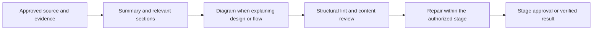

# Documentation Output Standard

## Summary

Every documentation file created or updated by Super Compound must help its reader understand its purpose, scope, key information, and next action. Preserve necessary detail without repetition or filler. This standard governs durable files, including short reports, state, logs, and issue pointers; it does not impose word, page, or token limits.

## Overview

Complete but concise. Simple but not oversimplified. Visual before verbose. Actionable before theoretical. User-friendly before technically impressive.

Use plain language, direct sentences, and technical terms appropriate to the reader. Explain what, why, how it works, next actions, risks, and dependencies where relevant. Organize detail with tables, grouping, appendices, and references rather than deleting needed information.

Lead human reports with the result, consequential decisions/findings, actual
verification and one next action. Link supporting detail; expand only what the
reader needs to review. A small completed task can return:

```text
Hasil: [concrete outcome]
Verifikasi: [actual command/check result]
Berikutnya: [one action, or complete within the requested scope]
Detail: [artifact link when useful]
```

Keep skeleton-first authoring, authority IDs, acceptance criteria and required
evidence. Do not add another template layer or universal word limit. When adding
a human summary to a machine CLI, use additive `--text`; preserve existing JSON,
parser fields, defaults and exit codes.

## High-Level Design



## Authoring and Review

- Start every file with a Summary after required frontmatter/title. Cover purpose, scope, key components or information, and decisions/outcomes when relevant. A short status pointer may need only one sentence.
- Prefer Summary → Overview → High-Level Design → Main Details → Actions/Recommendations → References. Use only relevant sections; preserve parser-required headings even when empty.
- Include an HLD when explaining a system, application, infrastructure, workflow, integration, or architecture. Show main components, relationships, and important flow. Use Mermaid in Markdown; use a rendered or readable text diagram elsewhere. Status-only pointers/logs need no decorative diagram.
- Review HLD relevance and adequacy from the content. Deterministic tools only check structure and syntax; keywords cannot decide whether a diagram explains the design.
- A summary may repeat information expanded in detail. Retain uniform-status tables when rows convey evidence, coverage, or meaningful differences.
- Findings may use multiple sentences for the problem, impact, evidence, and recommended action. Remove filler, not explanation.
- Derived diagrams and tables cite the same requirement/goal authority. They are views, never a second source of decisions.
- Preserve frontmatter, IDs, anchors, exact parser headings, field grammar, and numbered sections such as FSD Section 8. Add summary/HLD without renumbering these interfaces.
- Protected structures include STATE headings, `## Codebase Patterns`, ERR/LRN fields, `## Quick Reference`, issue `Blocked by:`, `Contract refs:`, `Contract gate:`, `Status:`, and solution frontmatter/section headings.
- Run `node .agent/tools/doc-lint.mjs <file> --advisory`; add `--requires-hld` after determining from content that HLD is applicable. Repair omissions within the same stage without an administrative approval checkpoint. Input/execution failures remain nonzero.

## Context and Limits

Documentation has no numerical length budget, including advisory targets. Word/token counts are diagnostics only. Compose AI context selectively: omit optional background first, preserve mandatory authority, and never truncate source documents to fit a work package. Explicit user/host hard limits remain binding; split logically and link references when necessary. Historical documents are updated only when related work touches them.
