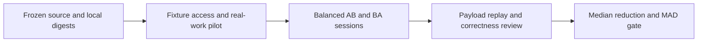

# Context Efficiency Evaluation

## Summary

Measure framework overhead against the frozen current worktree, independently
from the historical regression baseline. Static estimates and scripted fixtures
do not establish runtime savings. Acceptance remains UNPROVEN until paired live
work passes correctness, mandatory checks and the statistical gate.

## Flow

Freeze all tracked and nonignored untracked source bytes, HEAD, status and file
digests before edits; exclude runtime/private state. Keep the archive local.
The implementation baseline is `.scratch/context-efficiency/baseline.json`
with `baseline.zip`; historical `.agent/benchmarks/token-baseline.before.json`
remains a regression reference. Never substitute it for the current snapshot.

## Fixture protocol

Use `.agent/evals/context-efficiency.fixtures.json` and seed via
`node .agent/tools/context-fixtures.mjs <fresh-directory>`.
Run the declared proving check and review real outputs/diffs, not just host exit.
Each model must first prove fixture access and actual task execution in a pilot.
Only then run at least five independent pairs per fixture/model, balanced AB/BA
(three/two at five pairs). Reset to identical fixture bytes between runs;
pin model, effort, host version, environment/config and task prompt. Do not
change session model automatically. Record cache conditions separately.

The October 6 rollout starts with debugging and multi-goal-resume only. Require
the Codex selected-build/access/actual-check/write-probe preflight before counted sessions;
retain failed attempts and stop expansion if either fixture is blocked. Token
optimization uses the separate six-pair A/A noise floor and five-pair A/B gate
in `.agent/skills/eval-harness/references/paired-experiments.md`; the payload gate below keeps
its own coverage and 50 percent requirement.

| Fixture | Acceptance |
| --- | --- |
| consultation | Correct next route and prerequisites; no mutation |
| light-edit | Requested README correction; no unrelated mutation |
| fsd-execution | Approved addition goal; behavioral RED/GREEN and passing check |
| debugging | Diagnose operator bug; preserve test and pass regression |
| review | Identify operator bug with file/line and consequence; no mutation |
| multi-goal-resume | Retain verified addition goal; execute only remaining multiply goal |

## Payload measurement

`context-load.mjs loads <manifest.json> [root]` replays explicit delivered loads.
Manifest: `{route, tier, loads:[{path,start,end,digest,payloadPath,payloadDigest,
reason,phase,source,reused,residentDigest}]}`. Ranges are inclusive, one-based.
Digest/payload fields are optional on first capture, then pin them for replay.
Use payloadPath for actual tool wrappers/truncation; source ranges alone estimate
source load and must not be described as observed tool payload. Record cold-entry,
warm-reuse, execution, checkpoint and resume; reused unchanged resident text
contributes no new read payload, but remains context. Framework, host and toolSchema
sources have separate subtotals. CLI returns exact source and payload SHA-256,
bytes and deterministic estimates. Billing input is not framework overhead.
For several routes/tiers use `{evidenceClass, scenarios:[{name,route,tier,loads}]}`.
The provided `.agent/evals/context-efficiency.loads.json` is a modeled conditional
profile, including checkpoint/resume events, not a claim those events always occur.

Maintain complete capture at the host boundary; an unobserved read, schema or
host instruction remains unknown. Counts of `.agent` path activations in the
legacy transcript parser are not byte/range load evidence. Do not infer shell
reads from a command's first path or use agent self-report as complete telemetry.

`transcript-usage.mjs` supports verified Codex rollout event_msg/token_count
info.total_token_usage: latest cumulative total once; cached input and reasoning
output are subsets. Analyze child files separately with contributorId, use a
unique contributor registry, and sum each contributor only once. Missing fields
stay null. Claude streaming message IDs retain last-record-wins semantics.
Usage log v2 exposes knownSubtotal, fieldCoverage and PARTIAL totals; null means
unknown, never zero. Mixed provider semantics require separate reports.

## Statistical gate

`context-load.mjs pairs <pairs.json>` accepts `{models:[...],pairs:[...]}`.
Each pair has pairId, fixture, model, order AB/BA and before/after records:
`{evidenceClass:"observed-framework-payload",overhead,correct,mandatoryChecks,
complete,workEvidence,snapshot,replay,environment}`. Static payload estimates are
ineligible for the runtime gate.
Use distinct source snapshots, identical fixture replay/environment and reviewed
evidence locators. Flags represent inspected evidence; the CLI is an adjudicator,
not a correctness oracle. Missing cells or provenance yield UNPROVEN; any observed
correctness/check regression yields FAIL. For each fixture/model require median
`1-after/before >= .50` and strictly greater than twice MAD of paired reductions.
Report total tokens, output, cache, reasoning, cost and duration separately;
unknown metrics stay unknown. Hotspot repeated/preflight read target is 80-90%.
An advisory task succeeds by validated advice; unnecessary commands are not required.
