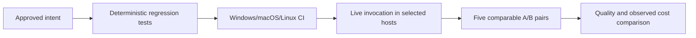

# Setup and SDLC Acceptance

## Summary

This evaluation covers prompt setup, six generated host adapters, documentation quality, stage approvals, and recovery. Automated tests exercise filesystem behavior and policy wiring. Live host invocation, cross-OS execution, and productivity improvements need separately recorded observations; no savings are inferred from test counts or static benchmarks.

## High-Level Design

## Automated Coverage

| Requirement | Evidence command or source |
| --- | --- |
| Long documents, summary recap, uniform evidence tables, relevant HLD, advisory exit | `node --test .agent/tools/documentation-quality.test.mjs .agent/tools/doc-lint.test.mjs` |
| Mandatory context preserved, advisory target distinct from explicit hard cap | `node --test .agent/tools/work-package.test.mjs` |
| Separate BRD/PRD/FSD approval and execution; no repeated derived-artifact approval | `node --test .agent/tools/autonomy-policy.test.mjs .agent/tools/workflow-contracts.test.mjs` |
| Light UI, local-only topology, recovery | Existing readiness-gate and workflow contract suites |
| Fresh install, no-op, user config, managed blocks, conflicts, offline cache activation, rollback, symlink rejection | `node --test .agent/tools/setup.test.mjs` |
| Legacy path, hashes, drift preservation, staging failure | `node --test .agent/tools/codex-install.test.mjs` |
| Shared retirement selector | `node --test .agent/tools/active-assets.test.mjs` |
| All active tools, skills, hooks, Python and router checks | `npm run test:local` plus Codex installer suite |
| Cross-OS setup execution | `.github/workflows/ci.yml` setup-matrix; CI results required before claiming all OS pass |

## Live Host Discovery

For each selected host, record version, OS, scope, source digest, doctor output, native discovery evidence, and actual `/sc-init` output. Confirm contract-first loading and project-core precedence with a distinct project marker. For global scope, activate a new project using `/sc-init setup` from the cache. Check both six-host discovery and the sequential fallback when subagents are unavailable. Doctor's `liveTested: false` is intentional; a valid file does not establish runtime behavior.

## Five-Pair Pilot

Use the primary host for at least five comparable A/B pairs with fixed task, fixtures, model, configuration, grader, and source digest per variant. Alternate run order. Use an existing-screen light UI fix, a LOCAL_ONLY case, full-tier stage approvals, retry recovery, and a documentation artifact within the fixed scenario. Preserve transcripts and executed-command evidence. Use the existing `adaptive-eval.mjs` paired-trial contract; never substitute invented runs.

Record administrative reapprovals, human waiting time, false budget stops, successful recoveries, time to verified result, and documentation completeness/clarity. Quality grading must check summaries, HLD relevance, evidence, references, and retained details. Acceptance requires zero administrative reapprovals within an unchanged authorized stage and no quality regression. An explicit host/user limit must still stop affected work. Publish savings only from measured pairs, with variation and limitations.

## Pending External Evidence

Cross-OS CI and live host trials are pending until run in those environments. The five-pair pilot is unmeasured. Local Windows regression results validate only the executed tests, not application discovery on all hosts or reduced human waiting time.

## Local Verification — 2026-10-04

Executed on Windows with Node 24.15.0. Node 22 is the declared minimum and configured CI baseline; a Node 22 run is not claimed here.

| Check | Observed result |
| --- | --- |
| `npm test` | 316 active tools tests and 20 skill tests passed; hook security suite passed |
| `npm run test:python` | 31 Python tests passed; skill router contract passed |
| Final artifact/workflow checks | 34 tests passed after the final policy/template expectation updates |
| `npm run audit` | Three static benchmark runs passed; framework audit had zero findings; stored evidence verified |
| Public docs lint with HLD required | Six documentation files passed structural checks |
| `git diff --check` | Passed; Git reported normal CRLF-to-LF notices |
| Installer coverage | Node, PowerShell and Git Bash exercised locally; seven setup tests include conflicts, rollback, six adapter paths, cache activation, and Bash parity |

The first documentation tests failed on missing summary/HLD/advisory support and rejection of summary/evidence repetition, then passed after implementation. Generated memory/handoff summary coverage also failed before its renderer changes and passed afterward. Setup's first CLI tests failed while the new engine was absent; subsequent behavior tests exercised the implemented filesystem paths. These tests do not establish a measured reduction in human interaction.

## References

- [Setup](../../SETUP.md)
- [Documentation standard](../context/output-style.md)
- [Paired experiments](../skills/eval-harness/references/paired-experiments.md)
