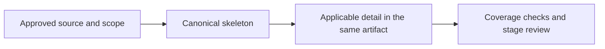

# Artifact Authoring and Outputs

## Summary

Use one canonical skeleton per artifact, expand only applicable detail, and keep
reviewer summaries and authority in the same document.



## Skeleton-First Authoring

Start with `.agent/templates/agentic-delivery/skeletons/`. Select the compact
artifact profile and expand only the named section whose risk or review need
requires more detail. Full templates are reference libraries, never default
prompt payloads or output shapes; do not load an entire full template.

## Applicability and Expansion

This section owns shared authoring applicability. Artifact risk/completeness
gates and the UI readiness reference retain their existing requirements.

| Content | Treatment |
|---|---|
| Always required | Artifact identity/version, decision owner and approval provenance, purpose/outcome, scope/non-scope, applicable rules, acceptance, material risks, OPEN blockers and handoff. Preserve required fields/headings; use qualified upstream refs instead of copying decisions. |
| Required when triggered | Expand the named reference section when the profile, changed behavior/contract, risk or review gap requires it. Assess security/privacy/accessibility and other mandatory obligations; record factual N/A where a required decision does not apply. |
| Optional | Omit empty supporting sections that no requirement, risk gate or parser requires. Do not generate all full-template tables merely to fill them with N/A. |

Group N/A decisions or states only when they share a factual reason; enumerate
the covered section/state IDs so applicability remains inspectable. A missing
decision or unproven check is not N/A. Keep material risks, trade-offs and
blocking OPEN records visible to the reviewer.
Routine factual N/A is an applicability decision, not a separate human approval;
changes to material accepted behavior/risk retain their owner's applicable gate.
The approval provenance records actual authority under the configured exception
or opted-in stage policy; a template's approval section does not add a new gate.

Lead Summary with the problem/change, outcome, scope, material risks and decision
requested for the current stage. Put engineering metadata and supporting detail
in their existing sections; the summary is a view of the same authority, not a
second decision register. Never invent baseline, root cause, ROI or test results.
Retain IDs, anchors, numbered headings, status/field grammar and FSD Section 8;
exact wire shapes remain in linked machine contracts and GOAL packets are authored
once. Follow output-style.md; no numerical document length targets apply.

| Artifact | Reviewer focus | Expand when |
|---|---|---|
| BRD | Why, business impact/outcome, scope, rules, success measure and business acceptance/decision. | Business evidence, financial exposure, regulatory/privacy obligations, cross-department change or transition risk requires detail; keep the BRD Profile Gate. |
| PRD | Who, permission intent, main flow, observable behavior, failure/recovery, acceptance and UAT. | UI states, permissions, quality constraints or product risks need clarification; keep the Minimum Completeness and UI Experience gates. |
| FSD | How, components/contracts, data/API/state/security, technical decisions, GOAL/TEST and rollout/recovery. | Changed interfaces, invariants, integrations or operations need an exact contract; follow UI topology/readiness for Section 8. |
| ADR | One material decision, context, viable options, rationale, consequences, obligations and revisit trigger. | The conditional ADR policy applies; use FSD TDEC for local decisions. No invented alternatives to fill a table. |

## Section-On-Demand Reference Libraries

```text
.agent/templates/agentic-delivery/BRD-Agentic-Ready-Reusable-Template.md
.agent/templates/agentic-delivery/PRD-Agentic-Ready-Reusable-Template.md
.agent/templates/agentic-delivery/FSD-Agentic-AI-Ready-Template.md
.agent/templates/agentic-delivery/ADR-Agentic-Ready-Reusable-Template-OPTIONAL.md
```

Search a heading, then read only that section. Do not paste template content
into workflow files, startup files, artifacts, or goal issues.

## Artifact Outputs

| Workflow | Primary Output | Location | Must Consume |
|---|---|---|---|
| `/sc-explore` | BRD | `docs/brd/brd-<feature>.md` | user request, evidence, business context |
| `/sc-prd` | PRD | `docs/prd/prd-<feature>.md` | approved BRD |
| `/sc-plan` | FSD plus goal issues | `docs/fsd/fsd-<feature>.md` and `.scratch/<feature>/issues/*.md` | approved PRD |
| `/sc-work` | implementation and verification evidence | source tree plus updated issue status | authorized FSD goal for full-tier; concrete request/issue acceptance for light-tier |

`/sc-plan` may still produce a short companion execution note only when useful, but the FSD is the implementation authority.

## UI-Bearing Output Rule

Classify each scope as `NOT_APPLICABLE`, `STANDARD`, or `HIGH_INTERACTION`.
Keep the experience baseline in the PRD and the Screen & Interaction Contract
in FSD Section 8; do not create a standalone UX brief, screen contract, UI
acceptance matrix, or vertical-slice plan by default. OpenAPI, JSON Schema,
AsyncAPI, or an approved equivalent is a linked machine asset for exact wire
shape. Load `ui-contract-readiness.md` only for UI-bearing scope.
