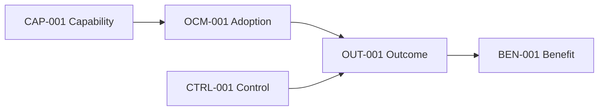
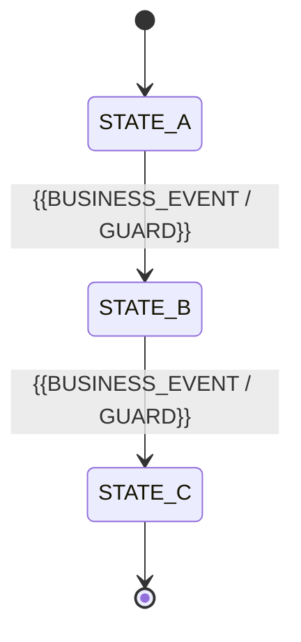

# {{PROJECT_NAME}} — Business Requirements Document

> **Cara menggunakan template**
>
> 1. Ganti seluruh `{{PLACEHOLDER}}` dengan fakta, keputusan, atau referensi yang dapat diverifikasi.
> 2. Bagian yang tidak relevan harus ditulis `N/A — {{ALASAN}}`; jangan dihapus diam-diam.
> 3. Jangan menggunakan `TBD`, “nanti”, “sesuai kebutuhan”, “optimal”, “efisien”, “mudah”, “real-time”, atau istilah ambigu tanpa `OPEN-ID`, owner, deadline, serta fallback yang disetujui.
> 4. Bedakan dengan tegas antara **fakta**, **evidence**, **asumsi**, **hipotesis**, **keputusan**, dan **preferensi solusi**.
> 5. BRD menetapkan **mengapa perubahan dibutuhkan, outcome bisnis, ruang lingkup, capability, proses, kebijakan, decision rights, nilai ekonomi, risiko, serta business acceptance**. PRD menetapkan perilaku produk; FSD menetapkan implementasi teknis.
> 6. Hindari mengunci UI, endpoint, database, framework, vendor, atau arsitektur kecuali hal tersebut merupakan constraint bisnis, hukum, kontraktual, keamanan, biaya, interoperabilitas, atau operasional yang nyata dan disetujui.
> 7. Setiap requirement dan keputusan yang disetujui wajib memiliki ID stabil dan traceability.
> 8. Coding agent tidak boleh menggunakan BRD sebagai instruksi implementasi langsung. Jalur wajib untuk autonomous coding adalah **BRD → PRD → FSD → GOAL → implementation → verification**.
> 9. ADR adalah artefak **opsional dan kondisional**, bukan tahap wajib. Bila tidak ada ADR, keputusan teknis material harus tetap dicatat di FSD sebagai `TDEC-*`; bila ADR digunakan, hanya ADR berstatus `ACCEPTED` yang boleh dirujuk.

---

# 0. Kontrak Operasional BRD

## 0.1 Tujuan Dokumen

BRD ini adalah sumber kebenaran untuk kebutuhan dan keputusan bisnis `{{PROJECT_NAME}}`. Dokumen ini mendefinisikan:

- masalah dan peluang yang dibuktikan;
- strategic driver serta alasan perubahan dilakukan sekarang;
- outcome, manfaat, KPI, dan guardrail;
- capability bisnis yang dibutuhkan tanpa menebak desain produk;
- scope, non-goal, prioritas, dan horizon perubahan;
- stakeholder, owner, decision rights, serta segregation of duties;
- current state, target process, control point, exception, dan target operating model;
- business rule, policy, information need, compliance obligation, dan evidence;
- business case, biaya, manfaat, risiko, change impact, dan acceptance gate;
- keputusan yang harus diteruskan secara deterministik ke PRD dan FSD.

BRD dianggap cukup lengkap ketika sponsor, business owner, product, finance, risk/compliance, operations, dan agent penyusun PRD dapat melanjutkan tanpa menciptakan sendiri:

- tujuan, manfaat, stakeholder, atau proses bisnis baru;
- policy, authority boundary, approval chain, atau risk appetite baru;
- scope, non-goal, service expectation, atau success metric baru;
- asumsi nilai ekonomi, volume, ownership, klasifikasi, retensi, atau compliance baru;
- definisi business acceptance dan consequence of failure yang tidak tertulis.

## 0.2 Batas Otoritas dan Relasi BRD, PRD, FSD, serta ADR Opsional

### 0.2.1 Jalur Artifact Canonical

```text
BRD → PRD → FSD → GOAL → IMPLEMENTATION → VERIFICATION
                 ↘ ADR (opsional, sidecar keputusan arsitektur)
```

- BRD, PRD, dan FSD membentuk jalur utama yang harus lengkap sebelum autonomous coding.
- ADR **bukan** gate default dan tidak perlu dibuat hanya untuk melengkapi checklist.
- Bila ADR tidak digunakan, FSD harus mencatat keputusan teknis material dalam **Technical Decision Register** dengan ID `TDEC-*`.
- Bila ADR digunakan, FSD harus menautkan ADR berstatus `ACCEPTED`, merinci implementasinya, dan tidak boleh menduplikasi keputusan secara kontradiktif.
- ADR berstatus `DRAFT`, `PROPOSED`, atau `IN_REVIEW` tidak menjadi authority implementasi.

### 0.2.2 Authority Matrix

| Jenis Keputusan | BRD | PRD | FSD | ADR opsional |
|---|---:|---:|---:|---:|
| Strategic driver, problem, dan opportunity | **Authoritative** | Referensi | Referensi | Tidak mengubah |
| Business objective, outcome, benefit, dan KPI | **Authoritative** | Menerjemahkan | Mendukung | Tidak mengubah |
| Business scope, non-goal, dan capability | **Authoritative** | Memetakan ke product scope | Memetakan ke implementation scope | Tidak memperluas |
| Business process, policy, rule, dan decision rights | **Authoritative** | Menetapkan observable product behavior | Merinci enforcement | Tidak mengubah |
| Business acceptance dan go/no-go criteria | **Authoritative** | Merinci product acceptance | Merinci technical evidence | Tidak menurunkan |
| Product feature, journey, UX, dan functional behavior | Constraint/outcome saja | **Authoritative** | Mengimplementasikan | Tidak mengubah intent |
| Logical product state dan product permission | Business boundary | **Authoritative** | Merinci persistence/enforcement | Tidak mengubah |
| Schema, API, event, job, concurrency, dan integration mechanics | Tidak menetapkan | Constraint saja | **Authoritative** | Menetapkan pattern/boundary hanya bila ADR dipakai |
| Architecture, framework, library, dan deployment topology | Constraint bisnis saja | Constraint produk saja | **Authoritative melalui `TDEC-*` bila tanpa ADR** | **Authoritative dalam delegated scope bila `ACCEPTED` dan linked** |
| Test implementation, build command, migration, rollback teknis | Business acceptance intent | Product acceptance intent | **Authoritative** | Dapat menetapkan constraint/pattern bila linked |

### 0.2.3 Aturan Precedence dan Perubahan

1. Hukum, kontrak, regulator, dan approved policy/security baseline berlaku paling tinggi.
2. BRD yang disetujui authoritative untuk business intent dan business boundary.
3. PRD yang disetujui authoritative untuk product intent dan product boundary.
4. ADR `ACCEPTED`, **bila ada dan linked**, authoritative hanya untuk delegated architecture decision yang tidak mengubah BRD/PRD.
5. FSD yang disetujui authoritative untuk implementation contract; `TDEC-*` menjadi authority teknis ketika ADR tidak digunakan.
6. Repository convention berlaku untuk pilihan lokal yang tidak ditentukan artifact di atas.
7. Task, prompt, atau `/goal` tidak boleh mengubah artifact authority.

PRD, FSD, dan ADR **MUST NOT** mengubah outcome bisnis, capability, scope, business rule, decision rights, compliance obligation, atau acceptance gate BRD tanpa change request yang disetujui. Konflik tidak boleh diselesaikan diam-diam; gunakan **Conflict and Resolution Ledger**.

## 0.3 Audiens

| Audiens | Penggunaan Utama |
|---|---|
| Sponsor / Steering Committee | Menyetujui investasi, outcome, risk appetite, dan keputusan go/no-go |
| Business Owner | Memiliki problem, scope, policy, dan business acceptance |
| Process Owner | Menetapkan proses target, control point, SLA, dan operating ownership |
| Benefits Owner | Bertanggung jawab atas realisasi manfaat setelah delivery |
| Product Owner | Menurunkan capability dan policy menjadi PRD tanpa mengarang kebutuhan bisnis |
| Finance | Memvalidasi biaya, benefit model, funding, dan financial assumptions |
| Risk / Legal / Compliance / Privacy | Memvalidasi obligation, control objective, data boundary, dan residual risk |
| Operations / Support / Change Team | Menyiapkan target operating model, adopsi, support, dan transisi |
| Architect / Technical Lead | Memahami business constraints sebelum menyusun FSD dan, bila diperlukan, ADR opsional |
| QA / Business Tester | Menurunkan business acceptance dan UAT scenario |
| Agent Penyusun PRD/FSD | Mengubah keputusan yang disetujui menjadi spesifikasi downstream tanpa invention |

## 0.4 Bahasa Normatif

- **MUST / WAJIB**: mandatory untuk business increment yang disetujui.
- **MUST NOT / DILARANG**: outcome atau tindakan yang tidak boleh terjadi.
- **SHOULD / SEHARUSNYA**: ekspektasi kuat; pengecualian memerlukan keputusan tertulis.
- **MAY / BOLEH**: opsional dan tidak boleh mengubah outcome wajib.
- **Business outcome**: perubahan terukur pada performa, risiko, biaya, pendapatan, kepatuhan, atau pengalaman stakeholder.
- **Business capability**: kemampuan organisasi yang dibutuhkan, independen dari bentuk solusi.
- **Business requirement**: kondisi atau kemampuan bisnis yang wajib dipenuhi untuk mencapai outcome.
- **Business rule**: aturan keputusan yang berlaku konsisten dan memiliki owner/authority.
- **Business invariant**: kondisi bisnis yang harus selalu benar.
- **Guardrail**: batas yang mencegah pencapaian satu KPI dengan merusak KPI atau obligation lain.
- **Business acceptance**: bukti bahwa perubahan mampu digunakan dan menghasilkan kondisi bisnis yang disetujui, bukan hanya bahwa software berjalan.

## 0.5 Taksonomi Pernyataan

Setiap pernyataan material harus dikategorikan agar agent tidak mengubah asumsi menjadi fakta.

| Tipe | Definisi | Bukti Minimum | Boleh Menjadi Requirement? |
|---|---|---|---|
| `FACT` | Kondisi yang dapat diverifikasi saat ini | Source primer atau data terukur | Ya, bila relevan |
| `EVIDENCE` | Data/observasi yang mendukung problem atau outcome | Source, periode, metode, kualitas | Menjadi dasar requirement |
| `ASSUMPTION` | Pernyataan belum terbukti yang dipakai untuk perencanaan | Owner + validation method + impact | Hanya bila risikonya diterima |
| `HYPOTHESIS` | Hubungan sebab-akibat yang perlu diuji | Experiment/validation plan | Tidak boleh diperlakukan sebagai hasil pasti |
| `DECISION` | Pilihan yang telah disetujui oleh authority | Approver + date + rationale | Ya, authoritative |
| `CONSTRAINT` | Batas yang benar-benar membatasi pilihan | Source dan consequence | Ya, bila valid |
| `PREFERENCE` | Pilihan yang diinginkan tetapi tidak wajib | Owner dan alasan | Tidak boleh dipromosikan menjadi MUST |
| `OPEN` | Keputusan yang belum tersedia | Owner + deadline + fallback | Blocker/non-blocker sesuai dampak |

## 0.6 Kebijakan Placeholder dan Open Item

`TBD` tanpa struktur dilarang. Gunakan format berikut:

| ID | Pertanyaan / Keputusan | Kelas | Dampak | IDs Terdampak | Owner | Opsi | Rekomendasi | Fallback Aman | Deadline | Status |
|---|---|---|---|---|---|---|---|---|---|---|
| OPEN-001 | {{QUESTION}} | BUSINESS_BLOCKER / PRD_BLOCKER / NON_BLOCKER | {{IMPACT}} | {{IDS}} | {{OWNER}} | {{OPTIONS}} | {{RECOMMENDATION}} | {{FALLBACK_OR_NONE}} | {{DATE_OR_GATE}} | OPEN |

Aturan:

- `BUSINESS_BLOCKER`: BRD tidak boleh disetujui sebelum selesai.
- `PRD_BLOCKER`: BRD dapat disetujui bersyarat, tetapi PRD tidak boleh memfinalkan area terkait.
- `NON_BLOCKER`: hanya boleh memakai fallback yang ditulis dan disetujui.
- Agent atau tim downstream dilarang menciptakan opsi/fallback baru secara diam-diam.
- Item `RESOLVED` harus menghasilkan `DEC-ID`, approver, tanggal, rationale, serta daftar ID yang diperbarui.

## 0.7 Konvensi ID Stabil

| Prefix | Arti | Contoh |
|---|---|---|
| SRC | Source artifact | SRC-001 |
| DRV | Strategic/business driver | DRV-001 |
| PROB | Problem statement | PROB-001 |
| EVD | Evidence | EVD-001 |
| BASE | Baseline | BASE-001 |
| ROOT | Root cause | ROOT-001 |
| PRINC | Business / target-state principle | PRINC-001 |
| OBJ | Business objective | OBJ-001 |
| OUT | Measurable outcome | OUT-001 |
| KPI | KPI / metric definition | KPI-001 |
| BEN | Benefit | BEN-001 |
| DISBEN | Disbenefit / adverse effect | DISBEN-001 |
| OPT | Business / solution option | OPT-001 |
| SCOPE | Scope boundary | SCOPE-001 |
| SCOPE-NG | Explicit non-goal | SCOPE-NG-001 |
| BI | Business increment / phase | BI-001 |
| CAP | Business capability | CAP-001 |
| PROC | Business process | PROC-001 |
| ACT | Business actor / operating role | ACT-001 |
| STK | Stakeholder | STK-001 |
| SOD | Segregation-of-duties rule | SOD-001 |
| BREQ | Business requirement | BREQ-001 |
| BAC | Business acceptance criterion | BAC-001 |
| BR | Business rule | BR-001 |
| POL | Business policy | POL-001 |
| INV | Business invariant | INV-001 |
| DT | Business decision-table row | DT-001 |
| OBL | Legal/regulatory/contractual obligation | OBL-001 |
| CTRL | Business control objective | CTRL-001 |
| CTRL-SEC | Security control objective | CTRL-SEC-001 |
| PRIV-BIZ | Business privacy requirement | PRIV-BIZ-001 |
| AI-BIZ | AI / automation business-governance requirement | AI-BIZ-001 |
| INFO | Business information requirement | INFO-001 |
| DQ | Data-quality rule | DQ-001 |
| REPORT | Reporting / decision-support requirement | REPORT-001 |
| NOTIF | Business notification / escalation requirement | NOTIF-001 |
| SLA | Business service-level expectation | SLA-001 |
| COST | Cost item / assumption | COST-001 |
| ASSUMP | Assumption | ASSUMP-001 |
| HYP | Hypothesis | HYP-001 |
| CONSTR | Constraint | CONSTR-001 |
| DEP | Dependency | DEP-001 |
| RISK | Risk | RISK-001 |
| RISK-INACTION | Risk / consequence of inaction | RISK-INACTION-001 |
| OCM | Organizational-change requirement | OCM-001 |
| CHG | BRD change-control trigger | CHG-001 |
| DEC | Approved decision | DEC-001 |
| CONFLICT | Conflict | CONFLICT-001 |
| OPEN | Open decision | OPEN-001 |
| ISSUE | Issue / exception record | ISSUE-001 |
| BAT | Business acceptance test / scenario | BAT-001 |
| GATE | Approval / release gate | GATE-001 |
| REV | Review comment | REV-001 |

ID yang telah disetujui tidak boleh digunakan ulang untuk arti lain. Item yang dibatalkan diberi status `RETIRED` dengan rationale, bukan dihapus.

### 0.7.1 Referensi Lintas Artifact

ID lokal boleh digunakan di dalam dokumennya sendiri. Referensi lintas dokumen **WAJIB** qualified agar `FR-001`, `BR-001`, atau `INV-001` dari artifact berbeda tidak tertukar.

```text
{{DOCUMENT_ID}}#{{LOCAL_ID}}
{{DOCUMENT_ID}}@{{VERSION}}#{{LOCAL_ID}}   # gunakan saat snapshot harus dipin
```

Contoh:

- `BRD-CCC#BREQ-001`
- `PRD-CCC@1.2#FR-014`
- `FSD-CCC#TDEC-003`
- `ADR-0042#DEC-001`

Manifest machine-readable harus menyimpan `artifact_id`, `artifact_version`, dan `local_id` secara terpisah atau memakai qualified reference di atas.

## 0.8 Aturan Kualitas untuk Mencegah AI Slop

BRD yang disetujui wajib memenuhi aturan berikut:

1. Setiap `BREQ` memetakan ke minimal satu `PROB`, `OBJ`, `OUT`, dan `CAP`.
2. Problem harus ditulis sebagai kondisi bisnis, bukan solusi yang sudah dipilih.
3. Capability harus tetap bermakna bila teknologi atau vendor diganti.
4. Outcome harus memiliki baseline, target, measurement source, owner, dan timeframe.
5. Benefit tidak boleh dihitung dua kali pada kategori berbeda.
6. KPI adoption/usage tidak boleh menggantikan business outcome kecuali adoption memang outcome utama.
7. Setiap angka memiliki unit, periode, segment/population, dan sumber.
8. Setiap business rule ditulis satu kali sebagai canonical rule dan direferensikan.
9. Scope harus menyatakan batas organisasi, proses, pengguna, data, geografi, kanal, waktu, dan release bila relevan.
10. Non-goal harus eksplisit agar agent tidak “melengkapi” solusi di luar mandat.
11. Current-state symptom dan root cause harus dibedakan; solusi tidak boleh hanya mengotomasi proses yang salah tanpa keputusan sadar.
12. Business acceptance harus mengukur kondisi penggunaan nyata dan evidence, bukan hanya “fitur tersedia”.
13. Risiko memiliki trigger, mitigation, contingency, owner, residual risk, dan acceptance authority.
14. Asumsi material memiliki validation method dan consequence bila salah.
15. Compliance/security/privacy harus berupa obligation atau control objective yang dapat dibuktikan, bukan klaim generik.
16. AI/automation tidak boleh mendapat authority implisit; advisory, deterministic, human-approved, dan autonomous harus dibedakan.
17. Opsi “do nothing” dan process-only harus dinilai agar keputusan build/buy tidak menjadi bias awal.
18. Constraint teknologi hanya boleh masuk bila sumber dan konsekuensi bisnisnya jelas.
19. Tidak boleh menggunakan daftar terbuka seperti “dan lain-lain” untuk obligation mandatory.
20. Konflik source, angka, policy, owner, atau scope harus terlihat di ledger; dilarang memilih salah satu secara diam-diam.

## 0.9 Gate Persetujuan BRD

BRD hanya dapat memiliki `status: APPROVED` dan `decision_stage: APPROVED_FOR_PRD` bila:

- [ ] Decision request dan accountable approver jelas.
- [ ] Problem, root cause, evidence, dan baseline cukup untuk mendukung investasi.
- [ ] Objective, outcome, KPI, guardrail, dan benefit owner ditetapkan.
- [ ] Scope, non-goal, capability, target process, dan target operating model konsisten.
- [ ] Business rule, policy, decision rights, control objective, dan obligation tidak ambigu.
- [ ] Opsi utama, termasuk do-nothing, dinilai dengan kriteria yang disetujui.
- [ ] Business case mencatat cost range, benefit range, uncertainty, dan sensitivity.
- [ ] Change impact, adoption dependency, support ownership, dan transition intent ditetapkan.
- [ ] Business acceptance scenario dan go/no-go criteria dapat diverifikasi.
- [ ] Risiko residual telah diterima oleh authority yang tepat.
- [ ] Tidak ada `BUSINESS_BLOCKER` terbuka.
- [ ] PRD handoff manifest konsisten dan tidak memiliki mandatory field kosong.

---

# 1. Kontrol Dokumen, Governance, dan Traceability

## 1.1 Metadata Dokumen

| Field | Value |
|---|---|
| Project / Initiative | `{{PROJECT_NAME}}` |
| Project Code | `{{PROJECT_CODE}}` |
| BRD ID | `BRD-{{PROJECT_CODE}}` |
| Version | `{{VERSION}}` |
| Status | `{{DRAFT / IN_REVIEW / APPROVED / SUPERSEDED}}` |
| Decision Stage | `{{STAGE}}` |
| Business Sponsor | `{{NAME_OR_ROLE}}` |
| Business Owner | `{{NAME_OR_ROLE}}` |
| Process Owner | `{{NAME_OR_ROLE}}` |
| Benefits Owner | `{{NAME_OR_ROLE}}` |
| Product Owner | `{{NAME_OR_ROLE}}` |
| Finance Owner | `{{NAME_OR_ROLE_OR_NA}}` |
| Risk/Compliance Owner | `{{NAME_OR_ROLE_OR_NA}}` |
| Change Owner | `{{NAME_OR_ROLE_OR_NA}}` |
| Target Horizon | `{{DATE_OR_PERIOD}}` |
| Reporting Currency | `{{CURRENCY}}` |
| Default Timezone | `{{IANA_TIMEZONE}}` |
| Classification | `{{CLASSIFICATION}}` |

## 1.2 Source Artifacts dan Evidence Register

| Source ID | Source / Artifact | Owner / Publisher | Version / Period | Type | Authority | Evidence Quality | Sections / Data Used | Access / Classification | Status |
|---|---|---|---|---|---|---|---|---|---|
| SRC-001 | {{TITLE_OR_PATH}} | {{OWNER}} | {{VERSION}} | Strategy / Policy / Audit / Data / Interview / Contract / Law | {{WHAT_IT_IS_AUTHORITATIVE_FOR}} | A / B / C / D | {{SECTIONS}} | {{ACCESS}} | VERIFIED |

Evidence quality:

- `A`: source primer, lengkap, terkini, dan dapat direproduksi.
- `B`: source resmi/terpercaya dengan keterbatasan minor.
- `C`: observasi/interview terstruktur atau sample terbatas.
- `D`: anecdotal, tidak lengkap, atau belum diverifikasi; tidak boleh menjadi satu-satunya dasar keputusan material.

## 1.3 Riwayat Revisi

| Version | Date | Author | Change Summary | IDs Affected | Review / Approval |
|---|---|---|---|---|---|
| 0.1 | {{YYYY-MM-DD}} | {{AUTHOR}} | Initial draft | All | Pending |

## 1.4 Approval dan Decision Authority

| Role | Name | Authority | Decision | Date | Conditions / Notes |
|---|---|---|---|---|---|
| Business Sponsor |  | Investment and strategic alignment | Pending |  |  |
| Business Owner |  | Scope, process, policy, acceptance | Pending |  |  |
| Benefits Owner |  | Benefit assumptions and realization | Pending |  |  |
| Finance |  | Cost/benefit and funding | Pending / N/A |  |  |
| Risk/Compliance/Privacy |  | Obligation and residual risk | Pending / N/A |  |  |
| Product Owner |  | PRD handoff feasibility | Pending |  |  |
| Operations / Change |  | Operating and adoption readiness | Pending |  |  |

## 1.5 Decision Log

| Decision ID | Decision | Type | Rationale | Alternatives Rejected | Approved By | Date | IDs Affected | Revisit Trigger |
|---|---|---|---|---|---|---|---|---|
| DEC-001 | {{DECISION}} | Scope / Policy / Investment / Operating Model / Risk / Option | {{RATIONALE}} | {{OPTIONS}} | {{APPROVER}} | {{DATE}} | {{IDS}} | {{TRIGGER_OR_NONE}} |

## 1.6 Conflict and Resolution Ledger

| Conflict ID | Conflicting Statements / Values | Sources | Impact | Canonical Resolution | Superseded Text / IDs | Approved By | Date | Change IDs |
|---|---|---|---|---|---|---|---|---|
| CONFLICT-001 | {{DESCRIPTION}} | {{SOURCE_IDS}} | {{IMPACT}} | {{RESOLUTION}} | {{OLD_IDS_OR_TEXT}} | {{OWNER}} | {{DATE}} | {{DEC_OR_CR_ID}} |

## 1.7 Change-Control Triggers

Perubahan berikut memerlukan review dan reapproval BRD:

| Trigger ID | Change Type | Reapproval Required From | Downstream Impact |
|---|---|---|---|
| CHG-001 | Perubahan problem, objective, outcome, atau KPI target material | Sponsor + Business Owner | PRD/FSD traceability review |
| CHG-002 | Perluasan scope organisasi, proses, data, geografi, atau user | Business Owner + Finance/Risk as applicable | Re-estimation and new requirements |
| CHG-003 | Perubahan business rule, authority, approval, atau compliance obligation | Business Owner + Control Owner | PRD/FSD and test update |
| CHG-004 | Cost/benefit melewati tolerance `{{THRESHOLD}}` | Sponsor + Finance | Business-case reapproval |
| CHG-005 | Residual risk melebihi appetite | Risk Owner + Sponsor | Pause/re-scope/mitigation decision |

## 1.8 Business Requirement Inventory

| Requirement ID | Summary | Problem / Outcome | Capability | Priority | Business Increment | Owner | Acceptance IDs | PRD IDs | Status |
|---|---|---|---|---|---|---|---|---|---|
| BREQ-001 | {{BUSINESS REQUIREMENT}} | PROB-001 / OUT-001 | CAP-001 | MUST | {{INCREMENT}} | {{OWNER}} | BAC-001 |  | DRAFT |

---

# 2. Executive Decision Brief

## 2.1 Ringkasan Satu Paragraf

`{{Dalam satu paragraf: kondisi sekarang, dampak terukur, perubahan capability/proses yang dibutuhkan, outcome target, kelompok terdampak, nilai/biaya utama, risiko utama, dan keputusan yang diminta. Jangan memuat detail implementasi.}}`

## 2.2 Decision Request

| Decision | Needed From | Needed By | Consequence if Delayed | Recommended Decision |
|---|---|---|---|---|
| {{EXACT_DECISION_REQUEST}} | {{AUTHORITY}} | {{DATE/GATE}} | {{CONSEQUENCE}} | {{RECOMMENDATION}} |

## 2.3 Snapshot Bisnis

| Area | Ringkasan |
|---|---|
| Strategic driver | {{DRV_IDS_AND_SUMMARY}} |
| Core problem | {{PROB_IDS_AND_SUMMARY}} |
| Evidence / baseline | {{EVD_BASE_IDS}} |
| Target outcome | {{OUT_IDS_AND_TARGETS}} |
| Required capability | {{CAP_IDS}} |
| Scope | {{ORG_PROCESS_DATA_GEOGRAPHY_HORIZON}} |
| Selected option | {{OPT_ID_OR_OPEN_ID}} |
| Indicative investment | {{RANGE_AND_CURRENCY}} |
| Expected benefit | {{RANGE_AND_PERIOD}} |
| Top risks | {{RISK_IDS}} |
| Business owner | {{OWNER}} |
| Target decision / launch horizon | {{DATE_OR_PERIOD}} |

## 2.4 Value Thesis

> Bila `{{TARGET_STAKEHOLDER_OR_BUSINESS_UNIT}}` memperoleh capability `{{CAPABILITY}}`, maka `{{CURRENT_PROBLEM}}` akan berubah menjadi `{{TARGET_OUTCOME}}`, yang diukur melalui `{{KPI_IDS}}`, karena `{{EVIDENCE_BASED_CAUSAL_LOGIC}}`.

## 2.5 Recommendation

`{{Nyatakan opsi yang direkomendasikan, alasan berbasis kriteria, trade-off yang diterima, dan kondisi yang harus benar. Jangan menyatakan kepastian bila masih berupa hipotesis.}}`

## 2.6 Cost of Inaction

| Impact Area | Current / Forecast Impact | Time Horizon | Evidence | Confidence | Owner |
|---|---:|---|---|---|---|
| Revenue / Cost / Risk / Compliance / Customer / Employee / Strategic | {{VALUE_OR_DESCRIPTION}} | {{PERIOD}} | {{EVD_ID}} | High / Medium / Low | {{OWNER}} |

---

# 3. Strategic Context, Problem, dan Evidence

## 3.1 Strategic Drivers

| Driver ID | Driver | Source | Strategic Objective Supported | Urgency / Deadline | Consequence of Missing | Owner |
|---|---|---|---|---|---|---|
| DRV-001 | {{DRIVER}} | {{SRC_ID}} | {{STRATEGIC_OBJECTIVE}} | {{DATE/URGENCY}} | {{CONSEQUENCE}} | {{OWNER}} |

## 3.2 Business Context

`{{Jelaskan konteks organisasi, proses, pasar, regulasi, customer, vendor, workforce, dan operating environment yang relevan. Hindari sejarah yang tidak memengaruhi keputusan.}}`

## 3.3 Problem Statements

Gunakan struktur: **actor/process terdampak + kondisi saat ini + dampak + evidence + batas konteks**.

| Problem ID | Problem Statement | Affected Stakeholders / Process | Business Impact | Evidence IDs | Frequency / Scale | Owner |
|---|---|---|---|---|---|---|
| PROB-001 | {{PROBLEM_WITHOUT_SOLUTION}} | {{STK/PROC_IDS}} | {{IMPACT}} | {{EVD_IDS}} | {{FREQUENCY_SCALE}} | {{OWNER}} |

## 3.4 Evidence dan Baseline

| Evidence ID | Metric / Observation | Baseline Value | Unit | Population / Segment | Period | Source | Collection Method | Data Quality | Limitation |
|---|---|---:|---|---|---|---|---|---|---|
| EVD-001 | {{MEASURE}} | {{VALUE}} | {{UNIT}} | {{POPULATION}} | {{PERIOD}} | {{SRC_ID}} | {{METHOD}} | A/B/C/D | {{LIMITATION}} |

## 3.5 Root Cause vs Symptom

| Root ID | Observed Symptom | Root Cause Hypothesis / Finding | Evidence | Controllable? | Addressed by Scope? | Validation Needed |
|---|---|---|---|---:|---:|---|
| ROOT-001 | {{SYMPTOM}} | {{ROOT_CAUSE}} | {{EVD_IDS}} | YES / PARTIAL / NO | YES / NO | {{METHOD_OR_NONE}} |

## 3.6 Current-State Process dan Workaround

```mermaid
flowchart TD
    A[{{CURRENT_TRIGGER}}] --> B[{{CURRENT_STEP}}]
    B --> C{Decision}
    C -->|Path 1| D[{{CURRENT_OUTPUT}}]
    C -->|Path 2| E[{{MANUAL_WORKAROUND_OR_FAILURE}}]
```

| Process ID | Step / Handoff | Actor | Input | Output | Tool / Channel | Cycle Time | Error / Rework Rate | Pain / Control Gap | Evidence |
|---|---|---|---|---|---|---:|---:|---|---|
| PROC-001 | {{STEP}} | {{ACT_ID}} | {{INPUT}} | {{OUTPUT}} | {{CURRENT_TOOL}} | {{TIME}} | {{RATE}} | {{PAIN}} | {{EVD_ID}} |

## 3.7 Existing Controls dan Their Limitations

| Control ID | Existing Control | Objective | Owner | Evidence Produced | Effectiveness | Limitation / Failure Mode |
|---|---|---|---|---|---|---|
| CTRL-001 | {{CONTROL}} | {{OBJECTIVE}} | {{OWNER}} | {{EVIDENCE}} | Effective / Partial / Ineffective / Unknown | {{LIMITATION}} |

## 3.8 Why Now

`{{Nyatakan deadline eksternal/internal, compounding cost, strategic window, audit finding, contract event, capacity limit, or dependency. “Karena teknologi tersedia” saja bukan why-now yang cukup.}}`

## 3.9 Opportunity Statement

`{{Nyatakan peluang sebagai peningkatan capability atau perubahan outcome, bukan nama fitur/teknologi.}}`

---

# 4. Business Objectives, Outcomes, KPI, dan Benefits

## 4.1 Business Objectives

| Objective ID | Objective | Strategic Driver | Problem IDs | Owner | Horizon | Priority |
|---|---|---|---|---|---|---|
| OBJ-001 | {{OBJECTIVE_AS_BUSINESS_CHANGE}} | DRV-001 | PROB-001 | {{OWNER}} | {{DATE/PERIOD}} | MUST |

## 4.2 Measurable Outcomes

| Outcome ID | Outcome | Baseline | Target | Unit | Population / Scope | Deadline | Measurement Source | Owner | Confidence |
|---|---|---:|---:|---|---|---|---|---|---|
| OUT-001 | {{MEASURABLE_OUTCOME}} | {{BASELINE}} | {{TARGET}} | {{UNIT}} | {{SCOPE}} | {{DATE}} | {{SOURCE}} | {{OWNER}} | High / Medium / Low |

## 4.3 KPI Dictionary

| KPI ID | Name | Purpose / Decision Supported | Formula | Numerator | Denominator | Inclusion / Exclusion | Segment | Frequency | Source of Truth | Baseline | Target | Threshold / Action | Owner |
|---|---|---|---|---|---|---|---|---|---|---:|---:|---|---|
| KPI-001 | {{NAME}} | {{DECISION}} | `{{FORMULA}}` | {{NUM}} | {{DEN}} | {{RULES}} | {{SEGMENT}} | {{CADENCE}} | {{SOURCE}} | {{VALUE}} | {{VALUE}} | {{ACTION_THRESHOLD}} | {{OWNER}} |

KPI rules:

- Definisikan perilaku ketika denominator nol, data terlambat, data hilang, atau source berubah.
- Pisahkan **leading indicator**, **lagging outcome**, **adoption metric**, dan **guardrail**.
- Hindari target persentase tanpa numerator/denominator dan population.
- Tulis tindakan yang diambil bila KPI melewati threshold; metric tanpa decision use adalah vanity metric.

## 4.4 Benefits Register

| Benefit ID | Benefit | Type | Outcome / KPI | Monetization or Proxy Method | Baseline | Expected Value Range | Realization Date | Adoption Dependency | Benefits Owner | Confidence | Evidence Method |
|---|---|---|---|---|---:|---:|---|---|---|---|---|
| BEN-001 | {{BENEFIT}} | Revenue / Cost Avoidance / Productivity / Risk Reduction / Compliance / Experience / Strategic | OUT-001 / KPI-001 | {{METHOD}} | {{BASELINE}} | {{LOW_BASE_HIGH}} | {{DATE}} | {{DEPENDENCY}} | {{OWNER}} | H/M/L | {{METHOD}} |

## 4.5 Disbenefits dan Guardrails

| ID | Potential Adverse Effect | Trigger / Leading Signal | Guardrail Metric | Tolerance | Mitigation | Owner |
|---|---|---|---|---|---|---|
| DISBEN-001 | {{ADVERSE_EFFECT}} | {{SIGNAL}} | {{KPI_OR_MEASURE}} | {{LIMIT}} | {{MITIGATION}} | {{OWNER}} |

## 4.6 Benefit Dependency Map



| Benefit | Required Capability | Process Change | Adoption / Behavior Change | Data / Control Dependency | External Dependency | Failure Point |
|---|---|---|---|---|---|---|
| BEN-001 | CAP-001 | PROC-001 | OCM-001 | INFO-001 / CTRL-001 | DEP-001 | {{FAILURE_POINT}} |

## 4.7 Success Review Cadence

| Review | Timing | Audience | Inputs | Decision | Owner |
|---|---|---|---|---|---|
| Baseline confirmation | Before PRD approval | Business/Product/Finance | EVD/BASE | Confirm target validity | {{OWNER}} |
| Pilot review | {{DATE/PERIOD}} | {{AUDIENCE}} | KPI/BAT | Scale, correct, or stop | {{OWNER}} |
| Benefit review | {{30/60/90 days or period}} | Sponsor/Benefits Owner | KPI/BEN/COST | Continue, optimize, or re-scope | {{OWNER}} |

---

# 5. Options Analysis dan Business Case

## 5.1 Option Inventory

Minimal pertimbangkan `do nothing`, `process/policy only`, `buy`, `build`, dan `hybrid` bila relevan.

| Option ID | Option | Description | Scope / Capability Covered | Time to Value | Indicative Cost | Key Benefits | Key Risks | Reversibility | Status |
|---|---|---|---|---|---:|---|---|---|---|
| OPT-001 | Do nothing / defer | {{DESCRIPTION}} | {{CAP_IDS}} | {{TIME}} | {{COST}} | {{BENEFITS_OR_NONE}} | {{RISKS}} | {{LEVEL}} | EVALUATED |
| OPT-002 | Process / policy change only | {{DESCRIPTION}} | {{CAP_IDS}} | {{TIME}} | {{COST}} | {{BENEFITS}} | {{RISKS}} | {{LEVEL}} | EVALUATED |
| OPT-003 | Buy / configure | {{DESCRIPTION}} | {{CAP_IDS}} | {{TIME}} | {{COST}} | {{BENEFITS}} | {{RISKS}} | {{LEVEL}} | EVALUATED |
| OPT-004 | Build | {{DESCRIPTION}} | {{CAP_IDS}} | {{TIME}} | {{COST}} | {{BENEFITS}} | {{RISKS}} | {{LEVEL}} | EVALUATED |
| OPT-005 | Hybrid | {{DESCRIPTION}} | {{CAP_IDS}} | {{TIME}} | {{COST}} | {{BENEFITS}} | {{RISKS}} | {{LEVEL}} | EVALUATED |

## 5.2 Evaluation Criteria

Weights must total 100%.

| Criterion | Weight | Definition | Scoring Scale | Evidence Source |
|---|---:|---|---|---|
| Business outcome fit | {} | {{DEFINITION}} | 1–5 | {{SOURCE}} |
| Time to value | {} | {{DEFINITION}} | 1–5 | {{SOURCE}} |
| Operating fit / adoption | {} | {{DEFINITION}} | 1–5 | {{SOURCE}} |

## 5.3 Weighted Option Assessment

| Option | Outcome Fit | Risk Fit | Time | TCO | Operating Fit | Reversibility | Weighted Score | Confidence | Notes |
|---|---:|---:|---:|---:|---:|---:|---:|---|---|
| OPT-001 | {{1-5}} | {{1-5}} | {{1-5}} | {{1-5}} | {{1-5}} | {{1-5}} | {{SCORE}} | H/M/L | {{NOTES}} |

## 5.4 Selected Direction dan Trade-Off

| Selected Option | Decision ID | Rationale | Trade-Off Accepted | Conditions / Exit Triggers | Approver |
|---|---|---|---|---|---|
| {{OPT_ID}} | DEC-001 | {{RATIONALE}} | {{TRADE_OFF}} | {{CONDITIONS}} | {{APPROVER}} |

## 5.5 Cost Model

Do not mix one-time and recurring costs. Use ranges when estimates are immature.

| Cost ID | Cost Category | One-Time / Recurring | Quantity / Driver | Unit Cost | Low | Base | High | Period | Source / Assumption | Owner | Confidence |
|---|---|---|---|---:|---:|---:|---:|---|---|---|---|
| COST-001 | People / Vendor / License / Infrastructure / Migration / Training / Support / Audit / Contingency | One-Time | {{DRIVER}} | {{VALUE}} | {{LOW}} | {{BASE}} | {{HIGH}} | {{PERIOD}} | {{SRC_OR_ASSUMP_ID}} | {{OWNER}} | H/M/L |

## 5.6 Benefit Valuation

| Benefit ID | Volume Driver | Value per Unit | Ramp / Adoption | Low | Base | High | Period | Double-Count Check | Confidence |
|---|---:|---:|---|---:|---:|---:|---|---|---|
| BEN-001 | {{VOLUME}} | {{VALUE}} | {{RAMP}} | {{LOW}} | {{BASE}} | {{HIGH}} | {{PERIOD}} | {{CHECK}} | H/M/L |

## 5.7 Financial Summary

| Measure | Low Case | Base Case | High Case | Formula / Basis |
|---|---:|---:|---:|---|
| Initial investment | {{VALUE}} | {{VALUE}} | {{VALUE}} | Sum one-time costs |
| Annual recurring cost | {{VALUE}} | {{VALUE}} | {{VALUE}} | Sum recurring costs |
| Annual quantified benefit | {{VALUE}} | {{VALUE}} | {{VALUE}} | Sum non-duplicated benefits |
| Net annual value | {{VALUE}} | {{VALUE}} | {{VALUE}} | Benefits − recurring costs |
| Payback period | {{VALUE}} | {{VALUE}} | {{VALUE}} | Initial investment / net periodic benefit |
| ROI | {{VALUE}} | {{VALUE}} | {{VALUE}} | `(total benefits − total costs) / total costs` |
| NPV, if required | {{VALUE}} | {{VALUE}} | {{VALUE}} | Use approved discount rate `{{RATE}}` |

## 5.8 Sensitivity dan Break-Even

| Variable | Base Assumption | Downside | Upside | Effect on Outcome / ROI | Break-Even Value | Monitoring Source |
|---|---:|---:|---:|---|---:|---|
| Adoption rate | {{VALUE}} | {{VALUE}} | {{VALUE}} | {{EFFECT}} | {{VALUE}} | {{SOURCE}} |
| Delivery cost | {{VALUE}} | {{VALUE}} | {{VALUE}} | {{EFFECT}} | {{VALUE}} | {{SOURCE}} |
| Volume | {{VALUE}} | {{VALUE}} | {{VALUE}} | {{EFFECT}} | {{VALUE}} | {{SOURCE}} |

## 5.9 Funding dan Stage Gates

| Gate ID | Funding / Decision Gate | Evidence Required | Decision Options | Authority | Date |
|---|---|---|---|---|---|
| GATE-010 | Approve PRD/design investment | Approved BRD, cost range, blocker closure | Approve / Conditional / Rework / Stop | {{AUTHORITY}} | {{DATE}} |

---

# 6. Scope, Capability, Prioritization, dan Constraints

## 6.1 Scope Boundary Matrix

| Dimension | In Scope | Out of Scope | Future / Conditional | Boundary Rule |
|---|---|---|---|---|
| Business unit / department | {{SCOPE}} | {{OUT}} | {{FUTURE}} | {{RULE}} |
| Process / lifecycle stage | {{SCOPE}} | {{OUT}} | {{FUTURE}} | {{RULE}} |
| Actor / user group | {{SCOPE}} | {{OUT}} | {{FUTURE}} | {{RULE}} |
| Customer / market segment | {{SCOPE}} | {{OUT}} | {{FUTURE}} | {{RULE}} |
| Geography / legal entity | {{SCOPE}} | {{OUT}} | {{FUTURE}} | {{RULE}} |
| Product / service / channel | {{SCOPE}} | {{OUT}} | {{FUTURE}} | {{RULE}} |
| Data / record type | {{SCOPE}} | {{OUT}} | {{FUTURE}} | {{RULE}} |
| Time period / historical data | {{SCOPE}} | {{OUT}} | {{FUTURE}} | {{RULE}} |
| Integration / third party | {{SCOPE}} | {{OUT}} | {{FUTURE}} | {{RULE}} |

## 6.2 Business Capability Map

| Capability ID | Capability | Level / Parent | Current Maturity | Target Maturity | Outcome Supported | Capability Owner | Required by Horizon |
|---|---|---|---|---|---|---|---|
| CAP-001 | {{TECHNOLOGY-INDEPENDENT_CAPABILITY}} | L1 / L2 / `{{PARENT}}` | {{1-5_OR_DESC}} | {{1-5_OR_DESC}} | OUT-001 | {{OWNER}} | {{DATE/INCREMENT}} |

Capability quality check:

- Nama capability harus berupa kemampuan organisasi, bukan layar, service, tabel, atau vendor.
- Capability harus memiliki owner, consumer, input/output, dan measurable outcome.
- Capability tidak boleh tumpang tindih tanpa boundary yang jelas.

## 6.3 In-Scope Business Requirements

| Scope ID | Capability / Process / Outcome Included | Boundary | Business Increment | Priority | Owner |
|---|---|---|---|---|---|
| SCOPE-001 | {{ITEM}} | {{BOUNDARY}} | {{INCREMENT}} | MUST | {{OWNER}} |

## 6.4 Explicit Non-Goals

| Scope ID | Excluded Capability / Outcome | Reason | Risk if Accidentally Included | Earliest Reconsideration | Guardrail |
|---|---|---|---|---|---|
| SCOPE-NG-001 | {{NON_GOAL}} | {{REASON}} | {{RISK}} | {{MILESTONE_OR_NONE}} | PRD/FSD/agents MUST NOT implement indirectly |

## 6.5 Business Increments / Phasing

| Increment | Business Outcome | Capabilities | Scope | Entry Criteria | Exit Criteria | Dependencies | Target |
|---|---|---|---|---|---|---|---|
| BI-001 | {{OUTCOME}} | {{CAP_IDS}} | {{SCOPE_IDS}} | {{ENTRY}} | {{EXIT}} | {{DEP_IDS}} | {{DATE}} |

## 6.6 Prioritization

| Item ID | Priority | Rationale | Time Criticality | Risk Reduction / Opportunity Enablement | Cost of Delay | Cannot Be Deferred Because |
|---|---|---|---|---|---|---|
| BREQ-001 | MUST / SHOULD / COULD / WON'T | {{RATIONALE}} | {{LEVEL}} | {{VALUE}} | {{VALUE}} | {{REASON}} |

`MUST` berarti business increment gagal tanpa item tersebut; bukan sekadar “penting”.

## 6.7 Constraints

| Constraint ID | Constraint | Type | Source | Why It Is Binding | Consequence for Options / PRD | Expiry / Review Trigger | Owner |
|---|---|---|---|---|---|---|---|
| CONSTR-001 | {{CONSTRAINT}} | Legal / Contract / Policy / Budget / Schedule / Interoperability / Security / Resource | {{SRC_ID}} | {{RATIONALE}} | {{CONSEQUENCE}} | {{TRIGGER}} | {{OWNER}} |

## 6.8 Assumptions

| Assumption ID | Assumption | Evidence | Impact if False | Validation Method | Validation Deadline | Owner | Status |
|---|---|---|---|---|---|---|---|
| ASSUMP-001 | {{ASSUMPTION}} | {{EVD_OR_NONE}} | {{IMPACT}} | {{METHOD}} | {{DATE/GATE}} | {{OWNER}} | UNVERIFIED |

## 6.9 Dependencies

| Dependency ID | Dependency | Type | Owner | Commitment / SLA | Needed Capability / Deliverable | Required By | Failure Impact | Fallback | Status |
|---|---|---|---|---|---|---|---|---|---|
| DEP-001 | {{TEAM_SYSTEM_VENDOR_POLICY_EVENT}} | Internal / External / Regulatory / Data / People | {{OWNER}} | {{COMMITMENT}} | {{DELIVERABLE}} | {{DATE}} | {{IMPACT}} | {{FALLBACK}} | {{STATUS}} |

---

# 7. Stakeholders, Actors, Decision Rights, dan Governance

## 7.1 Stakeholder Map

| Stakeholder ID | Stakeholder / Group | Interest | Influence | Current Pain / Incentive | Success Definition | Likely Resistance | Engagement Strategy | Owner |
|---|---|---:|---:|---|---|---|---|---|
| STK-001 | {{GROUP}} | High / Medium / Low | High / Medium / Low | {{PAIN}} | {{SUCCESS}} | {{RESISTANCE}} | {{STRATEGY}} | {{OWNER}} |

## 7.2 Business Actor dan Operating Role Catalog

| Actor ID | Role | Responsibilities | Business Authority | Data / Process Scope | Obligations | Prohibited Actions | Backup / Delegate |
|---|---|---|---|---|---|---|---|
| ACT-001 | {{ROLE}} | {{RESPONSIBILITIES}} | {{DECISIONS_ALLOWED}} | {{SCOPE}} | {{OBLIGATIONS}} | {{PROHIBITIONS}} | {{BACKUP}} |

Distinguish:

- stakeholder yang terdampak;
- actor yang menjalankan proses;
- approver yang memiliki authority;
- owner yang accountable atas outcome;
- product/system role yang baru akan didefinisikan di PRD.

## 7.3 Decision Rights Matrix

| Decision Area | Recommend | Decide / Approve | Execute | Verify / Challenge | Escalation Authority | Evidence Required |
|---|---|---|---|---|---|---|
| Scope change | {{ROLE}} | {{ROLE}} | {{ROLE}} | {{ROLE}} | {{ROLE}} | {{EVIDENCE}} |
| Policy exception | {{ROLE}} | {{ROLE}} | {{ROLE}} | {{ROLE}} | {{ROLE}} | {{EVIDENCE}} |
| High-risk action | {{ROLE}} | {{ROLE}} | {{ROLE}} | {{ROLE}} | {{ROLE}} | {{EVIDENCE}} |
| Benefit acceptance | {{ROLE}} | {{ROLE}} | {{ROLE}} | {{ROLE}} | {{ROLE}} | {{EVIDENCE}} |

## 7.4 RACI untuk Business Processes

| Process / Deliverable | Sponsor | Business Owner | Process Owner | Product | Operations | Risk/Compliance | Finance | Change |
|---|---|---|---|---|---|---|---|---|
| {{PROC_OR_DELIVERABLE}} | A / R / C / I | A / R / C / I | A / R / C / I | A / R / C / I | A / R / C / I | A / R / C / I | A / R / C / I | A / R / C / I |

Setiap row harus memiliki tepat satu `A`.

## 7.5 Segregation of Duties dan Conflict of Interest

| SoD ID | Action / Decision | Initiator | Approver / Verifier | Prohibited Combination | Exception Authority | Evidence |
|---|---|---|---|---|---|---|
| SOD-001 | {{HIGH_RISK_ACTION}} | {{ROLE}} | {{ROLE}} | {{CONFLICT}} | {{AUTHORITY}} | {{RECORD}} |

## 7.6 Governance Cadence

| Forum / Review | Purpose | Cadence | Participants | Inputs | Decisions | Record Owner |
|---|---|---|---|---|---|---|
| Steering review | {{PURPOSE}} | {{CADENCE}} | {{ROLES}} | {{INPUTS}} | {{DECISIONS}} | {{OWNER}} |

## 7.7 Escalation Model

| Trigger | First Owner | Response Target | Escalation Path | Final Authority | Required Record |
|---|---|---|---|---|---|
| {{BUSINESS_EXCEPTION}} | {{OWNER}} | {{SLA}} | {{PATH}} | {{AUTHORITY}} | {{EVIDENCE}} |

---

# 8. Target Business Process dan Operating Model

## 8.1 Target-State Principles

| Principle ID | Principle | Rationale | Observable Business Implication | Guardrail |
|---|---|---|---|---|
| PRINC-001 | {{PRINCIPLE}} | {{RATIONALE}} | {{IMPLICATION}} | {{GUARDRAIL}} |

## 8.2 Target Process Overview

```mermaid
flowchart TD
    A[{{BUSINESS_TRIGGER}}] --> B[{{ACTOR_ACTION_OR_CAPABILITY}}]
    B --> C{Business Decision}
    C -->|Approved| D[{{TARGET_OUTCOME}}]
    C -->|Exception| E[{{EXCEPTION_AND_ESCALATION}}]
    D --> F[{{EVIDENCE_OR_HANDOFF}}]
```

## 8.3 Business Process Inventory

| Process ID | Process | Objective | Trigger | Start State | End State | Owner | Participants | SLA | Controls | Outputs / Evidence |
|---|---|---|---|---|---|---|---|---|---|---|
| PROC-001 | {{PROCESS}} | {{OBJECTIVE}} | {{TRIGGER}} | {{START}} | {{END}} | {{OWNER}} | {{ACT_IDS}} | {{SLA_ID}} | {{CTRL_IDS}} | {{OUTPUTS}} |

## 8.4 Reusable Business Process Specification

### PROC-{{NNN}} — {{PROCESS_NAME}}

#### Process Objective

`{{OUTCOME THE PROCESS MUST ACHIEVE}}`

#### Scope and Boundary

| Included | Excluded | Start Boundary | End Boundary |
|---|---|---|---|
| {{INCLUDED}} | {{EXCLUDED}} | {{START_EVENT}} | {{END_CONDITION}} |

#### Actors and Decision Rights

| Actor | Responsibility | Authority | Handoff To / From |
|---|---|---|---|
| ACT-001 | {{RESPONSIBILITY}} | {{AUTHORITY}} | {{HANDOFF}} |

#### Trigger and Preconditions

- Trigger: `{{BUSINESS_EVENT}}`
- Preconditions:
  - `{{PRECONDITION_1}}`
  - `{{PRECONDITION_2}}`

#### Inputs and Required Information

| Input | Source | Minimum Quality / Completeness | Owner | Sensitive? |
|---|---|---|---|---|
| {{INPUT}} | {{SOURCE}} | {{QUALITY}} | {{OWNER}} | {{CLASSIFICATION}} |

#### Main Business Flow

| Step | Actor | Business Action / Decision | Rule IDs | Output | Target Time | Evidence |
|---:|---|---|---|---|---|---|
| 1 | ACT-001 | {{ACTION}} | BR-001 | {{OUTPUT}} | {{TIME}} | {{EVIDENCE}} |

#### Alternative, Exception, and Recovery Paths

| Scenario | Detection | Required Business Response | Authority | SLA | Final State | Evidence |
|---|---|---|---|---|---|---|
| Missing information | {{DETECTION}} | {{RESPONSE}} | {{ROLE}} | {{TIME}} | {{STATE}} | {{RECORD}} |
| Duplicate request | {{DETECTION}} | {{RESPONSE}} | {{ROLE}} | {{TIME}} | {{STATE}} | {{RECORD}} |
| Approval denied | {{DETECTION}} | {{RESPONSE}} | {{ROLE}} | {{TIME}} | {{STATE}} | {{RECORD}} |
| Dependency unavailable | {{DETECTION}} | {{FALLBACK_OR_PAUSE}} | {{ROLE}} | {{TIME}} | {{STATE}} | {{RECORD}} |
| Data discovered stale/incorrect | {{DETECTION}} | {{REVALIDATE_OR_REVERSE}} | {{ROLE}} | {{TIME}} | {{STATE}} | {{RECORD}} |

#### Postconditions and Completion Evidence

- Required end state: `{{END_STATE}}`
- Business record produced: `{{RECORD}}`
- Stakeholder notified: `{{WHO_AND_WHEN}}`
- KPI event/measurement: `{{KPI_ID}}`
- No-success condition: `{{WHAT_MUST_NOT_BE_REPORTED_AS_SUCCESS}}`

## 8.5 Handoff Matrix

| From | To | Trigger | Information / Artifact | Quality Criteria | Acceptance / Acknowledgement | Timeout / Escalation |
|---|---|---|---|---|---|---|
| {{ROLE/PROCESS}} | {{ROLE/PROCESS}} | {{TRIGGER}} | {{ARTIFACT}} | {{CRITERIA}} | {{ACK}} | {{RULE}} |

## 8.6 Business SLA and Service Expectations

| SLA ID | Service / Process | Scope / Population | Target | Measurement Start | Measurement Stop | Business Hours / Calendar | Exclusions | Breach Action | Owner |
|---|---|---|---|---|---|---|---|---|---|
| SLA-001 | {{SERVICE}} | {{SCOPE}} | {{TARGET}} | {{START}} | {{STOP}} | {{CALENDAR}} | {{EXCLUSIONS}} | {{ACTION}} | {{OWNER}} |

## 8.7 Control Points dan Evidence

| Control ID | Process Step | Control Objective | Preventive / Detective / Corrective | Performer | Verifier | Frequency | Evidence | Failure Response |
|---|---|---|---|---|---|---|---|---|
| CTRL-001 | {{STEP}} | {{OBJECTIVE}} | {{TYPE}} | {{ROLE}} | {{ROLE}} | {{FREQUENCY}} | {{EVIDENCE}} | {{RESPONSE}} |

## 8.8 Target Operating Model

| Operating Dimension | Target State | Owner | Capacity / Coverage | Governance | Dependency | Readiness Evidence |
|---|---|---|---|---|---|---|
| Process ownership | {{TARGET}} | {{OWNER}} | {{CAPACITY}} | {{FORUM}} | {{DEP}} | {{EVIDENCE}} |
| Day-to-day operation | {{TARGET}} | {{OWNER}} | {{CAPACITY}} | {{FORUM}} | {{DEP}} | {{EVIDENCE}} |
| Exception handling | {{TARGET}} | {{OWNER}} | {{CAPACITY}} | {{FORUM}} | {{DEP}} | {{EVIDENCE}} |
| Support | {{TARGET}} | {{OWNER}} | {{HOURS/TIER}} | {{ESCALATION}} | {{DEP}} | {{EVIDENCE}} |
| Data stewardship | {{TARGET}} | {{OWNER}} | {{CAPACITY}} | {{FORUM}} | {{DEP}} | {{EVIDENCE}} |
| Control assurance | {{TARGET}} | {{OWNER}} | {{CADENCE}} | {{FORUM}} | {{DEP}} | {{EVIDENCE}} |

## 8.9 Manual Fallback dan Degraded Business Operation

| Failure / Unavailability | Minimum Business Capability Preserved | Manual / Alternate Process | Maximum Safe Duration | Data Reconciliation Needed | Owner | Communication |
|---|---|---|---|---|---|---|
| {{FAILURE}} | {{CAPABILITY}} | {{FALLBACK}} | {{DURATION}} | {{RECONCILIATION}} | {{OWNER}} | {{MESSAGE/AUDIENCE}} |

---

# 9. Business Domain Semantics, Policy, dan Rules

## 9.1 Canonical Glossary

| Term | Canonical Definition | Not Equivalent To | Source / Owner | Downstream Notes |
|---|---|---|---|---|
| {{TERM}} | {{UNAMBIGUOUS_DEFINITION}} | {{CONFUSED_TERM}} | {{SRC_OR_OWNER}} | {{NOTES}} |

## 9.2 Conceptual Business Entity Catalog

Do not define physical schema here.

| Entity / Record | Business Purpose | Human Identifier | Lifecycle Owner | Source of Truth | Sensitive / Classified? | Retention Intent |
|---|---|---|---|---|---|---|
| {{ENTITY}} | {{PURPOSE}} | {{HUMAN_KEY}} | {{OWNER}} | {{SOURCE}} | {{CLASSIFICATION}} | {{RETENTION}} |

## 9.3 Source-of-Truth Matrix

| Datum / Decision / State | Authoritative Owner / System | Writers / Maintainers | Consumers | Freshness Expectation | Conflict Rule | Evidence of Reconciliation |
|---|---|---|---|---|---|---|
| {{DATUM}} | {{SOURCE_OF_TRUTH}} | {{WRITERS}} | {{CONSUMERS}} | {{FRESHNESS}} | {{WINNER_AND_REPAIR}} | {{EVIDENCE}} |

## 9.4 Business Rules

| Rule ID | Canonical Rule | Applies To | Trigger / Condition | Decision / Outcome | Exceptions | Authority / Source | Effective Date | Evidence |
|---|---|---|---|---|---|---|---|---|
| BR-001 | {{ONE_RULE_ONLY}} | {{SCOPE}} | {{CONDITION}} | {{OUTCOME}} | {{EXCEPTIONS_OR_NONE}} | {{SRC/OWNER}} | {{DATE}} | {{EVIDENCE}} |

Rule quality:

- satu row = satu rule;
- condition dan outcome harus deterministik bila rule bukan kebijakan discretionary;
- exception harus memiliki authority dan evidence;
- contoh tidak menggantikan rule;
- apabila dua rule berlaku bersamaan, precedence harus ditulis.

## 9.5 Business Policies

| Policy ID | Policy Statement | Objective | Scope | Mandatory / Discretionary | Exception Authority | Review Cadence | Source |
|---|---|---|---|---|---|---|---|
| POL-001 | {{POLICY}} | {{OBJECTIVE}} | {{SCOPE}} | {{TYPE}} | {{AUTHORITY}} | {{CADENCE}} | {{SRC_ID}} |

## 9.6 Business Invariants dan Forbidden Outcomes

| Invariant ID | Condition That Must Always Be True | Applies To | Violation Impact | Prevention / Detection Intent | Exception Allowed? | Owner |
|---|---|---|---|---|---|---|
| INV-001 | {{INVARIANT}} | {{SCOPE}} | {{IMPACT}} | {{CONTROL_INTENT}} | NO / {{RULE}} | {{OWNER}} |

Examples of forbidden outcomes to evaluate:

- unauthorized approval or disclosure;
- double-counted financial value;
- completion declared without required evidence;
- obligation silently dropped during dependency failure;
- irreversible action without required approval;
- stale or unverified information presented as current;
- AI-generated recommendation treated as authoritative without approved gate.

## 9.7 Business State / Lifecycle Semantics

| Lifecycle / State Set | State | Business Meaning | Entry Condition | Allowed Actor / Event | Exit Condition | Terminal? | Evidence |
|---|---|---|---|---|---|---:|---|
| `{{ENTITY_LIFECYCLE}}` | `{{STATE}}` | {{MEANING}} | {{ENTRY}} | {{ACTOR/EVENT}} | {{EXIT}} | Yes / No | {{RECORD}} |



## 9.8 Decision Tables

| Decision ID | Condition A | Condition B | Condition C | Outcome | Approval / Evidence |
|---|---|---|---|---|---|
| DT-001 | {{VALUE}} | {{VALUE}} | {{VALUE}} | {{OUTCOME}} | {{AUTHORITY/EVIDENCE}} |

## 9.9 Precedence dan Fail-Safe Rules

| Area | Higher-Precedence Source / Rule | Lower-Precedence Source | Conflict Resolution | Safe Default | Owner |
|---|---|---|---|---|---|
| {{AREA}} | {{SOURCE/RULE}} | {{SOURCE/RULE}} | {{RULE}} | {{DEFAULT}} | {{OWNER}} |

Unknown/default behavior must not become more permissive unless explicitly approved.

## 9.10 Time, Date, Currency, Unit, dan Rounding Semantics

| Semantic Area | Canonical Rule | Example | Edge Case | Owner |
|---|---|---|---|---|
| Business timezone | `{{IANA_TIMEZONE}}` | {{EXAMPLE}} | DST / no DST | {{OWNER}} |
| Business day | {{CALENDAR/HOLIDAY_SOURCE}} | {{EXAMPLE}} | Weekend/holiday | {{OWNER}} |
| Deadline inclusivity | {{INCLUSIVE_EXCLUSIVE}} | {{EXAMPLE}} | End-of-day | {{OWNER}} |
| Currency | {{ISO_CURRENCY}} | {{EXAMPLE}} | FX date/source | {{OWNER}} |
| Rounding | {{ROUNDING_RULE}} | {{EXAMPLE}} | Midpoint rule | {{OWNER}} |
| Unit conversion | {{CANONICAL_UNIT}} | {{EXAMPLE}} | Precision | {{OWNER}} |

---

# 10. Business Information, Reporting, Records, dan Notifications

## 10.1 Business Information Requirements

| Info ID | Information Needed | Business Decision / Process Supported | Consumer | Source of Truth | Required Fields / Dimensions | Freshness | Accuracy / Completeness | Classification | Owner |
|---|---|---|---|---|---|---|---|---|---|
| INFO-001 | {{INFORMATION}} | {{DECISION/PROC}} | {{ROLE}} | {{SOURCE}} | {{FIELDS/DIMENSIONS}} | {{FRESHNESS}} | {{QUALITY_TARGET}} | {{CLASS}} | {{OWNER}} |

## 10.2 Data Ownership dan Stewardship

| Information Domain | Business Owner | Data Steward | Permitted Consumers | Quality Accountability | Correction Authority | Escalation |
|---|---|---|---|---|---|---|
| {{DOMAIN}} | {{OWNER}} | {{STEWARD}} | {{CONSUMERS}} | {{ACCOUNTABILITY}} | {{AUTHORITY}} | {{PATH}} |

## 10.3 Data Quality Rules

| DQ ID | Data / Field | Quality Dimension | Rule / Target | Validation Point | Failure Handling | Owner | Evidence |
|---|---|---|---|---|---|---|---|
| DQ-001 | {{DATA}} | Accuracy / Completeness / Timeliness / Uniqueness / Consistency | {{RULE}} | {{POINT}} | {{RESPONSE}} | {{OWNER}} | {{REPORT}} |

## 10.4 Classification, Access, Retention, dan Disposal Intent

| Information / Record | Classification | Need-to-Know / Clearance | Permitted Purpose | Retention | Disposal / Legal Hold | Cross-Border / Third-Party Restriction | Owner |
|---|---|---|---|---|---|---|---|
| {{RECORD}} | {{CLASS}} | {{ACCESS}} | {{PURPOSE}} | {{PERIOD/RULE}} | {{RULE}} | {{RESTRICTION}} | {{OWNER}} |

## 10.5 Reporting dan Decision-Support Requirements

| Report ID | Information Product / Report | Audience | Decision Supported | Metrics / Dimensions | Frequency | Freshness | Drill / Filter Needs | Export / Evidence | Owner |
|---|---|---|---|---|---|---|---|---|---|
| REPORT-001 | {{REPORT_OR_VIEW}} | {{AUDIENCE}} | {{DECISION}} | {{KPI/INFO_IDS}} | {{CADENCE}} | {{LATENCY}} | {{NEEDS}} | {{FORMAT/RECORD}} | {{OWNER}} |

Do not require a “dashboard” unless the business need genuinely requires continuous visual monitoring; define the decision and information first.

## 10.6 Business Notifications dan Escalations

| Notification ID | Trigger | Recipient | Purpose / Required Action | Delivery Deadline | Escalation | Deduplication / Repeat Rule | Suppression / Completion Rule | Evidence |
|---|---|---|---|---|---|---|---|---|
| NOTIF-001 | {{BUSINESS_EVENT}} | {{ROLE}} | {{ACTION}} | {{TIME}} | {{PATH}} | {{RULE}} | {{RULE}} | {{RECORD}} |

## 10.7 Records dan Audit Evidence

| Record / Evidence | Event / Process | Required Contents | Creator | Verifier | Immutability / Correction Rule | Retention | Retrieval SLA | Consumer |
|---|---|---|---|---|---|---|---|---|
| {{RECORD}} | {{EVENT}} | {{CONTENTS}} | {{ROLE}} | {{ROLE}} | {{RULE}} | {{PERIOD}} | {{SLA}} | {{AUDITOR/OWNER}} |

## 10.8 External Business Interactions

| External Party / System | Business Purpose | Information Exchanged | Direction | Frequency / Trigger | Contract / Obligation | Failure Impact | Business Fallback | Owner |
|---|---|---|---|---|---|---|---|---|
| {{PARTY/SYSTEM}} | {{PURPOSE}} | {{INFO}} | In / Out / Both | {{TRIGGER}} | {{SRC/OBL}} | {{IMPACT}} | {{FALLBACK}} | {{OWNER}} |

## 10.9 Historical Data dan Transition Intent

| Data / Record Set | Required History | Reason | Quality Known? | Cleansing / Reconciliation Owner | Cutover Acceptance | Legacy Retention / Decommission |
|---|---|---|---|---|---|---|
| {{DATASET}} | {{PERIOD/SCOPE}} | {{REASON}} | {{STATUS}} | {{OWNER}} | {{CRITERIA}} | {{RULE}} |

---

# 11. Business Requirement Specifications

## 11.1 Requirement Writing Standard

A good business requirement:

- expresses a business capability, rule, control, information need, or outcome;
- is technology-independent unless a binding constraint is cited;
- has one accountable owner and one priority;
- maps to problem, outcome, capability, process, and acceptance evidence;
- separates mandatory behavior from examples;
- states negative/forbidden outcome and material exception behavior;
- provides enough policy and process context for PRD without prescribing implementation.

Canonical pattern:

> **BREQ-{{NNN}}:** `{{BUSINESS_ACTOR_OR_ORGANIZATION}}` MUST be able to `{{CAPABILITY_OR_BUSINESS_ACTION}}` for `{{SCOPE}}` under `{{CONDITIONS}}`, so that `{{OUTCOME_ID}}` is achieved, while preserving `{{INVARIANT/OBLIGATION}}`.

## 11.2 Reusable Requirement Packet

Duplicate this subsection for every material requirement or tightly cohesive capability slice.

### BREQ-{{NNN}} — {{BUSINESS_REQUIREMENT_NAME}}

#### 11.2.1 Metadata

| Field | Value |
|---|---|
| Requirement ID | BREQ-{{NNN}} |
| Status | DRAFT / IN_REVIEW / APPROVED / RETIRED |
| Priority | MUST / SHOULD / COULD / WON'T |
| Business Owner | {{OWNER}} |
| Process Owner | {{OWNER}} |
| Business Increment | {{INCREMENT}} |
| Problem IDs | {{PROB_IDS}} |
| Objective / Outcome IDs | {{OBJ_IDS}} / {{OUT_IDS}} |
| Capability IDs | {{CAP_IDS}} |
| Process IDs | {{PROC_IDS}} |
| Source / Evidence IDs | {{SRC/EVD_IDS}} |
| Rule / Policy / Obligation IDs | {{BR/POL/OBL_IDS}} |
| Acceptance IDs | {{BAC_IDS}} |
| Dependency / Risk / Open IDs | {{DEP/RISK/OPEN_IDS}} |

#### 11.2.2 Requirement Statement

`{{ONE_ATOMIC_BUSINESS_REQUIREMENT}}`

#### 11.2.3 Business Rationale

`{{WHY THIS REQUIREMENT IS NECESSARY; LINK TO IMPACT AND OUTCOME.}}`

#### 11.2.4 Scope and Exclusions

| In Scope | Out of Scope | Population / Volume | Geography / Entity | Time Horizon |
|---|---|---|---|---|
| {{IN}} | {{OUT}} | {{VOLUME}} | {{SCOPE}} | {{HORIZON}} |

#### 11.2.5 Actors, Authority, and SoD

| Actor | Responsibility | Allowed Decision / Action | Prohibited | Approval / Verification |
|---|---|---|---|---|
| ACT-001 | {{RESPONSIBILITY}} | {{ALLOWED}} | {{DENIED}} | {{GATE}} |

#### 11.2.6 Trigger, Preconditions, and Required Outcome

- Trigger: `{{BUSINESS_EVENT}}`
- Preconditions:
  - `{{PRECONDITION}}`
- Required outcome:
  - `{{END_STATE_OR_BUSINESS_RESULT}}`
- Required evidence:
  - `{{EVIDENCE}}`

#### 11.2.7 Main Business Flow

| Step | Actor | Business Action / Decision | Rule IDs | Output / Handoff | Business SLA |
|---:|---|---|---|---|---|
| 1 | ACT-001 | {{ACTION}} | BR-001 | {{OUTPUT}} | SLA-001 |

#### 11.2.8 Exception, Negative, and Recovery Conditions

| Condition | Must Happen | Must Not Happen | Authority | Final Business State | Evidence / Notification |
|---|---|---|---|---|---|
| Invalid/incomplete input | {{RESPONSE}} | {{FORBIDDEN}} | {{ROLE}} | {{STATE}} | {{EVIDENCE}} |
| Duplicate/repeated action | {{RESPONSE}} | {{FORBIDDEN}} | {{ROLE}} | {{STATE}} | {{EVIDENCE}} |
| Unauthorized actor | {{RESPONSE}} | {{FORBIDDEN}} | {{ROLE}} | {{STATE}} | {{EVIDENCE}} |
| Dependency failure | {{FALLBACK/PAUSE}} | {{FORBIDDEN}} | {{ROLE}} | {{STATE}} | {{EVIDENCE}} |
| Stale/changed source | {{REVALIDATE}} | {{FORBIDDEN}} | {{ROLE}} | {{STATE}} | {{EVIDENCE}} |
| Partial completion | {{ROLLBACK/COMPENSATE/HOLD}} | {{FORBIDDEN}} | {{ROLE}} | {{STATE}} | {{EVIDENCE}} |

#### 11.2.9 Business Rules and Invariants

| Type | IDs | Application to This Requirement |
|---|---|---|
| Business rules | {{BR_IDS}} | {{HOW_APPLIED}} |
| Policies | {{POL_IDS}} | {{HOW_APPLIED}} |
| Invariants | {{INV_IDS}} | {{HOW_PRESERVED}} |
| Obligations / controls | {{OBL_CTRL_IDS}} | {{HOW_SATISFIED}} |

#### 11.2.10 Information, Reporting, and Record Needs

| Type | IDs / Description | Required Freshness / Accuracy | Access / Classification | Evidence |
|---|---|---|---|---|
| Input information | {{INFO_IDS}} | {{QUALITY}} | {{ACCESS}} | {{EVIDENCE}} |
| Decision support/report | {{REPORT_IDS}} | {{FRESHNESS}} | {{ACCESS}} | {{EVIDENCE}} |
| Notification | {{NOTIF_IDS}} | {{TIMING}} | {{ACCESS}} | {{EVIDENCE}} |
| Business record | {{RECORD}} | {{COMPLETENESS}} | {{RETENTION}} | {{EVIDENCE}} |

#### 11.2.11 Service and Capacity Expectations

| Dimension | Expectation | Context / Population | Measurement | Tolerance / Degraded Mode |
|---|---|---|---|---|
| Volume | {{VOLUME}} | {{PERIOD/SEGMENT}} | {{SOURCE}} | {{TOLERANCE}} |
| Cycle time / latency | {{TARGET}} | {{CONTEXT}} | {{MEASUREMENT}} | {{DEGRADED_RULE}} |
| Availability / business hours | {{TARGET}} | {{CALENDAR}} | {{MEASUREMENT}} | {{FALLBACK}} |
| Accuracy / error tolerance | {{TARGET}} | {{CONTEXT}} | {{MEASUREMENT}} | {{RESPONSE}} |
| Recovery / continuity | {{TARGET}} | {{SCENARIO}} | {{MEASUREMENT}} | {{FALLBACK}} |

#### 11.2.12 Business Acceptance Criteria

| Acceptance ID | Given / Context | When / Business Event | Then / Expected Business Outcome | Evidence / Oracle | Negative Guard |
|---|---|---|---|---|---|
| BAC-001 | {{CONTEXT}} | {{EVENT}} | {{OUTCOME}} | {{OBJECTIVE_EVIDENCE}} | {{WHAT_MUST_NOT_OCCUR}} |

Acceptance criteria must be testable without relying on “looks correct”, “works as expected”, or subjective approval alone.

#### 11.2.13 Metrics and Benefit Contribution

| Outcome / KPI / Benefit | Expected Contribution | Measurement Event | Attribution Limitation | Owner |
|---|---|---|---|---|
| OUT-001 / KPI-001 / BEN-001 | {{CONTRIBUTION}} | {{EVENT/SOURCE}} | {{LIMITATION}} | {{OWNER}} |

#### 11.2.14 Dependencies, Risks, Assumptions, and Open Items

| Type | ID | Impact on Requirement | Required Action / Gate |
|---|---|---|---|
| Dependency | DEP-001 | {{IMPACT}} | {{ACTION}} |
| Risk | RISK-001 | {{IMPACT}} | {{MITIGATION}} |
| Assumption | ASSUMP-001 | {{IMPACT}} | {{VALIDATE}} |
| Open item | OPEN-001 | {{IMPACT}} | {{GATE}} |

#### 11.2.15 PRD Handoff Questions

PRD must resolve observable product behavior for the following without changing business intent:

- `{{USER/JOURNEY_OR_PRODUCT_BEHAVIOR_QUESTION}}`
- `{{ROLE/PERMISSION_ENFORCEMENT_QUESTION}}`
- `{{ERROR/EMPTY/RECOVERY_EXPERIENCE_QUESTION}}`
- `{{REPORT/NOTIFICATION_PRESENTATION_QUESTION}}`

PRD must not decide:

- `{{BUSINESS_RULE_AUTHORITY_SCOPE_OR_OUTCOME_ALREADY_DECIDED}}`

#### 11.2.16 Definition of Ready for PRD

- [ ] Requirement maps to approved problem, outcome, capability, process, and owner.
- [ ] Business rule, authority, scope, exception, and acceptance evidence are clear.
- [ ] No unresolved `BUSINESS_BLOCKER` affects this requirement.
- [ ] Volume, timing, classification, obligation, and service expectation are stated where material.
- [ ] Requirement is technology-independent or binding constraint is cited.
- [ ] PRD handoff questions are product decisions, not hidden business decisions.

## 11.3 Cross-Requirement Consistency Matrix

| Concern | Canonical IDs | Requirements Using It | Consistency Check | Result |
|---|---|---|---|---|
| Role authority | ACT-001 / SOD-001 | BREQ-001, BREQ-002 | No requirement grants broader authority | PASS / FAIL |
| Business state | BR-001 / INV-001 | {{BREQ_IDS}} | State names and transitions identical | PASS / FAIL |
| Information source | INFO-001 | {{BREQ_IDS}} | One source of truth | PASS / FAIL |
| KPI | KPI-001 | {{BREQ_IDS}} | Formula and denominator identical | PASS / FAIL |

---

# 12. Cross-Cutting Obligations dan Control Objectives

## 12.1 Legal, Regulatory, Contractual, dan Policy Obligations

| Obligation ID | Obligation | Jurisdiction / Contract / Policy | Applies To | Effective Date | Required Business Behavior | Evidence | Owner | Non-Compliance Impact |
|---|---|---|---|---|---|---|---|---|
| OBL-001 | {{OBLIGATION}} | {{SOURCE}} | {{SCOPE}} | {{DATE}} | {{BEHAVIOR}} | {{EVIDENCE}} | {{OWNER}} | {{IMPACT}} |

Verify legal interpretations with qualified counsel or the designated compliance owner; BRD must record approved interpretation, not invent one.

## 12.2 Security Control Objectives

| Control ID | Protected Asset / Process | Threat / Failure Concern | Business Control Objective | Required Evidence | Risk Owner | Downstream Design Freedom |
|---|---|---|---|---|---|---|
| CTRL-SEC-001 | {{ASSET}} | {{THREAT}} | {{OBJECTIVE}} | {{EVIDENCE}} | {{OWNER}} | PRD/FSD may choose implementation that meets objective |

## 12.3 Privacy dan Personal Data Requirements

| Privacy ID | Data Subject / Data | Purpose | Lawful / Approved Basis | Minimization | Access / Sharing | Retention / Deletion | Data Subject Request | Owner |
|---|---|---|---|---|---|---|---|---|
| PRIV-BIZ-001 | {{SUBJECT/DATA}} | {{PURPOSE}} | {{BASIS}} | {{MINIMUM_DATA}} | {{BOUNDARY}} | {{RULE}} | {{PROCESS}} | {{OWNER}} |

## 12.4 Auditability dan Recordkeeping

| Requirement | Event / Decision | Actor Attribution | Before/After / Rationale | Immutability Need | Retention | Retrieval / Export | Owner |
|---|---|---|---|---|---|---|---|
| {{REQUIREMENT}} | {{EVENT}} | {{ATTRIBUTION}} | {{DETAIL}} | {{LEVEL}} | {{PERIOD}} | {{NEED}} | {{OWNER}} |

## 12.5 AI and Automation Governance

Complete this section whenever AI, rules engine, workflow automation, recommendation, classification, or autonomous action is considered.

| AI/Automation ID | Business Use Case | Decision Type | Authority Mode | Permitted Output / Action | Prohibited Action | Human Gate | Evidence / Explainability | Error Tolerance | Fallback | Accountable Owner |
|---|---|---|---|---|---|---|---|---|---|---|
| AI-BIZ-001 | {{USE_CASE}} | Advisory / Deterministic / Approval Support / Autonomous Low-Risk | {{MODE}} | {{PERMITTED}} | {{PROHIBITED}} | {{GATE}} | {{EVIDENCE}} | {{TOLERANCE}} | {{FALLBACK}} | {{OWNER}} |

Authority modes:

- `ADVISORY`: AI proposes; authorized human decides.
- `DETERMINISTIC_AUTOMATION`: predefined rules execute; exceptions are visible.
- `HUMAN_APPROVED_ACTION`: system prepares action; human explicitly approves execution.
- `AUTONOMOUS_LOW_RISK`: system executes only within explicit limits, monitoring, and reversal rules.

Required governance questions:

- What is the business harm of false positive, false negative, hallucination, stale evidence, or unavailable model?
- Which data may leave the organization or be processed by a third party?
- Who can override, appeal, or reverse the result?
- What evaluation set and release threshold prove fitness for the intended use?
- How are model/provider changes re-approved?
- What capability remains when AI is unavailable?

## 12.6 Third-Party, Vendor, dan Outsourcing Requirements

| Vendor / Service | Business Dependency | Data / IP Ownership | SLA / Support | Regulatory / Residency | Lock-In Risk | Portability / Exit Requirement | Failure / Insolvency Contingency | Owner |
|---|---|---|---|---|---|---|---|---|
| {{VENDOR}} | {{DEPENDENCY}} | {{OWNERSHIP}} | {{SLA}} | {{REQUIREMENT}} | {{RISK}} | {{EXIT}} | {{CONTINGENCY}} | {{OWNER}} |

## 12.7 Business Continuity dan Resilience

| Scenario | Critical Capability | Maximum Tolerable Disruption | Target Recovery | Minimum Data / Record Integrity | Manual Workaround | Reconciliation | Communication | Owner |
|---|---|---|---|---|---|---|---|---|
| {{SCENARIO}} | CAP-001 | {{MTD}} | {{RTO/RPO_BUSINESS_INTENT}} | {{INTEGRITY}} | {{WORKAROUND}} | {{RULE}} | {{PLAN}} | {{OWNER}} |

## 12.8 Accessibility, Inclusion, dan Ethical Guardrails

| Requirement | Affected Group | Barrier / Harm | Required Business Outcome | Measure / Evidence | Owner |
|---|---|---|---|---|---|
| {{REQUIREMENT}} | {{GROUP}} | {{BARRIER}} | {{OUTCOME}} | {{EVIDENCE}} | {{OWNER}} |

---

# 13. Organizational Change, Adoption, dan Operational Readiness

## 13.1 Change Impact Assessment

| Stakeholder / Role | Current Behavior / Process | Target Behavior / Process | Change Magnitude | Skills / Capacity Gap | Incentive / Resistance | Intervention | Owner |
|---|---|---|---|---|---|---|---|
| {{ROLE}} | {{CURRENT}} | {{TARGET}} | High / Medium / Low | {{GAP}} | {{FACTOR}} | {{ACTION}} | {{OWNER}} |

## 13.2 Organizational Change Requirements

| OCM ID | Change Requirement | Audience | Outcome | Delivery Method | Timing | Completion Evidence | Owner |
|---|---|---|---|---|---|---|---|
| OCM-001 | {{CHANGE_ACTION}} | {{AUDIENCE}} | {{OUTCOME}} | Training / Communication / Policy / Role / Incentive / Coaching | {{TIMING}} | {{EVIDENCE}} | {{OWNER}} |

## 13.3 Training dan Competency

| Role | Required Competency | Current Level | Target Level | Training / Practice | Assessment | Refresher Cadence | Owner |
|---|---|---|---|---|---|---|---|
| {{ROLE}} | {{COMPETENCY}} | {{LEVEL}} | {{LEVEL}} | {{METHOD}} | {{EVIDENCE}} | {{CADENCE}} | {{OWNER}} |

## 13.4 Communication Plan

| Audience | Message | Sender | Channel | Timing | Required Action | Feedback / Confirmation |
|---|---|---|---|---|---|---|
| {{AUDIENCE}} | {{MESSAGE}} | {{SENDER}} | {{CHANNEL}} | {{TIMING}} | {{ACTION}} | {{METHOD}} |

## 13.5 Adoption Metrics

| Metric | Target Population | Definition | Baseline | Target | Deadline | Guardrail | Action if Below Target | Owner |
|---|---|---|---:|---:|---|---|---|---|
| {{METRIC}} | {{POPULATION}} | {{FORMULA}} | {{VALUE}} | {{VALUE}} | {{DATE}} | {{GUARDRAIL}} | {{ACTION}} | {{OWNER}} |

## 13.6 Transition, Parallel Run, dan Cutover Intent

| Phase | Current Process Status | Target Process Status | Entry Criteria | Exit Criteria | Reconciliation | Decision Authority |
|---|---|---|---|---|---|---|
| Pilot | {{STATUS}} | {{STATUS}} | {{ENTRY}} | {{EXIT}} | {{METHOD}} | {{AUTHORITY}} |
| Parallel run | {{STATUS}} | {{STATUS}} | {{ENTRY}} | {{EXIT}} | {{METHOD}} | {{AUTHORITY}} |
| Cutover | {{STATUS}} | {{STATUS}} | {{ENTRY}} | {{EXIT}} | {{METHOD}} | {{AUTHORITY}} |

## 13.7 Legacy Process / Tool Decommission

| Legacy Item | Decommission Condition | Data / Record Handling | User / Contract Impact | Rollback Window | Owner | Evidence |
|---|---|---|---|---|---|---|
| {{ITEM}} | {{CONDITION}} | {{HANDLING}} | {{IMPACT}} | {{WINDOW}} | {{OWNER}} | {{EVIDENCE}} |

## 13.8 Support and Service Ownership

| Support Area | L1 / First Contact | L2 / Specialist | Escalation | Support Hours | Response Target | Knowledge / Runbook Owner |
|---|---|---|---|---|---|---|
| {{AREA}} | {{ROLE}} | {{ROLE}} | {{PATH}} | {{HOURS}} | {{SLA}} | {{OWNER}} |

## 13.9 Operational Readiness Checklist

- [ ] Named process, data, control, benefit, and support owners accept responsibilities.
- [ ] Capacity and coverage exist for normal, peak, and absence scenarios.
- [ ] Policies, SOPs, work instructions, and training are updated.
- [ ] Exception and manual fallback procedures have been rehearsed.
- [ ] Support, escalation, communication, and incident ownership are active.
- [ ] Legacy transition and reconciliation approach is approved.
- [ ] Adoption metrics and corrective actions are assigned.
- [ ] Benefits measurement can start from a trusted baseline.

---

# 14. Business Acceptance, Pilot, dan Go-Live Gates

## 14.1 Business Acceptance Strategy

`{{Jelaskan siapa yang menerima, environment/process context, sample/population, evidence, tolerances, prerequisite, and decision authority. Business acceptance is not a substitute for technical testing.}}`

## 14.2 Business Acceptance Scenario Matrix

| BAT ID | Scenario | Related BREQ / OUT | Actor / Population | Preconditions | Business Event / Action | Expected Outcome | Evidence / Oracle | Negative / Exception Check | Owner |
|---|---|---|---|---|---|---|---|---|---|
| BAT-001 | {{SCENARIO}} | BREQ-001 / OUT-001 | {{ACTOR}} | {{PRECONDITION}} | {{ACTION}} | {{OUTCOME}} | {{EVIDENCE}} | {{NEGATIVE_CHECK}} | {{OWNER}} |

Required scenario classes to assess where material:

- happy path with real business data;
- incomplete/invalid information;
- duplicate or repeated request;
- unauthorized action or SoD violation;
- stale/conflicting source;
- approval rejection and rework;
- dependency unavailable or delayed;
- partial completion and reconciliation;
- high-volume/peak business condition;
- manual fallback and return to normal;
- reporting, audit evidence, retention, and confidentiality;
- AI false positive/negative, unavailable provider, and human override.

## 14.3 Pilot Design dan Exit Criteria

| Area | Pilot Scope | Baseline | Target / Tolerance | Duration | Sample / Population | Exit Rule | Stop Rule | Owner |
|---|---|---:|---:|---|---|---|---|---|
| Outcome | {{SCOPE}} | {{BASE}} | {{TARGET}} | {{DURATION}} | {{SAMPLE}} | {{EXIT}} | {{STOP}} | {{OWNER}} |
| Adoption | {{SCOPE}} | {{BASE}} | {{TARGET}} | {{DURATION}} | {{SAMPLE}} | {{EXIT}} | {{STOP}} | {{OWNER}} |
| Control / risk | {{SCOPE}} | {{BASE}} | {{TARGET}} | {{DURATION}} | {{SAMPLE}} | {{EXIT}} | {{STOP}} | {{OWNER}} |

## 14.4 Business Readiness Gates

| Gate ID | Gate | Required Evidence | Pass Criteria | Conditional Pass Allowed? | Authority | Status |
|---|---|---|---|---:|---|---|
| GATE-101 | Business scope and policy ready | Approved BRD + no blockers | All mandatory decisions approved | NO | Business Owner | PENDING |
| GATE-102 | Operational readiness | Owners, process, training, support, fallback | Checklist complete and rehearsal passed | {{YES/NO}} | Process/Operations Owner | PENDING |
| GATE-103 | Compliance/risk acceptance | Control evidence + residual risk | Within approved appetite | NO | Risk/Compliance Owner | PENDING |
| GATE-104 | Pilot exit / go-live | BAT, KPI, reconciliation, issue log | Thresholds met | {{YES/NO}} | Sponsor/Business Owner | PENDING |

## 14.5 Business Go/No-Go Matrix

| Criterion | Go | Conditional Go | No-Go | Evidence Owner |
|---|---|---|---|---|
| Critical business acceptance | All critical BAT pass | Minor non-critical issue with approved workaround/date | Any critical BAT fail | {{OWNER}} |
| Operational readiness | Owners/capacity/support active | Temporary coverage formally approved | No accountable owner or fallback | {{OWNER}} |
| Compliance / security | Required controls evidenced | Time-bound exception accepted by authority | Unaccepted high risk / obligation breach | {{OWNER}} |
| Data / records | Reconciled within tolerance | Small documented backlog with safe containment | Material loss/inconsistency | {{OWNER}} |
| Benefit measurement | Baseline and instrumentation ready | Temporary manual measure approved | No credible measurement method | {{OWNER}} |

## 14.6 Business Rollback / Pause Criteria

| Trigger | Threshold | Immediate Action | Decision Authority | Stakeholder Communication | Recovery / Re-entry Condition |
|---|---|---|---|---|---|
| {{TRIGGER}} | {{THRESHOLD}} | Pause / rollback / manual fallback | {{AUTHORITY}} | {{PLAN}} | {{CONDITION}} |

## 14.7 Acceptance Sign-Off

| Role | Name | Decision | Date | Conditions / Open Items |
|---|---|---|---|---|
| Business Sponsor |  | Pending |  |  |
| Business Owner |  | Pending |  |  |
| Process / Operations Owner |  | Pending |  |  |
| Benefits Owner |  | Pending |  |  |
| Risk/Compliance/Privacy |  | Pending / N/A |  |  |
| Finance |  | Pending / N/A |  |  |

## 14.8 Post-Implementation Business Review

| Review Timing | Inputs | Questions | Decisions | Owner |
|---|---|---|---|---|
| {{30/60/90 days or period}} | KPI, benefit, cost, risk, adoption, issue data | Are outcomes realized? Any harm? Continue/scale/change/stop? | {{DECISIONS}} | {{OWNER}} |

---

# 15. Risks, Assumptions, Dependencies, dan Open Decisions

## 15.1 Risk Register

| Risk ID | Risk Event | Cause | Business Impact | Likelihood | Impact | Exposure | Early Signal / Trigger | Mitigation | Contingency | Owner | Residual Risk | Acceptance Authority | Status |
|---|---|---|---|---|---|---|---|---|---|---|---|---|---|
| RISK-001 | {{EVENT}} | {{CAUSE}} | {{IMPACT}} | 1-5 | 1-5 | {{SCORE}} | {{SIGNAL}} | {{MITIGATION}} | {{CONTINGENCY}} | {{OWNER}} | {{LEVEL}} | {{AUTHORITY}} | OPEN |

## 15.2 Risk of Inaction

| Risk ID | Inaction Scenario | Time Horizon | Impact | Evidence | Trigger for Mandatory Action | Owner |
|---|---|---|---|---|---|---|
| RISK-INACTION-001 | {{SCENARIO}} | {{HORIZON}} | {{IMPACT}} | {{EVD_ID}} | {{TRIGGER}} | {{OWNER}} |

## 15.3 Assumption Register

| Assumption ID | Assumption | Used In | Evidence | Sensitivity | If False | Validation | Owner | Deadline | Status |
|---|---|---|---|---|---|---|---|---|---|
| ASSUMP-001 | {{ASSUMPTION}} | {{IDS}} | {{EVIDENCE}} | High / Medium / Low | {{IMPACT}} | {{METHOD}} | {{OWNER}} | {{DATE}} | UNVERIFIED |

## 15.4 Dependency Register

| Dependency ID | Dependency | Owner | Commitment | Required By | Affected IDs | Failure Impact | Fallback | Evidence | Status |
|---|---|---|---|---|---|---|---|---|---|
| DEP-001 | {{DEPENDENCY}} | {{OWNER}} | {{COMMITMENT}} | {{DATE}} | {{IDS}} | {{IMPACT}} | {{FALLBACK}} | {{EVIDENCE}} | OPEN |

## 15.5 Open Decisions

| Open ID | Question | Class | Options | Recommendation | Impact | Owner | Deadline | Fallback | Status |
|---|---|---|---|---|---|---|---|---|---|
| OPEN-001 | {{QUESTION}} | BUSINESS_BLOCKER / PRD_BLOCKER / NON_BLOCKER | {{OPTIONS}} | {{RECOMMENDATION}} | {{IMPACT}} | {{OWNER}} | {{DATE}} | {{FALLBACK}} | OPEN |

## 15.6 Resolved Decisions

| Decision ID | Resolved Open ID | Decision | Rationale | Approved By | Date | IDs Updated | Supersedes |
|---|---|---|---|---|---|---|---|
| DEC-001 | OPEN-001 | {{DECISION}} | {{RATIONALE}} | {{APPROVER}} | {{DATE}} | {{IDS}} | {{OLD_IDS}} |

## 15.7 Issue and Exception Register

| Issue ID | Actual Issue / Exception | Detected | Impact | Containment | Permanent Resolution | Owner | Due | Status |
|---|---|---|---|---|---|---|---|---|
| ISSUE-001 | {{ISSUE}} | {{DATE/SOURCE}} | {{IMPACT}} | {{CONTAINMENT}} | {{RESOLUTION}} | {{OWNER}} | {{DATE}} | OPEN |

---

# 16. Traceability dan Handoff ke PRD/FSD

## 16.1 End-to-End Traceability Matrix

Isi kolom downstream ketika artifact dibuat. Autonomous coding tidak boleh dimulai apabila requirement `MUST` belum memiliki PRD, FSD, test, dan goal traceability. Kolom keputusan teknis boleh berisi `TDEC-*`, `ADR-*`, atau `N/A — tidak ada keputusan arsitektur material`.

| Source / Driver | Problem / Evidence | Objective / Outcome / KPI | Capability / Process | Business Requirement | Rule / Obligation | Business Acceptance | PRD Feature / FR | FSD IDs | Decision Ref (`TDEC` / ADR opsional) | Test IDs | Goal IDs | Status |
|---|---|---|---|---|---|---|---|---|---|---|---|---|
| SRC-001 / DRV-001 | PROB-001 / EVD-001 | OBJ-001 / OUT-001 / KPI-001 | CAP-001 / PROC-001 | BREQ-001 | BR-001 / OBL-001 | BAC-001 / BAT-001 |  |  | N/A |  |  | DRAFT |

Orphan checks:

- Driver tanpa problem/opportunity yang nyata.
- Problem tanpa evidence atau validation plan.
- Objective tanpa outcome/KPI.
- Outcome tanpa owner, baseline, target, atau timeframe.
- Benefit tanpa capability/adoption dependency.
- Capability tanpa requirement/process/owner.
- `BREQ` tanpa business acceptance.
- Business rule atau obligation tidak digunakan oleh requirement mana pun.
- `MUST` requirement tanpa business increment.
- PRD feature yang tidak memetakan ke capability/BREQ.
- FSD/goal yang tidak memetakan ke PRD dan BRD.
- Keputusan teknis material tanpa `TDEC-*` atau ADR `ACCEPTED`.
- Goal yang menjadikan ADR sebagai satu-satunya authority tanpa FSD.

## 16.2 Business Decisions yang Tidak Boleh Diciptakan PRD/FSD

| Decision Area | Canonical BRD IDs | Final Business Decision | PRD Boleh Menentukan | PRD/FSD Dilarang Menentukan |
|---|---|---|---|---|
| Business outcome and KPI | OUT-001 / KPI-001 | {{DECISION}} | Product instrumentation and experience | Target/formula baru tanpa approval |
| Scope and capability | SCOPE-001 / CAP-001 | {{DECISION}} | Feature decomposition | Scope/capability baru |
| Decision rights / SoD | ACT-001 / SOD-001 | {{DECISION}} | Product roles and enforcement UX | Approval authority baru atau lebih permisif |
| Business rule / policy | BR-001 / POL-001 | {{DECISION}} | Observable behavior and validation | Mengubah rule/exception |
| Compliance / retention | OBL-001 / CTRL-001 | {{DECISION}} | Technical controls | Default lebih lemah atau data use baru |
| AI authority | AI-BIZ-001 | {{DECISION}} | Provider, prompt, eval implementation | Autonomous authority lebih luas |
| Business continuity | SLA-001 / BCP row | {{DECISION}} | Recovery design | Menurunkan minimum capability/fallback |

## 16.3 Required PRD Outputs

PRD downstream minimal harus menghasilkan:

- [ ] Product problem framing yang tidak mengubah BRD.
- [ ] User/actor mapping dari business role ke product role.
- [ ] Product scope, non-goal, release slice, dan feature decomposition.
- [ ] User journeys serta observable functional behavior untuk tiap `BREQ`.
- [ ] Canonical product rules, enums, states, permission intent, dan source of truth.
- [ ] Happy, negative, exception, stale, duplicate, authorization, degraded, dan recovery behavior.
- [ ] Product acceptance criteria yang memetakan ke `BAC` dan `BAT`.
- [ ] Security, privacy, compliance, AI, notification, reporting, accessibility, dan NFR product intent.
- [ ] Metrics/instrumentation intent untuk KPI/benefit measurement.
- [ ] UAT/release gates yang tidak lebih lemah daripada business acceptance.
- [ ] Traceability BRD → PRD → FSD.
- [ ] Machine-readable handoff ke FSD.
- [ ] Daftar candidate architecture decisions yang perlu dinilai FSD; daftar ini tidak otomatis mewajibkan ADR.
- [ ] `adr_policy` yang mempertahankan ADR sebagai sidecar opsional, bukan dependency serial.

## 16.4 Required FSD/Delivery Outputs

FSD/delivery downstream minimal harus menghasilkan:

- [ ] Deterministic implementation contracts untuk seluruh approved PRD requirements.
- [ ] Data/API/UI/event/job/integration/security/AI specifications.
- [ ] Idempotency, concurrency, failure, reconciliation, observability, recovery, and rollback.
- [ ] Deterministic tests dan business-evidence support untuk `BAC/BAT`.
- [ ] Goal graph dan bounded goal packets yang memetakan kembali ke BRD/PRD.
- [ ] Completion report yang tidak menyatakan business outcome tercapai hanya karena code/test pass; benefit realization tetap diverifikasi melalui KPI BRD.
- [ ] ADR applicability assessment dengan status `NOT_REQUIRED` atau `LINKED`.
- [ ] Setiap keputusan teknis material dicatat tepat satu kali: sebagai `TDEC-*` di FSD atau sebagai ADR `ACCEPTED` yang ditautkan.

## 16.5 Handoff Blockers

| Blocker ID | Missing Business Decision | Affected BREQ / Capability | Why PRD Must Not Guess | Owner | Resolution Gate |
|---|---|---|---|---|---|
| OPEN-001 | {{MISSING_DECISION}} | {{IDS}} | {{REASON}} | {{OWNER}} | {{GATE}} |

## 16.6 Machine-Readable BRD Handoff Manifest

Perbarui sebelum PRD dibuat. Mandatory values yang kosong adalah blocker. Keep IDs aligned with the human-readable sections.

```yaml
brd_handoff:
  brd_id: "BRD-{{PROJECT_CODE}}"
  version: "{{BRD_VERSION}}"
  status: "APPROVED"
  decision_stage: "APPROVED_FOR_PRD"
  target_business_horizon: "{{DATE_OR_PERIOD}}"
  target_increment: "{{INCREMENT}}"
  default_locale: "{{LOCALE}}"
  default_timezone: "{{IANA_TIMEZONE}}"
  reporting_currency: "{{CURRENCY}}"
  classification: "{{CLASSIFICATION}}"

  artifact_governance:
    canonical_path: "BRD -> PRD -> FSD -> GOAL -> IMPLEMENTATION -> VERIFICATION"
    fsd_required_for_autonomous_delivery: true
    adr:
      mode: "OPTIONAL_CONDITIONAL"
      default_applicability: "NOT_REQUIRED"
      allowed_link_statuses: ["ACCEPTED"]
      linked_ids: []
      when_not_used: "FSD records material technical decisions as TDEC-*"

  owners:
    business_sponsor: "{{NAME_OR_ROLE}}"
    business_owner: "{{NAME_OR_ROLE}}"
    process_owner: "{{NAME_OR_ROLE}}"
    benefits_owner: "{{NAME_OR_ROLE}}"
    product_owner: "{{NAME_OR_ROLE}}"
    risk_compliance_owner: "{{NAME_OR_ROLE_OR_NA}}"
    change_owner: "{{NAME_OR_ROLE_OR_NA}}"

  sources:
    - id: "SRC-001"
      authority: "{{PROBLEM_EVIDENCE_POLICY_OR_OBLIGATION}}"
      quality: "A"
      status: "VERIFIED"

  strategy:
    driver_ids: ["DRV-001"]
    problem_ids: ["PROB-001"]
    evidence_ids: ["EVD-001"]
    root_cause_ids: ["ROOT-001"]

  outcomes:
    objective_ids: ["OBJ-001"]
    outcome_ids: ["OUT-001"]
    kpi_ids: ["KPI-001"]
    benefit_ids: ["BEN-001"]
    disbenefit_ids: []

  business_case:
    selected_option_id: "OPT-001"
    decision_id: "DEC-001"
    cost_range:
      currency: "{{CURRENCY}}"
      low: "{{VALUE}}"
      base: "{{VALUE}}"
      high: "{{VALUE}}"
    benefit_range:
      period: "{{PERIOD}}"
      low: "{{VALUE}}"
      base: "{{VALUE}}"
      high: "{{VALUE}}"
    sensitivity_ids: ["ASSUMP-001"]

  scope:
    in_scope_ids: ["SCOPE-001"]
    non_goal_ids: ["SCOPE-NG-001"]
    capability_ids: ["CAP-001"]
    process_ids: ["PROC-001"]
    business_increment: "BI-001"

  actors_and_governance:
    stakeholder_ids: ["STK-001"]
    actor_ids: ["ACT-001"]
    segregation_of_duties_ids: ["SOD-001"]
    decision_authorities:
      scope: "{{ROLE}}"
      policy_exception: "{{ROLE}}"
      risk_acceptance: "{{ROLE}}"
      business_acceptance: "{{ROLE}}"

  canonical_business_semantics:
    rule_ids: ["BR-001"]
    policy_ids: ["POL-001"]
    invariant_ids: ["INV-001"]
    obligation_ids: ["OBL-001"]
    control_ids: ["CTRL-001"]
    source_of_truth_items: ["{{DATUM_OR_STATE}}"]
    lifecycle_names: ["{{LIFECYCLE_NAME}}"]

  requirements:
    must_ids: ["BREQ-001"]
    should_ids: []
    information_ids: ["INFO-001"]
    report_ids: ["REPORT-001"]
    notification_ids: ["NOTIF-001"]
    service_level_ids: ["SLA-001"]
    change_ids: ["OCM-001"]
    ai_automation_ids: []

  acceptance:
    business_acceptance_criteria_ids: ["BAC-001"]
    business_acceptance_test_ids: ["BAT-001"]
    gate_ids: ["GATE-101"]
    pilot_required: true
    business_go_live_authority: "{{ROLE}}"

  dependencies_and_risks:
    dependency_ids: ["DEP-001"]
    risk_ids: ["RISK-001"]
    assumption_ids: ["ASSUMP-001"]
    open_business_blocker_ids: []
    open_prd_blocker_ids: []
    approved_fallbacks:
      - scenario: "{{SCENARIO}}"
        fallback: "{{FALLBACK}}"
        max_duration: "{{DURATION}}"

  downstream_guardrails:
    prd_must_not_invent_business_rules: true
    prd_must_not_expand_scope: true
    fsd_must_not_reduce_business_controls: true
    coding_agents_must_not_execute_from_brd_alone: true
    autonomous_delivery_requires_approved_fsd: true
    autonomous_delivery_must_not_require_adr_when_adr_applicability_is_not_required: true
    linked_adr_must_be_accepted_and_traced_through_fsd: true
```

## 16.7 PRD Review Questions

PRD reviewer wajib memeriksa:

1. Apakah PRD menambah problem, outcome, capability, actor authority, business rule, atau scope yang tidak ada di BRD?
2. Apakah requirement bisnis diterjemahkan menjadi observable behavior tanpa mengubah policy?
3. Apakah product metrics benar-benar mendukung KPI dan benefit realization BRD?
4. Apakah feature tertentu hanya mengotomasi workaround tanpa mengatasi root cause yang disetujui?
5. Apakah error/degraded behavior mempertahankan business invariant dan control objective?
6. Apakah AI/automation mendapat authority yang lebih luas daripada `AI-BIZ`?
7. Apakah product acceptance lebih lemah daripada `BAC/BAT`?
8. Apakah constraint teknis telah dipromosikan menjadi keputusan bisnis tanpa approval?
9. Apakah ada `MUST` requirement yang hilang, menjadi opsional, atau tidak memiliki release slice?
10. Apakah konflik diselesaikan diam-diam?

## 16.8 FSD dan Goal Review Questions

1. Apakah implementasi mengubah semantics, rule, authority, scope, atau obligation BRD/PRD?
2. Apakah technical success dilaporkan sebagai business success tanpa KPI evidence?
3. Apakah goal packet memetakan ke PRD dan `BREQ/BAC` yang jelas?
4. Apakah fallback, audit, security, data handling, dan recovery memenuhi control objective bisnis?
5. Apakah test hanya membuktikan happy path sementara BAT mencakup negative/exception path?
6. Apakah agent menambah refactor/feature “best practice” yang tidak mendukung requirement?
7. Apakah FSD menganggap ADR wajib tanpa policy yang eksplisit, atau gagal mencatat `TDEC-*` ketika ADR tidak digunakan?
8. Bila ADR ditautkan, apakah statusnya `ACCEPTED` dan seluruh goal tetap menjadikan FSD sebagai source of truth utama?

---

# 17. Final BRD Readiness Checklist

## 17.1 Decision and Evidence

- [ ] Decision request, decision maker, deadline, dan consequence of delay jelas.
- [ ] Facts, evidence, assumptions, hypotheses, decisions, constraints, dan preferences dibedakan.
- [ ] Source register mencatat authority, recency, quality, limitation, dan classification.
- [ ] Problem tidak menyamar sebagai solusi.
- [ ] Root cause, symptom, current workaround, dan control gap dipisahkan.
- [ ] Why-now dan cost of inaction dapat dibuktikan.

## 17.2 Outcomes and Business Case

- [ ] Objective, outcome, KPI, baseline, target, population, timeframe, source, dan owner lengkap.
- [ ] Guardrail/disbenefit mencegah local optimization.
- [ ] Benefit memiliki owner, dependency, ramp, valuation method, dan realization date.
- [ ] Cost model memisahkan one-time, recurring, contingency, dan uncertainty.
- [ ] Opsi do-nothing/process-only/build/buy/hybrid dinilai bila relevan.
- [ ] Selected option, trade-off, sensitivity, break-even, dan exit trigger jelas.
- [ ] Tidak ada double counting atau false precision pada benefit.

## 17.3 Scope, Capability, and Process

- [ ] Scope memiliki batas organisasi, proses, actor, data, geografi, channel, history, dan horizon.
- [ ] Non-goals eksplisit dan tidak tumpang tindih.
- [ ] Capability technology-independent, memiliki owner, dan memetakan ke outcome.
- [ ] Current dan target process memuat trigger, handoff, decision, exception, SLA, control, dan evidence.
- [ ] Target operating model, support, fallback, capacity, dan reconciliation ditetapkan.
- [ ] Prioritas `MUST` benar-benar diperlukan untuk business increment.

## 17.4 Governance and Semantics

- [ ] Stakeholder, actor, owner, approver, verifier, dan product role dibedakan.
- [ ] Decision rights dan RACI memiliki satu accountable owner per keputusan/process.
- [ ] Segregation of duties dan exception authority jelas.
- [ ] Glossary, business rule, policy, invariant, state, and source of truth canonical.
- [ ] Precedence, unknown/default, date/time, currency, unit, and rounding rules jelas.
- [ ] Tidak ada rule atau angka yang bertentangan tanpa resolution ledger.

## 17.5 Information, Compliance, Security, and AI

- [ ] Information need dimulai dari decision/process, bukan dari keinginan membuat dashboard.
- [ ] Data owner, steward, quality, classification, purpose, retention, access, and disposal jelas.
- [ ] Report, notification, record, evidence, and external exchange memiliki owner dan timing.
- [ ] Legal/regulatory/contractual interpretation telah divalidasi oleh authority yang tepat.
- [ ] Security/privacy requirements berupa control objective dan evidence.
- [ ] AI authority, human gate, error tolerance, data egress, evaluation, override, and fallback jelas.
- [ ] Third-party exit, portability, data/IP ownership, and continuity dinilai.

## 17.6 Change and Acceptance

- [ ] Change impact, skills, capacity, resistance, training, communication, dan adoption action tersedia.
- [ ] Transition/parallel run/cutover/legacy decommission memiliki entry-exit criteria.
- [ ] Business acceptance mencakup happy, negative, exception, degraded, reconciliation, and control evidence.
- [ ] Pilot scope, sample, duration, exit, stop, and scale criteria jelas.
- [ ] Go/no-go, rollback/pause, support, and post-implementation review ditetapkan.
- [ ] Benefits measurement dapat berjalan setelah launch.

## 17.7 Traceability and Handoff

- [ ] Setiap `BREQ` memetakan ke problem, outcome, capability, process, owner, dan `BAC/BAT`.
- [ ] Tidak ada orphan pada traceability matrix.
- [ ] Business decisions yang dilarang diciptakan PRD/FSD telah dicatat.
- [ ] Tidak ada `BUSINESS_BLOCKER` terbuka.
- [ ] PRD blocker memiliki owner, deadline, dan fallback bila diizinkan.
- [ ] Machine-readable manifest konsisten dengan isi manusia.
- [ ] Downstream artifacts diwajibkan mempertahankan business controls dan scope.

## 17.8 AI-Slop Rejection

Tolak BRD atau artifact turunannya apabila ditemukan:

- [ ] Problem generik tanpa evidence, scale, population, atau impact.
- [ ] Solution-first wording seperti “butuh dashboard/app/AI” tanpa capability dan outcome.
- [ ] Capability yang sebenarnya nama layar, service, database, atau vendor.
- [ ] Outcome yang hanya berupa “fitur selesai”, “system live”, atau “user menggunakan”.
- [ ] KPI tanpa formula, baseline, target, owner, timeframe, atau action threshold.
- [ ] Benefit tanpa causal chain, valuation method, adoption dependency, atau double-count check.
- [ ] Cost/ROI yang menggunakan satu angka pasti padahal source belum matang.
- [ ] Scope dengan “semua user/data/proses” tanpa boundary.
- [ ] Business rule baru tanpa source atau approver.
- [ ] Happy path saja tanpa exception, denial, stale, duplicate, dependency failure, atau recovery.
- [ ] “Sistem otomatis” tanpa authority, trigger, exception, evidence, dan fallback.
- [ ] “AI akan menentukan” tanpa decision boundary, human gate, eval, override, dan accountability.
- [ ] Security/compliance berupa klaim “aman/compliant” tanpa obligation/control evidence.
- [ ] Adoption dianggap otomatis setelah launch tanpa change requirement.
- [ ] Business acceptance hanya mengulang requirement atau technical test.
- [ ] Technology/vendor dipilih karena tren atau preferensi, bukan option analysis/constraint.
- [ ] Placeholder, contradiction, fake certainty, atau hidden assumption.
- [ ] Coding agent diarahkan bekerja langsung dari BRD tanpa PRD/FSD approved.

---

# Appendix A — Pola Penulisan Business Requirement

## A.1 Requirement yang Baik

> **BREQ-014:** Process Owner MUST be able to identify every overdue review obligation for the in-scope business unit by the start of each business day, so that `OUT-003` can be achieved, while preserving `INV-007` that no obligation may disappear because a notification or external dependency failed.

Mengapa baik: actor, capability, scope, timing, outcome, dan invariant jelas; implementation tidak dipaksakan.

## A.2 Negative Requirement yang Baik

> **BREQ-015:** A review obligation MUST NOT be marked complete unless the designated verifier has accepted the required evidence; a failed notification MUST NOT change the obligation state.

## A.3 Business Acceptance yang Baik

> **BAC-021:** Given an owner has not submitted evidence by the approved due date, when the next business day begins, then the obligation appears in the authoritative overdue population, the escalation owner can act on it, and the record identifies the due date, owner, and evidence status; a notification delivery failure does not remove the obligation.

## A.4 Requirement yang Terlalu Teknis

> “Create a React dashboard backed by PostgreSQL with a cron job every five minutes.”

Perbaikan di BRD:

> “Authorized oversight roles MUST have current decision-support information for the in-scope obligations within `SLA-001`; overdue obligations must remain visible even when an external notification service is unavailable.”

UI, database, dan scheduler ditentukan di PRD/FSD.

## A.5 Requirement yang Buruk

- “Sistem harus user-friendly.”
- “Gunakan AI untuk meningkatkan efisiensi.”
- “Dashboard menampilkan semua informasi penting.”
- “Proses harus cepat dan aman.”
- “Support semua edge case.”
- “Integrasikan dengan sistem terkait.”

Setiap kalimat di atas tidak memiliki scope, ukuran, owner, evidence, decision boundary, atau acceptance oracle.

---

# Appendix B — Evidence Quality dan Discovery Checklist

## B.1 Evidence Triangulation

Untuk problem atau investasi material, usahakan minimal dua kategori source:

- data operasional atau finansial;
- process observation / sample record;
- policy, audit, contract, atau regulatory source;
- structured stakeholder interview;
- customer/user research;
- incident, complaint, or control failure data.

## B.2 Interview / Workshop Questions

### Problem and Impact

1. Apa yang gagal hari ini, untuk siapa, seberapa sering, dan apa bukti terbarunya?
2. Apa konsekuensi finansial, risiko, compliance, customer, atau kapasitas?
3. Workaround apa yang dipakai dan biaya tersembunyinya?
4. Mana symptom dan mana root cause?
5. Apa yang terjadi bila tidak melakukan perubahan selama 6–12 bulan?

### Outcomes and Decisions

1. Keputusan bisnis apa yang harus menjadi lebih baik atau lebih cepat?
2. Outcome apa yang dapat diamati dan siapa pemiliknya?
3. Baseline dan source of truth mana yang dipercaya?
4. Guardrail apa yang tidak boleh dikorbankan?
5. Threshold apa yang memicu tindakan atau penghentian?

### Process and Governance

1. Siapa yang initiate, approve, execute, verify, dan menerima exception?
2. Handoff mana yang paling sering gagal?
3. Evidence apa yang wajib tersedia untuk audit atau dispute?
4. Apa manual fallback dan berapa lama aman digunakan?
5. Role mana yang tidak boleh digabung?

### Scope and Change

1. Unit, user, process, data, geography, and history mana yang benar-benar termasuk?
2. Apa yang secara eksplisit tidak diselesaikan?
3. Perilaku siapa yang harus berubah agar benefit terealisasi?
4. Capacity, training, policy, incentive, atau support apa yang dibutuhkan?
5. Legacy process/tool apa yang harus dihentikan?

### AI / Automation

1. Keputusan mana yang boleh direkomendasikan atau dijalankan otomatis?
2. Apa biaya false positive dan false negative?
3. Siapa yang bertanggung jawab dan bisa override?
4. Data apa yang boleh diproses pihak ketiga?
5. Apa fallback bila AI unavailable atau evidence stale?

---

# Appendix C — Business Case Formula Notes

## C.1 ROI

```text
ROI = (Total Quantified Benefits - Total Costs) / Total Costs
```

State the period, whether values are discounted, and which benefits are excluded as non-quantifiable.

## C.2 Payback Period

```text
Payback Period = Initial Investment / Net Periodic Benefit
```

Use a ramped cash-flow model when benefits do not start immediately.

## C.3 Net Present Value

```text
NPV = Σ(Cash Flow_t / (1 + discount_rate)^t) - Initial Investment
```

Use only when finance has approved the discount rate and time horizon.

## C.4 Productivity Benefit

```text
Productivity Value = Avoided Hours × Loaded Hourly Cost × Realizable Capacity Factor
```

Do not assume all saved time becomes cash savings. State whether capacity is redeployed, avoided, or monetized.

## C.5 Risk-Reduction Benefit

```text
Expected Loss Reduction = (Baseline Probability × Baseline Impact) - (Residual Probability × Residual Impact)
```

Document uncertainty and avoid presenting low-frequency estimates as precise facts.

---

# Appendix D — BRD Review Comment Format

Use this format so review feedback is actionable and traceable:

```text
Review ID: REV-{{NNN}}
Severity: BLOCKER | MAJOR | MINOR | QUESTION
Section / ID: {{SECTION_OR_REQUIREMENT_ID}}
Issue: {{CONCISE_DESCRIPTION}}
Why it matters: {{BUSINESS_OR_HANDOFF_IMPACT}}
Evidence / conflict: {{SOURCE_OR_CONFLICT}}
Required resolution: {{DECISION_OR_CHANGE_NEEDED}}
Owner: {{OWNER}}
Due: {{DATE_OR_GATE}}
Status: OPEN | RESOLVED | ACCEPTED_RISK
Resolution / Decision ID: {{DEC_ID_OR_NA}}
```

---

# Appendix E — Minimal BRD Variant

Gunakan hanya untuk perubahan berisiko rendah dengan scope kecil. Minimal variant tidak boleh dipakai bila terdapat regulatory impact, sensitive data, external vendor/data egress, material financial investment, high-risk automation/AI, cross-department process change, atau irreversible migration.

Minimal sections:

1. Metadata dan decision request.
2. Problem, evidence, baseline, dan root cause.
3. Objective, outcome, KPI, guardrail, dan owner.
4. Scope, non-goal, capability, and selected option.
5. Actors, decision rights, process change, and rules.
6. `BREQ` + `BAC/BAT` inventory.
7. Cost/benefit range and risk register.
8. Change/operational readiness.
9. Open blockers, approval, traceability, and BRD handoff manifest.

Minimal does not mean ambiguous: all normative requirements, business rules, owners, metrics, and blockers still need stable IDs.
