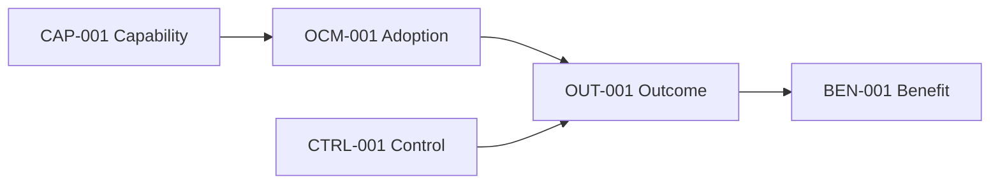
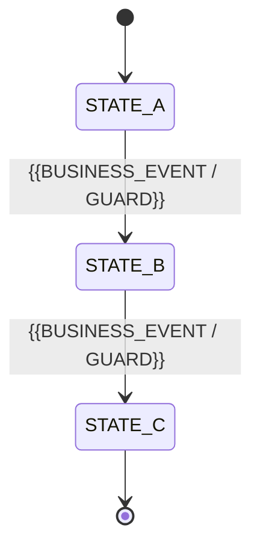

# {{PROJECT_NAME}} — Business Requirements Document

> **How to use this template**
>
> 1. Replace every `{{PLACEHOLDER}}` with verifiable facts, decisions, or references.
> 2. Sections that are not relevant must be written as `N/A — {{REASON}}`; do not delete them silently.
> 3. Do not use `TBD`, “later”, “as needed”, “optimal”, “efficient”, “easy”, “real-time”, or ambiguous terms without an `OPEN-ID`, owner, deadline, and approved fallback.
> 4. Distinguish strictly between **facts**, **evidence**, **assumptions**, **hypotheses**, **decisions**, and **solution preferences**.
> 5. The BRD establishes **why the change is needed, the business outcomes, scope, capabilities, processes, policies, decision rights, economic value, risks, and business acceptance**. The PRD establishes product behavior; the FSD establishes the technical implementation.
> 6. Avoid locking in UI, endpoints, databases, frameworks, vendors, or architecture unless they are real, approved business, legal, contractual, security, cost, interoperability, or operational constraints.
> 7. Every approved requirement and decision must have a stable ID and traceability.
> 8. Coding agents must not use the BRD as direct implementation instructions. The mandatory path for autonomous coding is **BRD → PRD → FSD → GOAL → implementation → verification**.
> 9. The ADR is an **optional and conditional** artifact, not a mandatory stage. When there is no ADR, material technical decisions must still be recorded in the FSD as `TDEC-*`; when an ADR is used, only ADRs with `ACCEPTED` status may be referenced.

---

> **REFERENCE LIBRARY - skeleton first.** Never load this entire file into
> working context or copy it as the output shape. Start from
> `skeletons/BRD-Skeleton.md`, select MINIMAL/STANDARD/HIGH_RISK, and read only
> the named section needed for a concrete risk, decision, or review gap.

# 0. BRD Operating Contract

## 0.1 Document Purpose

This BRD is the source of truth for the business needs and decisions of `{{PROJECT_NAME}}`. This document defines:

- the evidenced problems and opportunities;
- the strategic drivers and the reasons the change is happening now;
- outcomes, benefits, KPIs, and guardrails;
- the required business capabilities without guessing at product design;
- scope, non-goals, priorities, and the change horizon;
- stakeholders, owners, decision rights, and segregation of duties;
- current state, target process, control points, exceptions, and the target operating model;
- business rules, policies, information needs, compliance obligations, and evidence;
- the business case, costs, benefits, risks, change impact, and acceptance gates;
- the decisions that must be passed deterministically to the PRD and FSD.

The BRD is considered sufficiently complete when the sponsor, business owner, product, finance, risk/compliance, operations, and the PRD-authoring agent can proceed without inventing on their own:

- new objectives, benefits, stakeholders, or business processes;
- new policies, authority boundaries, approval chains, or risk appetite;
- new scope, non-goals, service expectations, or success metrics;
- new assumptions about economic value, volume, ownership, classification, retention, or compliance;
- unwritten definitions of business acceptance and consequence of failure.

## 0.2 Authority Boundaries and the Relationship Between BRD, PRD, FSD, and the Optional ADR

### 0.2.1 Canonical Artifact Path

```text
BRD → PRD → FSD → GOAL → IMPLEMENTATION → VERIFICATION
                 ↘ ADR (optional, architecture-decision sidecar)
```

- The BRD, PRD, and FSD form the primary path that must be complete before autonomous coding.
- The ADR is **not** a default gate and does not need to be created just to complete a checklist.
- When no ADR is used, the FSD must record material technical decisions in the **Technical Decision Register** with `TDEC-*` IDs.
- When an ADR is used, the FSD must link the ADR with `ACCEPTED` status, detail its implementation, and must not duplicate the decision in a contradictory way.
- ADRs with `DRAFT`, `PROPOSED`, or `IN_REVIEW` status do not become implementation authority.

### 0.2.2 Authority Matrix

| Decision Type | BRD | PRD | FSD | Optional ADR |
|---|---:|---:|---:|---:|
| Strategic driver, problem, and opportunity | **Authoritative** | Reference | Reference | Does not change |
| Business objective, outcome, benefit, and KPI | **Authoritative** | Translates | Supports | Does not change |
| Business scope, non-goal, and capability | **Authoritative** | Maps to product scope | Maps to implementation scope | Does not expand |
| Business process, policy, rule, and decision rights | **Authoritative** | Defines observable product behavior | Details enforcement | Does not change |
| Business acceptance and go/no-go criteria | **Authoritative** | Details product acceptance | Details technical evidence | Does not weaken |
| Product feature, journey, UX, and functional behavior | Constraint/outcome only | **Authoritative** | Implements | Does not change intent |
| Logical product state and product permission | Business boundary | **Authoritative** | Details persistence/enforcement | Does not change |
| Schema, API, event, job, concurrency, and integration mechanics | Does not define | Constraint only | **Authoritative** | Defines patterns/boundaries only when an ADR is used |
| Architecture, framework, library, and deployment topology | Business constraints only | Product constraints only | **Authoritative through `TDEC-*` when no ADR is used** | **Authoritative within delegated scope when `ACCEPTED` and linked** |
| Test implementation, build command, migration, technical rollback | Business acceptance intent | Product acceptance intent | **Authoritative** | May define constraints/patterns when linked |

### 0.2.3 Precedence and Change Rules

1. Law, contracts, regulators, and approved policy/security baselines take the highest precedence.
2. The approved BRD is authoritative for business intent and business boundaries.
3. The approved PRD is authoritative for product intent and product boundaries.
4. An `ACCEPTED` ADR, **when present and linked**, is authoritative only for delegated architecture decisions that do not change the BRD/PRD.
5. The approved FSD is authoritative for the implementation contract; `TDEC-*` becomes the technical authority when no ADR is used.
6. Repository conventions apply to local choices not determined by the artifacts above.
7. Tasks, prompts, or `/sc-work` invocations must not change artifact authority.

The PRD, FSD, and ADR **MUST NOT** change the BRD's business outcomes, capabilities, scope, business rules, decision rights, compliance obligations, or acceptance gates without an approved change request. Conflicts must not be resolved silently; use the **Conflict and Resolution Ledger**.

## 0.3 Audience

| Audience | Primary Use |
|---|---|
| Sponsor / Steering Committee | Approves investment, outcomes, risk appetite, and go/no-go decisions |
| Business Owner | Owns the problem, scope, policy, and business acceptance |
| Process Owner | Defines the target process, control points, SLAs, and operating ownership |
| Benefits Owner | Accountable for benefit realization after delivery |
| Product Owner | Derives capabilities and policies into the PRD without fabricating business needs |
| Finance | Validates costs, the benefit model, funding, and financial assumptions |
| Risk / Legal / Compliance / Privacy | Validates obligations, control objectives, data boundaries, and residual risk |
| Operations / Support / Change Team | Prepares the target operating model, adoption, support, and transition |
| Architect / Technical Lead | Understands business constraints before drafting the FSD and, when needed, an optional ADR |
| QA / Business Tester | Derives business acceptance and UAT scenarios |
| PRD/FSD Authoring Agent | Turns approved decisions into downstream specifications without invention |

## 0.4 Normative Language

- **MUST**: mandatory for the approved business increment.
- **MUST NOT**: outcomes or actions that must not occur.
- **SHOULD**: a strong expectation; exceptions require a written decision.
- **MAY**: optional and must not change mandatory outcomes.
- **Business outcome**: a measurable change in performance, risk, cost, revenue, compliance, or stakeholder experience.
- **Business capability**: a required organizational ability, independent of the solution's form.
- **Business requirement**: a business condition or capability that must be met to achieve an outcome.
- **Business rule**: a decision rule that applies consistently and has an owner/authority.
- **Business invariant**: a business condition that must always be true.
- **Guardrail**: a limit that prevents achieving one KPI by damaging another KPI or obligation.
- **Business acceptance**: evidence that the change can be used and produces the approved business condition, not merely that the software runs.

## 0.5 Statement Taxonomy

Every material statement must be categorized so that agents do not turn assumptions into facts.

| Type | Definition | Minimum Evidence | May Become a Requirement? |
|---|---|---|---|
| `FACT` | A condition verifiable today | Primary source or measured data | Yes, when relevant |
| `EVIDENCE` | Data/observation supporting a problem or outcome | Source, period, method, quality | Forms the basis of requirements |
| `ASSUMPTION` | An unproven statement used for planning | Owner + validation method + impact | Only when its risk is accepted |
| `HYPOTHESIS` | A cause-effect relationship that needs testing | Experiment/validation plan | Must not be treated as a certain result |
| `DECISION` | A choice approved by an authority | Approver + date + rationale | Yes, authoritative |
| `CONSTRAINT` | A limit that genuinely restricts choices | Source and consequence | Yes, when valid |
| `PREFERENCE` | A desired but non-mandatory choice | Owner and reason | Must not be promoted to MUST |
| `OPEN` | A decision not yet available | Owner + deadline + fallback | Blocker/non-blocker depending on impact |

## 0.6 Placeholder and Open Item Policy

Unstructured `TBD` is forbidden. Use the following format:

| ID | Question / Decision | Class | Impact | Affected IDs | Owner | Options | Recommendation | Safe Fallback | Deadline | Status |
|---|---|---|---|---|---|---|---|---|---|---|
| OPEN-001 | {{QUESTION}} | BUSINESS_BLOCKER / PRD_BLOCKER / NON_BLOCKER | {{IMPACT}} | {{IDS}} | {{OWNER}} | {{OPTIONS}} | {{RECOMMENDATION}} | {{FALLBACK_OR_NONE}} | {{DATE_OR_GATE}} | OPEN |

Rules:

- `BUSINESS_BLOCKER`: the BRD must not be approved until it is resolved.
- `PRD_BLOCKER`: the BRD may be approved conditionally, but the PRD must not finalize the related area.
- `NON_BLOCKER`: only the written and approved fallback may be used.
- Downstream agents or teams are forbidden from silently inventing new options/fallbacks.
- `RESOLVED` items must produce a `DEC-ID`, approver, date, rationale, and the list of updated IDs.

## 0.7 Stable ID Conventions

| Prefix | Meaning | Example |
|---|---|---|
| SRC | Source artifact | SRC-001 |
| DRV | Strategic/business driver | DRV-001 |
| PROB | Problem statement | PROB-001 |
| EVD | Evidence | EVD-001 |
| BASE | Baseline | BASE-001 |
| ROOT | Root cause | ROOT-001 |
| PRINC | Business / target-state principle | PRINC-001 |
| OBJ | Business objective | OBJ-001 |
| OUT | Measurable outcome | OUT-001 |
| KPI | KPI / metric definition | KPI-001 |
| BEN | Benefit | BEN-001 |
| DISBEN | Disbenefit / adverse effect | DISBEN-001 |
| OPT | Business / solution option | OPT-001 |
| SCOPE | Scope boundary | SCOPE-001 |
| SCOPE-NG | Explicit non-goal | SCOPE-NG-001 |
| BI | Business increment / phase | BI-001 |
| CAP | Business capability | CAP-001 |
| PROC | Business process | PROC-001 |
| ACT | Business actor / operating role | ACT-001 |
| STK | Stakeholder | STK-001 |
| SOD | Segregation-of-duties rule | SOD-001 |
| BREQ | Business requirement | BREQ-001 |
| BAC | Business acceptance criterion | BAC-001 |
| BR | Business rule | BR-001 |
| POL | Business policy | POL-001 |
| INV | Business invariant | INV-001 |
| DT | Business decision-table row | DT-001 |
| OBL | Legal/regulatory/contractual obligation | OBL-001 |
| CTRL | Business control objective | CTRL-001 |
| CTRL-SEC | Security control objective | CTRL-SEC-001 |
| PRIV-BIZ | Business privacy requirement | PRIV-BIZ-001 |
| AI-BIZ | AI / automation business-governance requirement | AI-BIZ-001 |
| INFO | Business information requirement | INFO-001 |
| DQ | Data-quality rule | DQ-001 |
| REPORT | Reporting / decision-support requirement | REPORT-001 |
| NOTIF | Business notification / escalation requirement | NOTIF-001 |
| SLA | Business service-level expectation | SLA-001 |
| COST | Cost item / assumption | COST-001 |
| ASSUMP | Assumption | ASSUMP-001 |
| HYP | Hypothesis | HYP-001 |
| CONSTR | Constraint | CONSTR-001 |
| DEP | Dependency | DEP-001 |
| RISK | Risk | RISK-001 |
| RISK-INACTION | Risk / consequence of inaction | RISK-INACTION-001 |
| OCM | Organizational-change requirement | OCM-001 |
| CHG | BRD change-control trigger | CHG-001 |
| DEC | Approved decision | DEC-001 |
| CONFLICT | Conflict | CONFLICT-001 |
| OPEN | Open decision | OPEN-001 |
| ISSUE | Issue / exception record | ISSUE-001 |
| BAT | Business acceptance test / scenario | BAT-001 |
| GATE | Approval / release gate | GATE-001 |
| REV | Review comment | REV-001 |

Approved IDs must not be reused for a different meaning. Cancelled items are given `RETIRED` status with a rationale, not deleted.

### 0.7.1 Cross-Artifact References

Local IDs may be used within their own document. Cross-document references **MUST** be qualified so that `FR-001`, `BR-001`, or `INV-001` from different artifacts are not confused.

```text
{{DOCUMENT_ID}}#{{LOCAL_ID}}
{{DOCUMENT_ID}}@{{VERSION}}#{{LOCAL_ID}}   # use when a snapshot must be pinned
```

Examples:

- `BRD-CCC#BREQ-001`
- `PRD-CCC@1.2#FR-014`
- `FSD-CCC#TDEC-003`
- `ADR-0042#DEC-001`

Machine-readable manifests must store `artifact_id`, `artifact_version`, and `local_id` separately or use the qualified reference above.

## 0.8 Quality Rules to Prevent AI Slop

An approved BRD must satisfy the following rules:

1. Every `BREQ` maps to at least one `PROB`, `OBJ`, `OUT`, and `CAP`.
2. Problems must be written as business conditions, not pre-selected solutions.
3. Capabilities must remain meaningful when the technology or vendor changes.
4. Outcomes must have a baseline, target, measurement source, owner, and timeframe.
5. Benefits must not be counted twice under different categories.
6. Adoption/usage KPIs must not replace business outcomes unless adoption is genuinely the primary outcome.
7. Every number has a unit, period, segment/population, and source.
8. Every business rule is written once as a canonical rule and referenced.
9. Scope must state organizational, process, user, data, geography, channel, time, and release boundaries where relevant.
10. Non-goals must be explicit so that agents do not “complete” the solution beyond the mandate.
11. Current-state symptoms and root causes must be distinguished; the solution must not merely automate a broken process without a conscious decision.
12. Business acceptance must measure real usage conditions and evidence, not merely “the feature is available”.
13. Risks have a trigger, mitigation, contingency, owner, residual risk, and acceptance authority.
14. Material assumptions have a validation method and a consequence if wrong.
15. Compliance/security/privacy must be provable obligations or control objectives, not generic claims.
16. AI/automation must not receive implicit authority; advisory, deterministic, human-approved, and autonomous modes must be distinguished.
17. The “do nothing” and process-only options must be assessed so that the build/buy decision does not become an initial bias.
18. Technology constraints may only be included when their source and business consequences are clear.
19. Open-ended lists such as “and so on” must not be used for mandatory obligations.
20. Conflicts in sources, numbers, policies, owners, or scope must be visible in the ledger; silently picking one is forbidden.

## 0.9 BRD Approval Gate

The BRD may only have `status: APPROVED` and `decision_stage: APPROVED_FOR_PRD` when:

- [ ] The decision request and accountable approver are clear.
- [ ] The problem, root cause, evidence, and baseline are sufficient to support the investment.
- [ ] Objectives, outcomes, KPIs, guardrails, and benefit owners are defined.
- [ ] Scope, non-goals, capabilities, the target process, and the target operating model are consistent.
- [ ] Business rules, policies, decision rights, control objectives, and obligations are unambiguous.
- [ ] The main options, including do-nothing, are assessed against approved criteria.
- [ ] The business case records the cost range, benefit range, uncertainty, and sensitivity.
- [ ] Change impact, adoption dependencies, support ownership, and transition intent are defined.
- [ ] Business acceptance scenarios and go/no-go criteria are verifiable.
- [ ] Residual risks have been accepted by the appropriate authority.
- [ ] No `BUSINESS_BLOCKER` remains open.
- [ ] The PRD handoff manifest is consistent and has no empty mandatory fields.

---

# 1. Document Control, Governance, and Traceability

## 1.1 Metadata Dokumen

| Field | Value |
|---|---|
| Project / Initiative | `{{PROJECT_NAME}}` |
| Project Code | `{{PROJECT_CODE}}` |
| BRD ID | `BRD-{{PROJECT_CODE}}` |
| Version | `{{VERSION}}` |
| Status | `{{DRAFT / IN_REVIEW / APPROVED / SUPERSEDED}}` |
| Decision Stage | `{{STAGE}}` |
| Business Sponsor | `{{NAME_OR_ROLE}}` |
| Business Owner | `{{NAME_OR_ROLE}}` |
| Process Owner | `{{NAME_OR_ROLE}}` |
| Benefits Owner | `{{NAME_OR_ROLE}}` |
| Product Owner | `{{NAME_OR_ROLE}}` |
| Finance Owner | `{{NAME_OR_ROLE_OR_NA}}` |
| Risk/Compliance Owner | `{{NAME_OR_ROLE_OR_NA}}` |
| Change Owner | `{{NAME_OR_ROLE_OR_NA}}` |
| Target Horizon | `{{DATE_OR_PERIOD}}` |
| Reporting Currency | `{{CURRENCY}}` |
| Default Timezone | `{{IANA_TIMEZONE}}` |
| Classification | `{{CLASSIFICATION}}` |

## 1.2 Source Artifacts and Evidence Register

| Source ID | Source / Artifact | Owner / Publisher | Version / Period | Type | Authority | Evidence Quality | Sections / Data Used | Access / Classification | Status |
|---|---|---|---|---|---|---|---|---|---|
| SRC-001 | {{TITLE_OR_PATH}} | {{OWNER}} | {{VERSION}} | Strategy / Policy / Audit / Data / Interview / Contract / Law | {{WHAT_IT_IS_AUTHORITATIVE_FOR}} | A / B / C / D | {{SECTIONS}} | {{ACCESS}} | VERIFIED |

Evidence quality:

- `A`: primary source, complete, current, and reproducible.
- `B`: official/trusted source with minor limitations.
- `C`: structured observation/interview or a limited sample.
- `D`: anecdotal, incomplete, or unverified; must not be the sole basis of a material decision.

## 1.3 Revision History

| Version | Date | Author | Change Summary | IDs Affected | Review / Approval |
|---|---|---|---|---|---|
| 0.1 | {{YYYY-MM-DD}} | {{AUTHOR}} | Initial draft | All | Pending |

## 1.4 Approval and Decision Authority

| Role | Name | Authority | Decision | Date | Conditions / Notes |
|---|---|---|---|---|---|
| Business Sponsor |  | Investment and strategic alignment | Pending |  |  |
| Business Owner |  | Scope, process, policy, acceptance | Pending |  |  |
| Benefits Owner |  | Benefit assumptions and realization | Pending |  |  |
| Finance |  | Cost/benefit and funding | Pending / N/A |  |  |
| Risk/Compliance/Privacy |  | Obligation and residual risk | Pending / N/A |  |  |
| Product Owner |  | PRD handoff feasibility | Pending |  |  |
| Operations / Change |  | Operating and adoption readiness | Pending |  |  |

## 1.5 Decision Log

| Decision ID | Decision | Type | Rationale | Alternatives Rejected | Approved By | Date | IDs Affected | Revisit Trigger |
|---|---|---|---|---|---|---|---|---|
| DEC-001 | {{DECISION}} | Scope / Policy / Investment / Operating Model / Risk / Option | {{RATIONALE}} | {{OPTIONS}} | {{APPROVER}} | {{DATE}} | {{IDS}} | {{TRIGGER_OR_NONE}} |

## 1.6 Conflict and Resolution Ledger

| Conflict ID | Conflicting Statements / Values | Sources | Impact | Canonical Resolution | Superseded Text / IDs | Approved By | Date | Change IDs |
|---|---|---|---|---|---|---|---|---|
| CONFLICT-001 | {{DESCRIPTION}} | {{SOURCE_IDS}} | {{IMPACT}} | {{RESOLUTION}} | {{OLD_IDS_OR_TEXT}} | {{OWNER}} | {{DATE}} | {{DEC_OR_CR_ID}} |

## 1.7 Change-Control Triggers

The following changes require BRD review and reapproval:

| Trigger ID | Change Type | Reapproval Required From | Downstream Impact |
|---|---|---|---|
| CHG-001 | Material change to the problem, objective, outcome, or KPI target | Sponsor + Business Owner | PRD/FSD traceability review |
| CHG-002 | Expansion of organizational, process, data, geography, or user scope | Business Owner + Finance/Risk as applicable | Re-estimation and new requirements |
| CHG-003 | Change to a business rule, authority, approval, or compliance obligation | Business Owner + Control Owner | PRD/FSD and test update |
| CHG-004 | Cost/benefit exceeds tolerance `{{THRESHOLD}}` | Sponsor + Finance | Business-case reapproval |
| CHG-005 | Residual risk exceeds appetite | Risk Owner + Sponsor | Pause/re-scope/mitigation decision |

## 1.8 Business Requirement Inventory

| Requirement ID | Summary | Problem / Outcome | Capability | Priority | Business Increment | Owner | Acceptance IDs | PRD IDs | Status |
|---|---|---|---|---|---|---|---|---|---|
| BREQ-001 | {{BUSINESS REQUIREMENT}} | PROB-001 / OUT-001 | CAP-001 | MUST | {{INCREMENT}} | {{OWNER}} | BAC-001 |  | DRAFT |

---

# 2. Executive Decision Brief

## 2.1 One-Paragraph Summary

`{{In one paragraph: the current condition, measured impact, required capability/process change, target outcome, affected groups, key value/cost, key risks, and the decision being requested. Do not include implementation detail.}}`

## 2.2 Decision Request

| Decision | Needed From | Needed By | Consequence if Delayed | Recommended Decision |
|---|---|---|---|---|
| {{EXACT_DECISION_REQUEST}} | {{AUTHORITY}} | {{DATE/GATE}} | {{CONSEQUENCE}} | {{RECOMMENDATION}} |

## 2.3 Business Snapshot

| Area | Summary |
|---|---|
| Strategic driver | {{DRV_IDS_AND_SUMMARY}} |
| Core problem | {{PROB_IDS_AND_SUMMARY}} |
| Evidence / baseline | {{EVD_BASE_IDS}} |
| Target outcome | {{OUT_IDS_AND_TARGETS}} |
| Required capability | {{CAP_IDS}} |
| Scope | {{ORG_PROCESS_DATA_GEOGRAPHY_HORIZON}} |
| Selected option | {{OPT_ID_OR_OPEN_ID}} |
| Indicative investment | {{RANGE_AND_CURRENCY}} |
| Expected benefit | {{RANGE_AND_PERIOD}} |
| Top risks | {{RISK_IDS}} |
| Business owner | {{OWNER}} |
| Target decision / launch horizon | {{DATE_OR_PERIOD}} |

## 2.4 Value Thesis

> When `{{TARGET_STAKEHOLDER_OR_BUSINESS_UNIT}}` gains the capability `{{CAPABILITY}}`, then `{{CURRENT_PROBLEM}}` will change into `{{TARGET_OUTCOME}}`, measured through `{{KPI_IDS}}`, because `{{EVIDENCE_BASED_CAUSAL_LOGIC}}`.

## 2.5 Recommendation

`{{State the recommended option, the criteria-based rationale, the accepted trade-offs, and the conditions that must hold true. Do not state certainty while it is still a hypothesis.}}`

## 2.6 Cost of Inaction

| Impact Area | Current / Forecast Impact | Time Horizon | Evidence | Confidence | Owner |
|---|---:|---|---|---|---|
| Revenue / Cost / Risk / Compliance / Customer / Employee / Strategic | {{VALUE_OR_DESCRIPTION}} | {{PERIOD}} | {{EVD_ID}} | High / Medium / Low | {{OWNER}} |

---

# 3. Strategic Context, Problem, and Evidence

## 3.1 Strategic Drivers

| Driver ID | Driver | Source | Strategic Objective Supported | Urgency / Deadline | Consequence of Missing | Owner |
|---|---|---|---|---|---|---|
| DRV-001 | {{DRIVER}} | {{SRC_ID}} | {{STRATEGIC_OBJECTIVE}} | {{DATE/URGENCY}} | {{CONSEQUENCE}} | {{OWNER}} |

## 3.2 Business Context

`{{Describe the relevant organizational, process, market, regulatory, customer, vendor, workforce, and operating-environment context. Avoid history that does not influence the decision.}}`

## 3.3 Problem Statements

Use the structure: **affected actor/process + current condition + impact + evidence + context boundary**.

| Problem ID | Problem Statement | Affected Stakeholders / Process | Business Impact | Evidence IDs | Frequency / Scale | Owner |
|---|---|---|---|---|---|---|
| PROB-001 | {{PROBLEM_WITHOUT_SOLUTION}} | {{STK/PROC_IDS}} | {{IMPACT}} | {{EVD_IDS}} | {{FREQUENCY_SCALE}} | {{OWNER}} |

## 3.4 Evidence and Baseline

| Evidence ID | Metric / Observation | Baseline Value | Unit | Population / Segment | Period | Source | Collection Method | Data Quality | Limitation |
|---|---|---:|---|---|---|---|---|---|---|
| EVD-001 | {{MEASURE}} | {{VALUE}} | {{UNIT}} | {{POPULATION}} | {{PERIOD}} | {{SRC_ID}} | {{METHOD}} | A/B/C/D | {{LIMITATION}} |

## 3.5 Root Cause vs Symptom

| Root ID | Observed Symptom | Root Cause Hypothesis / Finding | Evidence | Controllable? | Addressed by Scope? | Validation Needed |
|---|---|---|---|---:|---:|---|
| ROOT-001 | {{SYMPTOM}} | {{ROOT_CAUSE}} | {{EVD_IDS}} | YES / PARTIAL / NO | YES / NO | {{METHOD_OR_NONE}} |

## 3.6 Current-State Process and Workarounds

```mermaid
flowchart TD
    A[{{CURRENT_TRIGGER}}] --> B[{{CURRENT_STEP}}]
    B --> C{Decision}
    C -->|Path 1| D[{{CURRENT_OUTPUT}}]
    C -->|Path 2| E[{{MANUAL_WORKAROUND_OR_FAILURE}}]
```

| Process ID | Step / Handoff | Actor | Input | Output | Tool / Channel | Cycle Time | Error / Rework Rate | Pain / Control Gap | Evidence |
|---|---|---|---|---|---|---:|---:|---|---|
| PROC-001 | {{STEP}} | {{ACT_ID}} | {{INPUT}} | {{OUTPUT}} | {{CURRENT_TOOL}} | {{TIME}} | {{RATE}} | {{PAIN}} | {{EVD_ID}} |

## 3.7 Existing Controls and Their Limitations

| Control ID | Existing Control | Objective | Owner | Evidence Produced | Effectiveness | Limitation / Failure Mode |
|---|---|---|---|---|---|---|
| CTRL-001 | {{CONTROL}} | {{OBJECTIVE}} | {{OWNER}} | {{EVIDENCE}} | Effective / Partial / Ineffective / Unknown | {{LIMITATION}} |

## 3.8 Why Now

`{{State the external/internal deadline, compounding cost, strategic window, audit finding, contract event, capacity limit, or dependency. “Because the technology is available” alone is not a sufficient why-now.}}`

## 3.9 Opportunity Statement

`{{State the opportunity as a capability improvement or an outcome change, not a feature/technology name.}}`

---

# 4. Business Objectives, Outcomes, KPI, and Benefits

## 4.1 Business Objectives

| Objective ID | Objective | Strategic Driver | Problem IDs | Owner | Horizon | Priority |
|---|---|---|---|---|---|---|
| OBJ-001 | {{OBJECTIVE_AS_BUSINESS_CHANGE}} | DRV-001 | PROB-001 | {{OWNER}} | {{DATE/PERIOD}} | MUST |

## 4.2 Measurable Outcomes

| Outcome ID | Outcome | Baseline | Target | Unit | Population / Scope | Deadline | Measurement Source | Owner | Confidence |
|---|---|---:|---:|---|---|---|---|---|---|
| OUT-001 | {{MEASURABLE_OUTCOME}} | {{BASELINE}} | {{TARGET}} | {{UNIT}} | {{SCOPE}} | {{DATE}} | {{SOURCE}} | {{OWNER}} | High / Medium / Low |

## 4.3 KPI Dictionary

| KPI ID | Name | Purpose / Decision Supported | Formula | Numerator | Denominator | Inclusion / Exclusion | Segment | Frequency | Source of Truth | Baseline | Target | Threshold / Action | Owner |
|---|---|---|---|---|---|---|---|---|---|---:|---:|---|---|
| KPI-001 | {{NAME}} | {{DECISION}} | `{{FORMULA}}` | {{NUM}} | {{DEN}} | {{RULES}} | {{SEGMENT}} | {{CADENCE}} | {{SOURCE}} | {{VALUE}} | {{VALUE}} | {{ACTION_THRESHOLD}} | {{OWNER}} |

KPI rules:

- Define the behavior when the denominator is zero, data is late, data is missing, or the source changes.
- Separate **leading indicators**, **lagging outcomes**, **adoption metrics**, and **guardrails**.
- Avoid percentage targets without a numerator/denominator and population.
- Write down the action taken when a KPI crosses its threshold; a metric without a decision use is a vanity metric.

## 4.4 Benefits Register

| Benefit ID | Benefit | Type | Outcome / KPI | Monetization or Proxy Method | Baseline | Expected Value Range | Realization Date | Adoption Dependency | Benefits Owner | Confidence | Evidence Method |
|---|---|---|---|---|---:|---:|---|---|---|---|---|
| BEN-001 | {{BENEFIT}} | Revenue / Cost Avoidance / Productivity / Risk Reduction / Compliance / Experience / Strategic | OUT-001 / KPI-001 | {{METHOD}} | {{BASELINE}} | {{LOW_BASE_HIGH}} | {{DATE}} | {{DEPENDENCY}} | {{OWNER}} | H/M/L | {{METHOD}} |

## 4.5 Disbenefits and Guardrails

| ID | Potential Adverse Effect | Trigger / Leading Signal | Guardrail Metric | Tolerance | Mitigation | Owner |
|---|---|---|---|---|---|---|
| DISBEN-001 | {{ADVERSE_EFFECT}} | {{SIGNAL}} | {{KPI_OR_MEASURE}} | {{LIMIT}} | {{MITIGATION}} | {{OWNER}} |

## 4.6 Benefit Dependency Map


```mermaid
flowchart LR
    CAP1[CAP-001 Capability] --> ADOPT[OCM-001 Adoption]
    ADOPT --> OUT1[OUT-001 Outcome]
    OUT1 --> BEN1[BEN-001 Benefit]
    CTRL1[CTRL-001 Control] --> OUT1
```

| Benefit | Required Capability | Process Change | Adoption / Behavior Change | Data / Control Dependency | External Dependency | Failure Point |
|---|---|---|---|---|---|---|
| BEN-001 | CAP-001 | PROC-001 | OCM-001 | INFO-001 / CTRL-001 | DEP-001 | {{FAILURE_POINT}} |

## 4.7 Success Review Cadence

| Review | Timing | Audience | Inputs | Decision | Owner |
|---|---|---|---|---|---|
| Baseline confirmation | Before PRD approval | Business/Product/Finance | EVD/BASE | Confirm target validity | {{OWNER}} |
| Pilot review | {{DATE/PERIOD}} | {{AUDIENCE}} | KPI/BAT | Scale, correct, or stop | {{OWNER}} |
| Benefit review | {{30/60/90 days or period}} | Sponsor/Benefits Owner | KPI/BEN/COST | Continue, optimize, or re-scope | {{OWNER}} |

---

# 5. Options Analysis and Business Case

## 5.1 Option Inventory

At minimum, consider `do nothing`, `process/policy only`, `buy`, `build`, and `hybrid` where relevant.

| Option ID | Option | Description | Scope / Capability Covered | Time to Value | Indicative Cost | Key Benefits | Key Risks | Reversibility | Status |
|---|---|---|---|---|---:|---|---|---|---|
| OPT-001 | Do nothing / defer | {{DESCRIPTION}} | {{CAP_IDS}} | {{TIME}} | {{COST}} | {{BENEFITS_OR_NONE}} | {{RISKS}} | {{LEVEL}} | EVALUATED |
| OPT-002 | Process / policy change only | {{DESCRIPTION}} | {{CAP_IDS}} | {{TIME}} | {{COST}} | {{BENEFITS}} | {{RISKS}} | {{LEVEL}} | EVALUATED |
| OPT-003 | Buy / configure | {{DESCRIPTION}} | {{CAP_IDS}} | {{TIME}} | {{COST}} | {{BENEFITS}} | {{RISKS}} | {{LEVEL}} | EVALUATED |
| OPT-004 | Build | {{DESCRIPTION}} | {{CAP_IDS}} | {{TIME}} | {{COST}} | {{BENEFITS}} | {{RISKS}} | {{LEVEL}} | EVALUATED |
| OPT-005 | Hybrid | {{DESCRIPTION}} | {{CAP_IDS}} | {{TIME}} | {{COST}} | {{BENEFITS}} | {{RISKS}} | {{LEVEL}} | EVALUATED |

## 5.2 Evaluation Criteria

Weights must total 100%.

| Criterion | Weight | Definition | Scoring Scale | Evidence Source |
|---|---:|---|---|---|
| Business outcome fit | {} | {{DEFINITION}} | 1–5 | {{SOURCE}} |
| Time to value | {} | {{DEFINITION}} | 1–5 | {{SOURCE}} |
| Operating fit / adoption | {} | {{DEFINITION}} | 1–5 | {{SOURCE}} |

## 5.3 Weighted Option Assessment

| Option | Outcome Fit | Risk Fit | Time | TCO | Operating Fit | Reversibility | Weighted Score | Confidence | Notes |
|---|---:|---:|---:|---:|---:|---:|---:|---|---|
| OPT-001 | {{1-5}} | {{1-5}} | {{1-5}} | {{1-5}} | {{1-5}} | {{1-5}} | {{SCORE}} | H/M/L | {{NOTES}} |

## 5.4 Selected Direction and Trade-Off

| Selected Option | Decision ID | Rationale | Trade-Off Accepted | Conditions / Exit Triggers | Approver |
|---|---|---|---|---|---|
| {{OPT_ID}} | DEC-001 | {{RATIONALE}} | {{TRADE_OFF}} | {{CONDITIONS}} | {{APPROVER}} |

## 5.5 Cost Model

Do not mix one-time and recurring costs. Use ranges when estimates are immature.

| Cost ID | Cost Category | One-Time / Recurring | Quantity / Driver | Unit Cost | Low | Base | High | Period | Source / Assumption | Owner | Confidence |
|---|---|---|---|---:|---:|---:|---:|---|---|---|---|
| COST-001 | People / Vendor / License / Infrastructure / Migration / Training / Support / Audit / Contingency | One-Time | {{DRIVER}} | {{VALUE}} | {{LOW}} | {{BASE}} | {{HIGH}} | {{PERIOD}} | {{SRC_OR_ASSUMP_ID}} | {{OWNER}} | H/M/L |

## 5.6 Benefit Valuation

| Benefit ID | Volume Driver | Value per Unit | Ramp / Adoption | Low | Base | High | Period | Double-Count Check | Confidence |
|---|---:|---:|---|---:|---:|---:|---|---|---|
| BEN-001 | {{VOLUME}} | {{VALUE}} | {{RAMP}} | {{LOW}} | {{BASE}} | {{HIGH}} | {{PERIOD}} | {{CHECK}} | H/M/L |

## 5.7 Financial Summary

| Measure | Low Case | Base Case | High Case | Formula / Basis |
|---|---:|---:|---:|---|
| Initial investment | {{VALUE}} | {{VALUE}} | {{VALUE}} | Sum one-time costs |
| Annual recurring cost | {{VALUE}} | {{VALUE}} | {{VALUE}} | Sum recurring costs |
| Annual quantified benefit | {{VALUE}} | {{VALUE}} | {{VALUE}} | Sum non-duplicated benefits |
| Net annual value | {{VALUE}} | {{VALUE}} | {{VALUE}} | Benefits − recurring costs |
| Payback period | {{VALUE}} | {{VALUE}} | {{VALUE}} | Initial investment / net periodic benefit |
| ROI | {{VALUE}} | {{VALUE}} | {{VALUE}} | `(total benefits − total costs) / total costs` |
| NPV, if required | {{VALUE}} | {{VALUE}} | {{VALUE}} | Use approved discount rate `{{RATE}}` |

## 5.8 Sensitivity and Break-Even

| Variable | Base Assumption | Downside | Upside | Effect on Outcome / ROI | Break-Even Value | Monitoring Source |
|---|---:|---:|---:|---|---:|---|
| Adoption rate | {{VALUE}} | {{VALUE}} | {{VALUE}} | {{EFFECT}} | {{VALUE}} | {{SOURCE}} |
| Delivery cost | {{VALUE}} | {{VALUE}} | {{VALUE}} | {{EFFECT}} | {{VALUE}} | {{SOURCE}} |
| Volume | {{VALUE}} | {{VALUE}} | {{VALUE}} | {{EFFECT}} | {{VALUE}} | {{SOURCE}} |

## 5.9 Funding and Stage Gates

| Gate ID | Funding / Decision Gate | Evidence Required | Decision Options | Authority | Date |
|---|---|---|---|---|---|
| GATE-010 | Approve PRD/design investment | Approved BRD, cost range, blocker closure | Approve / Conditional / Rework / Stop | {{AUTHORITY}} | {{DATE}} |

---

# 6. Scope, Capability, Prioritization, and Constraints

## 6.1 Scope Boundary Matrix

| Dimension | In Scope | Out of Scope | Future / Conditional | Boundary Rule |
|---|---|---|---|---|
| Business unit / department | {{SCOPE}} | {{OUT}} | {{FUTURE}} | {{RULE}} |
| Process / lifecycle stage | {{SCOPE}} | {{OUT}} | {{FUTURE}} | {{RULE}} |
| Actor / user group | {{SCOPE}} | {{OUT}} | {{FUTURE}} | {{RULE}} |
| Customer / market segment | {{SCOPE}} | {{OUT}} | {{FUTURE}} | {{RULE}} |
| Geography / legal entity | {{SCOPE}} | {{OUT}} | {{FUTURE}} | {{RULE}} |
| Product / service / channel | {{SCOPE}} | {{OUT}} | {{FUTURE}} | {{RULE}} |
| Data / record type | {{SCOPE}} | {{OUT}} | {{FUTURE}} | {{RULE}} |
| Time period / historical data | {{SCOPE}} | {{OUT}} | {{FUTURE}} | {{RULE}} |
| Integration / third party | {{SCOPE}} | {{OUT}} | {{FUTURE}} | {{RULE}} |

## 6.2 Business Capability Map

| Capability ID | Capability | Level / Parent | Current Maturity | Target Maturity | Outcome Supported | Capability Owner | Required by Horizon |
|---|---|---|---|---|---|---|---|
| CAP-001 | {{TECHNOLOGY-INDEPENDENT_CAPABILITY}} | L1 / L2 / `{{PARENT}}` | {{1-5_OR_DESC}} | {{1-5_OR_DESC}} | OUT-001 | {{OWNER}} | {{DATE/INCREMENT}} |

Capability quality check:

- Capability names must be organizational abilities, not screens, services, tables, or vendors.
- Capabilities must have an owner, consumers, inputs/outputs, and a measurable outcome.
- Capabilities must not overlap without a clear boundary.

## 6.3 In-Scope Business Requirements

| Scope ID | Capability / Process / Outcome Included | Boundary | Business Increment | Priority | Owner |
|---|---|---|---|---|---|
| SCOPE-001 | {{ITEM}} | {{BOUNDARY}} | {{INCREMENT}} | MUST | {{OWNER}} |

## 6.4 Explicit Non-Goals

| Scope ID | Excluded Capability / Outcome | Reason | Risk if Accidentally Included | Earliest Reconsideration | Guardrail |
|---|---|---|---|---|---|
| SCOPE-NG-001 | {{NON_GOAL}} | {{REASON}} | {{RISK}} | {{MILESTONE_OR_NONE}} | PRD/FSD/agents MUST NOT implement indirectly |

## 6.5 Business Increments / Phasing

| Increment | Business Outcome | Capabilities | Scope | Entry Criteria | Exit Criteria | Dependencies | Target |
|---|---|---|---|---|---|---|---|
| BI-001 | {{OUTCOME}} | {{CAP_IDS}} | {{SCOPE_IDS}} | {{ENTRY}} | {{EXIT}} | {{DEP_IDS}} | {{DATE}} |

## 6.6 Prioritization

| Item ID | Priority | Rationale | Time Criticality | Risk Reduction / Opportunity Enablement | Cost of Delay | Cannot Be Deferred Because |
|---|---|---|---|---|---|---|
| BREQ-001 | MUST / SHOULD / COULD / WON'T | {{RATIONALE}} | {{LEVEL}} | {{VALUE}} | {{VALUE}} | {{REASON}} |

`MUST` means the business increment fails without the item; not merely “important”.

## 6.7 Constraints

| Constraint ID | Constraint | Type | Source | Why It Is Binding | Consequence for Options / PRD | Expiry / Review Trigger | Owner |
|---|---|---|---|---|---|---|---|
| CONSTR-001 | {{CONSTRAINT}} | Legal / Contract / Policy / Budget / Schedule / Interoperability / Security / Resource | {{SRC_ID}} | {{RATIONALE}} | {{CONSEQUENCE}} | {{TRIGGER}} | {{OWNER}} |

## 6.8 Assumptions

| Assumption ID | Assumption | Evidence | Impact if False | Validation Method | Validation Deadline | Owner | Status |
|---|---|---|---|---|---|---|---|
| ASSUMP-001 | {{ASSUMPTION}} | {{EVD_OR_NONE}} | {{IMPACT}} | {{METHOD}} | {{DATE/GATE}} | {{OWNER}} | UNVERIFIED |

## 6.9 Dependencies

| Dependency ID | Dependency | Type | Owner | Commitment / SLA | Needed Capability / Deliverable | Required By | Failure Impact | Fallback | Status |
|---|---|---|---|---|---|---|---|---|---|
| DEP-001 | {{TEAM_SYSTEM_VENDOR_POLICY_EVENT}} | Internal / External / Regulatory / Data / People | {{OWNER}} | {{COMMITMENT}} | {{DELIVERABLE}} | {{DATE}} | {{IMPACT}} | {{FALLBACK}} | {{STATUS}} |

---

# 7. Stakeholders, Actors, Decision Rights, and Governance

## 7.1 Stakeholder Map

| Stakeholder ID | Stakeholder / Group | Interest | Influence | Current Pain / Incentive | Success Definition | Likely Resistance | Engagement Strategy | Owner |
|---|---|---:|---:|---|---|---|---|---|
| STK-001 | {{GROUP}} | High / Medium / Low | High / Medium / Low | {{PAIN}} | {{SUCCESS}} | {{RESISTANCE}} | {{STRATEGY}} | {{OWNER}} |

## 7.2 Business Actor and Operating Role Catalog

| Actor ID | Role | Responsibilities | Business Authority | Data / Process Scope | Obligations | Prohibited Actions | Backup / Delegate |
|---|---|---|---|---|---|---|---|
| ACT-001 | {{ROLE}} | {{RESPONSIBILITIES}} | {{DECISIONS_ALLOWED}} | {{SCOPE}} | {{OBLIGATIONS}} | {{PROHIBITIONS}} | {{BACKUP}} |

Distinguish:

- stakeholders who are affected;
- actors who execute the process;
- approvers who hold authority;
- owners accountable for outcomes;
- product/system roles that will only be defined in the PRD.

## 7.3 Decision Rights Matrix

| Decision Area | Recommend | Decide / Approve | Execute | Verify / Challenge | Escalation Authority | Evidence Required |
|---|---|---|---|---|---|---|
| Scope change | {{ROLE}} | {{ROLE}} | {{ROLE}} | {{ROLE}} | {{ROLE}} | {{EVIDENCE}} |
| Policy exception | {{ROLE}} | {{ROLE}} | {{ROLE}} | {{ROLE}} | {{ROLE}} | {{EVIDENCE}} |
| High-risk action | {{ROLE}} | {{ROLE}} | {{ROLE}} | {{ROLE}} | {{ROLE}} | {{EVIDENCE}} |
| Benefit acceptance | {{ROLE}} | {{ROLE}} | {{ROLE}} | {{ROLE}} | {{ROLE}} | {{EVIDENCE}} |

## 7.4 RACI for Business Processes

| Process / Deliverable | Sponsor | Business Owner | Process Owner | Product | Operations | Risk/Compliance | Finance | Change |
|---|---|---|---|---|---|---|---|---|
| {{PROC_OR_DELIVERABLE}} | A / R / C / I | A / R / C / I | A / R / C / I | A / R / C / I | A / R / C / I | A / R / C / I | A / R / C / I | A / R / C / I |

Every row must have exactly one `A`.

## 7.5 Segregation of Duties and Conflict of Interest

| SoD ID | Action / Decision | Initiator | Approver / Verifier | Prohibited Combination | Exception Authority | Evidence |
|---|---|---|---|---|---|---|
| SOD-001 | {{HIGH_RISK_ACTION}} | {{ROLE}} | {{ROLE}} | {{CONFLICT}} | {{AUTHORITY}} | {{RECORD}} |

## 7.6 Governance Cadence

| Forum / Review | Purpose | Cadence | Participants | Inputs | Decisions | Record Owner |
|---|---|---|---|---|---|---|
| Steering review | {{PURPOSE}} | {{CADENCE}} | {{ROLES}} | {{INPUTS}} | {{DECISIONS}} | {{OWNER}} |

## 7.7 Escalation Model

| Trigger | First Owner | Response Target | Escalation Path | Final Authority | Required Record |
|---|---|---|---|---|---|
| {{BUSINESS_EXCEPTION}} | {{OWNER}} | {{SLA}} | {{PATH}} | {{AUTHORITY}} | {{EVIDENCE}} |

---

# 8. Target Business Process and Operating Model

## 8.1 Target-State Principles

| Principle ID | Principle | Rationale | Observable Business Implication | Guardrail |
|---|---|---|---|---|
| PRINC-001 | {{PRINCIPLE}} | {{RATIONALE}} | {{IMPLICATION}} | {{GUARDRAIL}} |

## 8.2 Target Process Overview

```mermaid
flowchart TD
    A[{{BUSINESS_TRIGGER}}] --> B[{{ACTOR_ACTION_OR_CAPABILITY}}]
    B --> C{Business Decision}
    C -->|Approved| D[{{TARGET_OUTCOME}}]
    C -->|Exception| E[{{EXCEPTION_AND_ESCALATION}}]
    D --> F[{{EVIDENCE_OR_HANDOFF}}]
```

## 8.3 Business Process Inventory

| Process ID | Process | Objective | Trigger | Start State | End State | Owner | Participants | SLA | Controls | Outputs / Evidence |
|---|---|---|---|---|---|---|---|---|---|---|
| PROC-001 | {{PROCESS}} | {{OBJECTIVE}} | {{TRIGGER}} | {{START}} | {{END}} | {{OWNER}} | {{ACT_IDS}} | {{SLA_ID}} | {{CTRL_IDS}} | {{OUTPUTS}} |

## 8.4 Reusable Business Process Specification

### PROC-{{NNN}} — {{PROCESS_NAME}}

#### Process Objective

`{{OUTCOME THE PROCESS MUST ACHIEVE}}`

#### Scope and Boundary

| Included | Excluded | Start Boundary | End Boundary |
|---|---|---|---|
| {{INCLUDED}} | {{EXCLUDED}} | {{START_EVENT}} | {{END_CONDITION}} |

#### Actors and Decision Rights

| Actor | Responsibility | Authority | Handoff To / From |
|---|---|---|---|
| ACT-001 | {{RESPONSIBILITY}} | {{AUTHORITY}} | {{HANDOFF}} |

#### Trigger and Preconditions

- Trigger: `{{BUSINESS_EVENT}}`
- Preconditions:
  - `{{PRECONDITION_1}}`
  - `{{PRECONDITION_2}}`

#### Inputs and Required Information

| Input | Source | Minimum Quality / Completeness | Owner | Sensitive? |
|---|---|---|---|---|
| {{INPUT}} | {{SOURCE}} | {{QUALITY}} | {{OWNER}} | {{CLASSIFICATION}} |

#### Main Business Flow

| Step | Actor | Business Action / Decision | Rule IDs | Output | Target Time | Evidence |
|---:|---|---|---|---|---|---|
| 1 | ACT-001 | {{ACTION}} | BR-001 | {{OUTPUT}} | {{TIME}} | {{EVIDENCE}} |

#### Alternative, Exception, and Recovery Paths

| Scenario | Detection | Required Business Response | Authority | SLA | Final State | Evidence |
|---|---|---|---|---|---|---|
| Missing information | {{DETECTION}} | {{RESPONSE}} | {{ROLE}} | {{TIME}} | {{STATE}} | {{RECORD}} |
| Duplicate request | {{DETECTION}} | {{RESPONSE}} | {{ROLE}} | {{TIME}} | {{STATE}} | {{RECORD}} |
| Approval denied | {{DETECTION}} | {{RESPONSE}} | {{ROLE}} | {{TIME}} | {{STATE}} | {{RECORD}} |
| Dependency unavailable | {{DETECTION}} | {{FALLBACK_OR_PAUSE}} | {{ROLE}} | {{TIME}} | {{STATE}} | {{RECORD}} |
| Data discovered stale/incorrect | {{DETECTION}} | {{REVALIDATE_OR_REVERSE}} | {{ROLE}} | {{TIME}} | {{STATE}} | {{RECORD}} |

#### Postconditions and Completion Evidence

- Required end state: `{{END_STATE}}`
- Business record produced: `{{RECORD}}`
- Stakeholder notified: `{{WHO_AND_WHEN}}`
- KPI event/measurement: `{{KPI_ID}}`
- No-success condition: `{{WHAT_MUST_NOT_BE_REPORTED_AS_SUCCESS}}`

## 8.5 Handoff Matrix

| From | To | Trigger | Information / Artifact | Quality Criteria | Acceptance / Acknowledgement | Timeout / Escalation |
|---|---|---|---|---|---|---|
| {{ROLE/PROCESS}} | {{ROLE/PROCESS}} | {{TRIGGER}} | {{ARTIFACT}} | {{CRITERIA}} | {{ACK}} | {{RULE}} |

## 8.6 Business SLA and Service Expectations

| SLA ID | Service / Process | Scope / Population | Target | Measurement Start | Measurement Stop | Business Hours / Calendar | Exclusions | Breach Action | Owner |
|---|---|---|---|---|---|---|---|---|---|
| SLA-001 | {{SERVICE}} | {{SCOPE}} | {{TARGET}} | {{START}} | {{STOP}} | {{CALENDAR}} | {{EXCLUSIONS}} | {{ACTION}} | {{OWNER}} |

## 8.7 Control Points and Evidence

| Control ID | Process Step | Control Objective | Preventive / Detective / Corrective | Performer | Verifier | Frequency | Evidence | Failure Response |
|---|---|---|---|---|---|---|---|---|
| CTRL-001 | {{STEP}} | {{OBJECTIVE}} | {{TYPE}} | {{ROLE}} | {{ROLE}} | {{FREQUENCY}} | {{EVIDENCE}} | {{RESPONSE}} |

## 8.8 Target Operating Model

| Operating Dimension | Target State | Owner | Capacity / Coverage | Governance | Dependency | Readiness Evidence |
|---|---|---|---|---|---|---|
| Process ownership | {{TARGET}} | {{OWNER}} | {{CAPACITY}} | {{FORUM}} | {{DEP}} | {{EVIDENCE}} |
| Day-to-day operation | {{TARGET}} | {{OWNER}} | {{CAPACITY}} | {{FORUM}} | {{DEP}} | {{EVIDENCE}} |
| Exception handling | {{TARGET}} | {{OWNER}} | {{CAPACITY}} | {{FORUM}} | {{DEP}} | {{EVIDENCE}} |
| Support | {{TARGET}} | {{OWNER}} | {{HOURS/TIER}} | {{ESCALATION}} | {{DEP}} | {{EVIDENCE}} |
| Data stewardship | {{TARGET}} | {{OWNER}} | {{CAPACITY}} | {{FORUM}} | {{DEP}} | {{EVIDENCE}} |
| Control assurance | {{TARGET}} | {{OWNER}} | {{CADENCE}} | {{FORUM}} | {{DEP}} | {{EVIDENCE}} |

## 8.9 Manual Fallback and Degraded Business Operation

| Failure / Unavailability | Minimum Business Capability Preserved | Manual / Alternate Process | Maximum Safe Duration | Data Reconciliation Needed | Owner | Communication |
|---|---|---|---|---|---|---|
| {{FAILURE}} | {{CAPABILITY}} | {{FALLBACK}} | {{DURATION}} | {{RECONCILIATION}} | {{OWNER}} | {{MESSAGE/AUDIENCE}} |

---

# 9. Business Domain Semantics, Policy, and Rules

## 9.1 Canonical Glossary

| Term | Canonical Definition | Not Equivalent To | Source / Owner | Downstream Notes |
|---|---|---|---|---|
| {{TERM}} | {{UNAMBIGUOUS_DEFINITION}} | {{CONFUSED_TERM}} | {{SRC_OR_OWNER}} | {{NOTES}} |

## 9.2 Conceptual Business Entity Catalog

Do not define physical schema here.

| Entity / Record | Business Purpose | Human Identifier | Lifecycle Owner | Source of Truth | Sensitive / Classified? | Retention Intent |
|---|---|---|---|---|---|---|
| {{ENTITY}} | {{PURPOSE}} | {{HUMAN_KEY}} | {{OWNER}} | {{SOURCE}} | {{CLASSIFICATION}} | {{RETENTION}} |

## 9.3 Source-of-Truth Matrix

| Datum / Decision / State | Authoritative Owner / System | Writers / Maintainers | Consumers | Freshness Expectation | Conflict Rule | Evidence of Reconciliation |
|---|---|---|---|---|---|---|
| {{DATUM}} | {{SOURCE_OF_TRUTH}} | {{WRITERS}} | {{CONSUMERS}} | {{FRESHNESS}} | {{WINNER_AND_REPAIR}} | {{EVIDENCE}} |

## 9.4 Business Rules

| Rule ID | Canonical Rule | Applies To | Trigger / Condition | Decision / Outcome | Exceptions | Authority / Source | Effective Date | Evidence |
|---|---|---|---|---|---|---|---|---|
| BR-001 | {{ONE_RULE_ONLY}} | {{SCOPE}} | {{CONDITION}} | {{OUTCOME}} | {{EXCEPTIONS_OR_NONE}} | {{SRC/OWNER}} | {{DATE}} | {{EVIDENCE}} |

Rule quality:

- one row = one rule;
- conditions and outcomes must be deterministic when the rule is not a discretionary policy;
- exceptions must have an authority and evidence;
- examples do not replace rules;
- when two rules apply at the same time, precedence must be written down.

## 9.5 Business Policies

| Policy ID | Policy Statement | Objective | Scope | Mandatory / Discretionary | Exception Authority | Review Cadence | Source |
|---|---|---|---|---|---|---|---|
| POL-001 | {{POLICY}} | {{OBJECTIVE}} | {{SCOPE}} | {{TYPE}} | {{AUTHORITY}} | {{CADENCE}} | {{SRC_ID}} |

## 9.6 Business Invariants and Forbidden Outcomes

| Invariant ID | Condition That Must Always Be True | Applies To | Violation Impact | Prevention / Detection Intent | Exception Allowed? | Owner |
|---|---|---|---|---|---|---|
| INV-001 | {{INVARIANT}} | {{SCOPE}} | {{IMPACT}} | {{CONTROL_INTENT}} | NO / {{RULE}} | {{OWNER}} |

Examples of forbidden outcomes to evaluate:

- unauthorized approval or disclosure;
- double-counted financial value;
- completion declared without required evidence;
- obligation silently dropped during dependency failure;
- irreversible action without required approval;
- stale or unverified information presented as current;
- AI-generated recommendation treated as authoritative without approved gate.

## 9.7 Business State / Lifecycle Semantics

| Lifecycle / State Set | State | Business Meaning | Entry Condition | Allowed Actor / Event | Exit Condition | Terminal? | Evidence |
|---|---|---|---|---|---|---:|---|
| `{{ENTITY_LIFECYCLE}}` | `{{STATE}}` | {{MEANING}} | {{ENTRY}} | {{ACTOR/EVENT}} | {{EXIT}} | Yes / No | {{RECORD}} |


```mermaid
stateDiagram-v2
    [*] --> STATE_A
    STATE_A --> STATE_B: {{BUSINESS_EVENT / GUARD}}
    STATE_B --> STATE_C: {{BUSINESS_EVENT / GUARD}}
    STATE_C --> [*]
```

## 9.8 Decision Tables

| Decision ID | Condition A | Condition B | Condition C | Outcome | Approval / Evidence |
|---|---|---|---|---|---|
| DT-001 | {{VALUE}} | {{VALUE}} | {{VALUE}} | {{OUTCOME}} | {{AUTHORITY/EVIDENCE}} |

## 9.9 Precedence and Fail-Safe Rules

| Area | Higher-Precedence Source / Rule | Lower-Precedence Source | Conflict Resolution | Safe Default | Owner |
|---|---|---|---|---|---|
| {{AREA}} | {{SOURCE/RULE}} | {{SOURCE/RULE}} | {{RULE}} | {{DEFAULT}} | {{OWNER}} |

Unknown/default behavior must not become more permissive unless explicitly approved.

## 9.10 Time, Date, Currency, Unit, and Rounding Semantics

| Semantic Area | Canonical Rule | Example | Edge Case | Owner |
|---|---|---|---|---|
| Business timezone | `{{IANA_TIMEZONE}}` | {{EXAMPLE}} | DST / no DST | {{OWNER}} |
| Business day | {{CALENDAR/HOLIDAY_SOURCE}} | {{EXAMPLE}} | Weekend/holiday | {{OWNER}} |
| Deadline inclusivity | {{INCLUSIVE_EXCLUSIVE}} | {{EXAMPLE}} | End-of-day | {{OWNER}} |
| Currency | {{ISO_CURRENCY}} | {{EXAMPLE}} | FX date/source | {{OWNER}} |
| Rounding | {{ROUNDING_RULE}} | {{EXAMPLE}} | Midpoint rule | {{OWNER}} |
| Unit conversion | {{CANONICAL_UNIT}} | {{EXAMPLE}} | Precision | {{OWNER}} |

---

# 10. Business Information, Reporting, Records, and Notifications

## 10.1 Business Information Requirements

| Info ID | Information Needed | Business Decision / Process Supported | Consumer | Source of Truth | Required Fields / Dimensions | Freshness | Accuracy / Completeness | Classification | Owner |
|---|---|---|---|---|---|---|---|---|---|
| INFO-001 | {{INFORMATION}} | {{DECISION/PROC}} | {{ROLE}} | {{SOURCE}} | {{FIELDS/DIMENSIONS}} | {{FRESHNESS}} | {{QUALITY_TARGET}} | {{CLASS}} | {{OWNER}} |

## 10.2 Data Ownership and Stewardship

| Information Domain | Business Owner | Data Steward | Permitted Consumers | Quality Accountability | Correction Authority | Escalation |
|---|---|---|---|---|---|---|
| {{DOMAIN}} | {{OWNER}} | {{STEWARD}} | {{CONSUMERS}} | {{ACCOUNTABILITY}} | {{AUTHORITY}} | {{PATH}} |

## 10.3 Data Quality Rules

| DQ ID | Data / Field | Quality Dimension | Rule / Target | Validation Point | Failure Handling | Owner | Evidence |
|---|---|---|---|---|---|---|---|
| DQ-001 | {{DATA}} | Accuracy / Completeness / Timeliness / Uniqueness / Consistency | {{RULE}} | {{POINT}} | {{RESPONSE}} | {{OWNER}} | {{REPORT}} |

## 10.4 Classification, Access, Retention, and Disposal Intent

| Information / Record | Classification | Need-to-Know / Clearance | Permitted Purpose | Retention | Disposal / Legal Hold | Cross-Border / Third-Party Restriction | Owner |
|---|---|---|---|---|---|---|---|
| {{RECORD}} | {{CLASS}} | {{ACCESS}} | {{PURPOSE}} | {{PERIOD/RULE}} | {{RULE}} | {{RESTRICTION}} | {{OWNER}} |

## 10.5 Reporting and Decision-Support Requirements

| Report ID | Information Product / Report | Audience | Decision Supported | Metrics / Dimensions | Frequency | Freshness | Drill / Filter Needs | Export / Evidence | Owner |
|---|---|---|---|---|---|---|---|---|---|
| REPORT-001 | {{REPORT_OR_VIEW}} | {{AUDIENCE}} | {{DECISION}} | {{KPI/INFO_IDS}} | {{CADENCE}} | {{LATENCY}} | {{NEEDS}} | {{FORMAT/RECORD}} | {{OWNER}} |

Do not require a “dashboard” unless the business need genuinely requires continuous visual monitoring; define the decision and information first.

## 10.6 Business Notifications and Escalations

| Notification ID | Trigger | Recipient | Purpose / Required Action | Delivery Deadline | Escalation | Deduplication / Repeat Rule | Suppression / Completion Rule | Evidence |
|---|---|---|---|---|---|---|---|---|
| NOTIF-001 | {{BUSINESS_EVENT}} | {{ROLE}} | {{ACTION}} | {{TIME}} | {{PATH}} | {{RULE}} | {{RULE}} | {{RECORD}} |

## 10.7 Records and Audit Evidence

| Record / Evidence | Event / Process | Required Contents | Creator | Verifier | Immutability / Correction Rule | Retention | Retrieval SLA | Consumer |
|---|---|---|---|---|---|---|---|---|
| {{RECORD}} | {{EVENT}} | {{CONTENTS}} | {{ROLE}} | {{ROLE}} | {{RULE}} | {{PERIOD}} | {{SLA}} | {{AUDITOR/OWNER}} |

## 10.8 External Business Interactions

| External Party / System | Business Purpose | Information Exchanged | Direction | Frequency / Trigger | Contract / Obligation | Failure Impact | Business Fallback | Owner |
|---|---|---|---|---|---|---|---|---|
| {{PARTY/SYSTEM}} | {{PURPOSE}} | {{INFO}} | In / Out / Both | {{TRIGGER}} | {{SRC/OBL}} | {{IMPACT}} | {{FALLBACK}} | {{OWNER}} |

## 10.9 Historical Data and Transition Intent

| Data / Record Set | Required History | Reason | Quality Known? | Cleansing / Reconciliation Owner | Cutover Acceptance | Legacy Retention / Decommission |
|---|---|---|---|---|---|---|
| {{DATASET}} | {{PERIOD/SCOPE}} | {{REASON}} | {{STATUS}} | {{OWNER}} | {{CRITERIA}} | {{RULE}} |

---

# 11. Business Requirement Specifications

## 11.1 Requirement Writing Standard

A good business requirement:

- expresses a business capability, rule, control, information need, or outcome;
- is technology-independent unless a binding constraint is cited;
- has one accountable owner and one priority;
- maps to problem, outcome, capability, process, and acceptance evidence;
- separates mandatory behavior from examples;
- states negative/forbidden outcome and material exception behavior;
- provides enough policy and process context for PRD without prescribing implementation.

Canonical pattern:

> **BREQ-{{NNN}}:** `{{BUSINESS_ACTOR_OR_ORGANIZATION}}` MUST be able to `{{CAPABILITY_OR_BUSINESS_ACTION}}` for `{{SCOPE}}` under `{{CONDITIONS}}`, so that `{{OUTCOME_ID}}` is achieved, while preserving `{{INVARIANT/OBLIGATION}}`.

## 11.2 Reusable Requirement Packet

Duplicate this subsection for every material requirement or tightly cohesive capability slice.

### BREQ-{{NNN}} — {{BUSINESS_REQUIREMENT_NAME}}

#### 11.2.1 Metadata

| Field | Value |
|---|---|
| Requirement ID | BREQ-{{NNN}} |
| Status | DRAFT / IN_REVIEW / APPROVED / RETIRED |
| Priority | MUST / SHOULD / COULD / WON'T |
| Business Owner | {{OWNER}} |
| Process Owner | {{OWNER}} |
| Business Increment | {{INCREMENT}} |
| Problem IDs | {{PROB_IDS}} |
| Objective / Outcome IDs | {{OBJ_IDS}} / {{OUT_IDS}} |
| Capability IDs | {{CAP_IDS}} |
| Process IDs | {{PROC_IDS}} |
| Source / Evidence IDs | {{SRC/EVD_IDS}} |
| Rule / Policy / Obligation IDs | {{BR/POL/OBL_IDS}} |
| Acceptance IDs | {{BAC_IDS}} |
| Dependency / Risk / Open IDs | {{DEP/RISK/OPEN_IDS}} |

#### 11.2.2 Requirement Statement

`{{ONE_ATOMIC_BUSINESS_REQUIREMENT}}`

#### 11.2.3 Business Rationale

`{{WHY THIS REQUIREMENT IS NECESSARY; LINK TO IMPACT AND OUTCOME.}}`

#### 11.2.4 Scope and Exclusions

| In Scope | Out of Scope | Population / Volume | Geography / Entity | Time Horizon |
|---|---|---|---|---|
| {{IN}} | {{OUT}} | {{VOLUME}} | {{SCOPE}} | {{HORIZON}} |

#### 11.2.5 Actors, Authority, and SoD

| Actor | Responsibility | Allowed Decision / Action | Prohibited | Approval / Verification |
|---|---|---|---|---|
| ACT-001 | {{RESPONSIBILITY}} | {{ALLOWED}} | {{DENIED}} | {{GATE}} |

#### 11.2.6 Trigger, Preconditions, and Required Outcome

- Trigger: `{{BUSINESS_EVENT}}`
- Preconditions:
  - `{{PRECONDITION}}`
- Required outcome:
  - `{{END_STATE_OR_BUSINESS_RESULT}}`
- Required evidence:
  - `{{EVIDENCE}}`

#### 11.2.7 Main Business Flow

| Step | Actor | Business Action / Decision | Rule IDs | Output / Handoff | Business SLA |
|---:|---|---|---|---|---|
| 1 | ACT-001 | {{ACTION}} | BR-001 | {{OUTPUT}} | SLA-001 |

#### 11.2.8 Exception, Negative, and Recovery Conditions

| Condition | Must Happen | Must Not Happen | Authority | Final Business State | Evidence / Notification |
|---|---|---|---|---|---|
| Invalid/incomplete input | {{RESPONSE}} | {{FORBIDDEN}} | {{ROLE}} | {{STATE}} | {{EVIDENCE}} |
| Duplicate/repeated action | {{RESPONSE}} | {{FORBIDDEN}} | {{ROLE}} | {{STATE}} | {{EVIDENCE}} |
| Unauthorized actor | {{RESPONSE}} | {{FORBIDDEN}} | {{ROLE}} | {{STATE}} | {{EVIDENCE}} |
| Dependency failure | {{FALLBACK/PAUSE}} | {{FORBIDDEN}} | {{ROLE}} | {{STATE}} | {{EVIDENCE}} |
| Stale/changed source | {{REVALIDATE}} | {{FORBIDDEN}} | {{ROLE}} | {{STATE}} | {{EVIDENCE}} |
| Partial completion | {{ROLLBACK/COMPENSATE/HOLD}} | {{FORBIDDEN}} | {{ROLE}} | {{STATE}} | {{EVIDENCE}} |

#### 11.2.9 Business Rules and Invariants

| Type | IDs | Application to This Requirement |
|---|---|---|
| Business rules | {{BR_IDS}} | {{HOW_APPLIED}} |
| Policies | {{POL_IDS}} | {{HOW_APPLIED}} |
| Invariants | {{INV_IDS}} | {{HOW_PRESERVED}} |
| Obligations / controls | {{OBL_CTRL_IDS}} | {{HOW_SATISFIED}} |

#### 11.2.10 Information, Reporting, and Record Needs

| Type | IDs / Description | Required Freshness / Accuracy | Access / Classification | Evidence |
|---|---|---|---|---|
| Input information | {{INFO_IDS}} | {{QUALITY}} | {{ACCESS}} | {{EVIDENCE}} |
| Decision support/report | {{REPORT_IDS}} | {{FRESHNESS}} | {{ACCESS}} | {{EVIDENCE}} |
| Notification | {{NOTIF_IDS}} | {{TIMING}} | {{ACCESS}} | {{EVIDENCE}} |
| Business record | {{RECORD}} | {{COMPLETENESS}} | {{RETENTION}} | {{EVIDENCE}} |

#### 11.2.11 Service and Capacity Expectations

| Dimension | Expectation | Context / Population | Measurement | Tolerance / Degraded Mode |
|---|---|---|---|---|
| Volume | {{VOLUME}} | {{PERIOD/SEGMENT}} | {{SOURCE}} | {{TOLERANCE}} |
| Cycle time / latency | {{TARGET}} | {{CONTEXT}} | {{MEASUREMENT}} | {{DEGRADED_RULE}} |
| Availability / business hours | {{TARGET}} | {{CALENDAR}} | {{MEASUREMENT}} | {{FALLBACK}} |
| Accuracy / error tolerance | {{TARGET}} | {{CONTEXT}} | {{MEASUREMENT}} | {{RESPONSE}} |
| Recovery / continuity | {{TARGET}} | {{SCENARIO}} | {{MEASUREMENT}} | {{FALLBACK}} |

#### 11.2.12 Business Acceptance Criteria

| Acceptance ID | Given / Context | When / Business Event | Then / Expected Business Outcome | Evidence / Oracle | Negative Guard |
|---|---|---|---|---|---|
| BAC-001 | {{CONTEXT}} | {{EVENT}} | {{OUTCOME}} | {{OBJECTIVE_EVIDENCE}} | {{WHAT_MUST_NOT_OCCUR}} |

Acceptance criteria must be testable without relying on “looks correct”, “works as expected”, or subjective approval alone.

#### 11.2.13 Metrics and Benefit Contribution

| Outcome / KPI / Benefit | Expected Contribution | Measurement Event | Attribution Limitation | Owner |
|---|---|---|---|---|
| OUT-001 / KPI-001 / BEN-001 | {{CONTRIBUTION}} | {{EVENT/SOURCE}} | {{LIMITATION}} | {{OWNER}} |

#### 11.2.14 Dependencies, Risks, Assumptions, and Open Items

| Type | ID | Impact on Requirement | Required Action / Gate |
|---|---|---|---|
| Dependency | DEP-001 | {{IMPACT}} | {{ACTION}} |
| Risk | RISK-001 | {{IMPACT}} | {{MITIGATION}} |
| Assumption | ASSUMP-001 | {{IMPACT}} | {{VALIDATE}} |
| Open item | OPEN-001 | {{IMPACT}} | {{GATE}} |

#### 11.2.15 PRD Handoff Questions

PRD must resolve observable product behavior for the following without changing business intent:

- `{{USER/JOURNEY_OR_PRODUCT_BEHAVIOR_QUESTION}}`
- `{{ROLE/PERMISSION_ENFORCEMENT_QUESTION}}`
- `{{ERROR/EMPTY/RECOVERY_EXPERIENCE_QUESTION}}`
- `{{REPORT/NOTIFICATION_PRESENTATION_QUESTION}}`

PRD must not decide:

- `{{BUSINESS_RULE_AUTHORITY_SCOPE_OR_OUTCOME_ALREADY_DECIDED}}`

#### 11.2.16 Definition of Ready for PRD

- [ ] Requirement maps to approved problem, outcome, capability, process, and owner.
- [ ] Business rule, authority, scope, exception, and acceptance evidence are clear.
- [ ] No unresolved `BUSINESS_BLOCKER` affects this requirement.
- [ ] Volume, timing, classification, obligation, and service expectation are stated where material.
- [ ] Requirement is technology-independent or binding constraint is cited.
- [ ] PRD handoff questions are product decisions, not hidden business decisions.

## 11.3 Cross-Requirement Consistency Matrix

| Concern | Canonical IDs | Requirements Using It | Consistency Check | Result |
|---|---|---|---|---|
| Role authority | ACT-001 / SOD-001 | BREQ-001, BREQ-002 | No requirement grants broader authority | PASS / FAIL |
| Business state | BR-001 / INV-001 | {{BREQ_IDS}} | State names and transitions identical | PASS / FAIL |
| Information source | INFO-001 | {{BREQ_IDS}} | One source of truth | PASS / FAIL |
| KPI | KPI-001 | {{BREQ_IDS}} | Formula and denominator identical | PASS / FAIL |

---

# 12. Cross-Cutting Obligations and Control Objectives

## 12.1 Legal, Regulatory, Contractual, and Policy Obligations

| Obligation ID | Obligation | Jurisdiction / Contract / Policy | Applies To | Effective Date | Required Business Behavior | Evidence | Owner | Non-Compliance Impact |
|---|---|---|---|---|---|---|---|---|
| OBL-001 | {{OBLIGATION}} | {{SOURCE}} | {{SCOPE}} | {{DATE}} | {{BEHAVIOR}} | {{EVIDENCE}} | {{OWNER}} | {{IMPACT}} |

Verify legal interpretations with qualified counsel or the designated compliance owner; BRD must record approved interpretation, not invent one.

## 12.2 Security Control Objectives

| Control ID | Protected Asset / Process | Threat / Failure Concern | Business Control Objective | Required Evidence | Risk Owner | Downstream Design Freedom |
|---|---|---|---|---|---|---|
| CTRL-SEC-001 | {{ASSET}} | {{THREAT}} | {{OBJECTIVE}} | {{EVIDENCE}} | {{OWNER}} | PRD/FSD may choose implementation that meets objective |

## 12.3 Privacy and Personal Data Requirements

| Privacy ID | Data Subject / Data | Purpose | Lawful / Approved Basis | Minimization | Access / Sharing | Retention / Deletion | Data Subject Request | Owner |
|---|---|---|---|---|---|---|---|---|
| PRIV-BIZ-001 | {{SUBJECT/DATA}} | {{PURPOSE}} | {{BASIS}} | {{MINIMUM_DATA}} | {{BOUNDARY}} | {{RULE}} | {{PROCESS}} | {{OWNER}} |

## 12.4 Auditability and Recordkeeping

| Requirement | Event / Decision | Actor Attribution | Before/After / Rationale | Immutability Need | Retention | Retrieval / Export | Owner |
|---|---|---|---|---|---|---|---|
| {{REQUIREMENT}} | {{EVENT}} | {{ATTRIBUTION}} | {{DETAIL}} | {{LEVEL}} | {{PERIOD}} | {{NEED}} | {{OWNER}} |

## 12.5 AI and Automation Governance

Complete this section whenever AI, rules engine, workflow automation, recommendation, classification, or autonomous action is considered.

| AI/Automation ID | Business Use Case | Decision Type | Authority Mode | Permitted Output / Action | Prohibited Action | Human Gate | Evidence / Explainability | Error Tolerance | Fallback | Accountable Owner |
|---|---|---|---|---|---|---|---|---|---|---|
| AI-BIZ-001 | {{USE_CASE}} | Advisory / Deterministic / Approval Support / Autonomous Low-Risk | {{MODE}} | {{PERMITTED}} | {{PROHIBITED}} | {{GATE}} | {{EVIDENCE}} | {{TOLERANCE}} | {{FALLBACK}} | {{OWNER}} |

Authority modes:

- `ADVISORY`: AI proposes; authorized human decides.
- `DETERMINISTIC_AUTOMATION`: predefined rules execute; exceptions are visible.
- `HUMAN_APPROVED_ACTION`: system prepares action; human explicitly approves execution.
- `AUTONOMOUS_LOW_RISK`: system executes only within explicit limits, monitoring, and reversal rules.

Required governance questions:

- What is the business harm of false positive, false negative, hallucination, stale evidence, or unavailable model?
- Which data may leave the organization or be processed by a third party?
- Who can override, appeal, or reverse the result?
- What evaluation set and release threshold prove fitness for the intended use?
- How are model/provider changes re-approved?
- What capability remains when AI is unavailable?

## 12.6 Third-Party, Vendor, and Outsourcing Requirements

| Vendor / Service | Business Dependency | Data / IP Ownership | SLA / Support | Regulatory / Residency | Lock-In Risk | Portability / Exit Requirement | Failure / Insolvency Contingency | Owner |
|---|---|---|---|---|---|---|---|---|
| {{VENDOR}} | {{DEPENDENCY}} | {{OWNERSHIP}} | {{SLA}} | {{REQUIREMENT}} | {{RISK}} | {{EXIT}} | {{CONTINGENCY}} | {{OWNER}} |

## 12.7 Business Continuity and Resilience

| Scenario | Critical Capability | Maximum Tolerable Disruption | Target Recovery | Minimum Data / Record Integrity | Manual Workaround | Reconciliation | Communication | Owner |
|---|---|---|---|---|---|---|---|---|
| {{SCENARIO}} | CAP-001 | {{MTD}} | {{RTO/RPO_BUSINESS_INTENT}} | {{INTEGRITY}} | {{WORKAROUND}} | {{RULE}} | {{PLAN}} | {{OWNER}} |

## 12.8 Accessibility, Inclusion, and Ethical Guardrails

| Requirement | Affected Group | Barrier / Harm | Required Business Outcome | Measure / Evidence | Owner |
|---|---|---|---|---|---|
| {{REQUIREMENT}} | {{GROUP}} | {{BARRIER}} | {{OUTCOME}} | {{EVIDENCE}} | {{OWNER}} |

---

# 13. Organizational Change, Adoption, and Operational Readiness

## 13.1 Change Impact Assessment

| Stakeholder / Role | Current Behavior / Process | Target Behavior / Process | Change Magnitude | Skills / Capacity Gap | Incentive / Resistance | Intervention | Owner |
|---|---|---|---|---|---|---|---|
| {{ROLE}} | {{CURRENT}} | {{TARGET}} | High / Medium / Low | {{GAP}} | {{FACTOR}} | {{ACTION}} | {{OWNER}} |

## 13.2 Organizational Change Requirements

| OCM ID | Change Requirement | Audience | Outcome | Delivery Method | Timing | Completion Evidence | Owner |
|---|---|---|---|---|---|---|---|
| OCM-001 | {{CHANGE_ACTION}} | {{AUDIENCE}} | {{OUTCOME}} | Training / Communication / Policy / Role / Incentive / Coaching | {{TIMING}} | {{EVIDENCE}} | {{OWNER}} |

## 13.3 Training and Competency

| Role | Required Competency | Current Level | Target Level | Training / Practice | Assessment | Refresher Cadence | Owner |
|---|---|---|---|---|---|---|---|
| {{ROLE}} | {{COMPETENCY}} | {{LEVEL}} | {{LEVEL}} | {{METHOD}} | {{EVIDENCE}} | {{CADENCE}} | {{OWNER}} |

## 13.4 Communication Plan

| Audience | Message | Sender | Channel | Timing | Required Action | Feedback / Confirmation |
|---|---|---|---|---|---|---|
| {{AUDIENCE}} | {{MESSAGE}} | {{SENDER}} | {{CHANNEL}} | {{TIMING}} | {{ACTION}} | {{METHOD}} |

## 13.5 Adoption Metrics

| Metric | Target Population | Definition | Baseline | Target | Deadline | Guardrail | Action if Below Target | Owner |
|---|---|---|---:|---:|---|---|---|---|
| {{METRIC}} | {{POPULATION}} | {{FORMULA}} | {{VALUE}} | {{VALUE}} | {{DATE}} | {{GUARDRAIL}} | {{ACTION}} | {{OWNER}} |

## 13.6 Transition, Parallel Run, and Cutover Intent

| Phase | Current Process Status | Target Process Status | Entry Criteria | Exit Criteria | Reconciliation | Decision Authority |
|---|---|---|---|---|---|---|
| Pilot | {{STATUS}} | {{STATUS}} | {{ENTRY}} | {{EXIT}} | {{METHOD}} | {{AUTHORITY}} |
| Parallel run | {{STATUS}} | {{STATUS}} | {{ENTRY}} | {{EXIT}} | {{METHOD}} | {{AUTHORITY}} |
| Cutover | {{STATUS}} | {{STATUS}} | {{ENTRY}} | {{EXIT}} | {{METHOD}} | {{AUTHORITY}} |

## 13.7 Legacy Process / Tool Decommission

| Legacy Item | Decommission Condition | Data / Record Handling | User / Contract Impact | Rollback Window | Owner | Evidence |
|---|---|---|---|---|---|---|
| {{ITEM}} | {{CONDITION}} | {{HANDLING}} | {{IMPACT}} | {{WINDOW}} | {{OWNER}} | {{EVIDENCE}} |

## 13.8 Support and Service Ownership

| Support Area | L1 / First Contact | L2 / Specialist | Escalation | Support Hours | Response Target | Knowledge / Runbook Owner |
|---|---|---|---|---|---|---|
| {{AREA}} | {{ROLE}} | {{ROLE}} | {{PATH}} | {{HOURS}} | {{SLA}} | {{OWNER}} |

## 13.9 Operational Readiness Checklist

- [ ] Named process, data, control, benefit, and support owners accept responsibilities.
- [ ] Capacity and coverage exist for normal, peak, and absence scenarios.
- [ ] Policies, SOPs, work instructions, and training are updated.
- [ ] Exception and manual fallback procedures have been rehearsed.
- [ ] Support, escalation, communication, and incident ownership are active.
- [ ] Legacy transition and reconciliation approach is approved.
- [ ] Adoption metrics and corrective actions are assigned.
- [ ] Benefits measurement can start from a trusted baseline.

---

# 14. Business Acceptance, Pilot, and Go-Live Gates

## 14.1 Business Acceptance Strategy

`{{Describe who accepts, the environment/process context, sample/population, evidence, tolerances, prerequisites, and decision authority. Business acceptance is not a substitute for technical testing.}}`

## 14.2 Business Acceptance Scenario Matrix

| BAT ID | Scenario | Related BREQ / OUT | Actor / Population | Preconditions | Business Event / Action | Expected Outcome | Evidence / Oracle | Negative / Exception Check | Owner |
|---|---|---|---|---|---|---|---|---|---|
| BAT-001 | {{SCENARIO}} | BREQ-001 / OUT-001 | {{ACTOR}} | {{PRECONDITION}} | {{ACTION}} | {{OUTCOME}} | {{EVIDENCE}} | {{NEGATIVE_CHECK}} | {{OWNER}} |

Required scenario classes to assess where material:

- happy path with real business data;
- incomplete/invalid information;
- duplicate or repeated request;
- unauthorized action or SoD violation;
- stale/conflicting source;
- approval rejection and rework;
- dependency unavailable or delayed;
- partial completion and reconciliation;
- high-volume/peak business condition;
- manual fallback and return to normal;
- reporting, audit evidence, retention, and confidentiality;
- AI false positive/negative, unavailable provider, and human override.

## 14.3 Pilot Design and Exit Criteria

| Area | Pilot Scope | Baseline | Target / Tolerance | Duration | Sample / Population | Exit Rule | Stop Rule | Owner |
|---|---|---:|---:|---|---|---|---|---|
| Outcome | {{SCOPE}} | {{BASE}} | {{TARGET}} | {{DURATION}} | {{SAMPLE}} | {{EXIT}} | {{STOP}} | {{OWNER}} |
| Adoption | {{SCOPE}} | {{BASE}} | {{TARGET}} | {{DURATION}} | {{SAMPLE}} | {{EXIT}} | {{STOP}} | {{OWNER}} |
| Control / risk | {{SCOPE}} | {{BASE}} | {{TARGET}} | {{DURATION}} | {{SAMPLE}} | {{EXIT}} | {{STOP}} | {{OWNER}} |

## 14.4 Business Readiness Gates

| Gate ID | Gate | Required Evidence | Pass Criteria | Conditional Pass Allowed? | Authority | Status |
|---|---|---|---|---:|---|---|
| GATE-101 | Business scope and policy ready | Approved BRD + no blockers | All mandatory decisions approved | NO | Business Owner | PENDING |
| GATE-102 | Operational readiness | Owners, process, training, support, fallback | Checklist complete and rehearsal passed | {{YES/NO}} | Process/Operations Owner | PENDING |
| GATE-103 | Compliance/risk acceptance | Control evidence + residual risk | Within approved appetite | NO | Risk/Compliance Owner | PENDING |
| GATE-104 | Pilot exit / go-live | BAT, KPI, reconciliation, issue log | Thresholds met | {{YES/NO}} | Sponsor/Business Owner | PENDING |

## 14.5 Business Go/No-Go Matrix

| Criterion | Go | Conditional Go | No-Go | Evidence Owner |
|---|---|---|---|---|
| Critical business acceptance | All critical BAT pass | Minor non-critical issue with approved workaround/date | Any critical BAT fail | {{OWNER}} |
| Operational readiness | Owners/capacity/support active | Temporary coverage formally approved | No accountable owner or fallback | {{OWNER}} |
| Compliance / security | Required controls evidenced | Time-bound exception accepted by authority | Unaccepted high risk / obligation breach | {{OWNER}} |
| Data / records | Reconciled within tolerance | Small documented backlog with safe containment | Material loss/inconsistency | {{OWNER}} |
| Benefit measurement | Baseline and instrumentation ready | Temporary manual measure approved | No credible measurement method | {{OWNER}} |

## 14.6 Business Rollback / Pause Criteria

| Trigger | Threshold | Immediate Action | Decision Authority | Stakeholder Communication | Recovery / Re-entry Condition |
|---|---|---|---|---|---|
| {{TRIGGER}} | {{THRESHOLD}} | Pause / rollback / manual fallback | {{AUTHORITY}} | {{PLAN}} | {{CONDITION}} |

## 14.7 Acceptance Sign-Off

| Role | Name | Decision | Date | Conditions / Open Items |
|---|---|---|---|---|
| Business Sponsor |  | Pending |  |  |
| Business Owner |  | Pending |  |  |
| Process / Operations Owner |  | Pending |  |  |
| Benefits Owner |  | Pending |  |  |
| Risk/Compliance/Privacy |  | Pending / N/A |  |  |
| Finance |  | Pending / N/A |  |  |

## 14.8 Post-Implementation Business Review

| Review Timing | Inputs | Questions | Decisions | Owner |
|---|---|---|---|---|
| {{30/60/90 days or period}} | KPI, benefit, cost, risk, adoption, issue data | Are outcomes realized? Any harm? Continue/scale/change/stop? | {{DECISIONS}} | {{OWNER}} |

---

# 15. Risks, Assumptions, Dependencies, and Open Decisions

## 15.1 Risk Register

| Risk ID | Risk Event | Cause | Business Impact | Likelihood | Impact | Exposure | Early Signal / Trigger | Mitigation | Contingency | Owner | Residual Risk | Acceptance Authority | Status |
|---|---|---|---|---|---|---|---|---|---|---|---|---|---|
| RISK-001 | {{EVENT}} | {{CAUSE}} | {{IMPACT}} | 1-5 | 1-5 | {{SCORE}} | {{SIGNAL}} | {{MITIGATION}} | {{CONTINGENCY}} | {{OWNER}} | {{LEVEL}} | {{AUTHORITY}} | OPEN |

## 15.2 Risk of Inaction

| Risk ID | Inaction Scenario | Time Horizon | Impact | Evidence | Trigger for Mandatory Action | Owner |
|---|---|---|---|---|---|---|
| RISK-INACTION-001 | {{SCENARIO}} | {{HORIZON}} | {{IMPACT}} | {{EVD_ID}} | {{TRIGGER}} | {{OWNER}} |

## 15.3 Assumption Register

| Assumption ID | Assumption | Used In | Evidence | Sensitivity | If False | Validation | Owner | Deadline | Status |
|---|---|---|---|---|---|---|---|---|---|
| ASSUMP-001 | {{ASSUMPTION}} | {{IDS}} | {{EVIDENCE}} | High / Medium / Low | {{IMPACT}} | {{METHOD}} | {{OWNER}} | {{DATE}} | UNVERIFIED |

## 15.4 Dependency Register

| Dependency ID | Dependency | Owner | Commitment | Required By | Affected IDs | Failure Impact | Fallback | Evidence | Status |
|---|---|---|---|---|---|---|---|---|---|
| DEP-001 | {{DEPENDENCY}} | {{OWNER}} | {{COMMITMENT}} | {{DATE}} | {{IDS}} | {{IMPACT}} | {{FALLBACK}} | {{EVIDENCE}} | OPEN |

## 15.5 Open Decisions

| Open ID | Question | Class | Options | Recommendation | Impact | Owner | Deadline | Fallback | Status |
|---|---|---|---|---|---|---|---|---|---|
| OPEN-001 | {{QUESTION}} | BUSINESS_BLOCKER / PRD_BLOCKER / NON_BLOCKER | {{OPTIONS}} | {{RECOMMENDATION}} | {{IMPACT}} | {{OWNER}} | {{DATE}} | {{FALLBACK}} | OPEN |

## 15.6 Resolved Decisions

| Decision ID | Resolved Open ID | Decision | Rationale | Approved By | Date | IDs Updated | Supersedes |
|---|---|---|---|---|---|---|---|
| DEC-001 | OPEN-001 | {{DECISION}} | {{RATIONALE}} | {{APPROVER}} | {{DATE}} | {{IDS}} | {{OLD_IDS}} |

## 15.7 Issue and Exception Register

| Issue ID | Actual Issue / Exception | Detected | Impact | Containment | Permanent Resolution | Owner | Due | Status |
|---|---|---|---|---|---|---|---|---|
| ISSUE-001 | {{ISSUE}} | {{DATE/SOURCE}} | {{IMPACT}} | {{CONTAINMENT}} | {{RESOLUTION}} | {{OWNER}} | {{DATE}} | OPEN |

---

# 16. Traceability and Handoff to PRD/FSD

## 16.1 End-to-End Traceability Matrix

Fill in the downstream columns as artifacts are created. Autonomous coding must not start while a `MUST` requirement lacks PRD, FSD, test, and goal traceability. The technical-decision column may contain `TDEC-*`, `ADR-*`, or `N/A — no material architecture decision`.

| Source / Driver | Problem / Evidence | Objective / Outcome / KPI | Capability / Process | Business Requirement | Rule / Obligation | Business Acceptance | PRD Feature / FR | FSD IDs | Decision Ref (`TDEC` / optional ADR) | Test IDs | Goal IDs | Status |
|---|---|---|---|---|---|---|---|---|---|---|---|---|
| SRC-001 / DRV-001 | PROB-001 / EVD-001 | OBJ-001 / OUT-001 / KPI-001 | CAP-001 / PROC-001 | BREQ-001 | BR-001 / OBL-001 | BAC-001 / BAT-001 |  |  | N/A |  |  | DRAFT |

Orphan checks:

- A driver without a real problem/opportunity.
- A problem without evidence or a validation plan.
- An objective without an outcome/KPI.
- An outcome without an owner, baseline, target, or timeframe.
- A benefit without a capability/adoption dependency.
- A capability without a requirement/process/owner.
- A `BREQ` without business acceptance.
- A business rule or obligation not used by any requirement.
- A `MUST` requirement without a business increment.
- A PRD feature that does not map to a capability/BREQ.
- An FSD/goal that does not map to the PRD and BRD.
- A material technical decision without a `TDEC-*` or an `ACCEPTED` ADR.
- A goal that treats an ADR as the sole authority without the FSD.

## 16.2 Business Decisions That PRD/FSD Must Not Invent

| Decision Area | Canonical BRD IDs | Final Business Decision | PRD May Decide | PRD/FSD Must Not Decide |
|---|---|---|---|---|
| Business outcome and KPI | OUT-001 / KPI-001 | {{DECISION}} | Product instrumentation and experience | New targets/formulas without approval |
| Scope and capability | SCOPE-001 / CAP-001 | {{DECISION}} | Feature decomposition | New scope/capabilities |
| Decision rights / SoD | ACT-001 / SOD-001 | {{DECISION}} | Product roles and enforcement UX | New or more permissive approval authority |
| Business rule / policy | BR-001 / POL-001 | {{DECISION}} | Observable behavior and validation | Changing rules/exceptions |
| Compliance / retention | OBL-001 / CTRL-001 | {{DECISION}} | Technical controls | Weaker defaults or new data uses |
| AI authority | AI-BIZ-001 | {{DECISION}} | Provider, prompt, eval implementation | Broader autonomous authority |
| Business continuity | SLA-001 / BCP row | {{DECISION}} | Recovery design | Lowering the minimum capability/fallback |

## 16.3 Required PRD Outputs

The downstream PRD must at minimum produce:

- [ ] Product problem framing that does not change the BRD.
- [ ] User/actor mapping from business roles to product roles.
- [ ] Product scope, non-goals, release slices, and feature decomposition.
- [ ] User journeys and observable functional behavior for every `BREQ`.
- [ ] Canonical product rules, enums, states, permission intent, and source of truth.
- [ ] Happy, negative, exception, stale, duplicate, authorization, degraded, and recovery behavior.
- [ ] Product acceptance criteria that map to `BAC` and `BAT`.
- [ ] Security, privacy, compliance, AI, notification, reporting, accessibility, and NFR product intent.
- [ ] Metrics/instrumentation intent for KPI/benefit measurement.
- [ ] UAT/release gates that are no weaker than business acceptance.
- [ ] BRD → PRD → FSD traceability.
- [ ] A machine-readable handoff to the FSD.
- [ ] A list of candidate architecture decisions for the FSD to assess; this list does not automatically mandate an ADR.
- [ ] An `adr_policy` that keeps the ADR as an optional sidecar, not a serial dependency.

## 16.4 Required FSD/Delivery Outputs

The downstream FSD/delivery must at minimum produce:

- [ ] Deterministic implementation contracts for all approved PRD requirements.
- [ ] Data/API/UI/event/job/integration/security/AI specifications.
- [ ] Idempotency, concurrency, failure, reconciliation, observability, recovery, and rollback.
- [ ] Deterministic tests and business-evidence support for `BAC/BAT`.
- [ ] A goal graph and bounded goal packets that map back to the BRD/PRD.
- [ ] A completion report that does not claim business outcomes are achieved merely because code/tests pass; benefit realization is still verified through the BRD KPIs.
- [ ] An ADR applicability assessment with `NOT_REQUIRED` or `LINKED` status.
- [ ] Every material technical decision recorded exactly once: as a `TDEC-*` in the FSD or as a linked `ACCEPTED` ADR.

## 16.5 Handoff Blockers

| Blocker ID | Missing Business Decision | Affected BREQ / Capability | Why PRD Must Not Guess | Owner | Resolution Gate |
|---|---|---|---|---|---|
| OPEN-001 | {{MISSING_DECISION}} | {{IDS}} | {{REASON}} | {{OWNER}} | {{GATE}} |

## 16.6 Machine-Readable BRD Handoff Manifest

Update before the PRD is created. Empty mandatory values are blockers. Keep IDs aligned with the human-readable sections.

```yaml
brd_handoff:
  brd_id: "BRD-{{PROJECT_CODE}}"
  version: "{{BRD_VERSION}}"
  status: "APPROVED"
  decision_stage: "APPROVED_FOR_PRD"
  target_business_horizon: "{{DATE_OR_PERIOD}}"
  target_increment: "{{INCREMENT}}"
  default_locale: "{{LOCALE}}"
  default_timezone: "{{IANA_TIMEZONE}}"
  reporting_currency: "{{CURRENCY}}"
  classification: "{{CLASSIFICATION}}"

  artifact_governance:
    canonical_path: "BRD -> PRD -> FSD -> GOAL -> IMPLEMENTATION -> VERIFICATION"
    fsd_required_for_autonomous_delivery: true
    adr:
      mode: "OPTIONAL_CONDITIONAL"
      default_applicability: "NOT_REQUIRED"
      allowed_link_statuses: ["ACCEPTED"]
      linked_ids: []
      when_not_used: "FSD records material technical decisions as TDEC-*"

  owners:
    business_sponsor: "{{NAME_OR_ROLE}}"
    business_owner: "{{NAME_OR_ROLE}}"
    process_owner: "{{NAME_OR_ROLE}}"
    benefits_owner: "{{NAME_OR_ROLE}}"
    product_owner: "{{NAME_OR_ROLE}}"
    risk_compliance_owner: "{{NAME_OR_ROLE_OR_NA}}"
    change_owner: "{{NAME_OR_ROLE_OR_NA}}"

  sources:
    - id: "SRC-001"
      authority: "{{PROBLEM_EVIDENCE_POLICY_OR_OBLIGATION}}"
      quality: "A"
      status: "VERIFIED"

  strategy:
    driver_ids: ["DRV-001"]
    problem_ids: ["PROB-001"]
    evidence_ids: ["EVD-001"]
    root_cause_ids: ["ROOT-001"]

  outcomes:
    objective_ids: ["OBJ-001"]
    outcome_ids: ["OUT-001"]
    kpi_ids: ["KPI-001"]
    benefit_ids: ["BEN-001"]
    disbenefit_ids: []

  business_case:
    selected_option_id: "OPT-001"
    decision_id: "DEC-001"
    cost_range:
      currency: "{{CURRENCY}}"
      low: "{{VALUE}}"
      base: "{{VALUE}}"
      high: "{{VALUE}}"
    benefit_range:
      period: "{{PERIOD}}"
      low: "{{VALUE}}"
      base: "{{VALUE}}"
      high: "{{VALUE}}"
    sensitivity_ids: ["ASSUMP-001"]

  scope:
    in_scope_ids: ["SCOPE-001"]
    non_goal_ids: ["SCOPE-NG-001"]
    capability_ids: ["CAP-001"]
    process_ids: ["PROC-001"]
    business_increment: "BI-001"

  actors_and_governance:
    stakeholder_ids: ["STK-001"]
    actor_ids: ["ACT-001"]
    segregation_of_duties_ids: ["SOD-001"]
    decision_authorities:
      scope: "{{ROLE}}"
      policy_exception: "{{ROLE}}"
      risk_acceptance: "{{ROLE}}"
      business_acceptance: "{{ROLE}}"

  canonical_business_semantics:
    rule_ids: ["BR-001"]
    policy_ids: ["POL-001"]
    invariant_ids: ["INV-001"]
    obligation_ids: ["OBL-001"]
    control_ids: ["CTRL-001"]
    source_of_truth_items: ["{{DATUM_OR_STATE}}"]
    lifecycle_names: ["{{LIFECYCLE_NAME}}"]

  requirements:
    must_ids: ["BREQ-001"]
    should_ids: []
    information_ids: ["INFO-001"]
    report_ids: ["REPORT-001"]
    notification_ids: ["NOTIF-001"]
    service_level_ids: ["SLA-001"]
    change_ids: ["OCM-001"]
    ai_automation_ids: []

  acceptance:
    business_acceptance_criteria_ids: ["BAC-001"]
    business_acceptance_test_ids: ["BAT-001"]
    gate_ids: ["GATE-101"]
    pilot_required: true
    business_go_live_authority: "{{ROLE}}"

  dependencies_and_risks:
    dependency_ids: ["DEP-001"]
    risk_ids: ["RISK-001"]
    assumption_ids: ["ASSUMP-001"]
    open_business_blocker_ids: []
    open_prd_blocker_ids: []
    approved_fallbacks:
      - scenario: "{{SCENARIO}}"
        fallback: "{{FALLBACK}}"
        max_duration: "{{DURATION}}"

  downstream_guardrails:
    prd_must_not_invent_business_rules: true
    prd_must_not_expand_scope: true
    fsd_must_not_reduce_business_controls: true
    coding_agents_must_not_execute_from_brd_alone: true
    autonomous_delivery_requires_approved_fsd: true
    autonomous_delivery_must_not_require_adr_when_adr_applicability_is_not_required: true
    linked_adr_must_be_accepted_and_traced_through_fsd: true
```

## 16.7 PRD Review Questions

The PRD reviewer must check:

1. Does the PRD add problems, outcomes, capabilities, actor authority, business rules, or scope that are not in the BRD?
2. Are business requirements translated into observable behavior without changing policy?
3. Do the product metrics genuinely support the BRD KPIs and benefit realization?
4. Does any feature merely automate a workaround without addressing the approved root cause?
5. Does error/degraded behavior preserve business invariants and control objectives?
6. Does AI/automation receive broader authority than `AI-BIZ`?
7. Is product acceptance weaker than `BAC/BAT`?
8. Has a technical constraint been promoted into a business decision without approval?
9. Is any `MUST` requirement missing, made optional, or lacking a release slice?
10. Were conflicts resolved silently?

## 16.8 FSD and Goal Review Questions

1. Does the implementation change BRD/PRD semantics, rules, authority, scope, or obligations?
2. Is technical success reported as business success without KPI evidence?
3. Does each goal packet map to a clear PRD and `BREQ/BAC`?
4. Do fallback, audit, security, data handling, and recovery satisfy the business control objectives?
5. Do the tests only prove the happy path while the BAT covers negative/exception paths?
6. Did the agent add “best practice” refactors/features that do not support the requirements?
7. Does the FSD treat the ADR as mandatory without an explicit policy, or fail to record `TDEC-*` when no ADR is used?
8. When an ADR is linked, is its status `ACCEPTED` and do all goals still treat the FSD as the primary source of truth?

---

# 17. Final BRD Readiness Checklist

## 17.1 Decision and Evidence

- [ ] The decision request, decision maker, deadline, and consequence of delay are clear.
- [ ] Facts, evidence, assumptions, hypotheses, decisions, constraints, and preferences are distinguished.
- [ ] The source register records authority, recency, quality, limitations, and classification.
- [ ] The problem is not a solution in disguise.
- [ ] Root causes, symptoms, current workarounds, and control gaps are separated.
- [ ] The why-now and cost of inaction are provable.

## 17.2 Outcomes and Business Case

- [ ] Objectives, outcomes, KPIs, baselines, targets, populations, timeframes, sources, and owners are complete.
- [ ] Guardrails/disbenefits prevent local optimization.
- [ ] Benefits have an owner, dependencies, ramp, valuation method, and realization date.
- [ ] The cost model separates one-time, recurring, contingency, and uncertainty.
- [ ] Do-nothing/process-only/build/buy/hybrid options are assessed where relevant.
- [ ] The selected option, trade-offs, sensitivity, break-even, and exit triggers are clear.
- [ ] There is no double counting or false precision in the benefits.

## 17.3 Scope, Capability, and Process

- [ ] Scope has organizational, process, actor, data, geography, channel, history, and horizon boundaries.
- [ ] Non-goals are explicit and do not overlap.
- [ ] Capabilities are technology-independent, have owners, and map to outcomes.
- [ ] Current and target processes include triggers, handoffs, decisions, exceptions, SLAs, controls, and evidence.
- [ ] The target operating model, support, fallback, capacity, and reconciliation are defined.
- [ ] `MUST` priorities are genuinely required for the business increment.

## 17.4 Governance and Semantics

- [ ] Stakeholders, actors, owners, approvers, verifiers, and product roles are distinguished.
- [ ] Decision rights and RACI have one accountable owner per decision/process.
- [ ] Segregation of duties and exception authority are clear.
- [ ] The glossary, business rules, policies, invariants, states, and source of truth are canonical.
- [ ] Precedence, unknown/default, date/time, currency, unit, and rounding rules are clear.
- [ ] No rules or numbers conflict without a resolution ledger entry.

## 17.5 Information, Compliance, Security, and AI

- [ ] Information needs start from decisions/processes, not from a desire to build a dashboard.
- [ ] Data owners, stewards, quality, classification, purpose, retention, access, and disposal are clear.
- [ ] Reports, notifications, records, evidence, and external exchanges have owners and timing.
- [ ] Legal/regulatory/contractual interpretations have been validated by the appropriate authority.
- [ ] Security/privacy requirements take the form of control objectives and evidence.
- [ ] AI authority, human gates, error tolerance, data egress, evaluation, override, and fallback are clear.
- [ ] Third-party exit, portability, data/IP ownership, and continuity are assessed.

## 17.6 Change and Acceptance

- [ ] Change impact, skills, capacity, resistance, training, communication, and adoption actions are in place.
- [ ] Transition/parallel run/cutover/legacy decommission have entry-exit criteria.
- [ ] Business acceptance covers happy, negative, exception, degraded, reconciliation, and control evidence.
- [ ] Pilot scope, sample, duration, exit, stop, and scale criteria are clear.
- [ ] Go/no-go, rollback/pause, support, and post-implementation review are defined.
- [ ] Benefits measurement can run after launch.

## 17.7 Traceability and Handoff

- [ ] Every `BREQ` maps to a problem, outcome, capability, process, owner, and `BAC/BAT`.
- [ ] There are no orphans in the traceability matrix.
- [ ] The business decisions PRD/FSD are forbidden from inventing have been recorded.
- [ ] No `BUSINESS_BLOCKER` remains open.
- [ ] PRD blockers have an owner, deadline, and fallback where permitted.
- [ ] The machine-readable manifest is consistent with the human-readable content.
- [ ] Downstream artifacts are required to preserve business controls and scope.

## 17.8 AI-Slop Rejection

Reject the BRD or its derived artifacts when any of the following is found:

- [ ] A generic problem without evidence, scale, population, or impact.
- [ ] Solution-first wording such as “needs a dashboard/app/AI” without a capability and outcome.
- [ ] A capability that is actually the name of a screen, service, database, or vendor.
- [ ] An outcome that is merely “feature done”, “system live”, or “users are using it”.
- [ ] A KPI without a formula, baseline, target, owner, timeframe, or action threshold.
- [ ] A benefit without a causal chain, valuation method, adoption dependency, or double-count check.
- [ ] A cost/ROI that uses a single exact number while the source is still immature.
- [ ] A scope of “all users/data/processes” without a boundary.
- [ ] A new business rule without a source or approver.
- [ ] Happy path only, without exception, denial, stale, duplicate, dependency-failure, or recovery paths.
- [ ] An “automated system” without authority, triggers, exceptions, evidence, and fallback.
- [ ] “AI will decide” without a decision boundary, human gate, evals, override, and accountability.
- [ ] Security/compliance stated as a “secure/compliant” claim without obligation/control evidence.
- [ ] Adoption assumed to be automatic after launch without change requirements.
- [ ] Business acceptance that merely repeats the requirements or technical tests.
- [ ] A technology/vendor chosen due to trends or preference, not option analysis/constraints.
- [ ] Placeholders, contradictions, fake certainty, or hidden assumptions.
- [ ] Coding agents directed to work straight from the BRD without an approved PRD/FSD.

---

# Appendix A — Business Requirement Writing Patterns

## A.1 A Good Requirement

> **BREQ-014:** Process Owner MUST be able to identify every overdue review obligation for the in-scope business unit by the start of each business day, so that `OUT-003` can be achieved, while preserving `INV-007` that no obligation may disappear because a notification or external dependency failed.

Why it is good: the actor, capability, scope, timing, outcome, and invariant are clear; no implementation is forced.

## A.2 A Good Negative Requirement

> **BREQ-015:** A review obligation MUST NOT be marked complete unless the designated verifier has accepted the required evidence; a failed notification MUST NOT change the obligation state.

## A.3 Good Business Acceptance

> **BAC-021:** Given an owner has not submitted evidence by the approved due date, when the next business day begins, then the obligation appears in the authoritative overdue population, the escalation owner can act on it, and the record identifies the due date, owner, and evidence status; a notification delivery failure does not remove the obligation.

## A.4 An Overly Technical Requirement

> “Create a React dashboard backed by PostgreSQL with a cron job every five minutes.”

The BRD correction:

> “Authorized oversight roles MUST have current decision-support information for the in-scope obligations within `SLA-001`; overdue obligations must remain visible even when an external notification service is unavailable.”

The UI, database, and scheduler are determined in the PRD/FSD.

## A.5 Bad Requirements

- “The system must be user-friendly.”
- “Use AI to improve efficiency.”
- “The dashboard displays all important information.”
- “The process must be fast and secure.”
- “Support all edge cases.”
- “Integrate with related systems.”

Every sentence above lacks a scope, measure, owner, evidence, decision boundary, or acceptance oracle.

---

# Appendix B — Evidence Quality and Discovery Checklist

## B.1 Evidence Triangulation

For material problems or investments, aim for at least two source categories:

- operational or financial data;
- process observation / sample record;
- policy, audit, contract, or regulatory source;
- structured stakeholder interview;
- customer/user research;
- incident, complaint, or control failure data.

## B.2 Interview / Workshop Questions

### Problem and Impact

1. What fails today, for whom, how often, and what is the most recent evidence?
2. What are the financial, risk, compliance, customer, or capacity consequences?
3. What workarounds are in use and what are their hidden costs?
4. Which are symptoms and which are root causes?
5. What happens if no change is made for 6–12 months?

### Outcomes and Decisions

1. Which business decisions must become better or faster?
2. What outcomes are observable and who owns them?
3. Which baseline and source of truth are trusted?
4. Which guardrails must not be sacrificed?
5. Which thresholds trigger action or a stop?

### Process and Governance

1. Who initiates, approves, executes, verifies, and accepts exceptions?
2. Which handoffs fail most often?
3. What evidence must be available for audits or disputes?
4. What is the manual fallback and how long is it safe to use?
5. Which roles must not be combined?

### Scope and Change

1. Which units, users, processes, data, geographies, and history are genuinely included?
2. What is explicitly not being solved?
3. Whose behavior must change for the benefits to be realized?
4. What capacity, training, policy, incentives, or support are needed?
5. Which legacy processes/tools must be retired?

### AI / Automation

1. Which decisions may be recommended or executed automatically?
2. What is the cost of a false positive and a false negative?
3. Who is accountable and who can override?
4. What data may be processed by third parties?
5. What is the fallback when AI is unavailable or evidence is stale?

---

# Appendix C — Business Case Formula Notes

## C.1 ROI

```text
ROI = (Total Quantified Benefits - Total Costs) / Total Costs
```

State the period, whether values are discounted, and which benefits are excluded as non-quantifiable.

## C.2 Payback Period

```text
Payback Period = Initial Investment / Net Periodic Benefit
```

Use a ramped cash-flow model when benefits do not start immediately.

## C.3 Net Present Value

```text
NPV = Σ(Cash Flow_t / (1 + discount_rate)^t) - Initial Investment
```

Use only when finance has approved the discount rate and time horizon.

## C.4 Productivity Benefit

```text
Productivity Value = Avoided Hours × Loaded Hourly Cost × Realizable Capacity Factor
```

Do not assume all saved time becomes cash savings. State whether capacity is redeployed, avoided, or monetized.

## C.5 Risk-Reduction Benefit

```text
Expected Loss Reduction = (Baseline Probability × Baseline Impact) - (Residual Probability × Residual Impact)
```

Document uncertainty and avoid presenting low-frequency estimates as precise facts.

---

# Appendix D — BRD Review Comment Format

Use this format so review feedback is actionable and traceable:

```text
Review ID: REV-{{NNN}}
Severity: BLOCKER | MAJOR | MINOR | QUESTION
Section / ID: {{SECTION_OR_REQUIREMENT_ID}}
Issue: {{CONCISE_DESCRIPTION}}
Why it matters: {{BUSINESS_OR_HANDOFF_IMPACT}}
Evidence / conflict: {{SOURCE_OR_CONFLICT}}
Required resolution: {{DECISION_OR_CHANGE_NEEDED}}
Owner: {{OWNER}}
Due: {{DATE_OR_GATE}}
Status: OPEN | RESOLVED | ACCEPTED_RISK
Resolution / Decision ID: {{DEC_ID_OR_NA}}
```

---

# Appendix E — Minimal BRD Variant

Use only for low-risk changes with a small scope. The minimal variant must not be used when there is regulatory impact, sensitive data, external vendor/data egress, material financial investment, high-risk automation/AI, cross-department process change, or irreversible migration.

Minimal sections:

1. Metadata and decision request.
2. Problem, evidence, baseline, and root cause.
3. Objective, outcome, KPI, guardrail, and owner.
4. Scope, non-goal, capability, and selected option.
5. Actors, decision rights, process change, and rules.
6. `BREQ` + `BAC/BAT` inventory.
7. Cost/benefit range and risk register.
8. Change/operational readiness.
9. Open blockers, approval, traceability, and BRD handoff manifest.

Minimal does not mean ambiguous: all normative requirements, business rules, owners, metrics, and blockers still need stable IDs.
