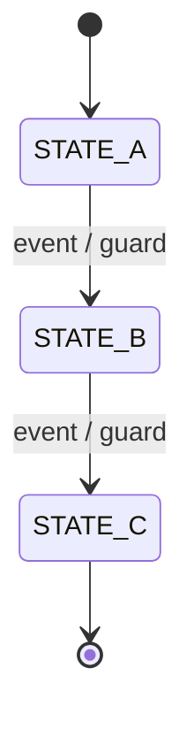
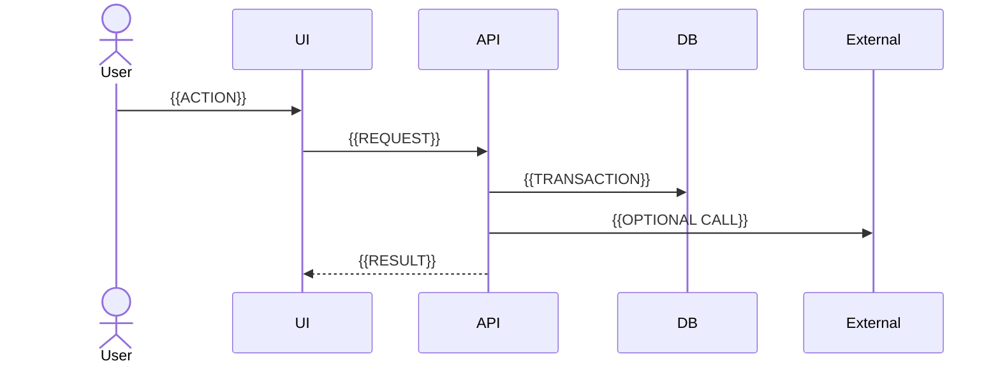
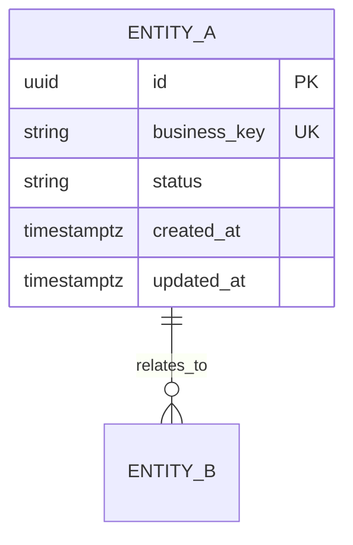
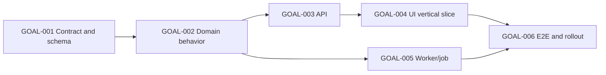

# {{PROJECT_NAME}} — Functional Specification Document

> **Template usage:** replace every `{{PLACEHOLDER}}`, mark non-applicable sections as `N/A — reason`, and never leave an unqualified `TBD`. Any unresolved item must use an `OPEN-xxx` record with owner, impact, fallback, and blocker classification. This FSD must remain complete and executable **without an ADR**; ADRs are optional sidecars and may be referenced only when `adr_applicability = LINKED` and their status is `ACCEPTED`.

---

# 0. FSD Operating Contract

## 0.1 Purpose

This document is the implementation source of truth for `{{PROJECT_NAME}}`. It converts approved product intent into deterministic system behavior, interfaces, data contracts, security controls, tests, delivery steps, and small executable goals for human developers or agentic coding systems.

This FSD is complete only when a developer or coding agent can implement every in-scope behavior without inventing product rules, data semantics, API behavior, permissions, failure handling, acceptance criteria, or architecture decisions.

The FSD is the mandatory implementation authority in the canonical delivery path. A material technical decision MUST be represented exactly once as either an embedded `TDEC-*` record in this FSD or an `ACCEPTED` ADR linked by this FSD. Absence of an ADR is not a gap when `adr_applicability = NOT_REQUIRED`.

## 0.2 Intended Audience

| Audience | Primary Use |
|---|---|
| Product Owner | Confirm product intent and scope traceability |
| Technical Lead / Architect | Approve architecture, contracts, and trade-offs |
| Developer / Coding Agent | Implement bounded goals without hidden assumptions |
| QA / Test Agent | Derive deterministic tests and release gates |
| Security / Compliance | Verify controls, data handling, and auditability |
| Operations | Deploy, observe, recover, and support the system |

## 0.3 Normative Language

- **MUST / MUST NOT**: mandatory for release.
- **SHOULD / SHOULD NOT**: expected unless an approved FSD exception, `TDEC-*`, or linked `ACCEPTED` ADR explicitly authorizes a deviation.
- **MAY**: optional behavior that must not change required outcomes.
- **Source of truth**: the one authoritative owner of a datum or derived state.
- **Invariant**: a condition that must always remain true.
- **Idempotent**: repeating the same operation with the same idempotency identity does not create additional side effects.

## 0.4 Artifact Relationship, ADR Applicability, and Decision Precedence

### 0.4.1 Canonical Delivery Path

```text
BRD → PRD → FSD → GOAL → IMPLEMENTATION → VERIFICATION
                 ↘ ADR (optional architecture-decision sidecar)
```

- BRD defines business authority.
- PRD defines product authority.
- FSD defines implementation authority and is always required before autonomous coding.
- ADR is optional. It never replaces BRD, PRD, FSD, tests, or bounded goal packets.
- When no ADR is used, this FSD records material technical decisions as `TDEC-*`.
- When an ADR is used, this FSD links it, translates it into concrete contracts, and remains the source used by every `/goal`.

### 0.4.2 ADR Applicability States

| State | Meaning | FSD Approval Rule |
|---|---|---|
| `NOT_ASSESSED` | Applicability has not been decided | FSD cannot be approved |
| `NOT_REQUIRED` | No ADR is used; decisions are fully captured as `TDEC-*` | Allowed |
| `LINKED` | One or more `ACCEPTED` ADRs govern delegated decisions | Allowed only when all linked ADRs are accepted and not superseded |
| `BLOCKED_BY_POLICY` | Project policy explicitly requires an ADR that is not yet accepted | FSD/affected goals remain blocked |

The template baseline does not require ADR creation. A project-specific policy MAY require an ADR for named decision classes; that policy must be cited as a constraint rather than assumed.

### 0.4.3 Decision Precedence

When two statements conflict, do not choose silently. Resolve them in this order and record the resolution:

1. Applicable law, contractual obligation, and approved security/compliance policy.
2. Approved BRD for business intent, business boundary, and business acceptance.
3. Approved PRD for product scope, user outcome, product policy, and acceptance intent.
4. Linked ADR with status `ACCEPTED`, only for its delegated architecture scope.
5. Approved FSD for implementation behavior and technical contracts; `TDEC-*` governs technical decisions when no ADR is linked.
6. Repository conventions and existing implementation for local choices not decided above.
7. Task, prompt, or `/goal` instructions.

A lower-precedence artifact MUST NOT silently override a higher-precedence artifact. An ADR cannot change BRD/PRD intent, and a `/goal` cannot change the FSD or linked ADR. Record every conflict in the **Conflict and Resolution Ledger**.

## 0.5 Placeholder and Open-Item Policy

Bare placeholders such as `TBD`, `later`, `as needed`, `appropriate`, `robust`, `fast`, or `secure` are prohibited in an approved FSD unless converted into measurable criteria.

Use this format for unresolved items:

| ID | Question / Missing Decision | Class | Affected Requirements / Goals | Owner | Approved Fallback | Resolution Gate | Status |
|---|---|---|---|---|---|---|---|
| OPEN-001 | {{QUESTION}} | BLOCKER / NON_BLOCKER | {{IDS}} | {{OWNER}} | {{SAFE_FALLBACK_OR_NONE}} | {{WHEN_REQUIRED}} | OPEN |

Rules:

- A goal that depends on an open `BLOCKER` cannot be marked `READY`.
- A `NON_BLOCKER` may use only its explicitly approved fallback.
- An implementation agent MUST NOT invent a fallback that is absent from this document.

## 0.6 Agentic Implementation Guardrails

A coding agent executing this FSD MUST:

1. Implement only approved requirement IDs included in its goal packet.
2. Preserve product invariants, authorization boundaries, data classifications, and source-of-truth rules.
3. Use existing repository conventions unless this FSD explicitly changes them.
4. Make the smallest coherent change that satisfies the goal.
5. Add or update deterministic tests for every changed behavior.
6. Run the exact verification commands listed in the goal packet.
7. Report files changed, migrations, tests, deviations, residual risks, and unresolved failures.
8. Stop only for a declared stop condition; ordinary implementation choices must use documented defaults and repository conventions.

A coding agent MUST NOT:

- Invent endpoints, fields, enums, roles, state transitions, business rules, or UI behavior.
- Broaden scope to unrelated refactors or dependency upgrades.
- leave `TODO`, fake implementations, placeholder returns, disabled tests, or swallowed errors unless the goal explicitly authorizes them.
- Treat a successful mock as proof that a real integration works.
- Weaken validation, authorization, audit logging, redaction, or error handling to make tests pass.
- Log credentials, secrets, personal data, classified content, or raw external payloads beyond the approved logging policy.
- Use unbounded retries, non-idempotent background processing, or silent data loss.
- Convert probabilistic AI output directly into authoritative state unless the approved human/deterministic gate is specified.

## 0.7 FSD Approval Gate

Before this FSD becomes `APPROVED`, all items below must be true:

- [ ] Scope, non-goals, and release slice are explicit.
- [ ] BRD and PRD sources are approved, versioned, and traced.
- [ ] `adr_applicability` is `NOT_REQUIRED` or `LINKED`; it is not `NOT_ASSESSED`.
- [ ] If `NOT_REQUIRED`, every material technical decision is captured as an approved `TDEC-*`.
- [ ] If `LINKED`, every referenced ADR is `ACCEPTED`, not superseded, scoped correctly, and translated into FSD contracts.
- [ ] Every product requirement has a stable ID and traceability to at least one acceptance test.
- [ ] All canonical enums, states, transitions, and invariants are defined once.
- [ ] Identity, authentication, authorization, and data-clearance rules are specified.
- [ ] Data schema includes keys, constraints, indexes, lifecycle, and migration behavior.
- [ ] API, UI, event, job, and integration contracts cover happy, negative, retry, and degraded paths.
- [ ] Date/time, units, locale, ordering, pagination, and rounding semantics are explicit.
- [ ] Idempotency, concurrency, transaction boundaries, and duplicate-event behavior are explicit.
- [ ] Security, privacy, audit, retention, backup, and restore requirements are testable.
- [ ] NFRs contain measurable targets and a stated load/data profile.
- [ ] Observability and operational runbooks cover critical failure modes.
- [ ] No in-scope goal depends on an unresolved blocker.
- [ ] The goal graph is acyclic, bounded, independently verifiable, and mapped to requirement IDs.
- [ ] Build, lint, type-check, test, migration, seed, and smoke-test commands are verified in the repository.
- [ ] Every `READY` goal references the FSD; ADR references are optional additions, never substitutes.

---

# 1. Document Control and Traceability

## 1.1 Document Metadata

| Field | Value |
|---|---|
| Project | `{{PROJECT_NAME}}` |
| FSD ID | `{{FSD_ID}}` |
| Version | `{{FSD_VERSION}}` |
| Status | `{{DRAFT / IN_REVIEW / APPROVED / SUPERSEDED}}` |
| Product owner | `{{NAME_OR_ROLE}}` |
| Technical owner | `{{NAME_OR_ROLE}}` |
| QA owner | `{{NAME_OR_ROLE}}` |
| Security/compliance owner | `{{NAME_OR_ROLE}}` |
| Repository | `{{PATH_OR_URL}}` |
| Target release | `{{RELEASE}}` |
| Default timezone | `{{IANA_TIMEZONE}}` |
| Data residency | `{{REGION / COUNTRY / N/A}}` |

## 1.2 Source Artifacts

| Source ID | Artifact | Version / Date | Authority | Relevant Sections | Status |
|---|---|---|---|---|---|
| SRC-001 | `BRD-{{PROJECT_CODE}}` | `{{VERSION}}` | Business intent, boundary, rule, and acceptance | `{{SECTIONS}}` | APPROVED |
| SRC-002 | `PRD-{{PROJECT_CODE}}` | `{{VERSION}}` | Product scope, behavior, policy, and acceptance intent | `{{SECTIONS}}` | APPROVED |
| SRC-003 | `{{POLICY_OR_STANDARD}}` | `{{VERSION}}` | Compliance/security | `{{SECTIONS}}` | APPROVED |
| SRC-004 | `{{EXISTING_SYSTEM_DOC_OR_REPOSITORY_EVIDENCE}}` | `{{VERSION}}` | Current implementation facts and constraints | `{{SECTIONS}}` | VERIFIED / REFERENCE |
| SRC-005 | `{{ADR_ID_OR_NONE}}` | `{{VERSION_OR_NA}}` | Optional delegated architecture decision | `{{SECTIONS_OR_NA}}` | N/A / ACCEPTED |

Rules:

- `SRC-001` and `SRC-002` are mandatory for the standard artifact path.
- `SRC-005` is optional. Use `N/A — adr_applicability=NOT_REQUIRED` when no ADR exists.
- An ADR with status other than `ACCEPTED` is context only and MUST NOT govern implementation.
- Repository facts that contradict an approved artifact must enter the conflict ledger; they must not silently win.

## 1.3 Stable ID Convention

Use stable IDs. Do not renumber approved IDs solely because sections move.

| Prefix | Meaning | Example |
|---|---|---|
| OBJ | Product objective | OBJ-001 |
| SCOPE | Scope boundary | SCOPE-001 |
| SCOPE-NG | Explicit non-goal | SCOPE-NG-001 |
| ACT | Actor or role | ACT-001 |
| BR | Business rule | BR-001 |
| INV | Cross-system invariant | INV-001 |
| ASSUMP | Assumption | ASSUMP-001 |
| CONSTR | Constraint | CONSTR-001 |
| DEP | Dependency | DEP-001 |
| FR | Functional requirement | FR-001 |
| AC | Acceptance criterion | AC-001 |
| NFR | Non-functional requirement | NFR-001 |
| SEC | Security/privacy requirement | SEC-001 |
| DATA | Data requirement | DATA-001 |
| MIG | Data migration/backfill | MIG-001 |
| QRY | Query/access pattern | QRY-001 |
| SEED | Seed/reference dataset | SEED-001 |
| API | API/interface contract | API-001 |
| IFACE | Internal service interface | IFACE-001 |
| UI | UI behavior/view | UI-001 |
| UI-ACT | UI action | UI-ACT-001 |
| EVT | Event/message contract | EVT-001 |
| JOB | Background job | JOB-001 |
| INT | External integration | INT-001 |
| FLOW | Sequence/data flow | FLOW-001 |
| TR | State transition | TR-001 |
| ALT | Alternative flow | ALT-001 |
| NEG | Negative/rejection flow | NEG-001 |
| REC | Recovery/degraded flow | REC-001 |
| DRIFT | Reconciliation drift class | DRIFT-001 |
| NOTIF | Notification delivery rule | NOTIF-001 |
| PERM | Permission rule | PERM-001 |
| THREAT | Threat scenario | THREAT-001 |
| EVAL | AI/evaluation scenario | EVAL-001 |
| OBS | Observability/operations requirement | OBS-001 |
| ALERT | Alert rule | ALERT-001 |
| RUN | Runbook | RUN-001 |
| CUT | Cutover/reconciliation check | CUT-001 |
| FIX | Test fixture | FIX-001 |
| TEST | Test scenario | TEST-001 |
| TDEC | Embedded technical decision in this FSD | TDEC-001 |
| ADR | Optional external architecture decision | ADR-0001 |
| CONFLICT | Conflict record | CONFLICT-001 |
| RISK | Risk | RISK-001 |
| DEBT | Accepted technical debt | DEBT-001 |
| OPEN | Unresolved item | OPEN-001 |
| GOAL | Agent-executable work package | GOAL-001 |

### 1.3.1 Cross-Artifact Qualified References

Local IDs may be used within this FSD. Any reference to another artifact MUST be qualified:

```text
{{DOCUMENT_ID}}#{{LOCAL_ID}}
{{DOCUMENT_ID}}@{{VERSION}}#{{LOCAL_ID}}   # use when pinning a traceability snapshot
```

Examples: `BRD-CCC#BREQ-001`, `PRD-CCC#FR-014`, `FSD-CCC#TDEC-003`, `ADR-0042#DEC-001`. A bare `FR-001` MUST NOT be used to refer to both a PRD requirement and an FSD requirement.

## 1.4 Revision History

| Version | Date | Author | Change Summary | Requirements Affected | Approval |
|---|---|---|---|---|---|
| 0.1 | {{YYYY-MM-DD}} | {{AUTHOR}} | Initial draft | All | Pending |

## 1.5 Approval

| Role | Name | Decision | Date | Notes |
|---|---|---|---|---|
| Product Owner |  | Pending |  |  |
| Technical Lead |  | Pending |  |  |
| QA Lead |  | Pending |  |  |
| Security/Compliance |  | Pending |  |  |
| Operations |  | Pending |  |  |

## 1.6 Conflict and Resolution Ledger

| Conflict ID | Conflicting Statements | Sources | Impact | Resolution | Superseded Text | Approved By | Decision Ref (`TDEC` / ADR / Change) |
|---|---|---|---|---|---|---|---|
| CONFLICT-001 | {{DESCRIPTION}} | {{SOURCE_IDS}} | {{IMPACT}} | {{CANONICAL_DECISION}} | {{TEXT_OR_ID}} | {{OWNER}} | {{TDEC_ADR_CHANGE_ID_OR_NA}} |

---

# 2. Product-to-Implementation Alignment

## 2.1 Problem Statement

`{{CONCISE, EVIDENCE-BASED PROBLEM. DO NOT DESCRIBE THE SOLUTION HERE.}}`

## 2.2 Objectives and Measurable Outcomes

| ID | Objective | Baseline | Target | Measurement Source | Measurement Window | Owner |
|---|---|---:|---:|---|---|---|
| OBJ-001 | {{OUTCOME}} | {{BASELINE}} | {{TARGET}} | {{SOURCE}} | {{WINDOW}} | {{OWNER}} |

## 2.3 In-Scope Release Slice

| ID | Capability / Behavior | Included in Release | Notes |
|---|---|---|---|
| SCOPE-001 | {{CAPABILITY}} | Yes | {{BOUNDARY}} |

## 2.4 Explicit Non-Goals

| ID | Excluded Capability | Reason | Earliest Reconsideration | Guardrail |
|---|---|---|---|---|
| SCOPE-NG-001 | {{NON_GOAL}} | {{REASON}} | {{MILESTONE_OR_NONE}} | Agents MUST NOT implement this indirectly |

## 2.5 Actors, Responsibilities, and Clearance

| Actor ID | Role | Responsibilities | Allowed Data Scope | Classification Clearance | Prohibited Actions |
|---|---|---|---|---|---|
| ACT-001 | {{ROLE}} | {{RESPONSIBILITIES}} | {{SCOPE}} | {{CLEARANCE}} | {{PROHIBITIONS}} |

## 2.6 Assumptions

| ID | Assumption | Evidence | If False | Validation Method | Owner | Status |
|---|---|---|---|---|---|---|
| ASSUMP-001 | {{ASSUMPTION}} | {{EVIDENCE}} | {{IMPACT}} | {{HOW_TO_VALIDATE}} | {{OWNER}} | UNVERIFIED |

An unverified assumption that changes data integrity, security, legal compliance, public API behavior, or destructive migration behavior must be promoted to an `OPEN-xxx BLOCKER`.

## 2.7 Constraints

| ID | Constraint | Type | Consequence for Design | Verification |
|---|---|---|---|---|
| CONSTR-001 | {{CONSTRAINT}} | Product / Technical / Legal / Cost / Schedule | {{CONSEQUENCE}} | {{CHECK}} |

## 2.8 Dependencies

| ID | Dependency | Owner | Required Capability | Version / Contract | Availability / SLA | Failure Impact | Fallback |
|---|---|---|---|---|---|---|---|
| DEP-001 | {{SYSTEM_OR_TEAM}} | {{OWNER}} | {{CAPABILITY}} | {{VERSION}} | {{SLA}} | {{IMPACT}} | {{FALLBACK}} |

## 2.9 Product Requirement Inventory

| Requirement ID | Summary | PRD Source | Priority | Release | Acceptance IDs | Status |
|---|---|---|---|---|---|---|
| FR-001 | {{DETERMINISTIC BEHAVIOR}} | {{PRD_ID}} | MUST | MVP | AC-001, TEST-001 | APPROVED |

---

# 3. Domain Model, Canonical Semantics, and Invariants

## 3.1 Glossary

| Term | Canonical Definition | Not Equivalent To | Source |
|---|---|---|---|
| {{TERM}} | {{UNAMBIGUOUS DEFINITION}} | {{COMMONLY CONFUSED TERM}} | {{SOURCE_ID}} |

## 3.2 Source-of-Truth Matrix

Define exactly one authority for each datum. Derived views may cache values but must identify their derivation and refresh rule.

| Datum / State | Authoritative System / Entity | Writers | Readers | Derivation / Sync Rule | Conflict Rule |
|---|---|---|---|---|---|
| {{DATUM}} | {{SOURCE}} | {{WRITERS}} | {{READERS}} | {{RULE}} | {{WINNER_AND_REPAIR}} |

## 3.3 Domain Entity Catalog

| Entity | Purpose | Human Key | System Key | Lifecycle Owner | Contains Sensitive Data | Retention |
|---|---|---|---|---|---|---|
| {{ENTITY}} | {{PURPOSE}} | {{KEY}} | UUID / ULID / other | {{OWNER}} | {{YES/NO + CLASS}} | {{RULE}} |

## 3.4 Canonical Enum Catalog

Every enum MUST be defined once. APIs, database constraints, UI labels, jobs, analytics, and tests must reference the same canonical values.

| Enum | Canonical Value | Meaning | UI Label | Terminal? | Allowed Caller / Transition Source |
|---|---|---|---|---|---|
| `{{ENUM_NAME}}` | `{{VALUE}}` | {{MEANING}} | {{LABEL}} | Yes / No | {{ACTOR_OR_SYSTEM}} |

Enum rules:

- Store canonical machine values; localize only presentation labels.
- Do not overload one enum with orthogonal concepts. Use separate fields for lifecycle, processing health, and human decision state.
- Define handling of unknown values during rolling deployment and backward compatibility.

## 3.5 State Machines

### 3.5.1 {{ENTITY_OR_PROCESS}} State Diagram



### 3.5.2 Transition Contract

| Transition ID | From | Event / Command | To | Actor | Guards | Transactional Side Effects | Audit Event | Idempotency Rule | Invalid-Transition Result |
|---|---|---|---|---|---|---|---|---|---|
| TR-001 | STATE_A | `{{COMMAND}}` | STATE_B | {{ACTOR}} | {{GUARDS}} | {{SIDE_EFFECTS}} | {{EVENT}} | {{RULE}} | HTTP 409 / domain error |

## 3.6 Cross-System Invariants

| ID | Invariant | Scope | Enforcement Point | Detection | Repair / Failure Behavior | Test IDs |
|---|---|---|---|---|---|---|
| INV-001 | {{CONDITION THAT MUST ALWAYS HOLD}} | {{ENTITIES/SYSTEMS}} | DB constraint / transaction / reconciler / authorization | {{CHECK}} | {{REPAIR_OR_ALERT}} | {{TEST_IDS}} |

Examples of invariant categories to specify where relevant:

- Exactly one active version per logical document or aggregate.
- Exactly one authoritative mapping or schedule state.
- A child record cannot be finalized against an invalid parent state.
- A user cannot read derived evidence from a source they cannot read directly.
- Duplicate delivery or retry cannot duplicate externally visible side effects.

## 3.7 Identifier and Version Semantics

| Concept | Format | Generated By | Uniqueness Scope | Mutable? | Parsing / Validation | Example |
|---|---|---|---|---|---|---|
| {{IDENTIFIER}} | {{FORMAT}} | {{SYSTEM}} | {{SCOPE}} | No | {{RULE}} | `{{EXAMPLE}}` |

Define separately when applicable:

- Logical entity identity vs physical version identity.
- Major/minor revision semantics.
- External IDs vs internal IDs.
- Stable deduplication fingerprint.
- Ordering when two versions have equal or missing timestamps.

## 3.8 Time, Date, Locale, Number, and Unit Semantics

| Concern | Canonical Rule |
|---|---|
| Storage timezone | Store instants in UTC; record source offset when legally/audit relevant |
| Business date timezone | `{{IANA_TIMEZONE}}` |
| Scheduler boundary | `{{EXACT LOCAL TIME AND DST RULE}}` |
| Date-only fields | `YYYY-MM-DD`, interpreted in `{{TIMEZONE}}` |
| Duration | Store in `{{CANONICAL_UNIT}}`; preserve original unit where evidence matters |
| Decimal / rounding | `{{PRECISION_AND_ROUNDING_MODE}}` |
| Locale | `{{LOCALE}}` |
| Sort/collation | `{{RULE}}` |
| Null vs empty | `{{SEMANTICS}}` |

## 3.9 Data Classification Semantics

| Classification | Canonical Value | Read Clearance | Export Rule | Log Rule | AI/External Processing Rule | Retention Rule |
|---|---|---|---|---|---|---|
| {{CLASS}} | `{{VALUE}}` | {{CLEARANCE}} | {{RULE}} | {{RULE}} | {{RULE}} | {{RULE}} |

If automatic classification and human override coexist, define them as separate fields, for example:

- `detected_classification`
- `detection_source`
- `manual_classification_override`
- `effective_classification`
- `classification_review_status`

The precedence rule MUST be explicit and audit-logged.

---

# 4. System Context and Architecture

## 4.1 System Context

```mermaid
flowchart LR
    U[{{ACTOR}}] --> APP[{{APPLICATION}}]
    APP --> DB[{{DATABASE}}]
    APP --> EXT[{{EXTERNAL SYSTEM}}]
    WORKER[{{BACKGROUND WORKER}}] --> DB
    WORKER --> EXT
```

## 4.2 Architectural Drivers

| ID | Driver | Design Consequence | Related Requirements |
|---|---|---|---|
| ARCH-DRV-001 | {{DRIVER}} | {{CONSEQUENCE}} | {{IDS}} |

## 4.3 Component Responsibilities

| Component | Responsibility | Owns Data | Exposes | Depends On | Must Not Do |
|---|---|---|---|---|---|
| {{COMPONENT}} | {{RESPONSIBILITY}} | {{DATA}} | API / event / job | {{DEPENDENCIES}} | {{PROHIBITED_COUPLING}} |

## 4.4 Module Dependency Rules

| Source Module | May Depend On | Must Not Depend On | Rationale / Enforcement |
|---|---|---|---|
| {{MODULE}} | {{ALLOWED}} | {{FORBIDDEN}} | {{LINT/REVIEW RULE}} |

## 4.5 Deployment Topology

| Runtime | Process Type | Scaling | State | Network Access | Failure Isolation | Deployment Unit |
|---|---|---|---|---|---|---|
| {{RUNTIME}} | Web / Worker / Scheduler / DB | {{RULE}} | Stateless / Stateful | {{RULE}} | {{BOUNDARY}} | {{UNIT}} |

```mermaid
flowchart TB
    subgraph Region[{{REGION}}]
      WEB[Web/API]
      WORKER[Worker]
      DB[(Database)]
      WEB --> DB
      WORKER --> DB
    end
    WORKER --> EXT[External Service]
```

## 4.6 Trust Boundaries and Data Flow

| Flow ID | From | To | Data | Classification | Protocol | Authentication | Encryption | Validation / Redaction |
|---|---|---|---|---|---|---|---|---|
| FLOW-001 | {{SOURCE}} | {{DESTINATION}} | {{DATA}} | {{CLASS}} | HTTPS / queue / DB | {{METHOD}} | {{RULE}} | {{RULE}} |

## 4.7 Critical Sequence Flows

### 4.7.1 {{FLOW_NAME}}



Document transaction boundaries, retry boundaries, and which system owns final authority below each diagram.

## 4.8 Technical Decision Register and Optional ADR Links

### 4.8.1 ADR Applicability Assessment

| Field | Value |
|---|---|
| Applicability | `{{NOT_REQUIRED / LINKED / BLOCKED_BY_POLICY}}` |
| Assessed by | `{{TECHNICAL_OWNER}}` |
| Assessment date | `{{YYYY-MM-DD}}` |
| Project policy requiring ADR | `{{POLICY_ID_OR_NONE}}` |
| Rationale | `{{WHY_AN_ADR_IS_OR_IS_NOT_USED}}` |
| Linked accepted ADR IDs | `{{ADR_IDS_OR_NONE}}` |
| Embedded TDEC IDs | `{{TDEC_IDS_OR_NONE}}` |

Decision rules:

1. `NOT_REQUIRED` is valid only when this FSD captures every material technical decision as `TDEC-*`.
2. `LINKED` is valid only when all referenced ADRs are `ACCEPTED`, not `DEPRECATED`/`SUPERSEDED`, and their scope is delegated by BRD/PRD.
3. `BLOCKED_BY_POLICY` blocks affected goals until the policy-required ADR is accepted.
4. Do not create an ADR merely because this template contains an ADR column.

### 4.8.2 Single-Authority Allocation

Each material technical decision MUST have exactly one decision authority:

| Decision | Authority Type | Authority ID | Duplicated Elsewhere? | Implementation Sections | Status |
|---|---|---|---:|---|---|
| {{DECISION}} | `FSD_TDEC` / `LINKED_ADR` | TDEC-001 / ADR-0001 | No | {{DATA/API/JOB/SEC/OPS SECTIONS}} | APPROVED |

- If authority type is `FSD_TDEC`, an ADR field must be empty.
- If authority type is `LINKED_ADR`, the FSD must summarize the decision but not restate conflicting rationale or alternatives.
- API, schema, test, migration, and goal details remain authoritative in FSD even when a linked ADR defines the higher-level pattern.

### 4.8.3 Reusable Embedded Technical Decision Packet

#### TDEC-{{NNN}} — {{DECISION_TITLE}}

| Field | Contract |
|---|---|
| Status | `DRAFT / APPROVED / SUPERSEDED` |
| Scope | {{COMPONENTS_OR_BOUNDARY}} |
| Related BRD/PRD IDs | {{IDS}} |
| Decision owner | {{NAME_OR_ROLE}} |
| Date | {{YYYY-MM-DD}} |
| Revisit trigger | {{DATE_EVENT_THRESHOLD}} |

**Context and decision needed**

{{FACTUAL_CONTEXT_AND_WHY_THE_DECISION_IS_NEEDED}}

**Constraints**

- {{HARD_CONSTRAINT_WITH_SOURCE}}

**Options considered**

| Option | Summary | Benefits | Costs / Risks | Rejected Because |
|---|---|---|---|---|
| OPT-001 | {{OPTION}} | {{BENEFITS}} | {{RISKS}} | {{RATIONALE_OR_SELECTED}} |
| OPT-002 | {{OPTION}} | {{BENEFITS}} | {{RISKS}} | {{RATIONALE_OR_SELECTED}} |

**Decision**

> The implementation **MUST** {{NORMATIVE_DECISION}} and **MUST NOT** {{PROHIBITED_BEHAVIOR}} within {{SCOPE}}.

**Consequences and obligations**

- Positive: {{CONSEQUENCE}}
- Negative/residual risk: {{CONSEQUENCE_AND_OWNER}}
- Required implementation IDs: {{FR/DATA/API/JOB/SEC/OBS/GOAL IDS}}
- Verification/fitness checks: {{TEST_IDS_OR_COMMANDS}}
- Rollback/reversal rule: {{RULE}}

A `TDEC-*` is appropriate for local or project-scoped decisions that are fully governed by this FSD. It is not a shortcut for unresolved product or business decisions.

### 4.8.4 Linked ADR Register — Optional

| ADR ID | Status | Decision Summary | Delegated Scope | FSD Implementation IDs | Supersedes | Revisit Trigger |
|---|---|---|---|---|---|---|
| ADR-{{NNNN}} | ACCEPTED | {{DECISION}} | {{SCOPE}} | {{IDS}} | {{ADR_ID_OR_NONE}} | {{TRIGGER}} |

When no ADR is used, write:

```text
N/A — adr_applicability=NOT_REQUIRED; material technical decisions are recorded as TDEC-*.
```

### 4.8.5 When to Consider a Separate ADR

Consider an ADR when a decision is cross-system, costly to reverse, security/privacy-sensitive, creates material vendor lock-in or recurring cost, changes platform standards, or needs durable reasoning beyond this FSD. This is a recommendation, not a baseline requirement. A cited organizational policy may elevate a specific decision to `BLOCKED_BY_POLICY`.

## 4.9 Failure and Degraded-Mode Matrix

| Dependency / Component Failure | User-Visible Behavior | Data Integrity Behavior | Retry / Recovery | Alert | Functions That Remain Available |
|---|---|---|---|---|---|
| {{FAILURE}} | {{BEHAVIOR}} | {{GUARANTEE}} | {{RULE}} | {{ALERT}} | {{CAPABILITIES}} |

---

# 5. Feature Specifications

> Copy the complete feature packet below for every independently testable capability. A feature is not implementation-ready when its data/API/UI/job/security effects are described only elsewhere or inferred by the implementer.

## 5.1 FEAT-{{NNN}} — {{FEATURE_NAME}}

### 5.1.1 Feature Metadata

| Field | Value |
|---|---|
| Feature ID | `FEAT-{{NNN}}` |
| PRD trace | `{{US/FR/GOAL IDS}}` |
| Priority | MUST / SHOULD / MAY |
| Release | `{{RELEASE}}` |
| Owner | `{{OWNER}}` |
| Dependencies | `{{FEATURE/INTEGRATION IDS}}` |
| Implementation goals | `{{GOAL IDS}}` |

### 5.1.2 Objective

`{{USER OR BUSINESS OUTCOME, NOT AN IMPLEMENTATION TASK}}`

### 5.1.3 Feature Boundary

**Included**

- {{IN_SCOPE_BEHAVIOR}}

**Excluded**

- {{EXPLICIT_NON_GOAL}}

### 5.1.4 Actors and Permissions

| Actor | Read | Create | Update | Transition / Approve | Delete | Scope / Clearance Rules |
|---|---:|---:|---:|---:|---:|---|
| {{ROLE}} | Yes/No | Yes/No | Yes/No | {{ACTIONS}} | Soft/Hard/No | {{RULE}} |

### 5.1.5 Trigger, Preconditions, and Postconditions

| Type | Contract |
|---|---|
| Trigger | {{EVENT / USER ACTION / SCHEDULE}} |
| Preconditions | {{ALL REQUIRED CONDITIONS}} |
| Success postconditions | {{AUTHORITATIVE STATE AFTER COMMIT}} |
| Failure postconditions | {{STATE THAT MUST REMAIN UNCHANGED / COMPENSATED}} |
| Idempotency identity | {{KEY / FINGERPRINT / NONE WITH JUSTIFICATION}} |

### 5.1.6 Inputs and Outputs

| Direction | Field / Artifact | Type | Required | Validation | Classification | Source / Destination |
|---|---|---|---:|---|---|---|
| Input | `{{FIELD}}` | {{TYPE}} | Yes | {{RULE}} | {{CLASS}} | {{SOURCE}} |
| Output | `{{FIELD}}` | {{TYPE}} | Yes | {{RULE}} | {{CLASS}} | {{DESTINATION}} |

### 5.1.7 Business Rules

| Rule ID | Rule | Rationale / Source | Enforcement Point | Failure Result | Tests |
|---|---|---|---|---|---|
| BR-{{NNN}} | {{DETERMINISTIC RULE}} | {{SOURCE}} | UI / API / DB / Job | {{ERROR/STATE}} | {{TEST IDS}} |

### 5.1.8 Main Flow

1. {{ACTOR/SYSTEM}} performs `{{ACTION}}`.
2. The system validates `{{PRECONDITION/RULE IDS}}`.
3. The system commits `{{STATE CHANGES}}` in `{{TRANSACTION BOUNDARY}}`.
4. The system emits or schedules `{{EVENT/JOB}}` after commit.
5. The system returns `{{RESPONSE/VIEW STATE}}`.

### 5.1.9 Alternative, Negative, and Recovery Flows

| Scenario ID | Condition | Expected Behavior | State Mutation | Error / UI Message | Retry / Recovery | Audit |
|---|---|---|---|---|---|---|
| ALT-001 | {{ALTERNATIVE}} | {{BEHAVIOR}} | {{MUTATION}} | {{RESULT}} | {{RULE}} | {{EVENT}} |
| NEG-001 | {{INVALID INPUT / PERMISSION}} | {{REJECTION}} | None | {{CODE}} | Not retryable | {{EVENT}} |
| REC-001 | {{DEPENDENCY FAILURE}} | {{DEGRADED BEHAVIOR}} | {{SAFE STATE}} | {{MESSAGE}} | {{BACKOFF/REPLAY}} | {{EVENT}} |

Mandatory scenario categories where applicable:

- Happy path.
- Empty and first-use state.
- Boundary values.
- Invalid and malformed input.
- Unauthorized and insufficient-clearance access.
- Duplicate command/event.
- Concurrent update or stale version.
- External timeout, throttling, auth failure, and partial batch failure.
- Source changed or deleted between read and commit.
- Retry after process restart.
- Export/redaction behavior.

### 5.1.10 Functional Requirements

| ID | Requirement | Inputs | Outputs | Side Effects | Acceptance IDs |
|---|---|---|---|---|---|
| FR-{{NNN}} | The system MUST {{DETERMINISTIC BEHAVIOR}} | {{INPUTS}} | {{OUTPUTS}} | {{SIDE EFFECTS}} | {{AC/TEST IDS}} |

### 5.1.11 Acceptance Criteria

Use Given/When/Then and include exact observable outcomes.

| AC ID | Given | When | Then | Verification Layer |
|---|---|---|---|---|
| AC-{{NNN}} | {{INITIAL STATE}} | {{ACTION}} | {{EXACT RESULT}} | Unit / Integration / E2E / UAT |

### 5.1.12 State and Concurrency Behavior

- State machine transitions: `{{TR IDS}}`.
- Concurrency control: `{{OPTIMISTIC VERSION / ROW LOCK / UNIQUE CONSTRAINT / SERIALIZATION}}`.
- Duplicate request behavior: `{{RESULT}}`.
- Transaction boundary: `{{START/COMMIT/ROLLBACK}}`.
- Post-commit side effects: `{{OUTBOX/JOB/EVENT}}`.
- Compensation behavior: `{{RULE}}`.

### 5.1.13 Data Impact

| Data Object | Operation | Fields | Constraint / Index | Migration / Backfill | Retention / Audit |
|---|---|---|---|---|---|
| {{TABLE/ENTITY}} | Create/Read/Update | {{FIELDS}} | {{CONSTRAINTS}} | {{PLAN}} | {{RULE}} |

### 5.1.14 API and Event Impact

| Contract ID | Change | Compatibility | Auth / Permission | Idempotency | Consumer Impact |
|---|---|---|---|---|---|
| {{API/EVT ID}} | Add / Change / Remove | Backward compatible / Breaking | {{RULE}} | {{RULE}} | {{IMPACT}} |

### 5.1.15 UI Impact

| UI ID / Route | State / Action | Required Behavior | Permission / Redaction | Accessibility | Error / Empty State |
|---|---|---|---|---|---|
| {{UI ID}} | {{STATE}} | {{BEHAVIOR}} | {{RULE}} | {{RULE}} | {{COPY/BEHAVIOR}} |

### 5.1.16 Jobs and Integration Impact

| Job / Integration ID | Trigger | Input | Side Effect | Retry / Dedupe | Failure Handling |
|---|---|---|---|---|---|
| {{ID}} | {{TRIGGER}} | {{INPUT}} | {{SIDE EFFECT}} | {{RULE}} | {{RULE}} |

### 5.1.17 Audit, Notification, and Observability

| Concern | Required Record / Signal | Sensitive Data Rule |
|---|---|---|
| Audit | {{ACTOR, ACTION, TARGET, BEFORE/AFTER, REASON}} | {{REDACTION}} |
| Notification | {{RECIPIENT, TEMPLATE, DEDUPE, DELIVERY STATE}} | {{RULE}} |
| Logs | {{EVENT NAME + REQUIRED FIELDS}} | {{RULE}} |
| Metrics | {{COUNTER/HISTOGRAM/GAUGE}} | No sensitive labels |
| Alerts | {{CONDITION + OWNER + SEVERITY}} | {{RULE}} |

### 5.1.18 Security and Privacy

- Authentication requirement: `{{METHOD}}`.
- Authorization requirement IDs: `{{SEC IDS}}`.
- Classification/clearance rule: `{{RULE}}`.
- Input trust boundary and validation: `{{RULE}}`.
- Secrets involved: `{{NONE / SECRET REFERENCES}}`.
- Privacy purpose and retention: `{{RULE}}`.
- Abuse cases and controls: `{{THREAT IDS}}`.

### 5.1.19 Performance and Reliability Budget

| Measure | Target | Load / Data Profile | Measurement | Degraded Threshold |
|---|---:|---|---|---|
| {{LATENCY/FRESHNESS/THROUGHPUT}} | {{TARGET}} | {{PROFILE}} | {{TEST/METRIC}} | {{THRESHOLD}} |

### 5.1.20 Test Fixtures and Evidence

| Fixture ID | Purpose | Setup | Expected Result | Data Classification |
|---|---|---|---|---|
| FIX-001 | {{CASE}} | {{SETUP}} | {{RESULT}} | Synthetic / Masked / Approved real data |

### 5.1.21 Feature Definition of Done

- [ ] All linked FR/SEC/NFR requirements are implemented.
- [ ] Happy, negative, boundary, permission, duplicate, concurrency, and dependency-failure tests pass where applicable.
- [ ] Database constraints and migrations are verified forward and backward or rollback limitations are documented.
- [ ] API/event schemas and generated clients/contracts are updated.
- [ ] UI loading, empty, error, forbidden, stale, and success states are implemented.
- [ ] Audit, metrics, logs, alerts, and runbook changes are present.
- [ ] No unresolved placeholders, disabled tests, unapproved scope expansion, or sensitive logging remain.
- [ ] Traceability matrix links the feature to tests and goals.

---

# 6. Data Design

## 6.1 Logical ERD



## 6.2 Physical Data Model

Copy this table for every table, collection, index, object store, or durable job record.

### 6.2.1 `{{TABLE_NAME}}`

**Purpose:** {{PURPOSE}}

| Column | DB Type | Domain Type | Nullable | Default | Constraints | Classification | Source of Truth | Notes |
|---|---|---|---:|---|---|---|---|---|
| `id` | UUID | Entity ID | No | generated | PK | Internal | Database | Immutable |
| `{{COLUMN}}` | {{TYPE}} | {{DOMAIN}} | Yes/No | {{DEFAULT}} | {{CHECK/FK/UNIQUE}} | {{CLASS}} | {{SOURCE}} | {{NOTES}} |

**Keys and indexes**

| Name | Columns / Expression | Type | Purpose | Cardinality Assumption |
|---|---|---|---|---|
| `{{INDEX_NAME}}` | `{{COLUMNS}}` | Unique / B-tree / GIN / Partial | {{QUERY/INVARIANT}} | {{ASSUMPTION}} |

**Row lifecycle**

- Creation: {{RULE}}.
- Mutation: {{ALLOWED FIELDS / ACTORS}}.
- Soft deletion: {{RULE OR PROHIBITED}}.
- Hard deletion: {{RULE OR PROHIBITED}}.
- Retention: {{DURATION + LEGAL BASIS}}.
- Archival/purge: {{JOB + AUDIT}}.

## 6.3 Data Constraints and Invariants

| DATA ID | Constraint | Enforcement | Error Surface | Repair |
|---|---|---|---|---|
| DATA-001 | {{CONSTRAINT}} | DB / Application / Reconciler | {{ERROR}} | {{REPAIR}} |

Prefer database constraints for local invariants and application/reconciliation logic for cross-system invariants. Do not rely solely on UI validation.

## 6.4 Transaction and Locking Model

| Use Case | Isolation / Lock | Rows / Aggregate | Conflict Detection | Retry Policy | Side-Effect Pattern |
|---|---|---|---|---|---|
| {{USE_CASE}} | {{LEVEL/METHOD}} | {{SCOPE}} | {{VERSION/CONSTRAINT}} | {{RULE}} | Outbox / after-commit job / none |

## 6.5 Query and Access Patterns

| Query ID | Caller | Filters / Sort | Expected Rows | Frequency | Index | Pagination |
|---|---|---|---:|---|---|---|
| QRY-001 | {{CALLER}} | {{FILTERS}} | {{ROWS}} | {{FREQ}} | {{INDEX}} | Cursor / offset / none |

## 6.6 Migration and Backfill Plan

| Migration ID | Change | Compatibility Strategy | Backfill | Verification | Rollback | Lock / Downtime Risk |
|---|---|---|---|---|---|---|
| MIG-001 | {{CHANGE}} | Expand-migrate-contract / additive | {{PLAN}} | {{QUERY/TEST}} | {{PLAN}} | {{RISK}} |

Migration rules:

- Prefer additive, backward-compatible changes for rolling deployments.
- Separate schema expansion, application rollout, backfill, and schema contraction.
- Define behavior for mixed application versions.
- Destructive migrations require an approved backup, restore test, and explicit rollback limitation.

## 6.7 Seed and Reference Data

| Seed ID | Dataset | Source / License | Version | Idempotency Key | Update Rule | Validation |
|---|---|---|---|---|---|---|
| SEED-001 | {{DATASET}} | {{SOURCE}} | {{VERSION}} | {{KEY}} | Replace / merge / immutable | {{CHECK}} |

## 6.8 Data Retention, Archival, and Erasure

| Data Category | Purpose | Classification | Retention | Trigger | Archive | Erasure / Legal Hold | Audit Evidence |
|---|---|---|---|---|---|---|---|
| {{CATEGORY}} | {{PURPOSE}} | {{CLASS}} | {{DURATION}} | {{TRIGGER}} | {{LOCATION}} | {{RULE}} | {{EVIDENCE}} |

---

# 7. API, Interface, and Event Contracts

## 7.1 API Standards

| Concern | Canonical Rule |
|---|---|
| Base path / versioning | `{{BASE_PATH}}` |
| Authentication | `{{METHOD}}` |
| Authorization | Server-side policy check for every request |
| Content type | `application/json` unless specified |
| Request correlation | `{{HEADER}}` generated/propagated |
| Idempotency | `{{HEADER_OR_DOMAIN_KEY}}` for side-effecting retryable commands |
| Pagination | `{{CURSOR/OFFSET RULE}}` |
| Sorting | Stable deterministic tie-breaker required |
| Error envelope | `{{SCHEMA}}` |
| Concurrency | `ETag/If-Match`, version field, or domain-specific rule |
| Rate limit | `{{RULE}}` |
| Date/time | ISO 8601; UTC instants; date-only semantics from Section 3.8 |
| Unknown fields | Reject / ignore according to `{{RULE}}` |
| Backward compatibility | `{{POLICY}}` |

## 7.2 Error Taxonomy

| Error Code | HTTP / Transport Status | Retryable | User Message | Log Severity | Audit? | Notes |
|---|---:|---:|---|---|---:|---|
| `VALIDATION_FAILED` | 400 | No | {{LOCALIZED_MESSAGE}} | INFO | No | Field errors included |
| `FORBIDDEN` | 403 | No | {{MESSAGE}} | WARN | Yes | Do not reveal resource existence when prohibited |
| `CONFLICT` | 409 | Conditional | {{MESSAGE}} | INFO | Yes if compliance-relevant | Stale state / duplicate transition |
| `DEPENDENCY_UNAVAILABLE` | 503 | Yes | {{MESSAGE}} | ERROR | Optional | Retry metadata included |

## 7.3 Endpoint Specification Template

### API-{{NNN}} — {{ENDPOINT_NAME}}

| Field | Contract |
|---|---|
| Method and route | `{{METHOD}} {{PATH}}` |
| Purpose | {{PURPOSE}} |
| Actor / permission | {{ROLE + POLICY ID}} |
| Classification clearance | {{RULE}} |
| Idempotency | {{HEADER/KEY + RETENTION + REPLAY RESPONSE}} |
| Concurrency | {{VERSION/ETAG/RULE}} |
| Rate limit | {{RULE}} |
| Transaction boundary | {{RULE}} |
| Audit event | {{EVENT OR NONE}} |

**Path parameters**

| Name | Type | Required | Validation | Example |
|---|---|---:|---|---|
| `{{PARAM}}` | UUID/string | Yes | {{RULE}} | `{{EXAMPLE}}` |

**Query parameters**

| Name | Type | Default | Validation | Semantics |
|---|---|---|---|---|
| `{{PARAM}}` | {{TYPE}} | {{DEFAULT}} | {{RULE}} | {{SEMANTICS}} |

**Request headers**

| Header | Required | Semantics |
|---|---:|---|
| `Authorization` | Yes | {{METHOD}} |
| `Idempotency-Key` | {{YES/NO}} | {{RULE}} |
| `If-Match` | {{YES/NO}} | {{RULE}} |

**Request body**

```json
{
  "field": "{{VALUE}}"
}
```

| Field | Type | Required | Validation | Classification | Meaning |
|---|---|---:|---|---|---|
| `field` | string | Yes | {{RULE}} | {{CLASS}} | {{MEANING}} |

**Success response**

```json
{
  "data": {},
  "meta": {
    "request_id": "uuid"
  }
}
```

**Error responses**

| Status | Error Code | Condition | Response Details | State Mutation |
|---:|---|---|---|---|
| 400 | `VALIDATION_FAILED` | {{CONDITION}} | {{DETAIL}} | None |
| 403 | `FORBIDDEN` | {{CONDITION}} | No sensitive existence disclosure | None |
| 409 | `CONFLICT` | {{CONDITION}} | Current version/state may be returned if authorized | None |
| 503 | `DEPENDENCY_UNAVAILABLE` | {{CONDITION}} | Retry-after where applicable | {{SAFE STATE}} |

**Side effects and ordering**

1. {{VALIDATE}}.
2. {{COMMIT AUTHORITATIVE STATE}}.
3. {{WRITE AUDIT / OUTBOX IN SAME TRANSACTION}}.
4. {{EXECUTE ASYNC SIDE EFFECT}}.

**Contract tests:** `{{TEST IDS / FILES}}`.

## 7.4 Event / Message Contract Template

### EVT-{{NNN}} — `{{EVENT_NAME}}`

| Field | Contract |
|---|---|
| Producer | {{COMPONENT}} |
| Consumers | {{COMPONENTS}} |
| Delivery | At-least-once / exactly-once effect via idempotency |
| Ordering | {{KEY / NONE}} |
| Partition / dedupe key | {{KEY}} |
| Schema version | `{{VERSION}}` |
| Sensitive fields | {{FIELDS / NONE}} |
| Retention | {{DURATION}} |

```json
{
  "event_id": "uuid",
  "event_type": "{{EVENT_NAME}}",
  "schema_version": "1.0",
  "occurred_at": "2026-01-01T00:00:00Z",
  "aggregate_id": "uuid",
  "aggregate_version": 1,
  "payload": {}
}
```

Consumer rules:

- Deduplicate by `event_id` or the specified domain key.
- Reject or quarantine unsupported schema versions.
- Do not acknowledge before the durable side effect is committed.
- Record terminal failure and provide replay tooling.

## 7.5 Internal Service Interface Template

| Interface ID | Method | Input | Output | Errors | Timeout | Idempotency | Implementations |
|---|---|---|---|---|---|---|---|
| IFACE-001 | `{{METHOD}}` | {{TYPE}} | {{TYPE}} | {{TYPED ERRORS}} | {{TIMEOUT}} | {{RULE}} | {{ADAPTERS}} |

---

# 8. User Interface and Interaction Design

## 8.1 Route and View Inventory

| UI ID | Route / Surface | Purpose | Actors | Data Source | Primary Actions | Release |
|---|---|---|---|---|---|---|
| UI-001 | `{{ROUTE}}` | {{PURPOSE}} | {{ROLES}} | {{API/QUERY}} | {{ACTIONS}} | {{RELEASE}} |

## 8.2 Page Specification Template

### UI-{{NNN}} — {{VIEW_NAME}}

**Route:** `{{ROUTE}}`  
**Actors:** `{{ROLES}}`  
**Requirement trace:** `{{FR/SEC/NFR IDS}}`

#### Information Architecture

| Region / Component | Data | Behavior | Permission / Redaction | Accessibility Name |
|---|---|---|---|---|
| {{REGION}} | {{DATA}} | {{BEHAVIOR}} | {{RULE}} | {{LABEL}} |

#### Actions

| Action ID | Control | Actor | Preconditions | Confirmation | API / Command | Success | Failure |
|---|---|---|---|---|---|---|---|
| UI-ACT-001 | {{CONTROL}} | {{ROLE}} | {{GUARDS}} | {{COPY/NO}} | {{API}} | {{STATE}} | {{STATE}} |

#### View-State Matrix

| State | Trigger | Required Display | Allowed Actions | Accessibility / Focus Behavior |
|---|---|---|---|---|
| Loading | Initial/query refresh | Skeleton or progress with label | Cancel if relevant | Announce busy state |
| Empty | Zero authorized records | Instructive empty copy | Primary next action | Heading and action reachable |
| Partial | Some dependency/data unavailable | Show valid data + explicit stale/degraded banner | Safe actions only | Banner announced |
| Error | Request failed | Error code/reference + safe retry | Retry / support link | Focus moves to error summary |
| Forbidden | Insufficient permission/clearance | Non-leaking message | Back/navigation | Do not expose hidden metadata |
| Stale/conflict | Version changed | Explain conflict and reload/compare | Reload / retry | Preserve user input when safe |
| Success | Operation complete | Confirm authoritative result | Next action | Live-region announcement |

#### Filtering, Sorting, and Pagination

| Concern | Rule |
|---|---|
| Default sort | {{FIELD + DIRECTION + TIE-BREAKER}} |
| Filters | {{LIST}} |
| URL persistence | {{YES/NO + FORMAT}} |
| Pagination | {{CURSOR/PAGE SIZE}} |
| Empty filter result | Explicit zero-result state |
| Authorization | Counts and facets include only authorized data |

#### Form Validation

| Field | Client Validation | Server Validation | Error Copy | Preserve Input? |
|---|---|---|---|---:|
| `{{FIELD}}` | {{RULE}} | {{AUTHORITATIVE RULE}} | {{COPY}} | Yes |

#### Responsive and Accessibility Requirements

- Minimum supported viewport: `{{WIDTH}}`.
- Keyboard order and shortcuts: `{{RULE}}`.
- Focus management after modal/navigation/error: `{{RULE}}`.
- Screen-reader labels and table semantics: `{{RULE}}`.
- Contrast target: `{{WCAG LEVEL}}`.
- Status is never conveyed by color alone.
- Reduced-motion and zoom behavior: `{{RULE}}`.

#### Localization and Content

| Content Key | Bahasa / Primary Locale | English / Secondary | Notes |
|---|---|---|---|
| `{{KEY}}` | {{COPY}} | {{COPY}} | {{DOMAIN TERM / VARIABLE}} |

## 8.3 Export and Download UX

Specify:

- Requested scope and filters.
- Synchronous vs asynchronous generation threshold.
- File format and schema/version.
- Redaction and clearance behavior.
- Expiration and secure download URL behavior.
- Audit event and generated-at timestamp.
- Empty export behavior.
- Maximum rows/file size and truncation policy; silent truncation is prohibited.

---

# 9. External Integrations, Background Jobs, and Reconciliation

## 9.1 Integration Inventory

| INT ID | System | Purpose | Data Direction | Auth | Data Classification | Owner | Criticality |
|---|---|---|---|---|---|---|---|
| INT-001 | {{SYSTEM}} | {{PURPOSE}} | In / Out / Both | {{METHOD}} | {{CLASS}} | {{OWNER}} | Critical / Degradable |

## 9.2 Integration Contract Template

### INT-{{NNN}} — {{SYSTEM_NAME}}

| Concern | Contract |
|---|---|
| Interface / adapter | `{{INTERFACE_NAME}}` |
| Production implementation | `{{ADAPTER}}` |
| Test implementation | Contract-compliant fake; no weaker semantics |
| Authentication | {{METHOD + ROTATION}} |
| Authorized scope | {{MINIMUM SCOPE}} |
| Endpoint/version | {{VALUE}} |
| Timeout | Connect `{{X}}`; request `{{Y}}`; total `{{Z}}` |
| Retry | {{MAX ATTEMPTS + BACKOFF + JITTER + RETRYABLE ERRORS}} |
| Rate limit | {{LIMIT + THROTTLING STRATEGY}} |
| Idempotency | {{KEY / METHOD}} |
| Pagination/checkpoint | {{RULE}} |
| Schema validation | {{RULE}} |
| Health check | {{METHOD}} |
| Degraded mode | {{BEHAVIOR}} |
| Re-auth/recovery | {{RUNBOOK}} |
| Data egress approval | {{APPROVAL / N/A}} |
| Observability | {{LOGS/METRICS/ALERTS}} |

### Integration Error Mapping

| External Condition | Internal Typed Error | Retryable | User/System Behavior | Alert |
|---|---|---:|---|---|
| 401/invalid credential | `AUTH_FAILED` | No until re-auth | Pause dependent work; preserve control-plane state | Immediate |
| 429/throttled | `RATE_LIMITED` | Yes | Backoff and checkpoint | Threshold-based |
| Timeout/5xx | `TEMPORARY_UNAVAILABLE` | Yes | Retry bounded; queue replay | Threshold-based |
| Malformed response | `INVALID_EXTERNAL_RESPONSE` | Conditional | Quarantine; do not persist authoritative mutation | Immediate if repeated |

## 9.3 Background Job Inventory

| JOB ID | Job | Trigger / Schedule | Owner Process | Input Scope | Output / Side Effects | Criticality |
|---|---|---|---|---|---|---|
| JOB-001 | {{JOB}} | {{CRON/EVENT/MANUAL}} | {{WORKER}} | {{SCOPE}} | {{OUTPUT}} | {{LEVEL}} |

## 9.4 Job Contract Template

### JOB-{{NNN}} — {{JOB_NAME}}

| Concern | Contract |
|---|---|
| Trigger | {{SCHEDULE/EVENT/MANUAL}} |
| Timezone | {{IANA_TIMEZONE}} |
| Input selection | {{QUERY / CURSOR}} |
| Batch size | {{SIZE}} |
| Checkpoint | {{DURABLE FIELD}} |
| Locking | {{ADVISORY LOCK / LEASE / UNIQUE RUN}} |
| Delivery semantics | At-least-once execution, exactly-once effect via idempotency |
| Dedupe key | {{KEY}} |
| Transaction boundary | {{RULE}} |
| Retry | {{RULE}} |
| Terminal failure | {{FAILED STATE / DEAD-LETTER TABLE}} |
| Manual replay | {{COMMAND / UI + AUTH}} |
| Cancellation | {{RULE}} |
| Maximum runtime | {{LIMIT}} |
| Progress | {{COUNTERS / HEARTBEAT}} |
| Audit | {{RUN EVENT / ITEM EVENTS}} |
| Metrics | {{RUNS, DURATION, ITEMS, FAILURES, LAG}} |
| Alert | {{CONDITION + OWNER}} |

## 9.5 Reconciliation and Drift Repair

### 9.5.1 Reconciliation Invariant

`{{SYSTEM_A}} ≡ {{SYSTEM_B}} ≡ {{SYSTEM_C}}` for `{{SCOPE}}`, with `{{AUTHORITATIVE SYSTEM}}` as the source of truth.

### 9.5.2 Drift Classes

| Drift ID | Detection | Authority | Repair | Idempotency | Residual Failure State |
|---|---|---|---|---|---|
| DRIFT-001 | {{CONDITION}} | {{SYSTEM}} | {{ACTION}} | {{KEY}} | {{ALERT/QUEUE}} |

### 9.5.3 Reconciliation Algorithm

1. Acquire `{{LOCK/LEASE}}`.
2. Load the durable checkpoint and authoritative source page.
3. Normalize and validate each item.
4. Apply database changes transactionally with audit/outbox entries.
5. Apply dependent-system changes idempotently.
6. Persist item outcomes and the next checkpoint only after the defined success boundary.
7. Record detected, repaired, deferred, and failed drift counts.
8. Release the lock and emit health metrics.

Define exact behavior for process termination after every numbered step.

## 9.6 Notification Delivery

| Notification ID | Trigger | Recipients | Channel | Template | Dedupe Key | Retry | Undeliverable Behavior | Audit |
|---|---|---|---|---|---|---|---|---|
| NOTIF-001 | {{TRIGGER}} | {{RECIPIENTS}} | Email / other | {{TEMPLATE}} | {{KEY}} | {{RULE}} | {{FLAG/ESCALATE}} | {{EVENT}} |

## 9.7 File Ingestion, Parsing, and Canonicalization

> Use this section for document-, media-, import-, or file-driven systems. Otherwise mark it `N/A — reason`.

### Supported Input Contract

| Format / MIME | Version(s) | Maximum Size | Extraction Method | Included Structures | Unsupported Behavior | Test Fixtures |
|---|---|---:|---|---|---|---|
| {{FORMAT}} | {{VERSIONS}} | {{SIZE}} | Native export / parser / sandboxed converter | body, headers, footers, tables, metadata | Reject / partial parse with warning | {{FIXTURE IDS}} |

### Canonical Content Contract

Define the exact byte/string input to the content hash. “Normalized content” is not sufficient.

| Step | Rule | Rationale | Versioned? | Test |
|---:|---|---|---:|---|
| 1 | {{EXPORT OR DECODE RULE}} | {{RATIONALE}} | Yes/No | {{TEST}} |
| 2 | {{ORDER OF BODY/HEADER/FOOTER/TABLE CONTENT}} | {{RATIONALE}} | Yes/No | {{TEST}} |
| 3 | {{UNICODE/WHITESPACE/LINE-END NORMALIZATION}} | {{RATIONALE}} | Yes/No | {{TEST}} |
| 4 | {{EXCLUDED NON-SEMANTIC METADATA}} | {{RATIONALE}} | Yes/No | {{TEST}} |
| 5 | Compute `{{HASH ALGORITHM}}` and record canonicalizer version | Reproducibility | Yes | {{TEST}} |

Changing the canonicalizer version requires an explicit re-hash/re-index strategy; it must not silently make all content appear modified.

### Metadata Extraction and Precedence

| Field | Source Candidates | Precedence | Validation | No-Match Behavior | Human Override | Audit |
|---|---|---|---|---|---|---|
| {{FIELD}} | footer / header / filename / sidecar / manual | {{EXACT ORDER}} | {{RULE}} | {{DEFAULT + ATTENTION STATE}} | {{RULE}} | {{EVENT}} |

Automatic detection and manual override SHOULD be stored separately so provenance is not lost.

### Partial Parse and Malicious-File Behavior

| Condition | Persisted State | Downstream Eligibility | User Signal | Retry / Quarantine | Security Control |
|---|---|---|---|---|---|
| Unsupported format | {{STATE}} | No | Explicit ignored/unsupported count | None | MIME/content validation |
| Parser error | {{STATE}} | {{RULE}} | Needs-attention item | Bounded retry/quarantine | Sandboxed parser |
| Missing controlled metadata | Partial row | {{RULE}} | Needs-attention item | Manual correction | Fail-closed classification |
| Password-protected/encrypted file | {{STATE}} | No unless approved path exists | Explicit error | Authorized recovery | No password logging |
| Suspected malicious content | Quarantined | No | Security alert | Security runbook | Size limits, sandbox, no active-content execution |

### Version and Identity Rules

Specify:

- Physical file ID vs logical document/entity ID.
- Rename/move behavior.
- New revision detection and tie-breaking.
- Duplicate content across different file IDs.
- Trashed, deleted, missing, obsolete, and superseded state transitions.
- Whether a metadata-only change triggers re-extraction, re-hash, re-index, or re-analysis.
- Exact behavior when extraction succeeds but a downstream mirror/index operation fails.

---

# 10. Security, Privacy, and Compliance

## 10.1 Security Objectives and Protected Assets

| Asset | Classification | Threat | Required Protection | Owner |
|---|---|---|---|---|
| {{ASSET}} | {{CLASS}} | {{THREAT}} | {{CONTROL}} | {{OWNER}} |

## 10.2 Authentication and Session Management

| Concern | Requirement |
|---|---|
| Identity provider | `{{IDP / AUTH METHOD}}` |
| User provisioning | {{RULE}} |
| MFA | {{RULE}} |
| Session lifetime | {{IDLE / ABSOLUTE}} |
| Token storage | {{RULE}} |
| Logout/revocation | {{RULE}} |
| Role/clearance change propagation | Effective on next request / bounded cache `{{DURATION}}` |
| Service identity | {{WORKLOAD IDENTITY / SECRET}} |
| Break-glass access | {{RULE / NONE}} |

## 10.3 Authorization Matrix

| Permission ID | Resource / Action | Role(s) | Ownership Scope | Clearance | Additional Guard | Denial Behavior | Audit |
|---|---|---|---|---|---|---|---|
| PERM-001 | `{{RESOURCE:ACTION}}` | {{ROLES}} | Own / Department / Global | {{CLASS}} | {{GUARD}} | 403/non-leaking | Yes/No |

Rules:

- Authorization is enforced server-side for every request and background command.
- Unknown roles and missing policies are default-deny.
- List counts, search results, exports, derived evidence, notifications, and audit views obey the same authorization and clearance rules as detail views.
- Ownership and clearance are separate dimensions unless explicitly unified.

## 10.4 Data Classification and Redaction

| Surface | Authorized Behavior | Unauthorized Behavior | Audit Requirement |
|---|---|---|---|
| API detail | {{RULE}} | 403 / redacted schema | {{RULE}} |
| List/search/count | {{RULE}} | Exclude or non-leaking aggregate | {{RULE}} |
| Derived evidence | {{RULE}} | Redact values/excerpts and provenance as required | {{RULE}} |
| Export | {{RULE}} | Omit/redact with labeled placeholder | Always log |
| Logs/traces | Metadata only | Never emit content/secrets | Security review |
| AI/external service | {{RULE}} | Prohibited unless approved | Data-egress audit |

## 10.5 Secrets and Credential Management

| Secret | Store | Consumers | Rotation | Failure Behavior | Logging Rule |
|---|---|---|---|---|---|
| {{SECRET}} | {{SECRET MANAGER}} | {{WORKLOAD}} | {{FREQUENCY/RUNBOOK}} | {{DEGRADED MODE}} | Name/status only; never value |

## 10.6 Input and Output Security

| Input Surface | Threats | Validation / Sanitization | Size Limit | Safe Output Rule |
|---|---|---|---:|---|
| {{SURFACE}} | Injection / traversal / XSS / SSRF / malicious document / prompt injection | {{RULE}} | {{LIMIT}} | {{ENCODING/ALLOWLIST}} |

## 10.7 Audit Trail Integrity

| Requirement | Contract |
|---|---|
| Event coverage | {{ACTIONS}} |
| Required fields | actor, role, action, target, request/run ID, before/after or digest, reason, timestamp |
| Immutability | {{DB ROLE/TRIGGER/APPEND-ONLY STORE/HASH CHAIN}} |
| Read access | {{ROLES/CLEARANCE}} |
| Export | {{FORMAT/REDACTION}} |
| Retention | {{DURATION}} |
| Clock | {{TIME SOURCE / UTC}} |
| Tamper detection | {{CONTROL}} |
| Backup/restore | {{RULE}} |

## 10.8 Privacy and Data-Lifecycle Requirements

| Data Category | Purpose | Legal/Policy Basis | Minimization | Access | Retention | Erasure / Legal Hold |
|---|---|---|---|---|---|---|
| {{CATEGORY}} | {{PURPOSE}} | {{BASIS}} | {{FIELDS ONLY}} | {{ROLES}} | {{DURATION}} | {{RULE}} |

## 10.9 Threat Model

| Threat ID | Abuse / Failure Scenario | Asset | Likelihood | Impact | Preventive Control | Detective Control | Residual Risk | Test |
|---|---|---|---|---|---|---|---|---|
| THREAT-001 | {{SCENARIO}} | {{ASSET}} | L/M/H | L/M/H | {{CONTROL}} | {{CONTROL}} | {{RISK}} | {{TEST ID}} |

Minimum threat categories to assess where applicable:

- Broken object-level authorization and privilege escalation.
- Classification bypass through derived data, counts, exports, notifications, or logs.
- Credential/session theft and stale privilege caches.
- Malicious uploaded content, parser exploits, prompt injection, and unsafe rendering.
- SQL/command/path/template/URL injection.
- Duplicate or replayed commands.
- Audit tampering.
- Dependency compromise and data egress.
- Backup leakage and restore failure.

## 10.10 Security Verification

| SEC ID | Requirement | Verification | Release Gate |
|---|---|---|---|
| SEC-001 | {{REQUIREMENT}} | Unit / integration / SAST / DAST / review / manual test | Must pass |

---

# 11. AI / LLM Subsystem Specification

> Mark this section `N/A — no AI runtime in product` when the product does not invoke probabilistic models. Agentic coding during development does not by itself require this runtime section.

## 11.1 AI Decision Boundary

| Decision / Output | AI May Suggest | AI May Persist as Candidate | Human/Deterministic Approval Required | AI May Execute Automatically |
|---|---:|---:|---:|---:|
| {{OUTPUT}} | Yes | Yes/No | {{GATE}} | No/Yes with conditions |

Define prohibited model authority explicitly. Examples: changing access, deleting records, approving compliance findings, spending money, or modifying source documents.

## 11.2 Provider Abstraction

| Interface Method | Input Contract | Output Contract | Typed Errors | Idempotency | Implementations |
|---|---|---|---|---|---|
| `{{METHOD}}` | {{TYPE}} | {{TYPE}} | {{ERRORS}} | {{RULE}} | {{ADAPTERS}} |

## 11.3 Input Corpus and Data-Egress Policy

| Input Category | Source | Classification | Allowed Provider / Region | Redaction | Retention by Provider | Approval |
|---|---|---|---|---|---|---|
| {{CATEGORY}} | {{SOURCE}} | {{CLASS}} | {{RULE}} | {{RULE}} | {{RULE}} | {{OWNER/DECISION}} |

No classified or personal data may be sent to a consumer AI service merely because application users can access it. External processing requires an explicit data-egress decision.

## 11.4 Prompt and Tool Contract

| Field | Contract |
|---|---|
| Prompt ID/version | `{{PROMPT_ID}}@{{VERSION}}` |
| System instruction owner | {{OWNER}} |
| Allowed tools/sources | {{ALLOWLIST}} |
| Prohibited tools/actions | {{DENYLIST}} |
| Source delimiting | {{METHOD}} |
| Prompt-injection handling | Treat source text as untrusted evidence, never instructions |
| Maximum input/output | {{LIMITS}} |
| Temperature/determinism | {{SETTING OR PROVIDER LIMITATION}} |
| Citation requirement | {{RULE}} |
| Schema requirement | {{RULE}} |
| Prompt change test gate | {{EVAL SUITE}} |

## 11.5 Structured Output Schema

```json
{
  "schema_version": "1.0",
  "run_id": "uuid",
  "items": [
    {
      "type": "{{CANONICAL_ENUM}}",
      "confidence": 0.0,
      "evidence": [
        {
          "source_id": "{{SOURCE_ID}}",
          "source_version": "{{VERSION}}",
          "location": "{{PAGE_OR_SECTION}}",
          "excerpt": "{{VERBATIM_BOUNDED_EXCERPT}}"
        }
      ],
      "structured_values": {}
    }
  ]
}
```

Validation rules:

- Reject unknown schema versions and enum values.
- Reject an item without the minimum evidence required by its type.
- Verify every cited source/version exists and is authorized for the current processing context.
- Bound excerpt size and output-encode before display.
- Normalize quantities deterministically outside the model.
- Do not persist model prose as an authoritative business rule.
- Quarantine malformed responses; do not partially accept ambiguous items unless per-item validation is explicitly designed.

## 11.6 Candidate Deduplication and Re-evaluation

| Concern | Rule |
|---|---|
| Stable fingerprint | `{{TYPE + ORDERED PARTIES + FIELD/CLASS}}` |
| Input version identity | `{{CONTENT HASH / VERSION}}` |
| Duplicate run | Reuse existing candidate/result when fingerprint and input versions are unchanged |
| Source change | Mark prior result stale/re-evaluation-required; preserve decision history |
| Source missing | Prevent authoritative confirmation until re-analysis or approved exception |
| Prompt/provider change | Record versions and define whether re-evaluation is mandatory |

## 11.7 Evaluation and Release Gate

| Eval ID | Dataset | Expected Structured Output | Metric | Minimum Threshold | Determinism Method | Failure Action |
|---|---|---|---|---:|---|---|
| EVAL-001 | {{VERSIONED FIXTURE SET}} | {{EXPECTED FIELDS}} | Recall / precision / extraction accuracy | {{TARGET}} | Structured assertions | Block release / degrade feature |

Evaluation rules:

- Version datasets, prompts, parsers, normalizers, and provider configuration.
- Prefer deterministic checks on structured values and citations over prose similarity.
- Separate offline eval, integration smoke test, and production quality monitoring.
- Define zero-denominator behavior for rates.
- Never present stale results as current.

## 11.8 Failure and Degraded Mode

| Failure | State | User Signal | Automated Behavior | Recovery |
|---|---|---|---|---|
| Auth failed | `AUTH_FAILED` | Explicit banner | Pause AI-dependent jobs; keep non-AI control plane available | Re-auth runbook |
| Provider unavailable | `DEGRADED` | Last-success timestamp | Bounded retry and queue | Automatic/manual replay |
| Invalid output | `INVALID_RESPONSE` | Run failed, no authoritative result | Quarantine payload | Fix/retry |
| Citation/source mismatch | `EVIDENCE_INVALID` | Candidate not accepted | Reject item | Re-index/re-run |

## 11.9 AI Audit and Reproducibility

Persist at minimum:

- Analysis/run ID.
- Provider and adapter version.
- Prompt ID/version.
- Input source IDs and content/version hashes.
- Output schema version.
- Structured validated result.
- Confidence if provided.
- Validation failures.
- Actor/trigger and timestamps.
- Human decision and reason, where applicable.

Do not persist raw chain-of-thought or sensitive provider debug output.

---

# 12. Non-Functional Requirements and Capacity Model

## 12.1 Capacity Assumptions

| Dimension | Current | Release Design Point | Growth Horizon | Hard Limit / Alert |
|---|---:|---:|---|---|
| Active users | {{N}} | {{N}} | {{PERIOD}} | {{LIMIT}} |
| Entities/documents | {{N}} | {{N}} | {{PERIOD}} | {{LIMIT}} |
| Writes/day | {{N}} | {{N}} | {{PERIOD}} | {{LIMIT}} |
| Largest file/payload | {{SIZE}} | {{SIZE}} | {{PERIOD}} | {{LIMIT}} |
| Background items/run | {{N}} | {{N}} | {{PERIOD}} | {{LIMIT}} |

Performance targets without a load/data profile are incomplete.

## 12.2 NFR/SLO Matrix

| NFR ID | Category | Scope | Target | Load/Profile | Measurement | Alert / Error Budget | Test |
|---|---|---|---:|---|---|---|---|
| NFR-001 | Interactive latency | {{VIEW/API}} | p95 < {{X}} ms | {{PROFILE}} | {{METRIC}} | {{THRESHOLD}} | {{TEST}} |
| NFR-002 | Background freshness | {{JOB}} | ≤ {{X}} min | {{PROFILE}} | {{METRIC}} | {{THRESHOLD}} | {{TEST}} |
| NFR-003 | Availability | {{SERVICE}} | {{PERCENT}} | Business hours `{{TZ}}` | {{SOURCE}} | {{BUDGET}} | {{TEST}} |
| NFR-004 | Durability | {{DATA}} | RPO {{X}}, RTO {{Y}} | {{FAILURE}} | Restore drill | {{ALERT}} | {{TEST}} |
| NFR-005 | Accessibility | {{UI}} | WCAG {{LEVEL}} | Supported browsers | Automated + manual | Block release | {{TEST}} |
| NFR-006 | Security | {{SURFACE}} | {{TARGET}} | {{PROFILE}} | {{SCAN/TEST}} | Block release | {{TEST}} |

## 12.3 Reliability Rules

- Every external call has explicit connect/request/total timeouts.
- Retries are bounded, jittered, and limited to retryable failures.
- Retryable side effects are idempotent.
- Critical jobs have durable checkpoints, leases, terminal failure records, and replay procedures.
- A partial failure never silently advances a checkpoint beyond uncommitted work.
- Degraded modes identify stale data and last-success timestamps.

## 12.4 Compatibility Matrix

| Surface | Supported Versions / Platforms | Upgrade Policy | Test |
|---|---|---|---|
| Browser | {{LIST}} | {{POLICY}} | {{TEST}} |
| Database | {{VERSION}} | {{POLICY}} | {{TEST}} |
| External API | {{VERSION}} | {{POLICY}} | {{CONTRACT TEST}} |
| File format/schema | {{VERSIONS}} | {{POLICY}} | {{FIXTURES}} |

---

# 13. Observability, Operations, and Recovery

## 13.1 Structured Logging

| Event Name | Level | Required Fields | Prohibited Fields | Sampling |
|---|---|---|---|---|
| `{{EVENT}}` | INFO/WARN/ERROR | request/run ID, actor/system, target ID, result, duration, error code | secrets, classified content, raw tokens | {{RULE}} |

Use stable event names and typed error codes. Stack traces belong only in protected server logs and must not contain secret values.

## 13.2 Metrics

| OBS ID | Metric | Type | Labels | Purpose | Alert Threshold |
|---|---|---|---|---|---|
| OBS-001 | `{{metric_name}}` | Counter/Gauge/Histogram | Low-cardinality labels only | {{PURPOSE}} | {{THRESHOLD}} |

Minimum categories where applicable:

- Request volume, error rate, and latency.
- Job runs, duration, lag, items processed, retries, terminal failures.
- Integration auth/health/rate-limit failures.
- Reconciliation drift detected/repaired/residual.
- Notification sent/failed/undeliverable.
- Data quality and stale-result counts.

## 13.3 Tracing and Correlation

- Correlation/request ID source: `{{RULE}}`.
- Propagation across web, worker, event, and external calls: `{{RULE}}`.
- Trace sampling: `{{RULE}}`.
- Sensitive attributes prohibited: `{{LIST}}`.

## 13.4 Dashboards and Alerts

| Alert ID | Condition | Severity | Evaluation Window | Owner | User Impact | Runbook | Auto-Recovery |
|---|---|---|---|---|---|---|---|
| ALERT-001 | {{CONDITION}} | P1/P2/P3 | {{WINDOW}} | {{OWNER}} | {{IMPACT}} | {{LINK/PATH}} | {{RULE}} |

Avoid alerts that cannot trigger an action. Define deduplication and escalation.

## 13.5 Health and Readiness

| Endpoint / Signal | Checks | Must Not Check | Success Meaning | Failure Effect |
|---|---|---|---|---|
| Liveness | Process event loop | External dependencies | Restart only if process is unhealthy | Orchestrator restart |
| Readiness | Required local dependencies | Optional/degradable integrations | Safe to receive traffic | Remove from service |
| Dependency health | {{SYSTEM}} | N/A | Feature-specific availability | Dashboard/alert; no process restart loop |

## 13.6 Runbook Inventory

| Runbook ID | Failure / Operation | Preconditions | Safe Actions | Verification | Escalation |
|---|---|---|---|---|---|
| RUN-001 | {{FAILURE}} | {{PRECONDITION}} | {{STEPS}} | {{CHECK}} | {{OWNER}} |

Minimum runbooks where relevant:

- Credential re-authentication/rotation.
- Failed job replay.
- Reconciliation drift repair.
- Database backup and restore.
- Rollback after migration/deployment.
- Stale or malformed AI output.
- Security incident and access revocation.

## 13.7 Backup and Restore

| Data Store | Backup Method | Frequency | Retention | Encryption | RPO | RTO | Restore Test Frequency | Owner |
|---|---|---|---|---|---|---|---|---|
| {{STORE}} | {{METHOD}} | {{FREQ}} | {{RETENTION}} | {{RULE}} | {{RPO}} | {{RTO}} | {{FREQ}} | {{OWNER}} |

A backup requirement is incomplete without a tested restore procedure.

---

# 14. Testing and Quality Gates

## 14.1 Test Strategy

| Layer | Purpose | Real vs Fake Dependencies | Owner | Required for Merge / Release |
|---|---|---|---|---|
| Unit | Pure rules, normalizers, state guards | No external systems | Dev | Merge |
| Database integration | Constraints, transactions, locks, migrations | Real ephemeral DB | Dev/QA | Merge |
| Contract | API/event/integration schema | Provider sandbox or contract fixtures | Dev | Merge |
| Component | Service/module behavior | Real DB, controlled adapters | Dev | Merge |
| E2E | Critical user journeys and authorization | Deployed test environment | QA | Release |
| Security | Authorization, injection, secret leakage, redaction | Test environment | Security/QA | Release |
| Performance | Latency, throughput, job capacity | Representative dataset | QA/Ops | Release |
| Resilience | Retry, restart, partial failure, dependency outage | Fault injection | QA/Ops | Release |
| Accessibility | Keyboard, semantics, contrast, screen reader | Supported browsers/tools | QA | Release |
| Migration/restore | Forward, mixed-version, rollback/restore | Production-like copy | Dev/Ops | Release |

## 14.2 Requirement-to-Test Matrix

| Requirement | Test ID | Layer | Fixture | Expected Evidence | Automated? | Goal |
|---|---|---|---|---|---:|---|
| FR-001 | TEST-001 | Integration | FIX-001 | {{ASSERTION}} | Yes | GOAL-001 |

Every MUST requirement needs at least one deterministic verification. Security and negative requirements should not rely only on UAT.

## 14.3 Test Scenario Template

### TEST-{{NNN}} — {{SCENARIO}}

| Field | Contract |
|---|---|
| Requirements | `{{IDS}}` |
| Preconditions/fixture | {{SETUP}} |
| Action | {{ACTION}} |
| Expected state | {{DATABASE/DOMAIN STATE}} |
| Expected response/UI | {{RESULT}} |
| Expected side effects | {{EVENT/AUDIT/NOTIFICATION}} |
| Forbidden side effects | {{MUST NOT HAPPEN}} |
| Cleanup | {{RULE}} |
| Determinism | {{CLOCK/ID/EXTERNAL CONTROL}} |

## 14.4 Repository Verification Commands

These commands must be copied from and verified against the actual repository. Remove commands that do not apply.

```bash
{{INSTALL_COMMAND}}
{{FORMAT_CHECK_COMMAND}}
{{LINT_COMMAND}}
{{TYPECHECK_COMMAND}}
{{UNIT_TEST_COMMAND}}
{{INTEGRATION_TEST_COMMAND}}
{{E2E_TEST_COMMAND}}
{{BUILD_COMMAND}}
{{MIGRATION_CHECK_COMMAND}}
{{SECURITY_SCAN_COMMAND}}
```

## 14.5 Merge Quality Gate

- [ ] Formatting, lint, type-check, and build pass.
- [ ] New and affected tests pass.
- [ ] No test is skipped or weakened without an approved exception.
- [ ] Database migrations are deterministic and tested.
- [ ] API/event contract changes are compatible or versioned.
- [ ] Authorization and redaction tests cover direct and derived surfaces.
- [ ] Logs contain no secrets or classified payloads.
- [ ] Observability and runbook changes accompany new failure modes.
- [ ] Requirement and goal traceability is updated.

## 14.6 Release Acceptance Gate

| Gate | Owner | Evidence | Result |
|---|---|---|---|
| Product acceptance | Product | {{UAT/EVIDENCE}} | Pending |
| Technical verification | Tech lead | {{BUILD/TEST/TDEC_AND_OPTIONAL_ADR_EVIDENCE}} | Pending |
| Security/compliance | Security | {{TEST/REVIEW}} | Pending |
| Operations readiness | Ops | {{DASHBOARD/RUNBOOK/RESTORE}} | Pending |
| Data migration validation | Data/Ops | {{COUNTS/QUERIES}} | Pending |

---

# 15. Delivery, Migration, Rollout, and Rollback

## 15.1 Environment Matrix

| Environment | Purpose | Data Policy | External Integrations | Secrets | Deployment Trigger |
|---|---|---|---|---|---|
| Local | Development | Synthetic only | Fakes/sandboxes | Local secret mechanism | Manual |
| Test | Automated integration | Synthetic/masked | Sandboxes | Secret manager | CI |
| Staging | Release validation | Approved masked subset | Production-like | Secret manager | Promotion |
| Production | Live | Approved live data | Production | Secret manager | Approved release |

## 15.2 Configuration Contract

| Config Key | Required | Secret? | Default | Validation | Runtime Reload | Owner |
|---|---:|---:|---|---|---:|---|
| `{{KEY}}` | Yes | Yes/No | None | {{RULE}} | Yes/No | {{OWNER}} |

The application must fail fast on missing required configuration unless the feature has an explicitly designed degraded mode.

## 15.3 Feature Flags

| Flag | Default | Scope | Owner | Enable Criteria | Disable/Rollback Behavior | Removal Date |
|---|---|---|---|---|---|---|
| `{{FLAG}}` | Off | {{SCOPE}} | {{OWNER}} | {{CRITERIA}} | {{BEHAVIOR}} | {{DATE}} |

## 15.4 Deployment Sequence

1. {{PRE-DEPLOY BACKUP / CHECK}}.
2. Apply additive schema migration `{{MIG ID}}`.
3. Deploy backward-compatible application/worker version.
4. Run idempotent backfill/seed `{{JOB/COMMAND}}`.
5. Verify data counts, constraints, health, and critical smoke tests.
6. Enable feature flag for `{{SCOPE}}`.
7. Observe defined metrics for `{{WINDOW}}`.
8. Complete schema contraction only in a later approved release.

## 15.5 Cutover and Data Validation

| Check ID | Before | After | Allowed Difference | Query / Tool | Owner |
|---|---:|---:|---:|---|---|
| CUT-001 | {{COUNT}} | {{COUNT}} | {{RULE}} | {{QUERY}} | {{OWNER}} |

## 15.6 Rollback Plan

| Failure Point | Detection | Application Rollback | Data Rollback / Forward Fix | User Communication | Decision Owner |
|---|---|---|---|---|---|
| {{POINT}} | {{SIGNAL}} | {{ACTION}} | {{ACTION}} | {{RULE}} | {{OWNER}} |

State explicitly when a migration is irreversible and define the forward-recovery procedure. “Rollback deployment” is not sufficient if data has changed.

## 15.7 Post-Deployment Validation

- [ ] Health/readiness checks pass.
- [ ] Critical user journeys pass with production permissions.
- [ ] Background jobs acquire locks and advance checkpoints correctly.
- [ ] Audit events are created and readable by authorized users.
- [ ] Metrics/logs/traces appear with no sensitive leakage.
- [ ] External integration smoke tests pass or approved degraded mode is visible.
- [ ] Backup/restore posture remains valid.
- [ ] No unresolved drift, failed migration, or silent queue backlog exists.

---

# 16. Agentic Execution Plan

## 16.1 Repository Facts

This section must reflect the actual repository, not assumptions.

| Concern | Value |
|---|---|
| Repository root | `{{PATH}}` |
| Primary language/runtime | `{{LANGUAGE + VERSION}}` |
| Framework | `{{FRAMEWORK + VERSION}}` |
| Package manager | `{{TOOL + VERSION}}` |
| Application entry points | `{{PATHS}}` |
| Database/migration tool | `{{TOOL + PATH}}` |
| Test frameworks | `{{TOOLS}}` |
| CI workflow | `{{PATH}}` |
| Coding-agent instructions | `{{AGENTS.md / CLAUDE.md / OTHER}}` |
| Architecture conventions | `{{PATH / SUMMARY}}` |
| Generated-code policy | `{{RULE}}` |

## 16.2 Repository Map and Change Boundaries

| Area | Paths | Responsibility | Allowed Dependencies | Owner | Typical Verification |
|---|---|---|---|---|---|
| {{AREA}} | `{{PATHS}}` | {{RESPONSIBILITY}} | {{DEPENDENCIES}} | {{OWNER}} | {{COMMAND}} |

## 16.3 Approved Implementation Defaults

Fill this table to eliminate low-value interruptions. Defaults may not override explicit requirements.

| Decision Area | Approved Default | Exception Requires |
|---|---|---|
| Naming | Follow nearest existing module convention | Approved `TDEC-*` or linked ADR if introducing a new cross-repo convention |
| Error handling | Use shared typed error envelope and centralized mapping | API contract change |
| Database change | Additive migration; enforce local invariants in DB | Approved destructive migration |
| Time | Inject clock in domain logic; UTC storage; business timezone from config | Product decision |
| IDs | Use existing repository ID strategy | Approved `TDEC-*` or linked ADR when changing the ID strategy |
| Logging | Structured metadata only; no payload/secret logging | Security approval |
| External calls | Adapter interface, explicit timeout, bounded retry, typed errors | Approved `TDEC-*` or linked ADR when changing provider/pattern boundaries |
| UI components | Reuse design-system components | Design/architecture approval |
| Tests | Add deterministic test at the lowest useful layer plus contract/E2E where boundary changes | QA approval |

Add project-specific defaults for pagination, date libraries, validation, authorization, jobs, events, and feature flags.

## 16.4 Goal Slicing Rules

A `GOAL-xxx` is ready for autonomous execution only when it:

- Produces one coherent, independently verifiable outcome.
- Has explicit requirement IDs and acceptance tests.
- Lists dependencies and has no hidden prerequisite.
- Bounds allowed files/modules or architectural surfaces.
- Defines prohibited scope changes.
- States database/API/UI/job/security impact.
- Includes exact commands and expected evidence.
- Can be merged without relying on an unimplemented downstream goal, unless hidden behind an approved interface/flag.
- Has safe rollback or an explicit forward-recovery rule.
- Contains no unresolved blocker.

Prefer vertical slices when they produce usable behavior; use foundational goals only for contracts, migrations, adapters, or infrastructure that are independently testable.

Avoid goals such as “implement backend,” “build dashboard,” “add security,” or “fix all tests.” They are too broad and invite uncontrolled interpretation.

## 16.5 Goal Dependency Graph



The graph MUST be acyclic. Parallel goals must not edit the same migration, generated artifact, or high-conflict module without an explicit integration strategy.

## 16.6 Machine-Readable Goal Manifest

Keep this manifest synchronized with the human-readable goal packets.

```yaml
goals:
  - id: GOAL-001
    title: "{{ATOMIC OUTCOME}}"
    status: DRAFT # DRAFT | READY | BLOCKED | IN_PROGRESS | DONE | VERIFIED
    requirement_ids: [FR-001, DATA-001, TEST-001]
    upstream_refs:
      - "BRD-{{PROJECT_CODE}}#BREQ-001"
      - "PRD-{{PROJECT_CODE}}#FR-001"
      - "PRD-{{PROJECT_CODE}}#AC-001"
    authority:
      fsd_id: "FSD-{{PROJECT_CODE}}"
      tdec_ids: [TDEC-001]
      adr_ids: [] # Optional; only ACCEPTED linked ADRs
    depends_on: []
    blocks: [GOAL-002]
    preconditions:
      - "FSD status is APPROVED"
      - "adr_applicability is NOT_REQUIRED or LINKED"
      - "all referenced TDEC records are APPROVED"
      - "all referenced ADRs, if any, are ACCEPTED and not superseded"
      - "{{PRECONDITION}}"
    scope:
      include:
        - "{{PATH_OR_MODULE}}"
      exclude:
        - "{{PROHIBITED_PATH_OR_BEHAVIOR}}"
    contracts:
      inputs:
        - "{{INPUT}}"
      outputs:
        - "{{OUTPUT}}"
      invariants:
        - INV-001
    database:
      migrations: [MIG-001]
      constraints: [DATA-001]
    interfaces:
      apis: [API-001]
      events: []
      jobs: []
    verification:
      commands:
        - "{{COMMAND}}"
      test_ids: [TEST-001]
      acceptance_ids: [AC-001]
    stop_conditions:
      - "{{P0 CONDITION}}"
    completion_artifacts:
      - "{{FILE/REPORT/MIGRATION}}"
```

## 16.7 Goal Packet Template

### GOAL-{{NNN}} — {{ATOMIC_OUTCOME}}

| Field | Contract |
|---|---|
| Status | DRAFT / READY / BLOCKED / IN_PROGRESS / DONE / VERIFIED |
| Objective | {{ONE OBSERVABLE OUTCOME}} |
| Requirement IDs | {{FR/DATA/API/UI/SEC/NFR/TEST IDS}} |
| FSD authority | `{{FSD_ID_AND_SECTION}}` |
| Technical decision IDs | `{{TDEC_IDS_OR_NONE}}` |
| Optional ADR IDs | `{{ACCEPTED_ADR_IDS_OR_NONE}}` |
| Dependencies | {{GOAL IDS OR NONE}} |
| Blocks | {{GOAL IDS OR NONE}} |
| Agent profile | Backend / Frontend / Full-stack / Data / Security / QA |
| Risk | Low / Medium / High with reason |

#### Context

- Current behavior: {{FACTUAL REPOSITORY STATE}}.
- Desired behavior: {{TARGET STATE}}.
- Relevant architecture/invariants: `{{TDEC/INV IDS}}`.
- Linked ADRs: `{{ACCEPTED_ADR_IDS_OR_NONE}}`; `none` is valid when `adr_applicability=NOT_REQUIRED`.
- The FSD remains the primary implementation authority even when an ADR is linked.

#### Preconditions

- [ ] {{REQUIRED GOAL/SCHEMA/SECRET/SANDBOX}}.
- [ ] All linked `OPEN-xxx BLOCKER` items are resolved.
- [ ] FSD status is `APPROVED`.
- [ ] Every referenced `TDEC-*` is `APPROVED`.
- [ ] Every referenced ADR, if any, is `ACCEPTED` and not superseded.

#### Allowed Scope

- `{{PATH_OR_MODULE}}`
- `{{PATH_OR_MODULE}}`

#### Explicitly Prohibited

- {{UNRELATED REFACTOR / DEPENDENCY UPGRADE / CONTRACT CHANGE}}.
- {{NON_GOAL}}.
- Do not weaken validation, authorization, audit, or tests.

#### Implementation Contract

1. {{IMPLEMENTATION STEP OR BEHAVIORAL CONTRACT}}.
2. {{IMPLEMENTATION STEP OR BEHAVIORAL CONTRACT}}.
3. Preserve `{{INVARIANTS}}`.
4. Add/update `{{TESTS}}`.
5. Update traceability and operational artifacts affected by this change.

Do not over-prescribe internal code structure when repository conventions already determine it; do prescribe externally observable behavior, boundaries, and invariants.

#### Data / API / UI / Job Impact

| Surface | Required Change | Compatibility / Migration |
|---|---|---|
| Data | {{CHANGE/NONE}} | {{RULE}} |
| API | {{CHANGE/NONE}} | {{RULE}} |
| UI | {{CHANGE/NONE}} | {{RULE}} |
| Event/job | {{CHANGE/NONE}} | {{RULE}} |
| Security/audit | {{CHANGE/NONE}} | {{RULE}} |
| Observability | {{CHANGE/NONE}} | {{RULE}} |

#### Acceptance Gates

- [ ] `{{EXACT OBSERVABLE OUTCOME}}`.
- [ ] `{{NEGATIVE/PERMISSION/BOUNDARY OUTCOME}}`.
- [ ] `{{DUPLICATE/CONCURRENCY/FAILURE OUTCOME}}`.
- [ ] No prohibited files or behavior changed.

#### Verification Commands

```bash
{{TARGETED_TEST_COMMAND}}
{{LINT_OR_TYPECHECK_COMMAND}}
{{BUILD_OR_INTEGRATION_COMMAND}}
```

#### Required Completion Report

The executing agent must return:

1. Summary of implemented behavior mapped to requirement IDs.
2. Files and migrations changed.
3. Tests added/updated and command results.
4. Any deviation from the FSD, with reason; unapproved deviations remain failures.
5. Security, data, and operational impact.
6. Residual risks or follow-up goals, without silently implementing them.

#### Stop Conditions

Stop and report a blocker only when one of these occurs:

- Two approved requirements conflict and precedence does not resolve them.
- A required secret, account, environment, licensed dataset, or external sandbox is unavailable and no approved fake/fallback exists.
- The goal requires a destructive or breaking change not approved in the FSD.
- The implementation requires an architecture decision absent from both an approved `TDEC-*` and a linked `ACCEPTED` ADR.
- Actual repository architecture materially contradicts the documented boundary.
- Required tests reveal an unrelated pre-existing failure that prevents trustworthy verification; report exact evidence and isolate it if possible.
- A security/privacy requirement cannot be satisfied within the allowed scope.

Do not stop for naming, code organization, minor UI composition, or similar choices already covered by repository conventions and approved defaults.

## 16.8 `/goal` Invocation Template

Use the goal packet as the source; do not compress away constraints. The FSD is always mandatory. The ADR line is optional.

```text
/goal GOAL-{{NNN}} — {{TITLE}}

Source of truth:
- FSD: {{FSD_PATH}}#goal-{{nnn}} (must be APPROVED)
- Requirements: {{REQUIREMENT_IDS}}
- Technical decisions: {{TDEC_IDS_OR_NONE}}
- ADRs (optional): {{ACCEPTED_ADR_IDS_OR_NONE}}
- Dependencies: {{DEPENDENCY_GOALS}}

Execute only the bounded goal packet.
Preserve invariants: {{INVARIANT_IDS}}.
Allowed scope: {{PATHS_OR_MODULES}}.
Prohibited scope: {{PROHIBITIONS}}.
Do not create a new architecture decision; stop if neither an approved TDEC nor a linked accepted ADR resolves a material decision.
Run all verification commands and return the required completion report.
Stop only on the listed stop conditions; otherwise use approved defaults and repository conventions.
```

## 16.9 Recommended Goal Sequence Pattern

Adapt this sequence to the project; do not force it when unnecessary.

| Order | Goal Type | Output | Independent Verification |
|---:|---|---|---|
| 1 | Compatibility/smoke spike | Confirm real external/repository assumptions; no production shortcut | Script/test evidence |
| 2 | Canonical contracts | Enums, types, interfaces, error model, state guards | Unit/type tests |
| 3 | Data foundation | Additive schema, constraints, repositories | Migration + DB tests |
| 4 | Domain vertical slices | One business capability at a time | Unit/integration tests |
| 5 | API/event surfaces | Authenticated contracts | Contract tests |
| 6 | UI slices | Complete states and permissions | Component/E2E tests |
| 7 | Workers/integrations | Idempotent jobs, retries, reconciliation | Integration/resilience tests |
| 8 | Security/observability hardening | Cross-cutting controls | Security/ops evidence |
| 9 | Migration/rollout | Backfill, flags, smoke tests, runbooks | Staging evidence |
| 10 | Release verification | Traceability, UAT, restore/rollback checks | Signed release gate |

---

# 17. Traceability, Risks, and Final Readiness

## 17.1 End-to-End Traceability Matrix

| BRD Source | PRD Source | FSD Requirement | Decision Authority (`TDEC` / ADR optional) | Design / Invariant | Data | API/Event/Job | UI | Security/NFR | Test | Goal | Status |
|---|---|---|---|---|---|---|---|---|---|---|---|
| BRD-{{PROJECT_CODE}}#BREQ-001 / BRD-{{PROJECT_CODE}}#BAC-001 | PRD-{{PROJECT_CODE}}#FR-001 / PRD-{{PROJECT_CODE}}#AC-001 | FSD-{{PROJECT_CODE}}#FR-001 | FSD-{{PROJECT_CODE}}#TDEC-001 / N/A | INV-001 | DATA-001 | API-001 | UI-001 | SEC-001 | TEST-001 | GOAL-001 | COVERED |

Coverage rules:

- Every in-scope BRD/PRD requirement maps to one or more FSD requirements.
- Every material technical decision maps to exactly one authority: `TDEC-*` or a linked `ACCEPTED` ADR.
- Every FSD `MUST` requirement maps to a deterministic test or explicitly documented manual evidence.
- Every implementation goal maps to the FSD, requirements, tests, and applicable decision authority.
- ADR may be `N/A`; FSD, test, and goal columns may not be empty for autonomous delivery.
- Orphan goals, orphan tests, duplicated decision authority, and unimplemented requirements are release blockers.

## 17.2 Risk Register

| Risk ID | Risk | Trigger / Evidence | Likelihood | Impact | Prevention | Contingency | Owner | Residual Acceptance |
|---|---|---|---|---|---|---|---|---|
| RISK-001 | {{RISK}} | {{TRIGGER}} | L/M/H | L/M/H | {{MITIGATION}} | {{PLAN}} | {{OWNER}} | {{APPROVER}} |

## 17.3 Open Decisions

| ID | Decision Needed | Class | Options | Recommendation | Owner | Required Before | Status |
|---|---|---|---|---|---|---|---|
| OPEN-001 | {{DECISION}} | BLOCKER/NON_BLOCKER | {{OPTIONS}} | {{RECOMMENDATION}} | {{OWNER}} | {{GOAL/RELEASE}} | OPEN |

## 17.4 Known Technical Debt

| Debt ID | Description | Why Accepted | Risk | Containment | Exit Trigger | Owner |
|---|---|---|---|---|---|---|
| DEBT-001 | {{DEBT}} | {{REASON}} | {{RISK}} | {{BOUNDARY}} | {{TRIGGER}} | {{OWNER}} |

Technical debt may not be used to hide incomplete MUST requirements.

## 17.5 Final Implementation-Readiness Checklist

### Artifact Governance and Product Scope

- [ ] BRD and PRD sources are approved and traced.
- [ ] Canonical path BRD → PRD → FSD → GOAL is intact.
- [ ] `adr_applicability` is `NOT_REQUIRED` or `LINKED`.
- [ ] `NOT_REQUIRED` has complete approved `TDEC-*` records.
- [ ] `LINKED` references only `ACCEPTED`, non-superseded ADRs and translates them into FSD contracts.
- [ ] Every goal references the FSD; no goal uses ADR as a substitute.
- [ ] Problem, outcomes, release slice, and non-goals are approved.
- [ ] Duplicate or contradictory PRD statements are normalized in the conflict ledger.
- [ ] All requirements use stable IDs and measurable language.

### Domain and Data

- [ ] Canonical entities, enums, state machines, identifiers, and invariants are defined once.
- [ ] Source-of-truth and conflict-repair rules are explicit.
- [ ] Schema, constraints, indexes, retention, migrations, and seed licensing are defined.
- [ ] Date/time, unit, locale, and version semantics are deterministic.

### Interfaces and Behavior

- [ ] Each feature covers main, negative, boundary, permission, concurrency, duplicate, and recovery flows.
- [ ] APIs/events/jobs define schemas, errors, auth, idempotency, retries, and compatibility.
- [ ] UI covers loading, empty, partial, error, forbidden, stale, and success states.
- [ ] External integrations have real compatibility evidence or an explicit blocker.

### Security and AI

- [ ] Authentication, roles, ownership, clearance, and revocation are specified.
- [ ] Derived data, counts, exports, notifications, logs, and AI processing obey classification rules.
- [ ] Secrets, audit immutability, privacy purpose, retention, and restore are testable.
- [ ] AI output uses a versioned schema, evidence validation, deterministic post-processing, eval gates, and a human/deterministic authority boundary.

### Delivery and Operations

- [ ] NFR targets include load assumptions and measurement.
- [ ] Logs, metrics, alerts, dashboards, runbooks, backup, and restore are defined.
- [ ] Deployment, backfill, cutover, feature flags, rollback, and post-deploy validation are defined.

### Agentic Execution

- [ ] Repository facts and commands are verified.
- [ ] Goal graph is acyclic and avoids overlapping high-conflict edits.
- [ ] Every READY goal has bounded scope, acceptance gates, tests, and stop conditions.
- [ ] No READY goal depends on an unresolved blocker.
- [ ] Agent guardrails prohibit scope invention, fake completion, weakened controls, and hidden failures.
- [ ] No goal requires an architecture decision absent from both `TDEC-*` and linked ADR authority.

---

# Appendix A — PRD Normalization Checklist Before Writing the FSD

Use this checklist on the source PRD. Record every issue in the conflict ledger or open-decision table.

- [ ] Product problem and outcomes are separated from implementation choices.
- [ ] Goals have baselines, targets, measurement sources, and windows.
- [ ] Scope and non-goals are explicit by release.
- [ ] Role descriptions match the permission matrix and workflow actors.
- [ ] Every user story identifies authoritative state change and postcondition.
- [ ] Acceptance criteria include negative, boundary, permission, duplicate, stale-source, and dependency-failure cases.
- [ ] Repeated requirements point to one canonical rule rather than restating variants.
- [ ] All enums and statuses are internally consistent.
- [ ] All “resolved” decisions have stale conditional/blocker wording removed.
- [ ] Identity, clearance, legal/data-egress, licensing, and retention assumptions are explicit.
- [ ] Success metrics distinguish product targets from engineering guarantees.
- [ ] Product requirements do not prescribe incomplete technical mechanisms; approved technical constraints are allocated to an FSD `TDEC-*` or a linked optional ADR.

# Appendix B — AI-Slop Rejection Checklist

Reject or revise an FSD/implementation when any item below is true:

- [ ] A requirement uses subjective language without a measurable threshold.
- [ ] The same state, enum, cadence, priority, or business rule has multiple definitions.
- [ ] A happy path exists without negative, permission, duplicate, concurrency, and failure behavior.
- [ ] An API lacks authorization, validation, typed errors, idempotency, or compatibility semantics.
- [ ] A table lacks constraints/indexes needed to enforce stated invariants.
- [ ] A background job lacks a durable checkpoint, lock/lease, bounded retry, dedupe, terminal failure, or replay path.
- [ ] An external integration is “tested” only with a mock and has no compatibility smoke test.
- [ ] AI output is accepted without structured validation, source evidence, prompt/version tracking, and an authority gate.
- [ ] Classified or personal data can leak through excerpts, counts, exports, logs, notifications, caches, or external AI processing.
- [ ] Audit immutability is asserted but not enforced or tested.
- [ ] Performance targets omit data/load assumptions.
- [ ] Backup is specified without a restore test.
- [ ] A migration has no mixed-version or rollback/forward-recovery plan.
- [ ] A goal says “implement module,” “finish backend,” or similar without bounded outcomes and exact verification.
- [ ] The implementation leaves TODOs, fake responses, skipped tests, swallowed errors, unapproved refactors, or silent fallbacks.
- [ ] Completion is claimed without command output/evidence and requirement-to-test traceability.

# Appendix C — Requirement Writing Patterns

## Good Functional Requirement

> **FR-123:** When an authorized `{{ROLE}}` submits `{{COMMAND}}` with `{{VALID INPUT}}`, the system MUST atomically `{{STATE CHANGE}}`, write `{{AUDIT/OUTBOX}}`, and return `{{RESPONSE}}`. Repeating the request with the same `{{IDEMPOTENCY KEY}}` MUST return the original result without duplicating `{{SIDE EFFECT}}`.

## Good Negative Requirement

> **SEC-123:** A user without `{{PERMISSION/CLEARANCE}}` MUST receive `{{NON-LEAKING RESULT}}`; the system MUST NOT return the resource title, count, excerpt, derived value, or existence indicator, and MUST record `{{AUDIT EVENT}}`.

## Good Background-Job Requirement

> **JOB-123:** The worker MUST process `{{SCOPE}}` with a durable `{{CURSOR}}`, a single active lease per `{{PARTITION}}`, and at-least-once execution with exactly-once effects enforced by `{{DEDUPE KEY/CONSTRAINT}}`. It MUST retry only `{{ERRORS}}` up to `{{N}}` attempts and move terminal failures to `{{FAILED STATE}}` for authorized replay.

## Good NFR

> **NFR-123:** For `{{DATA PROFILE}}` and `{{CONCURRENCY}}`, `{{ENDPOINT/VIEW}}` MUST complete within p95 `{{X}} ms` and p99 `{{Y}} ms`, measured at `{{BOUNDARY}}`; exceeding `{{THRESHOLD}}` for `{{WINDOW}}` raises `{{ALERT}}`.

## Bad Requirement Patterns

- “The system should be fast and user-friendly.”
- “Handle errors gracefully.”
- “Use best practices.”
- “Support all edge cases.”
- “Sync periodically.”
- “Secure the endpoint.”
- “AI analyzes documents accurately.”

Replace each with observable behavior, exact scope, measurable thresholds, typed failure behavior, and deterministic verification.
