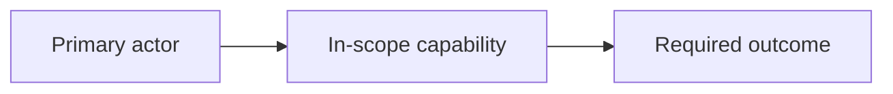

# {{PROJECT_NAME}} - Business Requirements Document

## Summary

<State purpose, scope, key information, and decision/outcome for this document.>

<!-- Apply .agent/context/output-style.md. For systems, workflows, integrations or architecture, add a relevant Mermaid HLD without renumbering protected sections. Status-only records need no decorative diagram. -->

Use the full BRD template only for sections that need detailed expansion.
State each fact once; omit sections with no content; expand only risk-relevant full-template sections.

## Profile Gate

Profile: MINIMAL / STANDARD / HIGH_RISK

MINIMAL is forbidden for regulatory impact, sensitive data, external vendor or
data egress, material financial investment, high-risk automation/AI,
cross-department process change, or irreversible migration. Expand only the
risk-relevant full-template section for STANDARD/HIGH_RISK work.

## High-Level Design

<!-- Replace this illustrative view with the main actors/components and relationships from this artifact's qualified authority. Keep implementation detail in its owning section. -->

## Metadata

ID: BRD-{{PROJECT}}  
Status: DRAFT / APPROVED  
Sources: {{REQUESTS_EVIDENCE_LINKS}}

## Business Contract

- Objectives and measurable outcomes.
- Scope, non-goals, constraints, assumptions, dependencies.
- Stakeholders, decision rights, policies, business rules, glossary.
- Business process, information, reporting, records, and controls.
- Business acceptance gates and rollback/pause criteria.
- Evidence/baseline/root cause; cost/benefit range and risk register; change and
  operational readiness.

## Traceability

List `BREQ-*`, business acceptance IDs, risks, assumptions, dependencies, and `OPEN-*` blockers.

## Handoff

State the PRD inputs required and decisions PRD/FSD must not invent.
