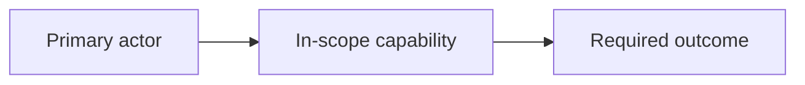

# {{PROJECT_NAME}} - Functional Specification Document

## Summary

<State purpose, scope, key information, and decision/outcome for this document.>

<!-- Apply .agent/context/output-style.md. For systems, workflows, integrations or architecture, add a relevant Mermaid HLD without renumbering protected sections. Status-only records need no decorative diagram. -->

Use the full FSD template only for sections that need detailed expansion.

## High-Level Design

<!-- Replace this illustrative view with the main actors/components and relationships from this artifact's qualified authority. Keep implementation detail in its owning section. -->

## Metadata

ID: FSD-{{PROJECT}}  
Artifact contract version: `2.0.0`
Status: DRAFT / APPROVED  
Upstream: PRD-{{PROJECT}}#{{IDS}}, BRD-{{PROJECT}}#{{IDS}}  
ADR applicability: NOT_REQUIRED / LINKED
ui_delivery_profile: NOT_APPLICABLE / STANDARD / HIGH_INTERACTION
ui_contract_readiness: NOT_APPLICABLE / DRAFT / BLOCKED / READY_FOR_SLICE

## Technical Contract

- Domain model, invariants, source-of-truth, states, and identifiers.
- Architecture, components, dependency rules, trust boundaries, sequences.
- Feature, data, API/event/interface, UI, job, integration, AI, security, privacy, observability, and NFR contracts.
- Tests, fixtures, verification commands, rollout, rollback, and operations.

## Screen & Interaction Contract

For networked UI-bearing scope, map `UI-STATE-*` and `UIMAP-*` to versioned `SCHEMA-*`
and `CONTRACT-*` refs. Pin deterministic fixture, matching mock, typed consumer
revisions, provider/consumer tests, responsive/accessibility evidence,
and the real `FIRST_VERTICAL_SLICE`. Expand only FSD Section 8 and the contract
manifest when detailed authoring is required.
For `NOT_APPLICABLE`, record an explicit factual reason. For networked UI scope,
include one final `HARDENING` goal that depends on all applicable delivery slices.

## Decisions

Use approved `TDEC-*` records or linked `ACCEPTED` ADR refs. Stop on missing authority.

## Goals

Define `GOAL-*` packets with UI delivery role, required gate, contract refs,
scope, dependencies, stop conditions, and verification refs.
Graph/traceability views cite these same qualified goals and verification refs; they do not create a second authority.

## AI Context and Output (conditional)

For product AI runtime only: specify actor/source attribution and versions,
chronology, authorized selection boundaries/omissions, truncation indicators,
and output-language policy from explicit requirements and selected context
(including mixed/empty/ambiguous cases). Reuse versioned output validation,
authority, fallback, and required review/edit/confirm/regenerate controls.
Expand FSD Section 11 for exact contracts; otherwise record N/A with reason.

Topology: LOCAL_ONLY maps local screen/state/data behavior to tests without
artificial wire/schema/mock/provider/consumer assets or first-provider roles.
Use `topology: LOCAL_ONLY`, `network_actions: []`, mapped UI verification refs,
and no blocking OPEN refs in the existing index. NETWORKED remains the default.
