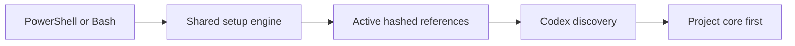

# Codex Adapter

## Summary

Use [prompt-driven setup](../SETUP.md) to install project/global scope and native adapters. New installations use exception-based approval: understand context, execute authorized work, validate, and deliver. Explicit stage preferences and existing configuration remain intact.

This adapter installs Super Compound as a Codex skill while keeping `.agent/` canonical. The installed `SKILL.md` prefers a live project's compact `.agent/context/` routing and loads full instructions only on demand; bundled references are the fallback when a project has no `.agent/` directory.

## Install

From the repository root:

```powershell
powershell -NoProfile -ExecutionPolicy Bypass -File .\.codex\install-super-compound.ps1
```

The destination is `$CODEX_HOME\skills\super-compound`. If `CODEX_HOME` is unset, the installer uses `$HOME\.codex`. Use an explicit isolated destination for testing:

```powershell
powershell -NoProfile -ExecutionPolicy Bypass -File .\.codex\install-super-compound.ps1 -CodexHome C:\temp\codex-home
```

Both legacy wrappers call the Node engine in `.agent/tools/setup.mjs`. It selects active `.agent/` assets into `references/`, excluding retired files and Python caches, stages and verifies hashes, then applies with rollback on recoverable failure. Unchanged owned stale files can be removed; user changes and unowned files produce a combined conflict report. Reinstall is a no-op when current.

## Verify

Verification is read-only and compares the installed file set, manifest, and hashes with the current canonical sources:

```powershell
powershell -NoProfile -ExecutionPolicy Bypass -File .\.codex\install-super-compound.ps1 -VerifyOnly
```

Run install again for missing or unchanged owned assets. Reconcile modified/unowned files explicitly before updating. Start a new Codex session for discovery. On macOS/Linux, use `bash .codex/install-super-compound.sh`; `--verify-only` and `--dry-run` are read-only. Node 22+ is required.

## High-Level Design



Canonical tools include structured memory capture/refresh/feedback/checkpoint/resume
and adaptive-eval comparison/behavior grading. Installation projects the same
contracts and fixtures for all hosts; real host reliability still requires measured
attempts. The installer parity suite verifies the complete bundled file set.
