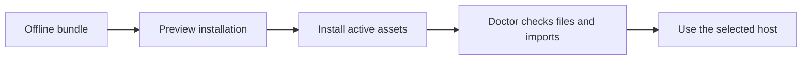

# Super Compound Offline Bundle

## Summary

This bundle installs the active framework into a project or a local host cache. It requires Node 22 or newer and no package install. It contains framework assets and installer adapters; repository development commands, package metadata, and historical evidence are available in the full source checkout.

## Workflow



## Install

Run from this bundle directory, replacing the target and host. Supported hosts: `codex`, `claude`, `antigravity`, `cursor`, `windsurf`, `gemini`.

```sh
node .agent/tools/setup.mjs install --source . --target "../my-project" --scope project --host codex --dry-run
node .agent/tools/setup.mjs install --source . --target "../my-project" --scope project --host codex
node .agent/tools/setup.mjs doctor --source . --target "../my-project" --scope project --host codex
```

Use `update` with the same options to refresh an existing installation. Preview is read-only. Installation preserves existing project configuration and stops on locally modified owned files. Doctor checks installation structure, source drift, and static local runtime dependencies; it does not test a live AI host.

Use `--scope global` to populate the local framework cache and host adapters, or `--scope both` for cache and project. See [SETUP.md](SETUP.md) for host-specific details. Do not copy a framework `package.json` into an application: the application keeps its own dependency and test commands.

## Use

Start with the goal in plain language or `/sc-status`. Bounded changes route to `/sc-work`, failures to `/sc-debug`, and full delivery to `/sc-launch`. New installations use exception-based approval; an existing project's explicit approval preferences remain in force. Validate the requested result and finish when the goal is met.
