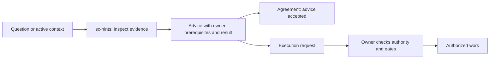
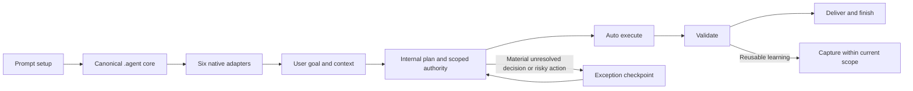

# Super Compound

## Summary

Use [prompt-driven setup](SETUP.md), describe the goal, and let the framework understand context, execute authorized work, validate, and deliver. New installations ask for approval only when an exception requires human judgment or additional authority. Existing configuration, including explicit stage approvals, is preserved.

Super Compound is a compact AI-assisted development framework for Antigravity IDE, Claude Code, and compatible coding agents.

It keeps the public command surface small, pushes detailed procedures into skills, and treats verification as part of the work rather than a final ritual.

Human input uses one [answerable checkpoint](.agent/context/checkpoint.contract.md):
what remains approved, the blocked result, owner, recommendation, direct review
material and a short prioritized set of ready questions/approvals with stable IDs and automatic continuation. Agent research/tests proceed
first; evidence refresh does not repeat approval. Authorized owner handoffs run
internally while configured stage checkpoints and read-only boundaries remain.
Every displayed item includes a recommendation, brief reason, and review link
when material is needed. The complete unresolved register, dependent items,
and supporting detail stay available by link or on request. Reply examples
appear when useful; partial replies keep unanswered IDs open, and silence grants no approval.
Approval does not supply missing information, test evidence or access readiness.
See [how to answer](WALKTHROUGH.md#answering-a-checkpoint) and the
[question/answer eval](docs/eval-results/questions-and-hints-20261005.md).
See the [PromptShield example and regression evidence](docs/eval-results/hitl-checkpoints-20261004.md).

## Quick Start

Start with [setup](SETUP.md), then try one small task. Node 22+ is required;
Python is needed only for interface search and Python checks.

Describe the result you need in ordinary language; commands remain available:

| Intent | Example | Expected boundary |
|---|---|---|
| Start/change work | "Ubah label ini" or "Buat PRD saja dari BRD approved" | The agent selects the existing owner/tier; document-only scope ends at that artifact and applicable validation. |
| Continue/check status | "Lanjutkan pekerjaan yang authorized" or "Lihat status saja" | Resume valid authority/evidence through the work owner; status-only stays read-only. |
| Consult | "Apa langkah berikutnya?" | Read-only advice; accepting a recommendation does not start implementation. |

These are conceptual labels, not new commands or runtime modes. The
[dispatcher](.agent/context/workflow-dispatch.md) retains all existing gates.

```text
/sc-init
/sc-debug Form login menerima email kosong; reproduksi dan perbaiki validasinya
```

Expected result: a focused fix with regression evidence and one next action:

```text
Hasil: Validasi form sudah diperbaiki.
Verifikasi: 6 pengujian terkait lulus.
Berikutnya: Review perubahan melalui /sc-review.
Detail: [tautan laporan]
```

The numbers above illustrate the format; the agent reports actual check results.

| Your task | Start here | What you provide | Result and next action |
|---|---|---|---|
| Setup | [SETUP.md](SETUP.md), then `/sc-init` | Project path, host and project/global scope | Doctor result and detected verification commands; try a small task |
| Bug | `/sc-debug Email kosong lolos validasi login` | Symptom, reproduction and expected behavior | Root cause, tested fix and evidence; review the change |
| Small change | `/sc-work Ubah teks tombol Simpan menjadi Simpan perubahan` | Exact change and expected result in the existing screen | Scoped edit and relevant checks; review |
| New feature | `/sc-launch Tambahkan dashboard penggunaan untuk admin akun` | Users, outcome and known constraints | Bounded changes reuse existing contracts; material full-tier work preserves BRD -> PRD -> FSD -> verified goals with exception checkpoints |
| Resume | `/sc-status` | Existing workspace and handoff, plus any changed intent | Current evidence/blockers and one exact next action; continue authorized ready work |
| Advice | `/sc-hints <question or condition>` | A question, or active work context | Recommendation, owner command, prerequisites and expected result; consultation writes no files |

All 19 commands use `/sc-*`; Claude Code exposes native slash commands after
installation. Other hosts use their adapters. In Codex, plain language such as
“fix this bug” or “resume the task” routes to the same compact contracts.
See [Public Workflows](#public-workflows) for input/output examples.

For document review, start with the Summary in the same BRD/PRD/FSD/ADR artifact.
It exposes scope, outcome, material risks and the current decision; technical
metadata, contracts and evidence remain available in their existing sections.
The [shared authoring rule](.agent/skills/agentic-delivery/references/templates-and-outputs.md#applicability-and-expansion)
distinguishes required, triggered and optional content without page targets.
See [worked document examples](WALKTHROUGH.md#reviewing-one-artifact).

### Practical guidance with `/sc-hints`

```text
/sc-hints
/sc-hints Saya punya PRD approved, langkah berikutnya apa?
/sc-hints Mengapa test modul order ini sulit ditulis?
/sc-hints Kapan saya perlu prototype sebelum membuat FSD?
/sc-hints Bagaimana melanjutkan pekerjaan setelah compact?
```

Hints uses active context or the supplied question. With neither, it shows
examples and asks what you need. It inspects focused evidence and separates
verified facts, assumptions and unknowns. Advice stays in chat; accepting a
recommendation does not start implementation. Ask to execute it to continue
through its owner under existing authorization and gates.

| Need | Command |
|---|---|
| Focused advice or a specific obstacle | `/sc-hints` |
| Project position or resume | `/sc-status` |
| Improvement inventory with Brain filtering | `/sc-geniusloop` |
| Business scope and decisions | `/sc-explore` |
| A factual evidence gap | `/sc-research` |
| Change review or failure diagnosis | `/sc-review` or `/sc-debug` |



For example, after verifying PRD approval and finding no FSD in the checked
locations, the answer recommends `/sc-plan <PRD path>`, explains why full-tier
implementation needs FSD authority, links the inspected approval section, and
names the expected FSD/GOAL result. See [worked examples](.agent/skills/hints/references/examples.md).

## Delivery Tiers

The framework decides how much process a request needs. Intake states one line, `Tier: light|full; trigger: T<n>|none`. `light` includes bounded reversible features and pages that reuse existing contracts, access and patterns with clear acceptance and proving checks; it goes to `/sc-work` or `/sc-debug`. A single trivial change is done directly. `full` covers material new capability/flow, contract/access/data/side-effect changes, coordination that changes outcomes or risk, or an explicit BRD/PRD/FSD request. It takes `BRD -> PRD -> FSD -> GOAL` with durable authority, without repeating permission already granted. A material trigger found mid-work escalates only affected work. Pin a project with `delivery_mode: light|full` in `.agent/rules/project-config.md`; the rubric is in `.agent/skills/agentic-delivery/references/workflow-integration.md`.

Session handoff, a derived issue board, and parallelism alone do not raise a
clear bugfix above `light`. Sensitive paths trigger semantic inspection.
Reversible internal choices proceed within authority; explicit operation
authorization persists unless target, scope, or material risk changes. Derived
boards and unchanged contract revisions pass machine gates without redundant
approval. LOCAL_ONLY UI uses local behavior checks without fabricated provider
assets. Networked scale-out retains real-provider first-slice proof.

Setup requires Node 22+ on Windows, macOS, and Linux. Python is needed only for Python-based features. See SETUP.md for ownership, staging, rollback, and verification limits.

## High-Level Design



## What It Provides

- 19 public workflows for common development operations
- Canonical product delivery path: `BRD -> PRD -> FSD -> GOAL -> IMPLEMENTATION -> VERIFICATION`
- Modular skills for agentic delivery, planning, execution, debugging, review, audit, UI, state, and verification
- Full BRD/PRD/FSD/optional ADR templates under `.agent/templates/agentic-delivery/`
- Local Markdown goal issue pointers under `.scratch/<feature>/issues/`
- Concise always-on rules under `.agent/rules/`
- Compact runtime contracts under `.agent/context/` for routing, skill selection, template skeletons, and context budget gates
- Deterministic local hooks under `.agent/hooks/`
- Deterministic token benchmark harness under `.agent/tools/`
- Native Codex adapter with staged, hash-verified, rollback-safe bundled fallback under `.codex/`
- Preview-first Git Workflow Operation through `/sc-go`
- Data-backed interface design search through `interface-design`
- Durable project memory through `docs/STATE.md`, `.continue-here.md`, and `docs/solutions/`

An approved BRD or PRD is always a durable artifact under `docs/brd/` or
`docs/prd/`; chat drafts cannot authorize the next delivery stage. Eval evidence
must likewise be stored under `.agent/evals/` whenever another gate consumes it.

## Install

Use the onboarding prompt in [SETUP.md](SETUP.md), or select scope and hosts explicitly:

```bash
node .agent/tools/setup.mjs install --scope project --host codex,claude --target "PATH TO PROJECT" --dry-run
node .agent/tools/setup.mjs install --scope project --host codex,claude --target "PATH TO PROJECT"
node .agent/tools/setup.mjs doctor --scope project --host codex,claude --target "PATH TO PROJECT"
```

Choose `global` for a local framework cache and personal entrypoints, or `both`.
Existing configuration and user-owned instructions are preserved; conflicts are
reported together. Node 22+ is the setup baseline. To export an active-only
distribution for offline transfer:

```bash
node .agent/tools/active-assets.mjs copy <new-bundle-directory>
```

The export is an install-only bundle with [OFFLINE-SETUP.md](OFFLINE-SETUP.md)
as its README. Use its Node installer commands; repository `npm` development
commands and historical reports belong to the full checkout. Installation
preserves the application's package metadata. Export and doctor check static
local imports, and automated bundle smoke tests run memory and install commands.

Selecting Claude installs `.claude/commands/` pointers for all 19 routes,
so `/sc-*` works as native Claude Code slash commands. Each pointer is a thin
contract-first stub that loads the compact route contract on demand.

It also ships `.claude/agents/` (regenerated from `.agent/agents/` plus
`.agent/context/agent-models.json` by `npm run agents:project`), so the six
framework subagents are native Claude Code subagents with the per-host model
you configured.

Optional cross-project knowledge store: `export SC_GLOBAL_KNOWLEDGE_DIR=~/.super-compound`
makes every route's read-back also search `<dir>/LEARNED_KNOWLEDGE.md` (see Knowledge Loop).

Optional Codex skill installation (PowerShell):

```powershell
powershell -NoProfile -ExecutionPolicy Bypass -File .\.codex\install-super-compound.ps1
```

The installed adapter still prefers a live project's compact `.agent/context/`
contracts. See `.codex/README.md` for isolated install and verification commands.

For Antigravity IDE, keep `.agent/rules/super-compound.md` lowercase. The root `SUPER-COMPOUND.md` is the concise human/Claude operating contract; `.agent/rules/super-compound.md` is the canonical Antigravity rule.

## Lifecycle Reference

After implementation, review and audit before explicitly requested Git delivery:

```text
/sc-work <approved-goal>
/sc-review
/sc-audit
/sc-go commit "Describe the verified change"
/sc-go push
/sc-go pr
```

Git commands require explicit intent for each operation. Authorized internal
workflow handoffs continue automatically; the list is a reference, not a queue
of commands the user must retype.

For product work with an interactive surface, the default hybrid lifecycle is:

```text
BRD -> PRD draft -> UI validation -> approved PRD
    -> FSD/UI-API contract -> contract enabler (when needed)
    -> /sc-plan re-index + automatic promotion of approved semantics
    -> first real vertical slice -> /sc-plan dependent promotion
    -> controlled parallel scale-out -> hardening
    -> applicable integration/responsive/accessibility/E2E/visual + conditional UAT
```

Use `NOT_APPLICABLE` for backend-only/CLI work, `STANDARD` for canonical
page/form/CRUD interactions, and `HIGH_INTERACTION` for conditional multi-step,
optimistic, realtime, offline, gesture, complex keyboard/focus, dense responsive,
or long-running async behavior. The gate is automatic when an interactive user
surface is detected.

If executable contract assets already match the pinned revision, skip the
enabler loop. Otherwise only the bounded enabler may run while readiness is
`DRAFT/BLOCKED`; the first slice stays blocked until `/sc-plan` reaches
`READY_FOR_SLICE` again. `EXCEPTION_APPROVED` can release that first slice but
never parallel scale-out.

For read-only UI design/review, then implementation from approved authority:

```text
/sc-ui review analytics dashboard for a fintech SaaS  # design-only
/sc-work <approved-goal>
```

For continuation:

```text
/sc-pause
# next session
/sc-status
```

## UI-Aware Delivery Gates

- PRD owns `ui_delivery_profile`, the validated experience baseline, critical
  journey, observable states, responsive/accessibility intent, and evidence refs.
- FSD Section 8 owns the Screen & Interaction Contract and stable
  `UI-STATE-*`/`UIMAP-*` mappings. OpenAPI/JSON Schema/AsyncAPI owns the exact
  delegated wire shape; `ui_api_contract` only indexes those authorities.
- Readiness is binary: `node .agent/tools/readiness-gate.mjs` must pass every
  hard gate. Missing state coverage, data/action mapping, revision consistency,
  verification refs, risk-appropriate evidence, or any blocking `OPEN-*` blocks
  the slice.
- `/sc-plan` writes only FSD and issue pointers. `/sc-work` materializes missing
  schemas, fixtures, mock, typed consumer, and contract tests through a
  `CONTRACT_ENABLER` goal.
- For networked UI, exactly one `FIRST_VERTICAL_SLICE` proves real-provider auth/permission,
  success, and a representative failure. Mock-only evidence cannot open
  `SCALE_OUT_SLICE` work.
- Parallelism starts at 2+ genuinely independent streams only when saved time
  exceeds coordination overhead, the first slice is verified, contract versions
  match, shared/generated surfaces have one writer, and worktrees are isolated.

Existing artifact contract 1.0 remains readable. New/changed UI work uses the
1.1 additive fields; completed goals are not revalidated retroactively and no
automatic project migration is performed.

Pilot outcome claims require at least three comparable features with a baseline.
Track preventable alignment rework hours after implementation starts, UAT
rejections caused by behavior mismatch, late state/permission/payload/error
defects, post-baseline breaking contract changes, first-pass real-integration
success, and pre-ready critical-state/AC-test coverage. Calculate:

```text
rework_reduction =
  (baseline_preventable_rework_hours - pilot_preventable_rework_hours)
  / baseline_preventable_rework_hours * 100
```

The target is greater than 90%. New scope, market learning, and new stakeholder
preferences are healthy iteration and are excluded from preventable rework.

## Public Workflows

Only these workflow files are public:

| Workflow | Use When |
|---|---|
| [/sc-init](.agent/workflows/sc-init.md) | Set up or reload framework context |
| [/sc-hints](.agent/workflows/sc-hints.md) | Practical evidence-backed guidance; read-only until an owner execution request |
| [/sc-status](.agent/workflows/sc-status.md) | Inspect current state and route the next action |
| [/sc-geniusloop](.agent/workflows/sc-geniusloop.md) | Generate a bounded improvement shortlist when explicitly requested |
| [/sc-explore](.agent/workflows/sc-explore.md) | Shape fuzzy ideas into a BRD with business objectives, constraints, policies, and acceptance |
| [/sc-research](.agent/workflows/sc-research.md) | Resolve a named factual or technical gap with an advisory research note, then return to the decision owner |
| [/sc-prd](.agent/workflows/sc-prd.md) | Write PRD product requirements from an approved BRD |
| [/sc-plan](.agent/workflows/sc-plan.md) | Produce the FSD, ADR applicability decision, goal issue pointers, risk checks, and verification |
| [/sc-eval](.agent/workflows/sc-eval.md) | Define and run evaluation criteria before or after implementation |
| [/sc-go](.agent/workflows/sc-go.md) | Preview branch, worktree, commit, push, and Pull Request operations |
| [/sc-work](.agent/workflows/sc-work.md) | Execute an approved FSD goal or goal issue pointer sequentially or with safe parallel slices |
| [/sc-debug](.agent/workflows/sc-debug.md) | Reproduce, isolate, and fix root causes |
| [/sc-review](.agent/workflows/sc-review.md) | Review changes for correctness, maintainability, and missing tests |
| [/sc-audit](.agent/workflows/sc-audit.md) | Check security, compatibility, compliance, agent surface, and release readiness |
| [/sc-compound](.agent/workflows/sc-compound.md) | Capture reusable solutions and lessons |
| [/sc-evolve](.agent/workflows/sc-evolve.md) | Cluster verified learnings into draft framework proposals for human approval |
| [/sc-pause](.agent/workflows/sc-pause.md) | Save durable handoff state |
| [/sc-launch](.agent/workflows/sc-launch.md) | Start a focused project or feature lifecycle |
| [/sc-ui](.agent/workflows/sc-ui.md) | Design or review UI read-only; route approved implementation to `/sc-work` |

Non-trivial debug evidence that would not fit the chat return is stored at
`docs/debug/YYYY-MM-DD-<slug>.md`; `/sc-compound` remains reserved for verified,
reusable lessons.

## Explore vs Research

`/sc-explore` resolves normative uncertainty: user value, scope, roles, policy, constraints, and acceptance. Its durable output is a BRD. `/sc-research` resolves empirical uncertainty: what local evidence and current primary sources show about one named fact, API/version, feasibility constraint, or option comparison. Its note informs a decision but never approves one.

| Dominant question | Route | Durable output | Return |
|---|---|---|---|
| What should we build, why, for whom, and under which policy? | `/sc-explore` | `docs/brd/brd-<feature>.md` | `/sc-prd` after BRD approval |
| What is true, current, supported, or feasible for this decision? | `/sc-research` | `docs/research/YYYY-MM-DD-<slug>.md` when non-trivial | Caller: explore, PRD, plan, audit, or debug |
| How should approved behavior be implemented? | `/sc-plan` | FSD plus goal pointers | `/sc-work` after approval |
| What security, compatibility, compliance, or release risks exist? | `/sc-audit` | Findings by severity | Owning remediation workflow; never fix inside audit |

Run research only when the named evidence gap could materially change a decision, sources conflict, or the result needs review/revalidation. Keep a one-line API lookup inside the active workflow. If intent is still fuzzy, use explore; if a concrete failure exists, use debug; if the job is risk severity or readiness, use audit.

Example:

```text
/sc-explore Add tenant usage analytics for account admins
/sc-research Can the current event store produce tenant-safe daily metrics with 15-minute freshness at the observed volume?
/sc-prd
```

If research changes the promised freshness or product scope, return to `/sc-explore`. If the BRD remains valid, feed the note into `/sc-prd`. A later technical recommendation becomes authoritative only after `/sc-plan` records it in the FSD as a `TDEC-*` or linked accepted ADR.

Removed workflows are intentionally not aliases. Route them this way:

| Old Intent | Current Route |
|---|---|
| brainstorm, discuss, domain, strategy, prototype | `/sc-explore` |
| issues, triage, Kanban, Journey, task shaping | `/sc-plan` |
| loop, handoff, parallel execution | `/sc-work` |
| branch, commit, push, PR, worktree | `/sc-go` |
| security, compatibility, MCP, compliance, release readiness | `/sc-audit` |
| focused consultation, next-step advice | `/sc-hints` |
| progress, resume | `/sc-status` |
| reload | `/sc-init reload` |

Exploration uses numbered decision rounds: ask small batches of consequential decisions with settled prerequisites, with a recommendation, reason, and trade-off for each question. Partial answers remain open; corrections reopen affected descendants. Concrete scope skips grilling, and existing BRD/PRD/FSD approvals remain authoritative. Both execution tiers inspect current flow, reusable patterns, affected callers, and proving checks. Product AI context and live verification expand only when relevant through their skill references.

## Skills

Skills live in `.agent/skills/<name>/SKILL.md`. They are loaded only when relevant.

Core operational skills:

- `agentic-delivery`
- `brainstorming`
- `codebase-design`
- `domain-modeling`
- `prd-generator`
- `issue-workflow`
- `triage-workflow`
- `writing-plans`
- `executing-plans`
- `prototyping`
- `systematic-debugging`
- `test-driven-development`
- `code-review`
- `security-audit`
- `state-management`
- `verification-before-completion`
- `git-workflow-operation`

Supporting skills:

- `architecture-enforcement`
- `checkpoint-protocol`
- `compatibility-check`
- `context7-docs`
- `context-engineering`
- `data-privacy`
- `eval-harness`
- `gap-closure`
- `integration-checking`
- `interface-design`
- `knowledge-compounding`
- `parallel-execution`
- `plan-verification`
- `secure-code-patterns`
- `skill-authoring`
- `subagent-orchestration`
- `threat-modeling`
- `todo-management`

## Knowledge Loop

Captured knowledge runs a closed loop: capture -> read-back -> maintenance -> evolve.

- `/sc-compound` routes outcomes to four sinks: `docs/solutions/` (solved problems), `ERR-*` entries in `docs/ERROR_LOG.md` (agent mistakes plus an IF-THEN prevention rule), `LRN-*` entries in `docs/LEARNED_KNOWLEDGE.md` (user corrections and confirmed conventions), and `docs/progress.md` (chronology). Entry formats and the capture guide live in `.agent/skills/knowledge-compounding/references/memory-capture.md`; `.agent/skills/state-management/references/file-contracts.md` only selects the file.
- `/sc-plan`, `/sc-work`, and `/sc-debug` run `node .agent/tools/knowledge-search.mjs "<query>"` read-back early; work/debug require `--require-complete` and known scope flags. Matching `ERR-*`/`LRN-*` lessons are evidence to validate against the current code and context. Decisions bind only through their authoritative source and approval provenance. The entry-granular corpus includes `docs/solutions/`, `docs/learnings/`, active and archived ERR/LRN records, and the Codebase Patterns head of `docs/progress.md`, still top-3 bounded.
- `/sc-status` counts memory entries via `node .agent/tools/memory-maintenance.mjs report` and recommends `/sc-evolve` at 3+ independent observed/confirmed origins with evidence; `/sc-evolve` consumes the report's promotion candidates but still writes drafts only for human approval. `memory-maintenance.mjs` supports `check` (format and cap validation), `report`, JSON `capture`/`refresh`/`feedback`/`checkpoint`, read-only `resume`, and `archive --dry-run`. Structured capture automatically applies lossless cap retention; the standalone archive command only proposes moves.
- Stop/SessionEnd hints inspect actual pending capture/closeout state, remain advisory and do not capture knowledge or replay implementation.
- The compact contracts carry the loop's spine, not just the full workflows: `sc-work`, `sc-debug`, and `sc-plan` read back first, `sc-work` and `sc-debug` close through `/sc-compound`, `sc-status` runs the maintenance report, `sc-pause` captures unlogged entries, and `sc-compound` names the four sinks. A spine test in `.agent/tools/workflow-contracts.test.mjs` keeps it that way, because the contract-first path never loads the full workflow body.
- `memory-maintenance.mjs report` also prints a `freshness` block comparing `docs/STATE.md` and `docs/progress.md` dates with the newest commit. `STALE_STATE` or `STALE_PROGRESS` is reconciled through the authorized owning route; active intent and dependency-ready work take priority. `/sc-status` remains read-only and `/sc-pause` is for actual stopping.
- Optional global store: set `SC_GLOBAL_KNOWLEDGE_DIR` and `knowledge-search.mjs` adds `<dir>/LEARNED_KNOWLEDGE.md` to the corpus (hits show as `global:`); `Applies to: global` entries are captured there too. Unset, the corpus stays repository-local.

## Git Workflow Operation

Use `/sc-go` when starting a branch, using an optional worktree, committing, pushing, or preparing a Pull Request. The default mode is preview-first: Super Compound shows safety checks and exact commands before mutating Git state.

Standard branch preview:

```bash
git checkout main
git pull --ff-only origin main
git checkout -b feature/login
```

Optional worktree preview:

```bash
git fetch origin
git worktree add -b feature/login ../project-feature origin/main
cd ../project-feature
```

Finish preview:

```bash
git status
git diff
git add .
git commit -m "Implement login workflow"
git push -u origin feature/login
```

Branch names should use `feature/`, `fix/`, `hotfix/`, `refactor/`, `docs/`, or `chore/`. Do not work directly on `main` or the configured base branch. Review sensitive paths such as `.env`, credentials, logs, cache, and build output before `git add .`. Pull Requests use `.agent/templates/git-workflow/PULL_REQUEST_TEMPLATE.md`.

## Automatic Knowledge and Resume

After verification, owning work/debug/compound routes automatically capture
reusable knowledge before closeout. Structured JSON capture validates evidence
locators, upserts stable origins, and keeps Quick Reference rows consistent.
Three independent observed/confirmed origins with evidence are required for
promotion; PATTERN alone cannot promote. Human proposal dispositions suppress
repeat candidates until new evidence appears. `/sc-status` remains read-only.

```bash
node .agent/tools/memory-maintenance.mjs capture --input-file .scratch/capture.json --json
node .agent/tools/memory-maintenance.mjs checkpoint --input-file .scratch/checkpoint.json
node .agent/tools/memory-maintenance.mjs resume --json
node .agent/tools/knowledge-search.mjs "retry timeout" --project my-project --require-complete --json
```

Schemas, worth gate, reviewed refresh, feedback, and writer ownership are in
[the deterministic loop](.agent/skills/knowledge-compounding/references/deterministic-loop.md)
and [checkpoint protocol](.agent/skills/state-management/references/checkpoint-protocol.md).
Capture is local; global knowledge remains opt-in. A failed atomic replacement
keeps the old record and retries capture using saved verification. Resume checks
contract digests and fresh ledger evidence before offering ready goals.
Stale/superseded knowledge is hidden by default; `--diagnostic` includes it.
Unknown legacy origins/versions remain unknown.

Recall includes active entries from both ERR/LRN archives without loading the
archive into model context. JSON `coverage` distinguishes complete-empty from
partial scans; `--require-complete` exits 2 on partial coverage. Optional default
stores may be absent in a fresh project. Supply scope flags only when known;
global scope never waives explicit stack/version restrictions.

New persisted knowledge, reviewed replacement content and pending capture input
pass the existing privacy guard. Non-trivial closeouts use optional checkpoint
`learningCloseouts` with captured/skip/pending dispositions and evidence identity.
Pending retries preserve verified work; tiny skips need no ledger/checkpoint.
Legacy checkpoints remain advisory and readable.

Feedback binds to the knowledge revision and record digest. Changed observations
append; overflow is archived losslessly, including failed/rejected evidence.
Maintenance reports bounded negative-first pointers for owner review, without
treating usage as truth or independent recurrence. Review reuses unchanged proof
and stable finding IDs; research verifies factual premises against current
observations or primary sources. These changes strengthen existing owners.

Optimization comparisons use task/host/model/grader/measurement parity and
KEEP/REJECT/INCONCLUSIVE. Tool fixtures and static context estimates do not
prove actual host behavior or runtime token savings. See the
[dated gap analysis](docs/audits/2026-10-03-knowledge-loop-gap-analysis.md).
The [swarm comparison](docs/audits/2026-10-06-framework-gap-analysis.md) covers
eleven frameworks and the website checklist; [delivery evidence](docs/eval-results/framework-enhancement-20261006.md)
separates implemented checks from unproven runtime benefit. Same-source A/A
controls describe noise and cannot certify an enhancement; eligible candidates
must beat the registered control floor and existing quality/variation gates.

## Interface Design

The legacy UI skill was renamed to `interface-design`.

Use:

```bash
python .agent/skills/interface-design/scripts/search.py "preconnect cdn" --domain web
python .agent/skills/interface-design/scripts/search.py "mobile touch target" --domain app
python .agent/skills/interface-design/scripts/search.py "performance trackBy" --stack angular
python .agent/skills/interface-design/scripts/search.py "SaaS dashboard" --design-system --persist -p "Acme CRM" --page dashboard --overwrite
```

Domains include `product`, `style`, `color`, `typography`, `landing`, `chart`, `ux`, `web`, `app`, `icons`, `gsap`, `react`, and `google-fonts`.

Use interface-design by retrieval: run targeted searches and read the returned rows. Do not preload `.agent/skills/interface-design/data/**/*.csv` into agent context.

The CSV loader fails fast when a row does not match its header width, so malformed reference data is caught during validation rather than silently producing bad search results.

## Repository Layout

```text
.agent/
  agents/       dedicated agent prompts
  context/      compact runtime routing, skill, template, and budget contracts
  benchmarks/   reproducible token baseline and benchmark evidence
  hooks/        deterministic local hook scripts
  rules/        concise always-on framework rules
  skills/       modular task procedures
  templates/    BRD, PRD, FSD, optional ADR, research-note, and PR templates
  tools/        deterministic local framework utilities
  workflows/    19 public workflows
.claude/        Claude Code path-scoped rules
.codex/         Codex skill adapter and hash-verified installer
docs/           engineering standards, archives, and runtime project docs
SUPER-COMPOUND.md
AGENTS.md
CLAUDE.md
WALKTHROUGH.md
CHANGELOG.md
```

Release and delivery history lives in [CHANGELOG.md](CHANGELOG.md).

Runtime/cache files such as `.debug/`, `.continue-here.md`, `.agent/.compact-state/`, `__pycache__/`, and `*.pyc` are ignored. `docs/` is not ignored; durable documentation should be tracked when it is part of the framework or project history.

Local goal issue boards live under `.scratch/<feature>/`. They are not ignored by default because teams may choose to track goal pointers as durable work contracts. Issue files should link to BRD/PRD/FSD/ADR IDs instead of copying their text.

Ephemeral multi-agent handoffs live under `.scratch/work-packages/`. They are ignored because briefs, diffs, reports, and review ledgers may contain large or sensitive working context; durable outcomes belong in the FSD, issue board, state, or solution docs.

## Compatibility Notes

This version intentionally breaks the imported 2026-06-20 surface area.

- The legacy UI workflow is now `/sc-ui`
- The legacy UI skill directory is now `.agent/skills/interface-design/`
- Alias workflows for exploration, security, continuation, progress, reload, and compatibility were removed
- Thin workflows were folded into `/sc-explore`, `/sc-plan`, `/sc-work`, and `/sc-audit`
- Archived analysis moved to `docs/archive/2026-06-20-gap-analysis.md`

The framework now favors clear operational defaults over preserving every imported idea as a standalone command.

## Verification

Recommended checks after editing the framework:

```bash
python -m py_compile .agent/skills/interface-design/scripts/core.py .agent/skills/interface-design/scripts/search.py .agent/skills/interface-design/scripts/design_system.py
node --check .agent/hooks/pre-compact.js
node --check .agent/hooks/session-end.js
node --check .agent/hooks/suggest-compact.js
node --check .agent/hooks/stop-check.js
node --check .agent/tools/git-workflow.mjs
node --test .agent/tools/agent-contracts.test.mjs .agent/tools/artifact-contracts.test.mjs .agent/tools/codex-install.test.mjs .agent/tools/evidence-matrix.test.mjs .agent/tools/framework-audit.test.mjs .agent/tools/git-workflow.test.mjs .agent/tools/token-benchmark.test.mjs .agent/tools/transcript-usage.test.mjs .agent/tools/work-package.test.mjs .agent/tools/workflow-contracts.test.mjs
node --test .agent/skills/agentic-delivery/tests/progressive-disclosure-wave3.test.mjs .agent/skills/architecture-enforcement/tests/architecture-enforcement.test.mjs .agent/skills/security-audit/tests/risk-skills-progressive-disclosure.test.mjs .agent/skills/skill-authoring/test-progressive-routers.mjs
node .agent/hooks/test-hooks-security.js
python -m unittest discover -s .agent/skills/interface-design/scripts -p "test_*.py"
python .agent/skills/verification-before-completion/tests/test_skill_router_contract.py
python .agent/skills/interface-design/scripts/search.py "preconnect cdn" --domain web
node .agent/tools/token-benchmark.mjs --baseline .agent/benchmarks/token-baseline.before.json --repeat 3 --output .agent/benchmarks/token-benchmark.after.json
node .agent/tools/framework-audit.mjs --output .agent/benchmarks/framework-audit.after.json
node .agent/tools/framework-audit.mjs --verify-existing .agent/benchmarks/framework-audit.after.json
```

The new `/sc-hints` row uses `liveBefore` with basis `current-full-vs-compact`, measured from current full workflow/skill sources. Its compact ratio must be at most 10%; it is excluded from historical reduction totals and the Git baseline is unchanged.

The benchmark separates immutable historical eager-preload evidence from current repository-owned startup budgets for Codex, Claude Code, Antigravity, the native Codex adapter, and bundled skill metadata. It also emits a 19-route x 3-cell static matrix: input context reduction, process wiring/authority, and output sink/budget/next-owner coverage. Every route contract must stay at or below 10% of its full workflow/skill context (`.agent/context/token-budget-gates.md`); startup surfaces retain absolute caps, every hotspot reduction must exceed 90%, and all 57 static cells must pass. Totals are scenario-weighted and may count shared files more than once. Output-authoring measures context and contracts, not generated prose. Host reasoning, generated-output, injected-context, latency, and billing tokens remain `unknown`; the static matrix is not a runtime end-to-end claim. The baseline is remeasured from recorded ancestor commit blobs on every authoritative run. A runtime claim requires paired attributable before/current traces for every route, not one after-only transcript.

Runtime token telemetry complements the static gates: `.agent/hooks/session-end.js` measures the host transcript (when the host provides `transcript_path`) through `.agent/tools/transcript-usage.mjs` into a runtime usage log under `.agent/.compact-state/`, and `npm run usage` aggregates it. Usage is counted once per `message.id` (streamed transcripts repeat lines), and each log entry carries an `assetReads` histogram of Read calls on `.agent/` contracts, workflows, and skills, which is the activation evidence the static matrix cannot supply. Static benchmark gates are unchanged.

The framework audit enumerates the exact active Git manifest: tracked files plus untracked, non-ignored files. It byte-reads the physical tree outside `.git`, classifies every active path into a declared audit class, and fails on any unclassified entry. The self-generated audit report is necessarily outside its own raw content digest, so `--verify-existing` validates it separately and emits a 100%-accounted verification envelope. The recorded `repositoryHead` is digest-bound provenance; freshness is content/manifest based so committing the excluded report does not invalidate otherwise identical evidence. The envelope reports whether stored and current heads match. The report distinguishes byte/content coverage, audit-class coverage, and specialized self-evidence instead of calling them one uniform semantic audit. It also validates UTF-8, JSON, CSV shape, Markdown links, workflow/skill contracts, duplicate content, output budgets, the 19x3 matrix, and fresh benchmark evidence. Invalid payload content is never echoed into findings.

Also check:

- Every workflow has frontmatter `description` and an H1
- Every skill directory matches its `name`
- Agentic delivery templates exist under `.agent/templates/agentic-delivery/`
- FSD goal issue examples use qualified references and do not duplicate BRD/PRD/FSD/ADR prose
- Active docs use `docs/solutions/adr-####-<slug>.md` for linked ADRs
- Interface CSV rows match header widths
- Interface-design runtime guidance uses search-only retrieval, not CSV preload
- Design-system persistence rejects path traversal and requires `--overwrite` for existing files
- Claude hook settings use exec-form `node` plus `${CLAUDE_PROJECT_DIR}` script args, so cwd changes and spaces do not break paths
- Old workflow and skill names are not referenced in active docs
- The benchmark is deterministic across 3 runs, every route meets the 10% ratio gate and startup surfaces stay within their absolute caps, and every hotspot reduction gate exceeds 90%
- The exact active-manifest framework audit passes with fresh benchmark evidence
- `docs/engineering-standards.md` and archive docs are not ignored

For framework maintenance, `npm run test:local` runs syntax, tool, skill, hook,
and Python checks while excluding the cross-platform installer integration
suite. `npm test` retains full installer verification; run it in CI and after
installer/adapter changes. `npm run audit` refreshes benchmark freshness and
checks structural invariants. Local Git previews can use `start`/`worktree` with
`--local --base <known-local-branch>` without requiring a remote.

## Evidence-Based Learning and Recovery

Existing work/debug workflows turn verified lessons into reusable or additive
regression checks; compound stores outcomes and evolve proposes changes to
skills/workflows/policy. Active instructions survive checkpoint/dispatch and
completion receipts survive interruption. See [learning/check guide](.agent/skills/knowledge-compounding/references/prevention-checks.md),
[recovery protocol](.agent/skills/context-engineering/references/active-context.md),
and [verification recipes](.agent/skills/verification-before-completion/references/verification-recipes.md).

The [exact retirement registry](.agent/context/retired-assets.json) excludes retired
files from the active runner, Codex bundle, operational knowledge, active benchmark
and pilot fixtures. The [historical archive](docs/archive/retired-assets-20261007/)
preserves 87 retired files byte-for-byte with original/archive locator mappings,
SHA-256 checksums and provenance. Both exact locators are retired. New paths are active
by default. Use `npm run test:tools`; direct wildcard runners include retired
tests. Distribution should use the selector rather than an unfiltered copy.
Audit records physical retired bytes and digests separately. Historical token
baselines remain immutable.

The [pstack delivery analysis](docs/audits/2026-10-04-pstack-gap-analysis.md)
links acceptance and implementation evidence. Runtime savings require measured
paired sessions; static context reduction is not runtime token/latency proof.
See [paired experiments](.agent/skills/eval-harness/references/paired-experiments.md).

## Context efficiency and session models

Use contracts for covered mandatory checks and load procedure sections only for
uncovered facts, material risk, conflicts or editing them. Reuse unchanged resident
rules. Conditional detail: [.agent/context/policy-loading.md](.agent/context/policy-loading.md).
Bundled roles inherit the session model; installation updates preserve explicit
model overrides. Effort/API guidance: [.agent/context/model-guidance.md](.agent/context/model-guidance.md).
Runtime savings require paired real-work evidence against the current snapshot;
static historical reduction is separate. Protocol: [.agent/evals/context-efficiency.md](.agent/evals/context-efficiency.md).
