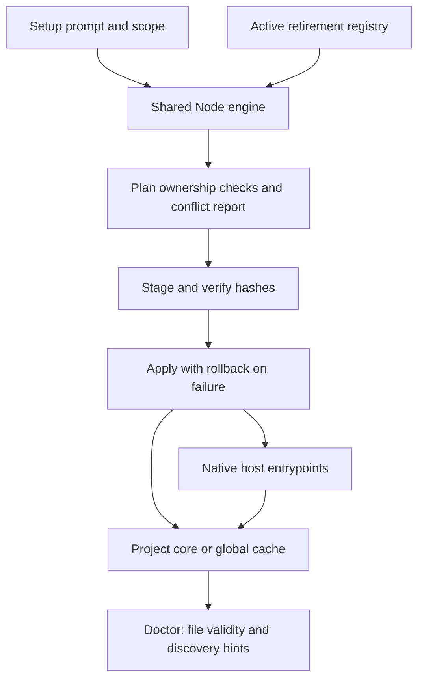

# Setup Super Compound

## Summary

Install or update one canonical framework with native adapters for Codex, Claude Code, Antigravity, Cursor, Windsurf/Cascade, and Gemini CLI. Choose project, global, or both. Setup preserves existing configuration and user edits, reports conflicts together, and verifies the installation. Node 22+ is required on Windows, macOS, and Linux; Python is needed only for Python-based features such as interface search.

## Overview

Paste this prompt into your AI host:

> Setup Super Compound untuk workspace ini dari repository aultramen/super-compound. Baca SETUP.md, deteksi OS dan host AI, tanyakan cakupan project/global/keduanya, pertahankan konfigurasi saya, pasang adapter yang relevan, dan jalankan doctor. Gunakan persetujuan per tahap, izin eksekusi terpisah, serta Documentation Output Standard.

The agent reads this file from a local checkout. If none exists, clone `https://github.com/aultramen/super-compound.git` into a new directory without replacing an existing checkout. Inspect existing host and project configuration. Ask only for missing scope or an ambiguous host choice. Directory detection is a hint; it is not proof the application is installed or active. Run a dry run, apply the authorized installation, then doctor. Do not request another approval merely to install the scope the user already selected.

## High-Level Design



## Commands and Scope

From the checkout, use the same command on all three operating systems:

```text
node .agent/tools/setup.mjs install --scope project --host codex --target "PATH TO PROJECT"
node .agent/tools/setup.mjs install --scope both --host codex,claude,cursor --target "PATH TO PROJECT" --dry-run --json
node .agent/tools/setup.mjs update --scope project --host auto --target "PATH TO PROJECT" --source "PATH TO CHECKOUT"
node .agent/tools/setup.mjs doctor --scope project --host codex --target "PATH TO PROJECT" --json
```

`--scope` is required. `--host auto` uses recognizable configuration directories and environment hints; choose an explicit comma-separated host list if ambiguous or absent. `--target` defaults to the current directory; `--source` defaults to the engine's framework root. `install` and `update` share ownership checks. Exit 0 means success/read-only preview, 1 means conflicts or doctor drift, and 2 means invalid input or execution failure.

| Scope | Result |
| --- | --- |
| project | Canonical `.agent/`, selected adapters, and owned installation manifest in the project |
| global | Cache at `~/.super-compound/framework` plus personal host entrypoints |
| both | Both results in one transaction; project core takes priority in every adapter |

For global activation, invoke `/sc-init setup` inside the project. Read the cached `SETUP.md` and run its engine with `--scope project --source "PATH TO HOME/.super-compound/framework" --target "PATH TO PROJECT"`. Plain `/sc-init` and `/sc-init reload` remain read-only. A cached installation supports offline project activation.

New project configuration sets `conventions.approval_mode: stage`: approve BRD, approve PRD, approve FSD with goals and verification, then authorize execution separately. Existing project configuration and authorization remain intact. Internal corrections, derived boards, and evidence do not create new approval gates. Documentation uses [Documentation Output Standard](.agent/context/output-style.md).

## Native Adapters

| Host | Project entrypoint | Global entrypoint |
| --- | --- | --- |
| Codex | `.agents/skills/super-compound/SKILL.md` and managed AGENTS block | `~/.codex/skills/super-compound/SKILL.md` and managed `~/.codex/AGENTS.md` block |
| Claude Code | `.claude/commands/sc-*.md`, projected `.claude/agents/`, managed CLAUDE block | Same under `~/.claude/` |
| Antigravity IDE | `.agents/skills/sc-*/SKILL.md`; canonical `.agent/` retained | `~/.gemini/antigravity/skills/sc-*/SKILL.md` (supported legacy IDE location) |
| Cursor | `.cursor/skills/sc-*/SKILL.md` and `.cursor/rules/super-compound.mdc` | `~/.cursor/skills/sc-*/SKILL.md`; project rules activate at project setup |
| Windsurf/Cascade | `.windsurf/workflows/sc-*.md` and managed rule block | `~/.codeium/windsurf/global_workflows/` and managed global rule block |
| Gemini CLI | `.gemini/commands/sc-*.toml` and managed `GEMINI.md` block | `~/.gemini/commands/` and managed `~/.gemini/GEMINI.md` block |

Public workflows remain 18. Adapters load compact contracts first and full detail on demand. Hosts without subagents run the same checks sequentially in-thread. Host trust restrictions or enterprise policies may affect discovery; file validity cannot prove live invocation.

## Ownership, Updates, and Recovery

The `.super-compound/manifest.json` records owner, content hashes, selected hosts, and source digest. Existing project config is preserved. Shared instruction files receive delimited managed blocks; text outside those blocks is preserved. Edited managed files/blocks and unowned collisions appear in one conflict report before any application. Review the current and proposed versions, merge needed changes, and rerun; setup does not silently overwrite them. Unowned files remain untouched. Retired files are removed only if their contents still match recorded ownership.

Updates stage all changes, verify their hashes, then apply and verify each write. Recoverable partial failures restore previous bytes and remove newly created files/directories. Abrupt process termination is not guaranteed to roll back; run doctor and inspect the manifest before retrying. Incomplete rollback reports its failures for manual recovery. `doctor` and `--dry-run` never write, including when the target is missing. Symlink/reparse-point paths are rejected.

The legacy `.codex/install-super-compound.ps1` (`-CodexHome`, `-VerifyOnly`, `-DryRun`) and `.sh` (`--codex-home`, `--verify-only`, `--dry-run`) call the same engine and preserve the standalone `<codex-home>/skills/super-compound` bundle layout. User modifications are now reported as conflicts instead of being overwritten. The regular global command uses the standard home paths; use the legacy wrapper for a custom `CODEX_HOME`. Test isolation can override the engine home using `SUPER_COMPOUND_HOME`.

## Doctor and Troubleshooting

After doctor succeeds, run `/sc-init` in the selected host. Confirm it reports
the project context and verification commands, then try one small task such as
`/sc-debug Email kosong lolos validasi login`. The expected return is a focused
fix, actual check results, and one next action. The [Quick Start](README.md#quick-start)
also covers small changes, new features, and resume. Keep full lifecycle details
for work that needs them.

| Observation | Action |
| --- | --- |
| No host detected | Pass `--host` explicitly; directory absence does not establish application absence |
| Conflict | Review all reported paths, preserve user content, resolve the specific ownership collision, rerun preview |
| Drift or missing files | Run update from the intended source; modified files require reconciliation |
| Adapter not visible | Reload/restart the host, inspect trust/policy and the native discovery location |
| Valid files, no live evidence | Invoke `/sc-init` in that host and record observed result; do not infer live support from doctor |
| Python unavailable | Node setup still works; install Python before using interface-search/Python checks |
| Symlink/reparse-point refusal | Choose a real directory and inspect existing links before retrying |

Doctor reports `filesValid`, `detected`, and `liveTested` separately; `liveTested` stays false because setup never drives host sessions. CI exercises installation on Windows/macOS/Linux. Live host usage and the five-pair behavior pilot require separate observed evidence; no productivity savings are claimed from structural checks.

## References

Native formats are based on [Cursor skills](https://cursor.com/docs/skills), [Claude commands/skills](https://code.claude.com/docs/en/slash-commands), [Antigravity skill locations](https://antigravity.google/docs/skills), [Windsurf workflows](https://docs.windsurf.com/windsurf/cascade/workflows), and [Gemini custom commands](https://geminicli.com/docs/cli/custom-commands/). See [README](README.md) and [walkthrough](WALKTHROUGH.md) for the development lifecycle.
