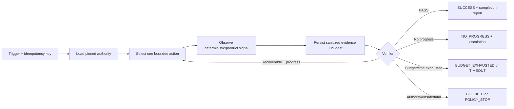
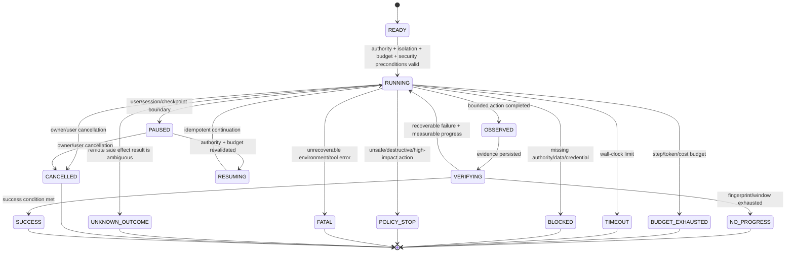

# Audit Loop Engineering pada Super Compound

**Tanggal audit:** 2026-07-16 (Asia/Jakarta)  
**Mode:** audit read-only; tidak ada perubahan logic, workflow, skill, hook, atau tool  
**Target:** framework `super-compound/` pada branch `feature/ui-aware-delivery`, HEAD `454089a`  
**Attachment utama:** `C:/Users/aul/Documents/Codex/2026-07-16/ambi/outputs/loop-engineering-artikel.md`  
**Integritas attachment:** 1.251 baris, 59.395 byte, SHA-256 `AF3D3A2FE7F5ED547B3DDDC4B377A185380B010E2A876B5CFB0E59AD2D30E3B9`  
**Verdict ringkas:** **MATURE AS A GOVERNED DELIVERY LIFECYCLE; INCOMPLETE AS A MACHINE-ENFORCED LOOP RUNTIME**  
**Confidence:** tinggi untuk gap statis/kontrak; sedang untuk perilaku runtime karena repository belum memiliki paired production traces.

## 1. Executive Summary

Super Compound sudah mempunyai fondasi Loop Engineering yang kuat pada level
governance:

- lifecycle otoritatif `BRD -> PRD -> FSD -> GOAL -> IMPLEMENTATION -> VERIFICATION`;
- goal yang bounded, dependency gate, `OPEN-*` fail-closed, dan FSD sebagai
  implementation authority;
- inner feedback loops yang baik untuk TDD, debugging, plan revision, gap
  closure, eval, review, dan integration checking;
- isolated worktree dan single-writer rules untuk parallel execution;
- durable project state, selective context loading, compaction support, serta
  verified-only knowledge compounding;
- deterministic evidence sebelum completion claim.

Namun, routing publik saat ini memetakan intent “loop execution” ke `/sc-work`
(`README.md:211`, `WALKTHROUGH.md:585`), sementara `/sc-work` masih merupakan
prosedur eksekusi satu goal—belum menjadi runtime controller yang:

1. mempunyai machine-readable run envelope;
2. memberlakukan iteration, time, token, dan optional cost budget;
3. mendeteksi no-progress berdasarkan evidence, bukan hanya menghitung retry;
4. menyimpan exact iteration state dan dapat resume secara idempotent;
5. menghasilkan typed exit reason dan kembali ke verifier asal;
6. memisahkan maker/checker secara risk-aware;
7. menghubungkan eval artifact ke work/review/release gate;
8. mengukur convergence, retry efficiency, dan cost per accepted outcome.

Dengan kata lain, Super Compound telah mempunyai **loop-shaped processes**, tetapi
belum mempunyai satu **shared loop control plane**. Gap ini tidak memerlukan route
publik baru. Desain paling konsisten adalah mempertahankan 17 workflow publik dan
menambahkan internal **Loop Run Contract** yang dipakai oleh `/sc-work`,
`/sc-debug`, `/sc-eval`, `/sc-review`, `/sc-pause`, `/sc-status`, dan
`/sc-launch`.

### Prioritas tertinggi

| ID | Temuan | Dampak | Prioritas |
|---|---|---|---|
| LE-01 | Tidak ada shared Loop Run Contract atau state machine runtime | Retry, budget, resume, dan exit bergantung pada prose/host | P0 |
| LE-02 | Termination caps tersebar; tidak ada no-progress fingerprint atau execution budget | Thrashing dan biaya tidak bounded secara machine-enforced | P0 |
| LE-03 | Work-package dapat langsung diubah dari `ready` ke `verified` dengan evidence bebas/kosong | Integrity state `verified` dapat dilompati | P0 |
| LE-04 | Durable eval dideklarasikan sebagai downstream gate, tetapi consumer tidak memuatnya | Approval bisa terjadi tanpa eval yang diklaim wajib | P0 |
| LE-05 | Version/digest pinning kuat untuk UI contract, belum generik untuk seluruh FSD goal | Goal dapat berjalan dengan authority yang telah berubah | P0 |
| LE-06 | Durable project state belum menjadi per-run control plane | Resume/compaction dapat kehilangan exact cycle position | P1 |
| LE-07 | Remediation tidak wajib kembali ke original verifier | Finding dapat ditutup oleh self-report fix | P1 |
| LE-08 | Verifier independence dan anti-reward-hacking belum risk-aware | High-risk/unattended output dapat menilai dirinya sendiri | P1 |
| LE-09 | Runtime telemetry tidak mengukur convergence/outcome | Cost, retry efficiency, dan no-progress tidak terlihat | P1 |
| LE-10 | Unattended isolation, security boundary, dan global parallel budget belum complete | Worktree saja tidak membatasi egress, credentials, atau external side effects | P1 |
| LE-11 | Compact-contract conformance assurance dan hook semantics masih parsial | Risiko drift/overclaim lintas loading path dan host | P2 |
| LE-12 | GeniusLoop belum mempunyai downstream outcome feedback | Continuous improvement tetap open-loop | P2 |
| LE-13 | Automation semantics belum portable atau side-effect-safe | Recurring triggers berisiko duplicate/race/unsafe action | P2 capability; P1 prerequisite controls |
| LE-14 | Historical loop claims tidak sesuai active surface | Pembaca dapat mengira `/loop` masih implemented | P2 |
| LE-15 | Human comprehension gate belum risk-tiered | Green tests belum membuktikan owner memahami risk/rollback | P1 |

`P0` di laporan ini berarti gap integritas framework yang perlu ditutup sebelum
menjanjikan unattended/autonomous loop; bukan klaim bahwa repository saat ini
sedang mengalami insiden produksi.

## 2. Scope dan Metode

### 2.1 Prinsip audit

Audit ini:

- membaca attachment lengkap secara berurutan, bukan hanya search snippets;
- mengekstrak seluruh URL dan memisahkan sumber primer, official product docs,
  vendor explainer, serta commercial CTA;
- membandingkan claim attachment dengan framework aktif, compact contracts,
  runtime tools, tests, hooks, templates, public docs, dan historical archive;
- menilai bukan hanya keberadaan prose, tetapi juga apakah control tersebut
  machine-enforced, persisted, tested, dan runtime-observable;
- tidak mengimplementasikan remediation.

### 2.2 Korpus repository

Korpus utama yang diperiksa:

- semua 17 workflow aktif di `.agent/workflows/sc-*.md`;
- semua workflow compact contracts di `.agent/context/workflows/*.contract.md`
  serta compact skill contracts yang terkait execution, verification, planning,
  risk, dan Git delivery;
- `workflow-dispatch.md`, `routing-index.md`, `workflow-invariants.json`,
  `token-budget-gates.md`, dan `output-budgets.json`;
- skills dan references: `agentic-delivery`, `writing-plans`,
  `executing-plans`, `test-driven-development`, `systematic-debugging`,
  `verification-before-completion`, `eval-harness`, `gap-closure`,
  `code-review`, `integration-checking`, `subagent-orchestration`,
  `parallel-execution`, `plan-verification`, `issue-workflow`,
  `triage-workflow`, `state-management`, `context-engineering`,
  `checkpoint-protocol`, `knowledge-compounding`, `brainstorming`,
  `codebase-design`, dan `domain-modeling`;
- `.agent/agents/brain.md`;
- FSD dan issue-pointer templates;
- `work-package.mjs`, `transcript-usage.mjs`, `evidence-matrix.mjs`,
  `token-benchmark.mjs`, `framework-audit.mjs`, dan tests terkait;
- `.agent/hooks/` beserta tests dan dokumentasinya;
- `README.md`, `WALKTHROUGH.md`, `SUPER-COMPOUND.md`, token-efficiency audit,
  framework-sync solution, benchmark artifacts, dan archive gap analysis.

Existing framework audit mencatat 321/321 active framework files accounted.
Angka ini dipakai sebagai evidence inventory repository, bukan sebagai bukti
bahwa seluruh kemungkinan runtime trajectory telah diuji.

### 2.3 Batasan

- Audit bersifat static + targeted test verification. Tidak ada production
  workload atau autonomous multi-hour run yang dijalankan.
- `observedRuntimeTokens`, latency, provider billing, dan generated output tetap
  tidak dapat disimpulkan tanpa attributable paired traces.
- External product behavior diverifikasi pada 2026-07-16. Fitur vendor dapat
  berubah setelah tanggal tersebut.
- Attachment mengandung opini, contoh konfigurasi, dan promosi; semuanya tidak
  diperlakukan sebagai requirement normatif tanpa corroboration.

## 3. Pembacaan Penuh Attachment

### 3.1 Peta isi

| Baris | Konteks yang dibaca | Implikasi audit |
|---:|---|---|
| 1–67 | Definisi one-shot vs loop; narasi asal; verification dan termination | Loop hanya layak jika ada observable feedback dan definition of done |
| 68–195 | Evolusi prompt → context → harness → loop; alasan momentum 2026 | Context besar membantu, tetapi bukan pengganti state, pruning, dan control |
| 196–381 | Bagian “7 komponen”; automation/worktree/skills/connectors/subagents; verification/termination | Taxonomy attachment tercampur dan perlu dinormalisasi |
| 382–576 | Test, compiler, runtime, product/UI, dan review loop | Goal perlu mendeklarasikan feedback type dan verifier yang sesuai |
| 577–737 | Cursor Agent, rules, Background Agents, Automations | Host adapters berguna, tetapi mempunyai isolation/security constraints |
| 738–889 | Claude `/goal`, auto mode, subagents, context files, cloud agents | Fresh evaluator berguna, tetapi tidak otomatis menjadi external verifier |
| 890–1.077 | Cost, comprehension debt, critique, infinite loop, adoption ladder | Budget, no-progress, risk tier, dan human ownership harus first-class |
| 1.078–1.251 | Adoption plan, decision tree, role shift, BWA CTA, URL list | Praktik adopsi harus dipisahkan dari marketing dan unsupported metrics |

### 3.2 Prinsip valid yang dibawa attachment

Prinsip yang didukung dan relevan untuk Super Compound:

- loop harus mempunyai measurable goal, bounded scope, observable feedback,
  verification, stopping conditions, dan escalation;
- feedback signal berbeda untuk test, compiler, runtime, product/UI, dan review;
- deterministic verifier lebih kuat dan lebih murah daripada model judge jika
  outcome dapat diperiksa secara mekanis;
- perubahan per iteration harus kecil, evidence-based, reversible, dan
  mempertahankan authority;
- worktree adalah isolation boundary untuk run/worker independen;
- operational state harus bertahan di luar conversation;
- parallelism harus bounded oleh independence, dependency, budget, dan
  integration/review capacity;
- human tetap memiliki intent, architecture, risk tolerance, dan final
  acceptance untuk keputusan yang tidak deterministic;
- verified knowledge boleh dikompound, tetapi self-modifying operating
  instructions tidak boleh otomatis.

### 3.3 Koreksi taxonomy material

Attachment mengatribusikan “framework/komponen Addy Osmani” secara langsung pada
baris 192, 196, dan 198; taxonomy tujuh tahap berulang pada baris 38, 200, 369,
dan 1.174 tanpa selalu mengulang nama Addy.
Esai primer [Addy Osmani, *Loop Engineering*](https://addyosmani.com/blog/loop-engineering/)
sebenarnya membahas lima execution primitives—automations, worktrees, skills,
plugins/connectors, dan sub-agents—ditambah durable external state/memory.

Attachment kemudian mencampur:

1. tahapan control loop: trigger, context, action, observation, reasoning,
   verification, termination; dan
2. execution substrate: automation, worktree, skills, connectors, subagents.

Model audit yang lebih koheren memisahkan empat lapisan:

| Lapisan | Elemen |
|---|---|
| Lifecycle/control plane | trigger → discover/triage → plan → act → observe → decide → verify → stop/escalate |
| Execution substrate | tools, worktrees, skills, connectors, subagents |
| Durable state | authority pointers, attempts, evidence, decisions, budget, next action |
| Safeguards | permissions, isolation, deterministic checks, budgets, termination, human gates |

Tujuh tahap boleh dipakai sebagai sintesis control loop, tetapi tidak boleh
diatribusikan sebagai framework tujuh komponen Addy.

## 4. Validasi URL dan Kualitas Sumber

### 4.1 Seluruh URL unik pada attachment

Terdapat 11 kemunculan link-like text yang menjadi delapan URL unik setelah
normalisasi.

| URL | Baris attachment | Status 2026-07-16 | Klasifikasi dan penggunaan |
|---|---:|---|---|
| [Addy Osmani](https://addyosmani.com/blog/loop-engineering/) | 1.087, 1.214 | Live, HTTP 200 | Sumber primer untuk framing Addy; tanggal halaman 7 Juni 2026 |
| [Kilo guide](https://kilo.ai/articles/what-is-loop-engineering) | 1.215 | Live, HTTP 200 | Vendor explainer; berguna untuk praktik, bukan standard |
| [Tosea guide](https://tosea.ai/blog/loop-engineering-ai-agents-complete-guide-2026) | 1.216 | Live, HTTP 200 | Vendor/secondary guide; angka contoh bukan default universal |
| [Louis Bouchard](https://www.louisbouchard.ai/loop-engineering/) | 1.217 | Live, HTTP 200 | Secondary explainer; menguatkan five pieces + memory |
| [BWA Coding](https://buildwithangga.com/belajar/coding) | 1.165, 1.189, 1.218 | Web-readable; raw automated request terkena WAF 403 | Commercial catalog, bukan technical evidence |
| [BWA Free Courses](https://buildwithangga.com/belajar/free-courses) | 1.194 | Web-readable; raw request WAF 403 | Commercial catalog; blanket claims tidak seluruhnya terlihat |
| [BWA Freelancer](https://buildwithangga.com/belajar/freelancer) | 1.199 | Web-readable; raw request WAF 403 | Commercial page; tidak membuktikan productivity claim |
| [BWA Handbook](https://buildwithangga.com/handbook) | 1.204 | Web-readable; raw request WAF 403 | Career material; tidak membuktikan “loop engineer” sebagai established role |

Tidak ditemukan link mati atau paywall. WAF 403 pada raw requests BWA tidak
berarti halaman mati; namun empat halaman tersebut tetap tidak layak menjadi
evidence teknis untuk desain framework.

### 4.2 Sumber official tambahan untuk fact-check

| Topik | Sumber | Kesimpulan audit |
|---|---|---|
| Reason/action/observation | [ReAct paper](https://arxiv.org/abs/2210.03629) | Mendukung iterative action-observation pattern, bukan runtime governance lengkap |
| Agent design | [Anthropic: Building Effective Agents](https://www.anthropic.com/engineering/building-effective-agents) | Pilih solusi sederhana; gunakan environmental ground truth, stop conditions, sandbox, dan human review |
| Claude evaluator | [Claude Code `/goal`](https://code.claude.com/docs/en/goal) | Fresh evaluator berjalan setelah turn, tetapi hanya membaca transcript dan tidak menjalankan tools/files |
| Claude worktrees | [Claude Code worktrees](https://code.claude.com/docs/en/worktrees) | Worktree adalah boundary per session/run/worker, bukan per iteration |
| Long-running agents | [Anthropic Fable](https://www.anthropic.com/claude/fable) | Mendukung long-running work, self-testing, dan vision-based checking dengan batasan platform |
| Current Fable state | [Anthropic redeployment](https://www.anthropic.com/news/redeploying-fable-5) | Akses yang sempat disuspensi dipulihkan 1 Juli 2026 |
| Claude auto mode | [Claude permission modes](https://code.claude.com/docs/en/permission-modes) | Memakai classifier dan protected paths; mempunyai eligibility/fallback/risk constraints dan bukan pengganti review |
| Claude cloud routines | [Claude routines](https://code.claude.com/docs/en/routines) | Scheduled/API/event execution ada pada host, tetapi masih research preview dan tetap memerlukan framework-level scope/result routing |
| Cursor rules | [Cursor Rules](https://cursor.com/docs/rules) | `.cursorrules` legacy; gunakan current rules/`AGENTS.md` |
| Cursor background risk | [Cursor Cloud Agent security](https://cursor.com/docs/cloud-agent/security-network) | Remote execution, network/repository access, retention, dan injection/exfiltration risk perlu threat boundary |
| Cursor automation | [Cursor Automations](https://cursor.com/docs/cloud-agent/automations) | Schedule/event triggers dan cloud sandbox mendukung automation, bukan otomatis menjamin safe convergence |
| OpenAI automation | [ChatGPT scheduled tasks](https://learn.chatgpt.com/docs/automations?surface=app) | Trigger/scheduled work perlu scope, isolation, security, dan result routing |
| OpenAI skills/subagents | [Skills](https://learn.chatgpt.com/docs/build-skills), [Subagents](https://learn.chatgpt.com/docs/agent-configuration/subagents) | **Inference audit:** execution primitives ini sebaiknya tunduk pada shared authority dan verification contract |

### 4.3 Claim yang perlu dikoreksi atau dikualifikasi

- Halaman Addy bertanggal **7 Juni 2026**, bukan 8 Juni.
- “Five primitives plus memory” bukan “seven Addy components”.
- Context window besar tidak berarti seluruh project selalu muat atau harus
  dimuat ulang pada setiap cycle.
- Worktree tidak dibuat per iteration; gunakan satu worktree per isolated
  run/worker dan pertahankan selama goal yang sama.
- `.cursorrules` sudah legacy/deprecated.
- `VISION.md` tidak otomatis menjadi Claude Code authority tanpa import/reference.
- Fable 5 sempat disuspensi, tetapi status current harus menyebut redeployment
  1 Juli 2026.
- Claude `/goal` memberi evaluator terpisah pada level model invocation, tetapi
  evaluator transcript-only bukan pengganti deterministic test, file inspection,
  atau independent human/tool-enabled reviewer.
- Angka “cost turun 10–100x”, “loop selalu 10–100x lebih mahal”, “3 parallel
  loops = 3x throughput”, “2–5 vs 20–30 menit”, dan view/post counts pada
  attachment tidak mempunyai evidence memadai dari URL yang dilampirkan. Jangan
  jadikan angka tersebut default atau KPI.
- “87 iterations” adalah skenario retoris tentang manual re-prompting—human as
  the loop—bukan autonomous runaway loop atau metric empiris; attachment justru
  memakainya sebagai contoh ketiadaan Loop Engineering.
- Contoh `MAX_ITER=20`, budget `$5`, atau timeout `2h` adalah contoh konfigurasi,
  bukan baseline aman universal.
- “All five stop conditions, always” terlalu absolut. Framework juga perlu
  terminal exit untuk fatal error, unsafe/destructive action, missing
  credentials/data, unrelated user changes, authority conflict, dan product
  judgment.
- Kritik tentang self-improving memory harus dibedakan dari verification loop.
  Super Compound benar untuk mempertahankan human-approved, verified-only
  compounding.

## 5. Model Loop yang Dipakai Audit

Loop yang sehat bukan sekadar “ulangi prompt sampai selesai”. Model target:



Setiap goal tidak harus autonomous. Profile yang tepat bergantung pada
determinism, risk, dan blast radius:

| Profile | Contoh | Verifier minimum | Human role |
|---|---|---|---|
| Interactive | eksplorasi, subjective design | explicit review criteria | aktif pada setiap decision |
| Bounded | test/compiler/debug loop | deterministic checks + final verification | approve authority dan residual risk |
| Background | isolated maintenance goal | deterministic checks + independent final checker | approve merge/release |
| High-risk | auth, payment, migration, privacy | composite deterministic + independent + human | mandatory comprehension/acceptance |

## 6. Current-State Loop Architecture

### 6.1 Outer lifecycle

`/sc-launch` menyusun lifecycle dari framing hingga review/audit
(`.agent/workflows/sc-launch.md:11-28`) dan hanya mengaktifkan satu stage pada
satu waktu (`:30-35`). Ini baik untuk authority discipline, tetapi lifecycle
belum mendefinisikan closed transition:

`finding → remediation owner → original verifier → canonical terminal run state`.

`/sc-review` dan `/sc-audit` read-only serta meroute remediation
(`sc-review.md:24-30`, `sc-audit.md:32-38`), tetapi tidak membawa mandatory
`return_gate` atau `original_verifier`.

### 6.2 Inner loops

| Loop aktif | Current behavior | Kekuatan | Gap |
|---|---|---|---|
| `/sc-work` | Satu approved goal; dependency/authority checks; task verification setelah meaningful change | Scope dan evidence discipline kuat | Tidak ada runtime envelope/state machine |
| TDD | RED → GREEN → refactor dengan evidence | Deterministic and small-step | Attempt/budget tidak dipersistenkan |
| `/sc-debug` | reproduce → evidence → hypothesis → fix → regression | Root-cause first; architecture stop setelah tiga kegagalan | Failure fingerprint tidak shared/persisted |
| `/sc-eval` | independent attempts; pass@1/pass@3/pass^3 | Metric discipline baik | Artifact consumer wiring belum ada |
| plan verification | 10 dimensions; targeted revisions | Strong readiness gate | Cap tiga masih prose/local |
| gap closure | re-run original verification; maksimum dua tambahan | Original oracle dipertahankan | Route/re-entry tidak konsisten |
| subagent review | SPEC lalu QUALITY; dua revision cycles | Fresh checker dan isolated scope | Ledger dapat bypass verdict |
| `/sc-geniusloop` | ≥10 ideas → Brain filters → 1–2 routes | Safe/read-only ideation | Tidak mempunyai outcome feedback loop |
| `/sc-compound` | verified, deduped, human-owned knowledge capture | Aman dari self-modification | Belum mengonsumsi run retrospective otomatis sebagai candidate |

### 6.3 Kekuatan yang harus dipertahankan

1. **Authority-first delivery.** FSD, accepted TDEC/ADR, qualified refs, dan
   `OPEN-*` stop behavior mengurangi invention.
2. **First-slice proof.** Scale-out menunggu real vertical slice dan verified
   dependencies.
3. **Deterministic-first engineering.** TDD, debugging, integration checking,
   dan verification-before-completion memberi feedback yang nyata.
4. **Parallel safety.** Semantic/file independence, isolated worktree,
   single-writer boundaries, scheduler-owned scope, dan merged-system
   verification sudah lebih matang daripada pola “spawn many agents”.
5. **Context discipline.** Selective loading dan durable state lebih tepat
   daripada reload seluruh project setiap cycle.
6. **Read-only review/audit/ideation.** Ini menjaga authorization boundary.
7. **Verified-only compounding.** Tidak ada automatic self-edit terhadap
   `AGENTS.md`, `CLAUDE.md`, rules, atau skills.
8. **Honest static evidence.** Token audit menyatakan runtime/cost/latency masih
   unknown (`docs/audits/2026-07-11-super-compound-token-efficiency.md:189-196`).

## 7. Detailed Gap Analysis

### LE-01 — Shared Loop Run Contract tidak ada

**Evidence**

- Public routing menyatakan `loop, handoff, parallel execution -> /sc-work`
  (`README.md:211`) dan `loop execution, handoff, swarm work -> /sc-work`
  (`WALKTHROUGH.md:585`).
- `/sc-work` memeriksa authority dan menjalankan verification
  (`.agent/workflows/sc-work.md:12-47`), tetapi tidak mempunyai fields untuk
  run ID, iteration, elapsed time, budget, no-progress, exit reason, atau resume.
- FSD goal packet mempunyai scope, dependency, verification, dan stop conditions
  (`FSD-Agentic-AI-Ready-Template.md:2076-2179`), tetapi tidak mempunyai loop
  profile/control envelope.

**Gap**

Prosedur eksekusi ada, controller tidak ada. Host atau agent harus mengingat
sendiri posisi cycle dan kapan berhenti.

**Risk**

Perilaku berbeda antarhost, retry tidak auditable, resume dapat mengulang action,
dan completion claim tidak mempunyai normalized run outcome.

**Recommendation**

Tambahkan shared internal `LoopRun` schema, bukan workflow publik baru. Schema
harus direferensikan oleh FSD goal, issue pointer, `/sc-work`, `/sc-debug`,
`/sc-eval`, `/sc-pause`, `/sc-status`, `/sc-review`, dan `/sc-launch`.

**Acceptance evidence**

- Schema versioned dan divalidasi.
- Setiap bounded/background run mempunyai immutable `run_id`.
- Setiap transition diuji.
- Resume tidak mengulang completed action.
- Semua terminal state mempunyai reason dan evidence pointer.

### LE-02 — Termination, budget, dan convergence tersebar

**Evidence**

- Work verification revision maksimum tiga
  (`executing-plans/references/parallel-revision-and-handoff.md:22-29`).
- Plan revision maksimum tiga (`plan-verification/SKILL.md:43-44`).
- Debugging berhenti setelah tiga failed fix attempts
  (`systematic-debugging/references/advanced-techniques.md:36-38`).
- Subagent review escalate setelah dua revision cycles
  (`subagent-orchestration/references/review-contract.md:54-56`).
- Gap closure maksimum dua additional iterations
  (`gap-closure/SKILL.md:31-34`).
- `token-budget-gates.md:33-40` menjelaskan cap hanya untuk chat return dan
  runtime usage tetap unknown.

**Gap**

Caps tidak memakai satu semantic model, tidak persisted, dan tidak
memperhitungkan repeated failure fingerprint. Static context/output budget sering
mudah disalahartikan sebagai execution budget.

**Risk**

Agent dapat mengganti patch berulang tanpa requirement coverage membaik, atau
berhenti hanya karena counter lokal tanpa handoff yang resumable.

**Recommendation**

Definisikan per-profile:

- `max_steps`;
- `max_wall_time`;
- `max_tokens` bila host menyediakan usage;
- `max_cost` hanya jika attributable provider data tersedia;
- `max_subagents` dan global fan-out budget;
- `no_progress_window`;
- `cooldown/backoff` untuk remote retries;
- `escalation_owner`;
- typed terminal reason.

No-progress fingerprint minimal:

`verifier command + exit code + normalized failures + relevant diff digest +
requirement-coverage delta + repeated approach ID`.

Jangan menyimpan chain-of-thought; simpan action, observation, hypothesis label,
evidence, dan decision outcome yang dapat diaudit.

### LE-03 — Integrity state `verified` dapat dilompati

**Evidence**

- `work-package.mjs:22-29` mendefinisikan statuses.
- `recordWorkPackageResult()` hanya memeriksa membership, lalu overwrite status
  (`work-package.mjs:383-411`).
- Verification kosong menjadi `"not reported"` (`:408`).
- Test secara eksplisit mengubah paket baru langsung menjadi `verified`
  (`work-package.test.mjs:229-260`) dan tidak menguji invalid transition.

**Gap**

Prose pada `subagent-orchestration` mewajibkan SPEC PASS, QUALITY PASS, pinned
contract, dan integration evidence, tetapi CLI ledger tidak menegakkannya.

**Risk**

Downstream dependency dapat terbuka berdasarkan label yang tidak membuktikan
review atau fresh verification.

**Recommendation**

- Enforce transition graph:
  `ready → in-progress → implemented → verified`;
- `blocked`/`failed` mempunyai controlled resume transition;
- gunakan compare-and-swap ledger version dan immutable event log;
- semua `verified` wajib mempunyai nonempty fresh evidence, timestamp, evidence
  digest, base/artifact revision, dan integration evidence jika applicable;
- SPEC verdict, QUALITY verdict, serta independent reviewer identity/type wajib
  untuk delegated parallel, background, high-risk, atau profile yang memang
  mendeklarasikan independent review; low-risk deterministic work boleh memakai
  deterministic final gate tanpa reviewer terpisah;
- reject stale review package dan authority digest.

### LE-04 — Eval producer/consumer contract belum wired

**Evidence**

- `eval-harness/SKILL.md:38` menyatakan verification dan code review mengonsumsi
  active evals di `.agent/evals/`.
- `/sc-eval` mewajibkan durable artifact jika downstream gate mengonsumsinya
  (`sc-eval.md:25-27`).
- Search pada `/sc-work`, `/sc-review`, `/sc-go`, dan
  `verification-before-completion` tidak menemukan mandatory load/consume
  `.agent/evals`.
- Existing contract test memeriksa producer text, bukan actual consumer gate.

**Gap**

Framework mempunyai eval methodology yang kuat, tetapi durable eval dapat
menjadi orphan artifact.

**Risk**

Release dapat disebut verified tanpa menjalankan capability/regression grader
yang sudah didefinisikan sebagai gate.

**Recommendation**

- FSD goal menyatakan `eval_refs` dan `eval_required`;
- `/sc-work` memuat grader definition sebelum action;
- verification menyimpan machine-readable result;
- `/sc-review` mengaudit attempt independence dan flaky/disagreement;
- `/sc-go commit/push/pr` menolak unresolved required eval;
- human gate tetap wajib untuk legal, security, atau subjective UX sesuai risk.

### LE-05 — Generic authority freshness belum pinned

**Evidence**

- Issue pointer hanya memberi generic `FSD-*#IDs`
  (`Issue-Pointer-Skeleton.md:4-10`).
- UI contract refs sudah versioned
  (`Issue-Pointer-Skeleton.md:11-12`).
- Compact FSD skeleton tidak mencantumkan generic FSD version
  (`FSD-Skeleton.md:7-13`), walau full template memilikinya.
- `scopeDigest` pada work package adalah digest path allowlist
  (`work-package.mjs:57-58,90-98`), bukan digest authority content.

**Gap**

UI delivery mendapat stale-contract protection yang lebih kuat daripada generic
backend/domain/integration goal.

**Risk**

FSD, upstream authority, accepted ADR, atau base commit dapat berubah setelah
issue menjadi ready tanpa invalidating run.

**Recommendation**

Pin semua goal ke:

- FSD version + content digest;
- relevant BRD/PRD versions;
- accepted TDEC/ADR refs + revision;
- base commit SHA;
- verifier/eval definition digest.

Re-hash pada create, start, resume, review, dan record. Mismatch harus menjadi
`BLOCKED_STALE_AUTHORITY` dan kembali ke `/sc-plan`, bukan silently continue.

### LE-06 — Durable project state belum menjadi run control plane

**Evidence**

- `STATE.md` menyimpan current position, task, next action, decisions, blockers,
  dan branch (`state-management/references/file-contracts.md:17-40`).
- `/sc-status` membaca state/progress/issue metadata/Git
  (`sc-status.md:11-18`), tetapi tidak menginventaris run ledger, eval, debug,
  review/audit finding, todo, atau Genius outcome.
- `pre-compact.js:41-61` menulis compaction marker dan reload instruction, bukan
  exact iteration snapshot.

**Gap**

State project kuat, operational state per loop belum ada.

**Recommendation**

Tambahkan pointer singkat `Active Loop Run` pada `STATE.md`, sementara append-only
operational log berada di ignored
`.scratch/loop-runs/<run-id>/events.jsonl` dan current snapshot di `state.json`.
State minimal: iteration, last action/observation, failure fingerprint,
verification delta, spent/remaining budget, pending decision, authority digest,
and terminal reason. `/sc-pause` harus menulis boundary ini secara atomic.

### LE-07 — Remediation tidak wajib kembali ke oracle asal

**Evidence**

- Review/audit mengirim finding ke owner, tetapi tidak menyimpan `return_gate`.
- Gap closure sendiri mensyaratkan re-run original verification
  (`gap-closure/SKILL.md:30-32`).
- `/sc-launch` bergerak linear ke review/audit tanpa transition remediation →
  re-review.

**Gap**

Human menjadi outer-loop scheduler. Finding dapat dianggap selesai setelah fix
tanpa oracle yang pertama kali menemukan gap dijalankan ulang.

**Recommendation**

Setiap finding actionable membawa:

- `source_finding_id`;
- `source_run_id`;
- `remediation_owner`;
- `original_verifier`;
- `return_gate`;
- `max_closure_cycles`;
- `closure_outcome`.

Verifier `PASS` hanya menutup run sebagai `SUCCESS`; hasil lain harus menjadi
canonical `BLOCKED`, `NO_PROGRESS`, `BUDGET_EXHAUSTED`, `TIMEOUT`,
`POLICY_STOP`, `FATAL`, atau `UNKNOWN_OUTCOME`, bukan “fixed” dari self-report.

### LE-08 — Verifier independence dan reward-hacking defense belum risk-aware

**Evidence**

- Delegated packages mempunyai fresh SPEC/QUALITY reviewer.
- Local `/sc-work` tidak mewajibkan distinct reviewer setelah deterministic
  checks; ini adalah inference dari workflow contract, bukan explicit
  self-review mechanism.
- FSD melarang weakening/skipping tests secara prose, tetapi runtime tool tidak
  membekukan oracle/acceptance baseline.
- Sebagai pembanding eksternal, [Claude `/goal`](https://code.claude.com/docs/en/goal)
  memakai fresh evaluator yang transcript-only; ia bukan tool-enabled file/test
  verifier.

**Gap**

Self-verification cukup untuk deterministic low-risk iteration, tetapi tidak
untuk subjective, high-risk, atau unattended final acceptance.

**Recommendation**

Gunakan verifier ladder:

1. targeted deterministic check;
2. broader regression/integration;
3. frozen product/spec oracle;
4. independent checker untuk high-risk/unattended/open-ended quality;
5. human acceptance untuk intent, architecture, security/privacy, legal, dan
   subjective UX.

Critical goal harus mendeteksi perubahan terhadap existing acceptance tests,
grader, requirement, dan verification command. Test baru tetap boleh dibuat
melalui TDD; perubahan terhadap frozen baseline memerlukan authority approval.

### LE-09 — Runtime observability belum mengukur convergence

**Evidence**

- Static workflow matrix membuktikan 17×3 contract wiring, bukan runtime path.
- Token audit menyimpan `runtimePass: null` dan menyatakan cost/latency/billing
  unknown.
- `transcript-usage.mjs` mengagregasi token main/subagent, tetapi tidak
  mengaitkan route, goal, iteration, verifier result, duration, cost, atau stop
  reason.

**Gap**

Tidak ada evidence untuk menjawab apakah loop mengurangi rework, berapa retry per
accepted goal, atau kapan parallelism merugikan.

**Recommendation**

Telemetry sanitized per run:

- route, trigger, goal/authority refs, profile;
- start/end/duration;
- attempts dan verifier outcomes;
- normalized failure fingerprint;
- relevant diff/coverage delta;
- tokens/cache/cost jika attributable;
- subagent fan-out dan review queue time;
- terminal reason dan human rework.

KPI yang lebih bermakna: pass@1, accepted outcome rate, median attempts,
no-progress rate, escalation rate, regression rate, cost per accepted outcome,
review time, dan human rework—not anecdotal “3x throughput”.

### LE-10 — Unattended isolation, security boundary, dan global parallel budget belum complete

**Evidence**

- Parallel execution sudah mewajibkan isolated worktrees dan verified
  dependencies.
- Sequential `/sc-work` dapat berjalan in-place.
- Tidak ada global token/time/subagent/reviewer-capacity envelope.
- Worktree mengisolasi file/branch, tetapi bukan permission, credential,
  network-egress, prompt-injection, atau external-side-effect sandbox. Official
  Cursor cloud-agent security guidance menunjukkan remote agents dapat memiliki
  network/repository access sehingga untrusted observations perlu diperlakukan
  sebagai data, bukan instruction.

**Gap**

Long/background run dapat meninggalkan partial edit di workspace utama; parallel
workers dapat melampaui review/integration capacity walau file scope independen.
Untrusted issue/log/web/tool output juga dapat mencoba mengubah instruction atau
mengekstrak code/secrets. Retry terhadap write API dapat menggandakan side effect.

**Recommendation**

- Dedicated worktree wajib untuk background/unattended/high-risk run.
- Satu worktree per run/worker, bukan per iteration.
- Failed run menjadi `QUARANTINED`; jangan auto-delete.
- Global budget mencakup worker count, tokens/time, remote calls, dan reviewer
  capacity.
- Merge tetap deliberate dan harus menjalankan merged-system verification.
- Threat-model trust boundaries sebelum unattended use: tandai provenance dan
  trust class observation, pisahkan instruction dari untrusted data, gunakan
  least-privilege/short-lived credential scopes serta egress allowlist, dan
  redaksi secret sebelum model/tool boundary.
- External state changes wajib memakai idempotency key atau transaction;
  multi-step remote changes memerlukan compensating workflow, audit event, dan
  human checkpoint untuk destructive/production impact.

### LE-11 — Compact-contract conformance assurance dan hook semantics masih parsial

**Evidence**

- Compact contracts adalah first-hop indexes yang secara desain meroute ke full
  workflow/skill ketika detailed procedure diperlukan. Karena itu, detail yang
  tidak diduplikasi di compact file bukan otomatis defect.
- Existing marker tests belum membuktikan bahwa setiap compliant loading path
  benar-benar mencapai full stop/metric/gate semantics saat dibutuhkan.
- `hooks.json:4-16` menjalankan `suggest-compact` hanya pada `Edit|Write`, tetapi
  fallback dideskripsikan sebagai “tool calls”; read-heavy session tidak
  terhitung.
- `session-end` hanya memeriksa keberadaan `STATE.md`.
- `stop-check.js:13-32` memeriksa console log dan sensitive-looking output,
  bukan unresolved goal atau verification evidence.
- Enforcement hooks terutama Claude-specific; host lain manual/reference.

**Gap**

Tidak ditemukan bukti bahwa compliant loading path saat ini pasti kehilangan
invariant; ini adalah conformance-test gap, bukan confirmed control bypass.
Secara terpisah, hook documentation dapat memberi assurance lebih luas daripada
matcher/validation yang benar-benar dijalankan.

**Recommendation**

- Tambah conformance tests yang membuktikan compact route memuat full procedure
  ketika cap, grader gate, dedupe threshold, stage stop, atau final verification
  diperlukan; jangan menduplikasi seluruh full workflow ke compact index.
- Hitung semua relevant tool events atau ubah label menjadi “write calls”.
- Session/end/stop validation harus memeriksa freshness state dan unresolved
  verified goal secara bounded, tanpa memblokir legitimate incomplete work.
- Buat host-neutral loop semantics; adapters boleh berbeda.

### LE-12 — GeniusLoop belum mempunyai outcome feedback

**Evidence**

- `/sc-geniusloop` adalah safe read-only idea generator/filter
  (`sc-geniusloop.md:7-43`).
- Hanya report opsional di `docs/geniusloop/` boleh ditulis (`:59-60`).
- Tidak ada report schema, prior-report read/dedupe, GL-ID → downstream artifact
  link, baseline KPI, experiment result, atau outcome eval.
- Output request (benchmark, ≥10 ideas, matrix, 1–2 recommendations) besar,
  sementara chat return budget 600 estimated tokens/2.400 characters
  (`output-budgets.json:7`); sidecar menjadi praktis perlu tetapi belum
  distandardisasi.

**Gap**

Nama “continuous improvement” belum mempunyai learning closure. Ini tetap lebih
aman daripada self-modifying agent.

**Recommendation**

Pertahankan read-only dan human approval. Tambahkan optional outcome ledger:
`GL-ID`, source signal, prior duplicate check, hypothesis, baseline, expected
metric, route, downstream artifact refs, owner, experiment result, accepted/
rejected reason, and compounding candidate. Jangan auto-edit operating rules.

### LE-13 — Automation semantics belum portable atau side-effect-safe

**Evidence**

- `/sc-status` hanya merekomendasikan GeniusLoop ketika tidak ada ready goal
  issue, active handoff, blocker, atau failing verification (`sc-status.md:18`).
- Tidak ada framework-owned schedule/event/resume trigger contract.
- Current hooks adalah context/session aids, bukan coding loop scheduler.

**Gap**

Host products mempunyai automation capabilities, tetapi framework tidak
mendefinisikan common semantics.

**Recommendation**

Optional adapter contract harus mempunyai trigger provenance, idempotency key,
dedupe, lock/lease, missed-run behavior, expiry, retry/backoff, rate/concurrency
limit, permissions/network scope, worktree policy, budget, result sink,
cancel/resume, dan human review gate. Remote writes juga harus mendeklarasikan
idempotency/transaction boundary, compensating action, audit event, dan
destructive-action approval. Jangan memperluas 17-route public surface.

### LE-14 — Historical loop claims tidak lagi sesuai active surface

**Evidence**

- Archive 2026-06-20 menyebut `agentic-loop`, `optimization-loop`, `/loop`,
  completion promise, caps, dan ledger
  (`docs/archive/2026-06-20-gap-analysis.md:46,52,88-89,114,153`).
- Pada active operational `.agent/workflows` dan runtime contracts—dengan
  mengecualikan docs, audit, dan archive—filename “loop” hanya muncul pada
  `sc-geniusloop` dan contract-nya.
- `git log -S"agentic-loop"` menunjuk commit simplification yang menambahkan/
  mengarsipkan narasi; tidak ada active implementation evidence.
- Public docs kini memetakan intent umum ke `/sc-work`.

**Gap**

Archive dapat dibaca sebagai implemented current capability, padahal active
behavior berbeda.

**Recommendation**

Tandai archive dengan historical/non-current banner dan jelaskan bahwa
`/sc-work` adalah routing primitive, bukan native scheduler atau `/goal`
equivalent. Jika shared controller diimplementasikan, dokumentasikan capability
secara eksplisit tanpa menghidupkan kembali route aliases.

### LE-15 — Human comprehension gate belum risk-tiered

**Evidence**

- Spec/quality review dan UI UAT sudah ada.
- Tidak ada mandatory comprehension signoff umum sebelum commit/PR untuk
  high-risk atau unattended goal.

**Gap**

Green tests tidak memastikan maintainer memahami invariants, failure modes,
security implications, atau rollback.

**Recommendation**

Sebelum `/sc-go commit/push/pr` untuk high-risk/unattended work, minta bounded
human checkpoint yang merangkum: why, authority, architecture/invariants, data
and security impact, tests/evals, residual risk, rollback, dan unresolved
assumptions.

## 8. Workflow-by-Workflow Enhancement Matrix

| Workflow | Current loop role | Enhancement yang direkomendasikan | Priority |
|---|---|---|---|
| `/sc-init` | inventory dan capability bootstrap | Deteksi support host untuk usage, background isolation, hooks, evaluator, dan resume; pilih profile yang benar | P2 |
| `/sc-status` | manual control-plane summary/router | Tampilkan active run ID, iteration, budget, last signal, fingerprint, eval/finding pointers, terminal reason, dan exact next transition | P1 |
| `/sc-geniusloop` | read-only ideation/filter | Tambah prior-report dedupe dan downstream outcome ledger; tetap tidak implement/self-modify | P2 |
| `/sc-explore` | intent/option discovery | Pertahankan human-led untuk vague/subjective scope; hasilkan observable outcome candidate sebelum loopability | Maintain |
| `/sc-research` | bounded factual evidence | Tambah explicit source-freshness expiry, research budget, and caller return gate; jangan berubah menjadi recurring crawler | P2 |
| `/sc-prd` | product authority | Nyatakan feedback observability, autonomy/risk tier, human acceptance, dan metric yang bukan proxy | P1 |
| `/sc-plan` | FSD/goal authority owner | Menjadi owner Loop Run Contract: type, signal, budget, convergence, verifier, isolation, exit/escalation | P0 |
| `/sc-eval` | capability/regression evaluator | Machine-readable result dan mandatory consumer wiring ke work/review/go | P0 |
| `/sc-go` | Git/worktree/release operations | Wajibkan isolated worktree untuk background/high-risk; gate pada authority digest, required eval, independent review, comprehension | P1 |
| `/sc-work` | one-goal executor | Menjadi primary consumer shared controller; checkpoint per verifier boundary; typed stop/resume | P0 |
| `/sc-debug` | evidence-driven defect loop | Persist attempt/failure fingerprint; share budget; return to original regression oracle | P1 |
| `/sc-review` | read-only checker | Consume eval/run ledger; enforce maker/checker by risk; issue finding with return gate and canonical severity | P1 |
| `/sc-audit` | read-only risk/readiness | Tambah optional loop-runtime/automation audit submode; jangan remediate dalam audit | P2 |
| `/sc-compound` | verified knowledge capture | Consume sanitized retrospective candidate; preserve human approval, provenance, dedupe, expiry/rollback | P2 |
| `/sc-pause` | durable handoff | Atomic snapshot of active run pointer, iteration, budget, authority digest, last evidence, next action, terminal/pause reason | P1 |
| `/sc-launch` | lifecycle orchestrator | Carry run IDs and stage transitions; remediation must re-enter original verifier; stop pada canonical terminal run state | P1 |
| `/sc-ui` | product/UI design and validation | Declare product-loop signal: browser/visual/accessibility deterministic evidence plus owner UAT; prevent aesthetic model score as sole oracle | P1 |

## 9. Skill dan Control-Surface Enhancements

| Area | Pertahankan | Tambahkan |
|---|---|---|
| `writing-plans` / FSD | bounded goals, traceability, exact verification | loop profile, budgets, authority digest, no-progress, verifier ownership |
| `executing-plans` | one goal, small change, targeted → broad checks | shared controller, persisted attempt, typed exit/resume |
| TDD / debugging | evidence-first, reproducible failure, architecture stop | frozen oracle metadata, failure fingerprint, shared budget |
| verification / eval | fresh evidence, deterministic-first, pass@k | actual eval consumer gate, independent final checker policy |
| subagent / parallel | isolated worktree, scheduler-owned scope, single writer | global fan-out/reviewer budget, lease/cancel, verified transition enforcement |
| state / context | selective load, STATE, pause/compact | exact active-run pointer, event ledger, re-anchor after authority/head change |
| issue / triage | dependency DAG dan ready-for-agent gate | run-policy refs, idempotency, recurring-run dedupe |
| checkpoint | human input pada missing authority/risk | typed `NO_PROGRESS`, `BUDGET`, `TIMEOUT`, `POLICY_STOP`, `STALE_AUTHORITY` |
| compounding | verified-only, dedupe, manual promotion | run retrospective candidate with provenance/expiry; never auto-edit rules |

## 10. Recommended Target Design

### 10.1 Conceptual Loop Run Contract

Berikut bentuk konseptual, bukan implementation patch:

```yaml
loop_run:
  schema_version: "1"
  run_id: "RUN-..."
  parent_run_id: null
  resumed_from_event_id: null
  goal_ref: "FSD-X@version#GOAL-001"
  authority:
    fsd_digest: "sha256:..."
    upstream_digests: []
    decision_revisions: []
    base_sha: "..."
    verifier_digest: "sha256:..."
  profile:
    loop_type: "test|compiler|runtime|product|review|composite"
    trigger: "manual|schedule|event|resume"
    autonomy: "interactive|bounded|background"
    risk: "low|medium|high|critical"
    isolation: "current-worktree|dedicated-worktree"
  signals:
    primary: "command/ref/acceptance signal"
    guards: []
    success_condition: "machine-checkable or owner-approved condition"
  verifier:
    mode: "deterministic|fresh-agent|human|composite"
    commands: []
    eval_refs: []
    original_return_gate: null
  budgets:
    max_steps: "required-positive-integer"
    max_wall_time_seconds: "required-positive-integer"
    max_tokens: null
    max_cost: null
    max_subagents: "required-nonnegative-integer"
  convergence:
    no_progress_window: "required-positive-integer"
    fingerprint_fields: []
  escalation:
    owner: "role/name"
    checkpoint_type: "..."
  security:
    observation_trust_classes: []
    instruction_data_separation: "required-for-untrusted-input"
    credential_scopes: []
    network_egress_allowlist: []
    side_effect_policy: "read-only|idempotent|transactional|human-gated"
    compensation_ref: null
    reconciliation_owner: null
  state:
    status: "READY"
    iteration: 0
    last_event_id: null
    spent: {}
    stop_reason: null
```

Defaults harus profile/risk-specific. `0`, `$5`, `20 iterations`, atau `2h`
tidak boleh di-hardcode dari contoh attachment.

### 10.2 State machine



Canonical terminal taxonomy:

- `SUCCESS`;
- `BLOCKED`;
- `NO_PROGRESS`;
- `BUDGET_EXHAUSTED`;
- `TIMEOUT`;
- `POLICY_STOP`;
- `FATAL`;
- `UNKNOWN_OUTCOME` for a remote/external side effect whose success cannot be
  established safely;
- optional `CANCELLED` by user/owner.

Verifier verdict dan run state bukan vocabulary yang sama. `PASS` dari required
verifier memetakan ke `SUCCESS` hanya setelah seluruh guard/eval/human gate yang
applicable terpenuhi. Recoverable `FAIL` kembali ke `RUNNING` bila masih ada
progress/budget; nonrecoverable result dipetakan ke canonical terminal reason di
atas.

`PAUSED` dan `RESUMING` adalah non-terminal state untuk continuation pada run
yang sama. Resume dari terminal `BLOCKED`, `BUDGET_EXHAUSTED`, atau `TIMEOUT`
harus membuat run baru dengan `parent_run_id` dan `resumed_from_event_id`, setelah
authority, budget, blocker, dan absence/reconciliation of external side effects
divalidasi ulang. `UNKNOWN_OUTCOME` tidak boleh auto-retry atau auto-resume:
owner harus merekonsiliasi external state, mencatat audit evidence, lalu memilih
compensation, accept-as-applied, atau safe child run.

`QUARANTINED` adalah disposition untuk worktree/artifact setelah failed,
policy-stopped, atau unknown-outcome run; ia bukan pengganti canonical run state.

### 10.3 Storage boundaries

- **Authority:** BRD/PRD/FSD/TDEC/ADR, versioned and tracked.
- **Issue pointer:** compact goal and run-policy refs, not duplicated prose.
- **Operational run ledger:** ignored `.scratch/loop-runs/`, append-only events,
  atomic snapshot, sanitized evidence.
- **STATE:** pointer and human-readable current position only.
- **Eval/result:** `.agent/evals/` + `docs/eval-results/` according to current
  contract.
- **Durable learning:** `docs/solutions/`, only after verified human-approved
  compounding.

### 10.4 Loop-type templates

| Type | Primary signal | Guard signal | Typical exit |
|---|---|---|---|
| Test | targeted failing/passing tests | regression/integration | all mapped tests pass |
| Compiler | type/build diagnostics | test suite and API contract | clean compile + required tests |
| Runtime/debug | reproducible symptom/log/probe | regression and performance/safety | symptom absent + regression pass |
| Product/UI | acceptance mapping, browser state, a11y/visual evidence | owner intent and deterministic fixtures | required evidence + UAT |
| Review | SPEC and QUALITY findings | eval/integration evidence | no blocking findings + return gate pass |
| Composite | ordered combination | frozen authority | all mandatory component gates pass |

### 10.5 Explicit non-recommendations

Audit ini tidak merekomendasikan:

- menghidupkan route publik `/loop` hanya untuk meniru terminology vendor;
- unlimited retry atau completion promise tanpa hard brakes;
- membuat worktree baru pada setiap iteration;
- memakai model judge sebagai satu-satunya verifier untuk outcome yang dapat
  diuji secara deterministic;
- otomatis menulis ulang `AGENTS.md`, `CLAUDE.md`, rules, skills, atau durable
  memory dari run result;
- menyimpulkan cost/latency/productivity runtime dari static token benchmark;
- menambah scheduler sebelum integrity `verified`, authority freshness, dan eval
  consumer gate telah ditutup.
- memperlakukan worktree sebagai security sandbox untuk network, credentials,
  untrusted content, atau external side effects.

## 11. Remediation Roadmap

### Wave 0 — Contract integrity

1. Tulis failing tests untuk seluruh control Wave 0 sebelum implementation.
2. Define versioned Loop Run Contract and canonical exit taxonomy.
3. Add loop-policy refs to FSD goal and issue pointer.
4. Harden `work-package.mjs` transition/evidence enforcement.
5. Wire required `.agent/evals` into work, verification, review, and Git gates.
6. Generalize authority version/digest pinning.
7. Define unattended trust, credential, egress, idempotency, compensation, dan
   destructive-action checkpoint controls.

**Exit:** invalid transition, missing eval, stale authority, and evidence-less
`verified` are deterministically rejected. READY juga ditolak jika trust class,
instruction/data boundary, credential scope/expiry, egress policy, secret
boundary, idempotency/transaction/compensation policy, external audit event,
atau destructive-action checkpoint yang wajib belum valid.

### Wave 1 — Runtime control and recovery

1. Implement internal `loop-run` start/observe/checkpoint/stop/resume utility.
2. Persist sanitized event ledger and current snapshot atomically.
3. Implement budget and evidence-based no-progress detection.
4. Extend pause/status/launch with active-run state and return gates.
5. Add independent verifier and comprehension policies by risk tier.

**Exit:** a run can stop and resume without duplicate action, and every terminal
outcome has evidence plus owner.

### Wave 2 — Observability and safe autonomy

1. Add loop trajectory eval suite and paired runtime trace ingestion.
2. Require dedicated worktree for background/high-risk profiles.
3. Add global parallel/reviewer budgets.
4. Add optional host adapters for manual/scheduled/event triggers.
5. Add GeniusLoop outcome ledger and retrospective-to-compound candidate.

**Exit:** continuous/background use is measurable, bounded, portable, and still
human-governed.

### Quick wins yang dapat dilakukan sebelum runtime utility

- Clarify public docs: `/sc-work` is a routing/execution primitive, not a native
  `/goal` equivalent or scheduler.
- Add historical banner to archived loop claims.
- Add Loop Run fields to FSD/issue skeletons and compact contracts.
- Add `return_gate` to review/audit/eval finding schema.
- Add `Active Loop Run` pointer to STATE template.
- Add semantic contract tests distinguishing output budget from runtime budget.
- Standardize Genius report schema while preserving read-only behavior.

## 12. Verification Strategy untuk Remediation

Implementation nanti harus mengikuti TDD dan menambahkan minimal test berikut:

1. reject `ready → verified`;
2. reject `verified` without nonempty fresh evidence and required verdicts;
3. reject stale FSD/ADR/base/eval digest;
4. stop after unchanged no-progress fingerprint window;
5. do not count measurable improvement as no-progress;
6. stop on step, wall-time, token, and optional cost budget independently;
7. resume is idempotent and does not repeat completed action;
8. fatal/unsafe/authority blockers bypass ordinary retry;
9. required eval is consumed by work/review/go;
10. remediation cannot close without original verifier re-run;
11. parallel workers respect dependency, isolation, and global budget;
12. compact contracts preserve all mandatory stop/gate semantics;
13. status/pause expose exact run pointer and remaining budget;
14. automation deduplicates same event/idempotency key;
15. telemetry redacts secrets/PII and never stores chain-of-thought.
16. untrusted observation cannot become operating instruction without an
    explicit trusted authority transition;
17. denied egress and expired/out-of-scope credentials fail closed;
18. secret-like content is blocked/redacted before model, connector, or external
    tool boundary;
19. destructive/high-impact action cannot run without the required checkpoint;
20. repeated remote write with the same idempotency key produces at most one
    external side effect;
21. ambiguous remote-write timeout ends as `UNKNOWN_OUTCOME`, blocks automatic
    retry, and requires reconciliation evidence;
22. compensating action and external audit event are enforced for applicable
    multi-step side effects.

Recommended verification commands after implementation:

```powershell
rtk node --test .agent/tools/work-package.test.mjs
rtk node --test .agent/tools/workflow-contracts.test.mjs
rtk node --test .agent/tools/evidence-matrix.test.mjs
rtk node --test .agent/tools/transcript-usage.test.mjs
rtk node --test .agent/hooks/test-hooks-security.js
```

Tambahkan dedicated suites untuk `loop-run`, authority freshness, eval consumers,
resume/idempotency, no-progress, budgets, automation dedupe, dan trajectory eval.

## 13. Existing Verification Baseline

Audit menjalankan existing targeted suites tanpa mengubah framework:

- `workflow-contracts.test.mjs`
- `evidence-matrix.test.mjs`
- `transcript-usage.test.mjs`
- `work-package.test.mjs`

Baseline: **40 tests, 40 pass, 0 fail**. Hook security suite juga pass.

Interpretasi yang benar: current structure, markers, locking, and configured
contracts konsisten menurut tests yang ada. Hasil hijau **tidak** membuktikan
state-transition safety, eval consumer wiring, runtime convergence, budget
enforcement, atau closed-loop outcome semantics, karena test untuk control
tersebut belum ada.

## 14. Final Assessment

Super Compound tidak perlu menyalin hype “agent keeps looping until done”.
Framework justru sudah mempunyai bagian yang lebih penting: authority,
traceability, deterministic feedback, safe parallelism, evidence, dan human
ownership.

Enhancement yang bernilai adalah mengubah inner loops yang sekarang tersebar
menjadi satu control contract yang:

- bounded;
- persisted;
- resumable;
- evidence-driven;
- oracle-preserving;
- risk-aware;
- independently verified jika diperlukan;
- observable secara runtime;
- portable lintas host.

Rekomendasi arsitektural utama adalah:

> **Pertahankan 17 workflow publik. Jadikan `/sc-work` primary executor, lalu
> tambahkan internal shared Loop Run Contract dan machine-enforced state
> transition yang dipakai lintas work/debug/eval/review/pause/status/launch.**

Urutan paling aman adalah menutup integrity gaps (`verified`, eval consumer,
authority freshness) sebelum menambah scheduler atau background automation.
Automation tanpa tiga control tersebut hanya mempercepat keputusan yang belum
dapat dipercaya.
