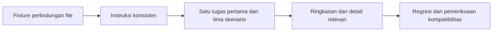

# Improvement Super Compound untuk Developer Baru

## Ringkasan

Perbaikan utama sudah diterapkan: CLI projection melindungi file saat help/input
invalid, page design-system mempertahankan master yang diedit, dan panduan mulai
pakai mendahulukan satu tugas kecil. Authority, handoff, recovery, writer STATE,
topology UI, prefix branch, serta format checkpoint diselaraskan. Nama 18 workflow
dan format JSON yang ada tetap dipertahankan.

Laporan ini mencatat implementasi dari rencana pengguna. Audit sebelumnya
melaporkan 593 file (506 aktif, 87 retired) dan 32/32 pemeriksaan. Angka itu adalah
bukti yang diberikan dalam rencana, bukan audit ulang setiap baris oleh sesi ini.
Lampiran mencatat inventaris saat implementasi dan kedalaman pemeriksaan sesi ini;
file yang hanya diinventarisasi tidak dinyatakan telah diaudit algoritmanya.

Langkah berikutnya: review diff dan bukti di bawah; uji lima skenario onboarding
bersama developer baru untuk mengukur keterpahaman nyata.

## Alur perbaikan

## Temuan dan hasil implementasi

| ID | Prioritas | Hasil | Acceptance dan bukti |
|---|---|---|---|
| ND-01 | P1 | Projection memproses seluruh argumen sebelum akses file; help exit 0, input invalid exit 2 | Fixture menjaga bytes instruksi lokal dan tidak membuat file baru; `agent-projection.test.mjs` |
| ND-02 | P2 | Page baru mewarisi master yang ada; overwrite page hanya mengganti page; master diperbarui lewat pemanggilan terpisah | Dua page, edited master, konflik overwrite dan pembaruan master diuji; `test_design_system_security.py` |
| ND-03 | P2 | README memulai dari setup dan satu bugfix, kemudian lima skenario; lifecycle menjadi referensi | Inspeksi Quick Start/SETUP/WALKTHROUGH dan contoh 18 workflow; belum diuji oleh developer baru |
| ND-04 | P2 | Knowledge adalah evidence yang divalidasi; keputusan mengikat melalui authority dan provenance; pekerjaan aktif mendahului hygiene | README, SUPER-COMPOUND dan compact debug selaras dengan workflow-integration/status |
| ND-05 | P2 | PRD-only berhenti pada scope-nya; delivery terotorisasi handoff internal; pengulangan gagal memicu reassessment; STATE ditulis owner berwenang | Reference PRD/gap/state serta full work/debug/pause selaras; review skenario kontrak secara in-thread |
| ND-06 | P2 | Gate langsung menyatakan applicability: LOCAL_ONLY memakai pemeriksaan lokal; networked membutuhkan provider nyata | Execution contract/skill/full workflow; readiness tests mencakup kedua topology dan proof yang wajib |
| ND-07 | P2 | Default branch prefix menjadi `feature`; sumber validasi tetap `gitWorkflow.branchPrefixes` | Inspeksi project-config dan tes git-workflow/setup |
| ND-08 | P2 | Design-system menolak JSON/stack/domain yang belum didukung sebelum persist; contoh memakai Markdown dan stack search terpisah | End-to-end CLI invalid combinations, JSON search dan CLI help; `test_search_cli.py` |
| ND-09 | P2 | Checkpoint sederhana memakai enam kebutuhan inti; paket kompleks menyertakan evidence/owner/approval/choices ketika relevan | H01-H12 ditinjau ulang, action grader dan negative controls; tidak mengubah authority atau parser fields |
| ND-10 | P2 | Generated master dimulai dengan keputusan; page menghilangkan bagian kosong; contoh implementasi mengikuti stack terpilih | Formatting regressions dan persisted link tests; `test_design_system_efficiency.py` |
| ND-11 | Berikutnya | Semua workflow memiliki contoh input, prasyarat, hasil dan tindakan lanjut; adapter Codex menerima intent natural-language | 18:18:18 workflow/contract/Claude compatibility; setup fixture memasang enam adapter dan menguji routing Codex |

## Bukti dan batas verifikasi

RED sebelum perbaikan mereproduksi penimpaan file oleh `--help`, kegagalan
penambahan page, direktori yang dibuat oleh page invalid, opsi CLI yang diabaikan,
serta output master/page yang tidak memenuhi format ringkas. GREEN targeted
meluluskan regresi tersebut. Fixture memakai direktori sementara dan tidak
memproyeksikan agent ke workspace pengguna.

Hasil verifikasi:

| Command | Hasil |
|---|---|
| `npm run check` | PASS: syntax hooks dan Git tool |
| `npm run test:tools:local` | 328/328 lulus, termasuk projection, setup, readiness, workflow, checkpoint dan all-file audit |
| `npm run test:skills` | 20/20 lulus; pin retrieval reference diperbarui setelah content review |
| `npm run test:python` | 36/36 lulus dan skill router contract PASS |
| `npm run test:hooks` | Hook security suite PASS |
| `npm run bench` | Tiga pengulangan deterministik; semua gate pengurangan/startup PASS |
| `doc-lint.mjs --advisory` dan `git diff --check` | Tidak ada structural findings atau whitespace errors pada pemeriksaan akhir |

Log lokal ada di `.scratch/new-developer-20261004/`; benchmark final tersimpan di
`.agent/benchmarks/token-benchmark.after.json`. Python diverifikasi langsung
dengan exit 0 setelah redirect stderr di PowerShell sempat menampilkan
NativeCommandError meskipun seluruh test lulus. Benchmark memakai estimasi
deterministik; pengurangan context bukan bukti produktivitas atau pemahaman manusia.

H01-H12 adalah content review in-thread atas respons yang sudah direkam,
kemudian digrading ulang dengan negative controls. Digest lama dipertahankan
di `source_revalidation.previous_source_digests`. Ini tidak diklaim sebagai
pressure test agent independen, live host reliability, provider integration,
atau UAT. PRD-only, authorized delivery, recovery, dan writer-state juga diperiksa
langsung pada compact/full/reference yang diubah. Tidak ada deployment atau
perubahan instalasi global pada sesi ini.

## Lampiran dan tindak lanjut

[Lampiran per-file](2026-10-04-new-developer-files.csv) menginventarisasi 609 path
pada snapshot implementasi: 522 aktif dan 87 retired. Kolomnya: path,
aktif/retired, kedalaman pemeriksaan, finding ID, rekomendasi, dan acceptance. Status retirement
menggunakan registry exact-path yang sudah ada. Tidak ada file retired yang dihapus.
Perubahan lokal yang mendahului tugas dipertahankan; laporan ini tidak mengklaim
seluruh dirty diff sebagai hasil implementasi sesi ini.

Tambahan fase berikutnya dari rencana: seragamkan help seluruh CLI aktif dan
perbaiki reminder knowledge berdasarkan edit yang benar-benar berhasil serta
capture aktual. Keduanya tidak diperlukan untuk menutup sebelas temuan prioritas
di atas dan dicatat di [follow-up](../todos/2026-10-04-new-developer-follow-ups.md).
Jika fase tersebut menambah tampilan manusia pada CLI machine, gunakan `--text`
secara additive dan pertahankan default JSON/exit/parser yang ada.
