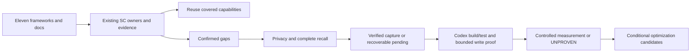

# Framework gap analysis and enhancement

## Summary

Three read-only swarm investigators compared eleven sibling frameworks and the workspace docs against the current Super Compound tree, including the user's uncommitted October 6 changes. Most requested capabilities already exist. The actionable gaps are durable-memory privacy, complete and scoped recall, closeout dispositions, and trustworthy runtime measurement. Implementation and verification status is recorded in the [delivery report](../eval-results/framework-enhancement-20261006.md); this inventory does not claim runtime improvement.

Authority: the user's approved conversational plan followed by "Implement the plan." [FSD and goals](../fsd/fsd-framework-enhancement-20261006.md). Source revisions below are the freshly synchronized default-branch snapshots. Catalogs were inventoried, and mechanisms relevant to the requested outcomes were examined; not every source skill was run on every host.

## High-Level Design

## Source coverage

| Source / revision | Mechanisms examined | Decision |
| --- | --- | --- |
| pstack / df581122 | 51 skills; routing, constraints, swarm, recovery, recipes, prevention, paired experiments | Existing SC adaptations cover most behavior; validate live activation, not another orchestration mode |
| bmad-method / bda3c592 | 33 skill/module records; brief, requirements, architecture, build, review, retrospective | Existing delivery owners; per-finding adjudication implemented locally, runtime benefit unproven |
| superpowers / 8ca22dba | 15 skills; TDD/debugging, task dispatch, review, worktrees, verification | Reviewer economics implemented locally, runtime benefit unproven; broader trace-based diagnosis remains a candidate |
| compound-engineering / efcb657d | 36 skills; compound/refresh, handoff, optimization, retuning | Adapt solution worth and identical-build noise controls |
| everything-claude-code / ef648e01 | Learning v2, scoped injection, read completeness, iterative retrieval, profiles | Adapt completeness/applicability and measurable learning closeout |
| gsd-core-next / 82f7acdf | Fresh context, phase extraction, state drift, global learning, context profiles | Reuse checkpoint and scoped recovery; capture must have an observable completion criterion |
| gao-agent / 4c874665 | Error memory, confidence, pruning, ACTIVE_TASK recovery | Already adapted; SC evidence/idempotency is stronger; avoid wholesale reload/manual lock conventions |
| mattpocock-skills-main / 6fd94792 | Retro, handoff, writing-for-agents, invocation consistency | Already adapted; reinforce checkable outcomes rather than duplicate skills |
| ralph / 6c53cb0b | Fresh processes, Stop-hook integration, bounded loops, cancellation, persistent progress | Existing loop runtime; verify recovery and preserve archived topic recall |
| ui-ux-pro-max-skill / 477bcb28 | MASTER/page persistence, retrieval, selective upstream refresh, held-out relevance | Existing design skill; keep selective refresh candidate-only |
| isms-public / 2d336696 | Classification, sensitive-content scanning, agent changes, indirect injection | Extend existing privacy boundary to durable knowledge; no DLP service |
| workspace docs | One six-document website checklist | Map into existing PRD/FSD/design contracts using factual applicability |

`super-compound-release-check` is a secondary snapshot, not implementation authority. Its older route counts and historical evidence must not overwrite canonical current behavior. Anthropic's imported Ralph plugin was already current at claude-code revision 8e60c4ca.

## Findings and recommendations

| ID | Gap and baseline evidence | Existing owner / recommended change | Priority |
| --- | --- | --- | --- |
| GAP-001 | Capture dry-run accepted a synthetic sensitive value rejected by the existing runtime privacy guard | memory-maintenance: validate new persisted payloads before active/archive/pending writes | P1 |
| GAP-002 | Directory/file read errors in knowledge-search were swallowed; empty text asserted safe record creation | knowledge-search and maintenance catalog reads: distinguish complete-empty from incomplete scan | P1 |
| GAP-003 | Automatic overflow retained records in ERR/LRN archives, but default topic search omitted those archives | knowledge-search: bounded filtered archive recall with stable-ID deduplication | P1 |
| GAP-004 | general/global recall bypassed explicit stack/version filters; work/debug did not require complete scoped lookup | knowledge-search and compact contracts: retain global project scope without ignoring explicit restrictions | P1 |
| GAP-005 | Capture was owner policy; Stop used unrelated memory mtimes and SessionEnd only printed a checklist | checkpoint/owning routes/hooks: captured, skip and pending dispositions; retry maintenance only | P1 |
| GAP-006 | adaptive-eval accepted same-source A/B as KEEP; synthetic five-pair probe reported 20 percent gain | existing evaluator: distinct effective source, descriptive A/A noise controls, unchanged quality/provenance gates | P1 |
| GAP-007 | Significant feature size alone could justify full solution prose recoverable from final artifacts | knowledge-compounding: non-obvious reasoning and recurrence/rediscovery worth gate | P1 |
| GAP-008 | Current context-efficiency report has zero eligible runtime pairs | existing Codex harness: access/selector/actual-work preflight, fixed-model debug/resume controls and trials | P1 |
| GAP-009 | Scoped review lacks explicit recursive-fanout limits and durable unchanged finding adjudication | Existing review contract/artifact; activate after phase-one acceptance | P2 |
| GAP-010 | Feedback overflow drops older entries and report does not consume revision-bound outcomes | Existing maintenance/archive/report; conditional lossless feedback and negative-evidence review | P2 |
| GAP-011 | Project memory can become circular factual corroboration; model poisoning behavior is not established by contract tests | Existing research/context/security/eval owners; primary observations and poisoned-lesson scenario | P2 |
| GAP-012 | Lexical variants, scoped historical rationale and upstream UI deltas may improve outcomes but have no measured need | Existing context/interface skills; held-out/delta candidates, no new public workflow | P2 |

The findings table records baseline gaps and recommended activation order. GAP-001 through GAP-011 now have locally verified implementations; GAP-008 runtime measurement and GAP-011 model resistance remain unproven. GAP-012 stays held-out. The delivery report records failed live attempts and final verification.

Baseline reproductions were synthetic, read-only probes of public functions. They demonstrate missing checks, not real token savings. Exact baseline hashes and original Git status are retained locally in workspace `.scratch/sc-enhancement-20261006-232111/baseline.json`. Local source copies retain original bytes for RED and rollback inspection.

## Adaptation evidence

- ECC `tests/lib/memory-read-completeness.test.js`: partial reads must not establish absence; continuous-learning-v2 scope isolates project lessons.
- GSD `docs/features/extract-learnings.md` and Matt `skills/productivity/writing-for-agents/SKILL.md`: phase completion and checkable completion criteria.
- Compound `skills/ce-compound/SKILL.md`: preserve otherwise unrecoverable reasoning; `skills/ce-retune/references/noise-floor.md`: tree-identical controls, selector proof and interleaving. The conservative max-absolute paired reduction is an explicit SC adaptation, not a formula copied from that source or a significance test.
- BMAD `skills/bmad-build/step-04-review.md` and Superpowers `skills/subagent-driven-development/task-reviewer-prompt.md`: carried finding adjudication and scoped reviewer effort.
- ISMS `Data_Classification_Policy.md` and `OWASP_LLM_Security_Policy.md`: verify masking, separate credentials/PII and treat indirect retrieved instructions as untrusted.
- Ralph `UPSTREAM.md`: fresh-process technique differs from the same-session Stop hook; both are already represented without installing another plugin.

Concepts are adapted into SC's existing owners in original wording. No upstream rule overrides approved authority, permission, verifier, or the user's preference to review framework changes.

## Website checklist mapping

| Checklist item | Existing artifact | Applicability |
| --- | --- | --- |
| PRD | Approved PRD | Observable feature/user/acceptance requirements |
| TRD | FSD technical/deployment/integration contracts | Relevant technical decisions only |
| App Flow | PRD journey and FSD interaction contract | User interaction changes |
| Design Brief | Existing design-system MASTER/page references | UI/branding changes |
| Database Schema | FSD data/access/privacy contracts | Persisted data; factual N/A for sites without it |
| Implementation Plan | FSD GOAL dependencies, checks and approval sequence | Existing full-tier delivery; light fixes stay light |

Six checklist boxes do not require six new documents or force every website to have a database. Keep the canonical BRD/PRD/FSD/GOAL lifecycle and all nineteen public workflows.
