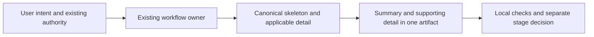

# Blueprint Document Refactor Evidence

## Summary

P0/P1 aligns authoring around the existing skeletons, one applicability owner
and three conceptual user intents. Existing tier, stage approval, UI readiness,
ADR, parser and adapter policy remain intact. The focused and complete local
suites, installer checks, document lint and canonical audit pass. Usability and
runtime savings remain **UNPROVEN**.

## Baseline and scope

Inspected HEAD: `d042706f7bac292127d0649dd088654aa206113f`, branch
`refactor/blueprint-document`. The local frozen archive contains 629 tracked and
nonignored source files plus HEAD, dirty status and per-file SHA-256/byte sizes
under `.scratch/blueprint-document-20261006/`. Runtime/private scratch was excluded.
Original untracked `.scratch/`, `docs/brainstorms/context7-readme.md` and
`docs/refactor/` were retained. No historical document migration, global setup,
commit, push, publishing or deployment is part of this change.

Before editing, three added artifact checks were RED: missing shared
applicability, alternate compact PRD shape, and LOCAL_ONLY topology placed after
AI. The actual command `node --test .agent/tools/artifact-contracts.test.mjs`
reported 9 pass / 3 fail, then 12 pass / 0 fail after the corrections.
That is structural regression sensitivity, not an invented host/model failure.

## Changes and authority

| Area | Actual change | Authority retained |
|---|---|---|
| Routing | Start/change, continue/status and consult labels; explicit PRD-only end boundary. | Existing 19 commands, T1-T5, contracts and authorized owner handoffs. |
| Authoring | Shared required/triggered/optional treatment; concrete Summary and contract prompts. | BRD business, PRD product, FSD implementation, conditional ADR/TDEC. |
| Completeness | Factual, enumerated grouped N/A; optional empty support omitted. | Material risks, OPEN blockers, mandatory decisions and profile gates. |
| UI | LOCAL_ONLY guidance belongs to the screen contract and FSD authoring reference. | Local checks; networked real first slice before scale-out; security/accessibility/integrity. |
| Reviewer output | Same-artifact summary and concrete checkpoint/document examples. | Stable IDs, all ready/pending items, separate stage approvals and reply/resume semantics. |

The usage notes of the four full reference libraries now defer to
[the applicability owner](../../.agent/skills/agentic-delivery/references/templates-and-outputs.md#applicability-and-expansion).
The [walkthrough](../../WALKTHROUGH.md#reviewing-one-artifact) contains four
before/after excerpts; they are illustrations, not approved requirements or
drop-in parser replacements. Startup additions are compact pointers/examples,
not imported standards or new controller state.

## Local evaluation and verification

[BP01-BP12](../../.agent/evals/blueprint-document.responses.json) retain identical
before/after prompts and exact informed responses. Safety decisions already
conformed at baseline; BP03 now resolves the authoring ambiguity. Deadline,
sunk cost and senior pressure are included without inventing authorization.
The grader rejects wrong tier, unrequested writes, fabricated providers/proof,
hidden pending answers, mock scale-out and bypassed legacy execution authority.

Eight template interface signatures protect existing skeleton headings,
numbered reference headings, frontmatter and metadata fields. Direct parser
checks read old-style manifests/pointers with additive Summary/HLD, while existing
readiness tests retain fail-closed behavior and legacy restrictions. Reviewed
H01-H12/A01-A11 content and outcomes stay valid; previous source digests remain
in review history. These are local compatibility adjudications, not new host trials.

| Check | Actual result |
|---|---|
| Focused artifact/BP/checkpoint/questions run | 56 pass, 0 fail, 0 skip. |
| `npm run test:local` | Exit 0; 375 tool tests, 20 skill tests, hook security checks and 36 Python tests pass; skill router contract PASS. Node suites have 0 failures/skips. |
| `npm test` | Exit 0; 381 tool tests, 20 skill tests, hook security and syntax checks pass; Node suites have 0 failures/skips. |
| Final `codex-install.test.mjs` run | 6 pass, 0 fail, 0 skip on the current canonical payload. Together with the final local suite this covers all 381 tool tests. |
| Changed-document lint and `git diff --check` | Exit 0; 20 changed Markdown files have no structural findings; eight applicable HLD documents pass; no diff whitespace errors. |
| Canonical benchmark/audit | Three deterministic benchmark repeats pass; framework audit PASS with zero findings; stored evidence verification passes. |

The first complete checks detected stale canonical evidence and the old
authoring-reference hash pin. Evidence was regenerated and the reviewed pin was
updated, retaining the baseline digest and assertions. The routing index was
shortened to satisfy its existing budget; no threshold was relaxed. The final
local and installer runs cover the current source bytes. Counts overlap across
commands and must not be summed as independent experiments.

Canonical evidence is in [the benchmark](../../.agent/benchmarks/token-benchmark.after.json)
and `.agent/benchmarks/framework-audit.after.json`. They are
regenerated and verified after the final source/report edits. Historical baseline
and dated reports remain unchanged. These static budgets do not measure runtime
savings from this refactor.

## Limits, recovery and next action

This records one informed in-thread response review and deterministic local
checks. It does not measure reviewer task time, host/model reliability, provider
integration, token/cost reduction or task duration. Structural lint and smaller
templates do not establish those outcomes. The
[evaluation protocol](../../.agent/evals/blueprint-document.md) specifies separate
business/QA/engineering reviewer tasks and matched repeated AB/BA live runs using
existing context-load/transcript tooling. Unknown remains unknown.

Residual risk is how varied models apply prose guidance and how reviewers read
grouped applicability. Preserve mandatory coverage before comparing reading
burden. Wizard checkpoint, tier changes, numerical page targets and machine-format
changes remain separate P2 proposals. Recover a failed slice by restoring only
this change's affected bytes from the local baseline and rerunning related checks;
never reset or overwrite unrelated user state.

The implementation and local verification are complete for P0/P1. A later
usability/runtime study needs concrete reviewers/host access and its own resource
authorization; it is not evidence claimed by this change.
