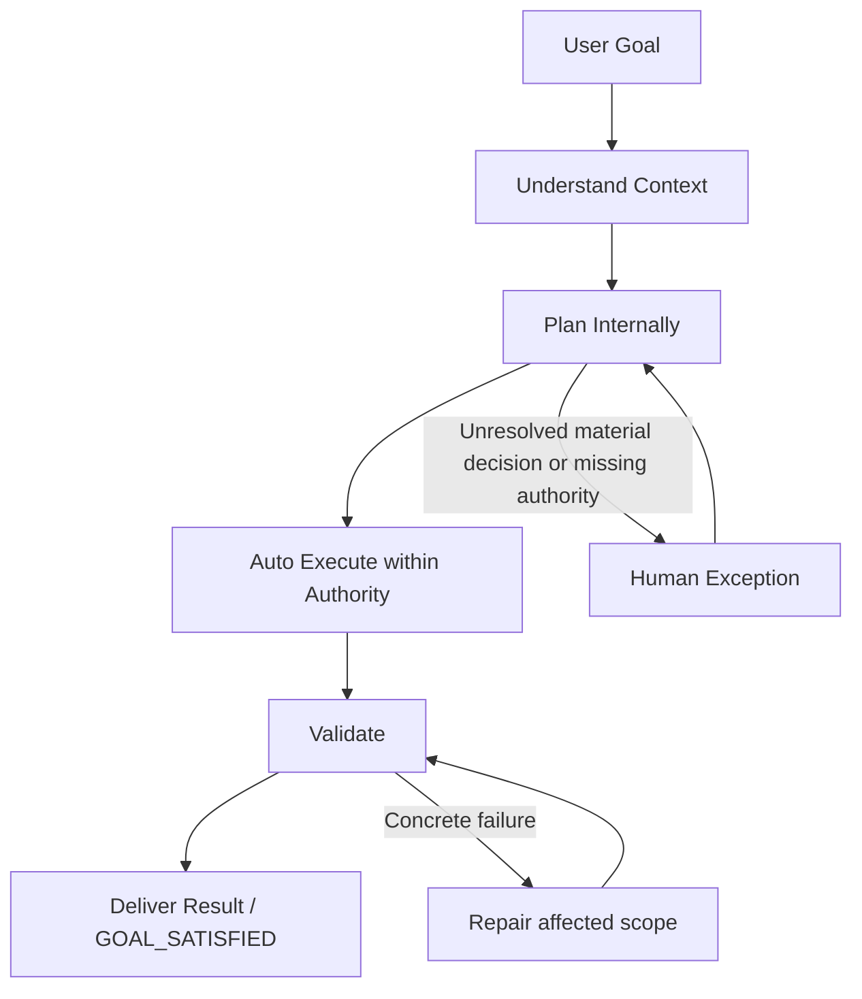

# HITL Autonomy Implementation — 2026-10-07

## Summary

Implementasi audit mengubah default framework menjadi `Infer -> Decide -> Execute -> Report`. Approval baru diperlukan untuk keputusan material yang belum terselesaikan, informasi kritis yang tidak dapat diinfer, atau tindakan berisiko di luar otorisasi yang berlaku. Preferensi `stage` milik proyek tetap dipertahankan. Semua 19 workflow publik, batas read-only, pemeriksaan keamanan/privacy/accessibility, dan pembuktian integrasi yang relevan tetap berlaku.

Empat subagent dipakai secara total selama audit dan implementasi; tiga stream implementasi memiliki kepemilikan file terpisah. Cross-review menemukan dan menutup celah parser OPEN serta promosi completion receipt dengan prerequisite stale. Hasil di bawah membedakan pengujian lokal dari perilaku host AI yang belum diukur.

## Workflow

Exception bukan approval untuk menghapus failure. Perubahan metadata, evidence refresh, dan derived pointer yang tidak mengubah semantik berjalan internal. Perubahan authority material kembali ke pemiliknya. Standalone audit/review/status/hints tetap read-only. Goal yang selesai tidak membuka ideation atau sesi baru secara otomatis.

## Traceability audit → implementasi

| Finding | Perubahan | Komponen utama | Pembuktian |
|---|---|---|---|
| F01 | Privacy primitive aktif dipisahkan dari runtime retired; export/install/doctor memeriksa static local imports | `privacy-guard.mjs`, `memory-maintenance.mjs`, `active-assets.mjs`, `setup.mjs` | Privacy regression, fail-before-write import closure, smoke bundle nyata |
| F02 | `approval_mode: exception` menjadi default; `stage` opt-in dan konfigurasi existing dipertahankan | project-config, workflow-dispatch, checkpoint, native adapters | Autonomy contracts dan six-host install/update tests |
| F03 | Feature/page bounded dan reversible memakai light tier jika reuse kontrak/access/pattern serta acceptance dan checks jelas | workflow-integration, work/launch/UI contracts | Light/full/material-risk regression contracts |
| F04 | Freshness hanya memblokir goal terpilih dan dependency transitif; structural corruption tetap global | work-package, memory resume | Independent goal tetap ready; stale prerequisite/cycle/missing ref ditolak |
| F05 | OPEN resolved/closed/history tidak membuka blocker; active/unknown blocker tetap fail closed | readiness-gate | Tabel template, multiline, history, glossary, NON_BLOCKER dan mixed records |
| F06 | Completion CLI membaca ledger tervalidasi dengan fresh proof, bukan status saja | verified-promise, work-package | Forged/malformed/stale completion negative controls |
| F07 | Maksimal tiga pertanyaan prioritas secara default; semua unresolved IDs dan material blocks tetap tersimpan | checkpoint, brainstorming, recorded fixtures | Partial/bulk/exception/silence/progressive-display checks |
| F08 | PRD kanonis yang relevan direvisi dari konteks tanpa pertanyaan create/revise tambahan | sc-prd, prd-generator | PRD reuse contract |
| F09 | N/A faktual cukup alasan/evidence; keputusan material tetap mengikuti owner | templates, authoring references, readiness | N/A tanpa approver serta missing-reason rejection |
| F10 | UAT/hardening mengikuti acceptance, topology dan risiko; local checks dapat berada dalam goal yang sama | UI/readiness/planning/integration refs | LOCAL_ONLY dan networked first-real-slice gates |
| F11 | Promotion/index/pointer deterministik menjadi operasi internal planning-owned | plan/work/status, issue and plan-verification refs | Recorded owner transitions dan ordered authority checks |
| F12 | Empty queue setelah goal verified menghasilkan `GOAL_SATISFIED` | status/work/launch/dispatch | Goal-satisfied contract |
| F13 | Geniusloop hanya atas intent improvement eksplisit; ≤3 kandidat default, incremental eligible | geniusloop, Brain | Bounded shortlist dan explicit broad-mode contracts |
| F14 | Standards relevan dimuat sebelum edit, lalu direuse saat review | work/review/quality gates | Early standards contract |
| F15 | Routine lesson reuse/capture tidak meminta blanket human approval baru | compound/evolve/knowledge references | Policy-change approval boundary dan reusable-learning contracts |
| F16 | Evolve yang sudah diotorisasi dapat diterapkan oleh owner dalam sesi yang sama | evolve contract/workflow | Same-session owner handoff contract |
| F17 | Pending learning yang melebihi hot checkpoint dipertahankan dalam existing capture queue; progress checkpoint tetap dapat disimpan | memory-maintenance, state checkpoint | Overflow/resume/retry/interruption/durable-closeout tests |
| F18 | Hints test memakai active consultation boundary dan manifest; dependency retired dihapus | hints.test | Active route plus read-only/approval controls |
| F19 | Detail skill sesuai tier; pause/hardening/UI acceptance kondisional; context critical compact lalu lanjut | detailed skills, compact contracts, hook-index | Router navigability/invariant tests dan context hook tests |
| F20 | Session-end hanya melaporkan pending/incomplete closeout nyata | session-end, hook tests | Captured/skipped/fresh project silent; pending tetap dilaporkan; telemetry tetap bekerja |
| F21 | RED awal yang memadai direuse; sensitivity toggle tambahan hanya ketika bukti awal tidak cukup | TDD detail/execution refs | Adequate-RED regression contract |
| F22 | Prototype mempromosikan keputusan/evidence; kode production reuse membutuhkan exception eksplisit dan validation | explore/prototyping refs | Prototype authority boundary |
| F23 | Announcement skill digabung satu kali per fase | skill-index, output-style, skill routers | Router announcement regression |
| F24 | Onboarding, operating contract, walkthrough, installer adapters dan banner historis selaras | README, SUPER-COMPOUND, WALKTHROUGH, SETUP, Codex README | Documentation review, installation config preservation |
| F25 | Archive komponen retired setelah closure, reference tracing dan suite; byte/provenance dipertahankan | exact retirement registry dan archive manifest | Exact selectors, checksum archive, active suite dan preservation inventory |
| F26 | Export mempunyai README install-only dengan Node commands yang benar; package aplikasi tidak diganti | OFFLINE-SETUP, active-assets, setup | Real bundle check/report/resume/install/doctor smoke |

## Verification

| Pemeriksaan | Hasil |
|---|---|
| `npm test` setelah archive | PASS: 438 tool tests + 28 skill tests; syntax dan hook security checks lulus; tidak ada skipped tests |
| Readiness setelah negative control unknown-status terakhir | 34/34 PASS; closed/history tidak memblokir, status/class unknown pada record nyata fail closed |
| `npm run test:python` | 36/36 PASS dan skill-router contract PASS |
| Six-host install/update/rollback dan active distribution | 16/16 PASS; Node/Bash parity, preference preservation dan bundle runtime smoke |
| `npm run bench` | PASS, tiga pengulangan deterministik; seluruh existing gates dipertahankan |
| Structural audit dan stored-evidence verification | PASS; nol findings dan seluruh active manifest accounted |
| Doc lint delapan dokumen terkait | Nol structural findings; isi dan applicability diagram direview |
| Preservation | 414 file original byte-identik, 135 file original diubah dalam scope, 87 diarsipkan byte-identik; nol file hilang; branch/HEAD sama |

`git diff --check` melaporkan satu blank line EOF pada `docs/LEARNED_KNOWLEDGE.md` yang sudah ada sebelum implementasi. File tersebut cocok dengan snapshot original dan sengaja tidak diubah. Perubahan dalam scope diperiksa terpisah.

Safety regressions ditulis sebelum perbaikan runtime: import retired yang hilang,
unrelated/required stale proof, completion palsu, OPEN history/active/multiline,
learning overflow/interruption/identity drift/starvation, dan reminder closeout
berulang. Guard utama direview independen oleh agent dari stream lain. Directory
archive menyimpan [manifest/checksums](../archive/retired-assets-20261007/manifest.json),
dengan satu registry locator yang sudah tidak ada sebelum perubahan. Unknown
component yang tidak terdaftar retired tidak dipindah atau dihapus.

Pengujian policy berbasis source-contract menjaga konsistensi prompt; pengujian runtime menggunakan fixture dan CLI nyata. Recorded response/source digests direview untuk compatibility, dengan konten/digest historis tetap tersedia. Refresh tersebut bukan eksperimen host baru. `evaluatePromise` tetap helper status-only dengan precondition ledger tervalidasi; entrypoint CLI melakukan validation dan freshness sebelum evaluasi.

## Preservation dan batas bukti

Sebelum perubahan, 636 file sumber disalin byte-identik ke backup lokal dan dicatat dalam `.scratch/hitl-autonomy-20261007/before.json`. Inventory akhir ada pada `.scratch/hitl-autonomy-20261007/preservation.json`; log suite/benchmark ada pada direktori yang sama. Perubahan existing milik user, konfigurasi instalasi, model overrides, dan historical benchmark baseline dipertahankan. Tidak ada commit, push atau deployment.

Codebase-memory graph dicoba lebih dulu, tetapi koneksi root mengembalikan `Transport closed`; metadata yang tersedia dari agent juga belum mencakup seluruh file. Dependency closure dan reference tracing diperiksa langsung terhadap source tree dan bundle yang benar-benar diekspor. Tidak menyatakan komponen dead hanya berdasarkan ketiadaan reference pertama.

Secara desain, task bounded yang sudah konkret memerlukan nol approval administratif; mode stage atau exception material tetap membutuhkan input sesuai scope. Pengurangan interaction, fatigue, latency dan time-to-goal belum diukur pada sesi host nyata. Static token benchmark bukan bukti percepatan runtime. Pengukuran lanjutan diperlukan sebelum membuat klaim persentase produktivitas.
