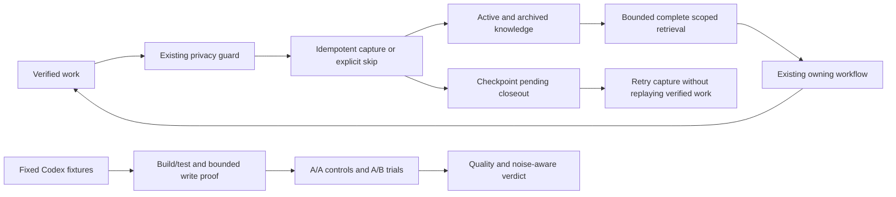

# FSD - Framework enhancement 2026-10-06

## Summary

Implement the user's approved swarm gap-analysis plan by strengthening existing knowledge, retrieval, closeout and evaluation behavior. No new public workflow, model switching, autonomous policy modification or dependency is required. Existing local edits are the baseline and must survive.

## High-Level Design

## Metadata

ID: FSD-FRAMEWORK-ENHANCEMENT-20261006
Artifact contract version: `2.0.0`
Status: APPROVED
Version: 2
Technical owner / approver: User, through the approved conversational plan and subsequent explicit instruction "Implement the plan."
Upstream: User request for swarm gap analysis; approved proposed plan in this conversation. No separate BRD/PRD approval is asserted.
ADR applicability: NOT_REQUIRED
ui_delivery_profile: NOT_APPLICABLE
ui_contract_readiness: NOT_APPLICABLE

## Technical Contract

- TDEC-001: Reuse existing .agent tools, skills, workflows and tests; keep all 19 public commands and legacy APIs. No commits or pushes.
- TDEC-002: Guard newly persisted knowledge payloads, refreshed replacements, feedback and pending capture content with the existing bounded runtime privacy check before writing. Do not rewrite historical records or apply telemetry field policy to all STATE data.
- TDEC-003: Knowledge JSON adds bounded coverage diagnostics (at most ten locator/code rows); missing optional default stores are valid, failed explicit scope/read is incomplete. `--require-complete` exits 2 on partial scan; default exit behavior and search-array API stay compatible. Maintenance catalog scans must not silently claim completeness. Search active archive entries with existing status/applicability/output caps; global scope does not waive explicit stack/version restrictions.
- TDEC-004: Optional checkpoint `learningCloseouts` holds at most twenty origin/revision/evidence-digest identities and captured/skipped-trivial/pending/legacy-unknown dispositions. Captured requires knowledgeRef, pending requires validated captureInputRef, skipped requires reason; tool computes evidence hashes. Optional completionRef points to existing receipt without changing receipt hash identity. Legacy absence remains advisory; verified goals never reset. Tiny tasks need no ledger/checkpoint merely to record a skip.
- TDEC-005: Owner assesses full-solution worth by non-obvious reasoning and recurrence/rediscovery risk, with skip reason. Hooks report actual pending closeouts and remain advisory/read-only.
- TDEC-006: Same effective source cannot support optimization KEEP; retain quality REJECT and statistics. Six A/A pairs define conservative floor max(abs(1-B/A)); candidate requires five A/B pairs, unchanged quality/provenance and existing threshold/MAD plus floor. This is descriptive control, not a statistical significance claim.
- TDEC-007: Codex local pilots first prove fixture access, selected build, actual initial test and bounded write capability. The <=1 KiB probe must match source/fixture and have an observed successful command; source/tests remain unchanged. First flows are debugging and fresh-session resume, with fixed host/model/effort/config/grader; preserve all failed attempts. Honor effective read-only policy. Failed preflight launches no counted session; first invalid A/A workflow or session execution failure stops expansion. Runtime benefit remains UNPROVEN without eligible controls/trials.
- TDEC-008: After phase-one acceptance, phase two may tighten reviewer economics/adjudication, archive and summarize revision-bound feedback, and research trust separation. Lexical refinements, historical recall and UI refresh remain candidates until held-out/delta evidence supports them.

## Screen & Interaction Contract

NOT_APPLICABLE: internal CLI, memory and instruction improvements; no product UI changes.

## Goals

| Goal | Ownership | Dependencies | Acceptance |
| --- | --- | --- | --- |
| GOAL-001 | retrieval tool/tests | None | complete vs partial scan, archive topic recall, scoped global lessons, legacy API |
| GOAL-002 | memory maintenance/checkpoint/hooks/tests | None | privacy rejection, idempotent captured/skip/pending, legacy recovery, no verified-work replay |
| GOAL-003 | adaptive evaluator/tests/pilot preflight | None | same-source guard, controls above floor, bounded fixture preflight |
| GOAL-004 | integration, documentation, local verification | GOAL-001, GOAL-002, GOAL-003 | integrated regression gates and accurate source/coverage/status report |
| GOAL-005 | live Codex pilot and conditional phase two | GOAL-004 | eligible runtime controls/trials, or explicit host blockage/UNPROVEN; conditional optimization does not bypass gate |

Implementation amendment, 2026-10-07: phase two followed phase-one local acceptance and four successful v2 access/test preflights. Later controls exposed missing write-capability evidence. Version 2 adds the minimal bounded v3 probe and first-failed-control stop; locally verified phase-two changes do not establish runtime gain. The approved scope, existing authority and quality gates remain intact. See the [delivery evidence](../eval-results/framework-enhancement-20261006.md).

Baseline and disjoint isolated workspaces: workspace `.scratch/sc-enhancement-20261006-232111/`; baseline.json contains HEAD, original status, source sizes and SHA-256 digests. Root integrates only agent-owned changed files after checking the original target digest.

## Verification and Rollout

Behavior tests follow RED/GREEN. Run focused tools/hooks suites, all applicable local suites, projection checks, three deterministic token-benchmark repetitions and canonical audit. Keep historical baselines and dated evidence intact. Restore an integration file only from its recorded original bytes if rollback is needed; never use destructive Git commands.

Pilot metrics distinguish correctness, framework payload, inclusive input/output/cache/reasoning, latency and retries. Existing optimization gate is at least 10 percent; context-payload gate remains 50 percent. Unknown remains unknown. Record every attempt; stop before counted sessions after failed fixture/access/selector/test/write preflight, and stop expansion after the first invalid A/A workflow or execution failure.
